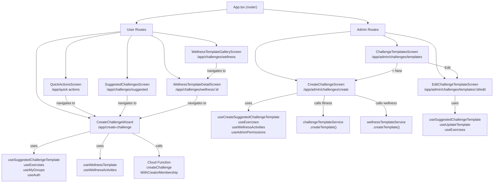
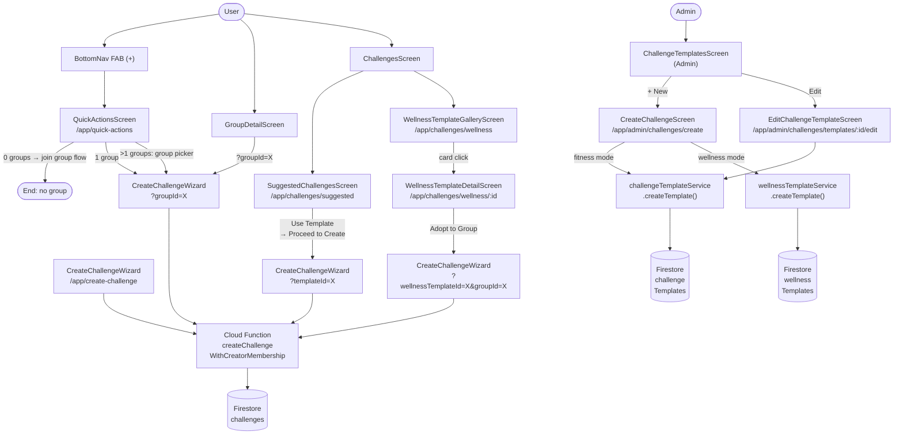
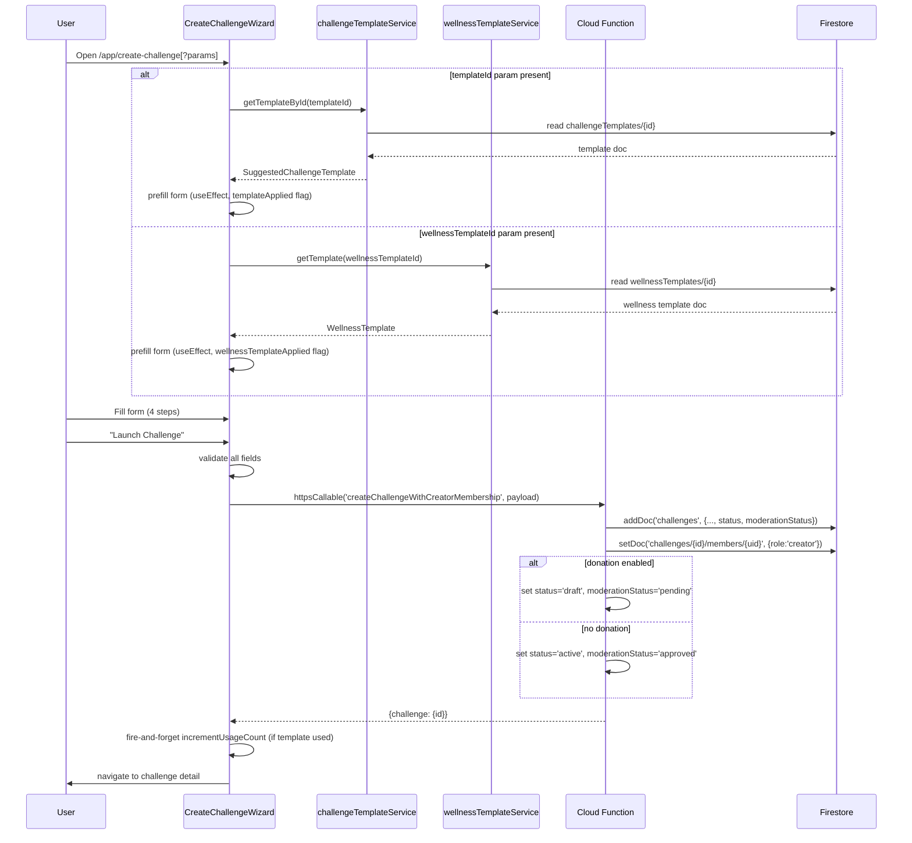
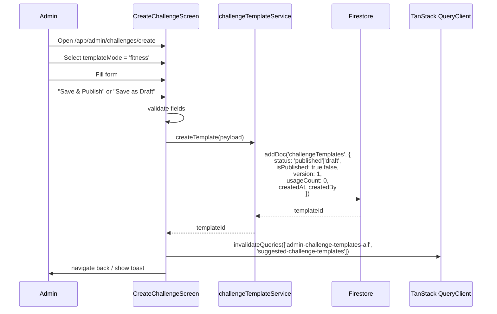
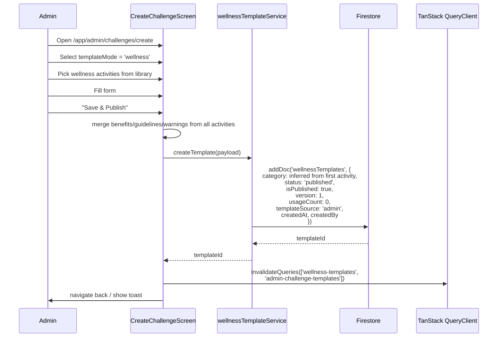
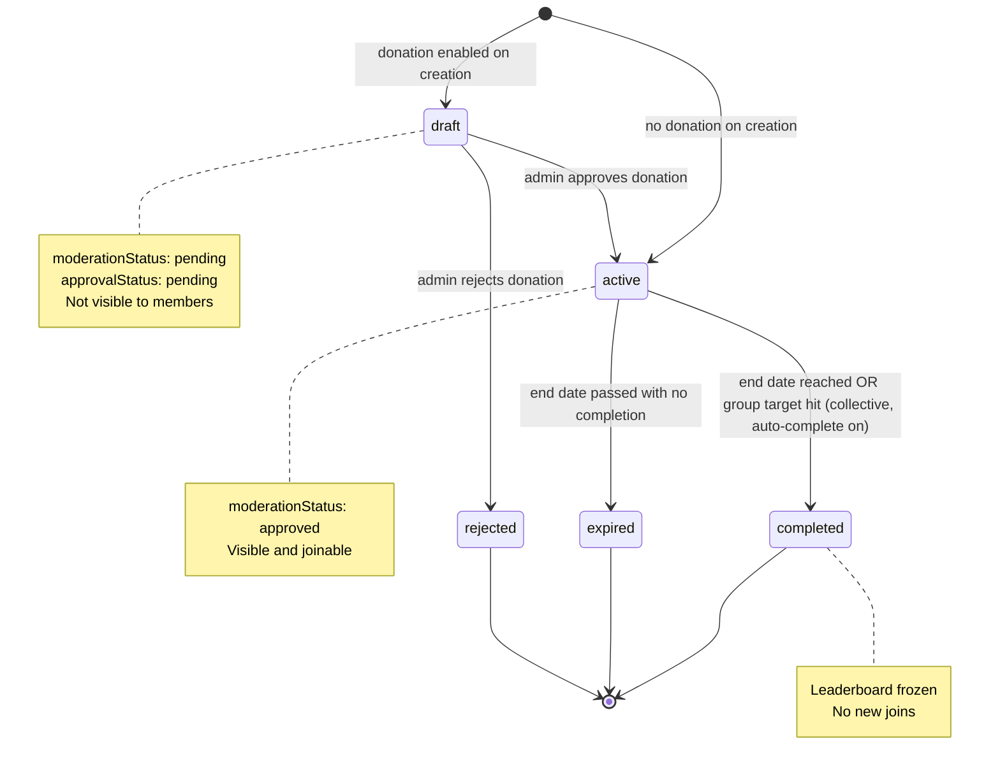
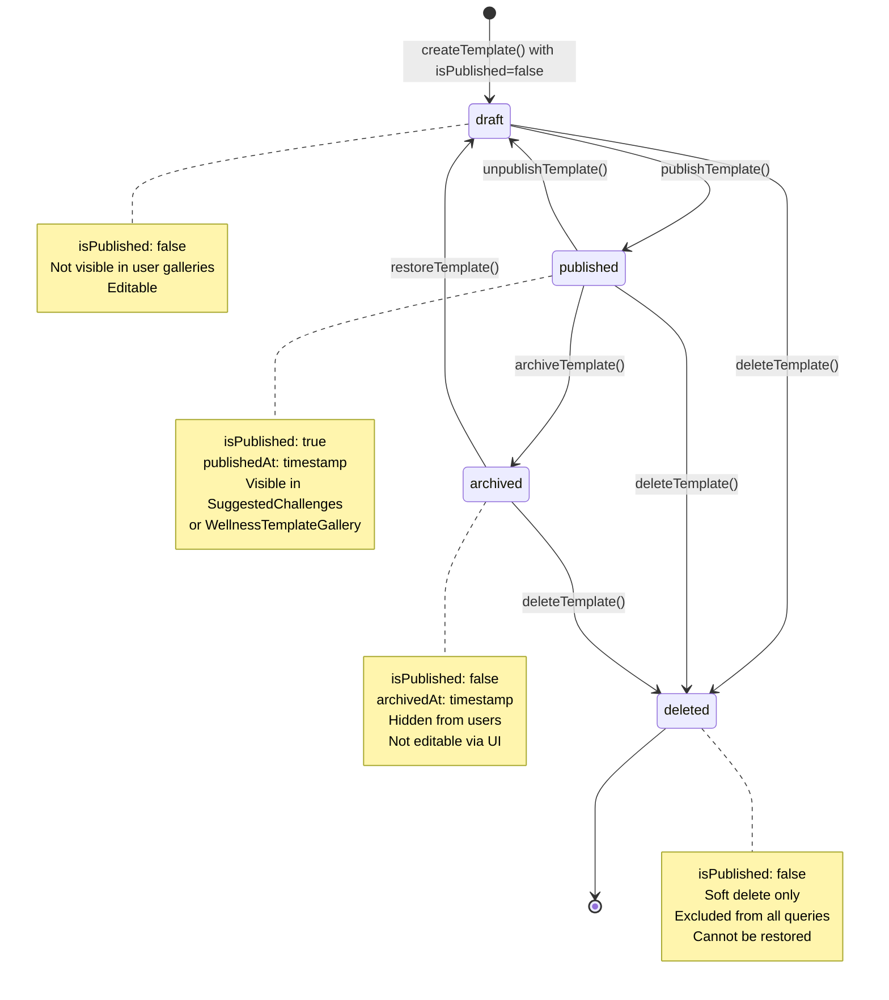
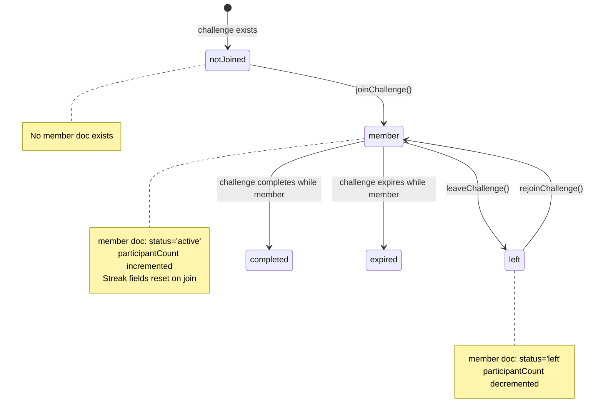
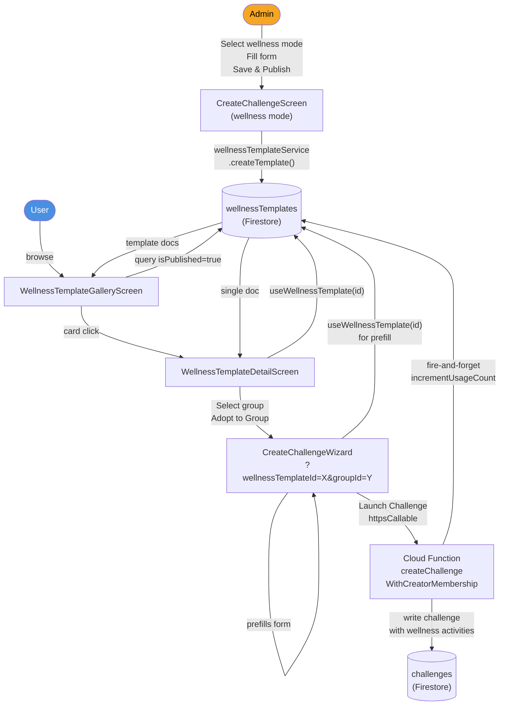
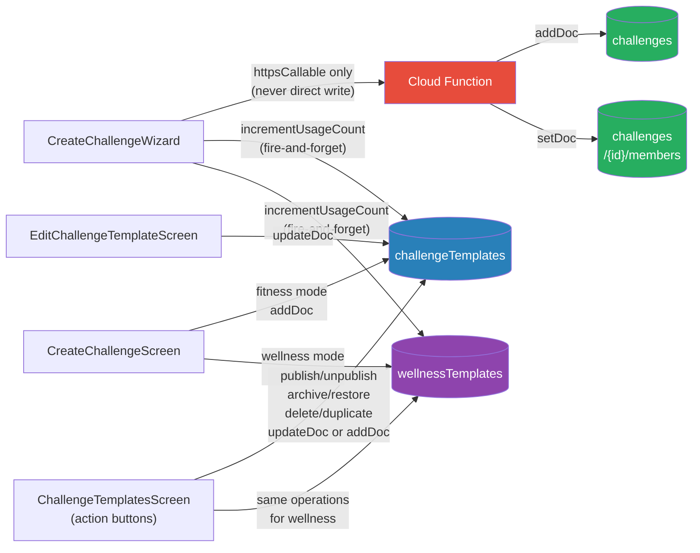

# Challenge Architecture — Official Reference

**Version:** 1.0
**Date:** 2026-06-27
**Branch:** fix/p0-pre-deploy-blockers
**Source:** Phase 16R-B parity audit (`docs/reports/challenge-feature-parity-master.md`)
**Status:** Frozen — no code changes permitted during this phase

---

## Table of Contents

1. [Overview](#overview)
2. [Entry Points](#entry-points)
3. [Routes](#routes)
4. [Component Hierarchy](#component-hierarchy)
5. [Navigation Flow](#navigation-flow)
6. [Data Flow](#data-flow)
7. [Firestore Collections](#firestore-collections)
8. [Cloud Functions](#cloud-functions)
9. [Services](#services)
10. [Challenge Lifecycle](#challenge-lifecycle)
11. [Template Lifecycle](#template-lifecycle)
12. [User Lifecycle](#user-lifecycle)
13. [Wellness Lifecycle](#wellness-lifecycle)
14. [Firestore Write Map](#firestore-write-map)

---

## Overview

The challenge system has two independent creation implementations feeding three Firestore collections through two distinct write paths. All user-facing challenge creation goes through a Cloud Function. All admin template creation goes through direct service writes.

```
Users                          Admins
  │                              │
  ▼                              ▼
CreateChallengeWizard     CreateChallengeScreen
  │                         EditChallengeTemplateScreen
  │
  ▼
httpsCallable                service.createTemplate()
  │                              │
  ▼                              ▼
challenges                 challengeTemplates
challenges/{id}/members    wellnessTemplates
```

---

## Entry Points

Every path that can open a challenge creation screen.

| # | Trigger | Source Component | Destination | Notes |
|---|---|---|---|---|
| 1 | FAB "+" button | BottomNav | `/app/quick-actions` | Primary mobile entry point |
| 2 | "Create Challenge" button | QuickActionsScreen | `/app/create-challenge?groupId=<id>` | Group picker if >1 group |
| 3 | "Create Challenge" button | GroupDetailScreen | `/app/create-challenge?groupId=<id>` | Group pre-selected |
| 4 | "Use Template" → "Proceed to Create" | SuggestedChallengesScreen | `/app/create-challenge?templateId=<id>` | Fitness template prefill |
| 5 | "Adopt to Group" | WellnessTemplateDetailScreen | `/app/create-challenge?wellnessTemplateId=<id>&groupId=<id>` | Wellness template + group prefill |
| 6 | Direct URL | Browser / deep link | `/app/create-challenge` | No prefill |
| 7 | "+ New" button | ChallengeTemplatesScreen (Admin) | `/app/admin/challenges/create` | Admin template creation |
| 8 | "Edit" button | ChallengeTemplatesScreen (Admin) | `/app/admin/challenges/templates/:id/edit` | Fitness templates only |

---

## Routes

### User Routes

| URL | Component | File |
|---|---|---|
| `/app/create-challenge` | CreateChallengeWizard | `src/features/Challenges/CreateChallengeWizard.tsx` |
| `/app/create-challenge?groupId=<id>` | CreateChallengeWizard | — group preselected |
| `/app/create-challenge?templateId=<id>` | CreateChallengeWizard | — fitness template prefilled |
| `/app/create-challenge?wellnessTemplateId=<id>` | CreateChallengeWizard | — wellness template prefilled |
| `/app/create-challenge?wellnessTemplateId=<id>&groupId=<id>` | CreateChallengeWizard | — both prefilled |
| `/app/quick-actions` | QuickActionsScreen | `src/features/QuickActions/QuickActionsScreen.tsx` |
| `/app/challenges/suggested` | SuggestedChallengesScreen | `src/features/Challenges/SuggestedChallengesScreen.tsx` |
| `/app/challenges/wellness` | WellnessTemplateGalleryScreen | `src/features/Challenges/WellnessTemplateGalleryScreen.tsx` |
| `/app/challenges/wellness/:id` | WellnessTemplateDetailScreen | `src/features/Challenges/WellnessTemplateDetailScreen.tsx` |

### Admin Routes

| URL | Component | File |
|---|---|---|
| `/app/admin/challenges/create` | CreateChallengeScreen | `src/features/Admin/Challenges/CreateChallengeScreen.tsx` |
| `/app/admin/challenges/templates` | ChallengeTemplatesScreen | `src/features/Admin/Challenges/ChallengeTemplatesScreen.tsx` |
| `/app/admin/challenges/templates/:id/edit` | EditChallengeTemplateScreen | `src/features/Admin/Challenges/EditChallengeTemplateScreen.tsx` |

---

## Component Hierarchy



---

## Navigation Flow



---

## Data Flow

### User Challenge Creation (all paths)



### Admin Fitness Template Creation



### Admin Wellness Template Creation



---

## Firestore Collections

### `challenges`

Written by: Cloud Function `createChallengeWithCreatorMembership`

```
challenges/{challengeId}
├── name                    string
├── description             string
├── groupId                 string
├── createdBy               string (uid)
├── coverImageUrl           string?
├── category                'fitness'|'wellness'|'fasting'|'hydration'|'sleep'
│                           |'mindfulness'|'nutrition'|'habits'|'stress'|'social'
├── challengeType           'collective'|'competitive'|'streak'
├── startDate               string (ISO date)
├── endDate                 string (ISO date)
├── durationDays            number
├── engineVersion           'v2'
├── status                  'draft'|'active'|'completed'|'expired'
├── moderationStatus        'pending'|'approved'|'needs_changes'
├── approvalRequired        boolean
├── approvalStatus          'pending'|'approved'|'rejected'
├── participantCount        number (starts at 1 — creator)
├── exerciseIds             string[]
├── activities              ActivityEntry[]
│   └── { exerciseId?, activityId?, exerciseName?, targetValue,
│          unit, frequency?, pointsPerCompletion?, instructions?,
│          benefits?, guidelines?, warnings? }
├── visibility              'public'|'private'?
├── groupVisibility         'public'|'private'?
│
│── [collective only]
├── groupCumulativeTarget   number
├── autoCompleteOnGroupTarget boolean
├── groupCurrentTotal       number (starts at 0)
│
│── [streak only]
├── requiredConsecutiveDays number
├── streakResetOnMiss       boolean
│
│── [donation only]
├── donation
│   ├── enabled             boolean
│   ├── causeName           string?
│   ├── causeDescription    string?
│   ├── targetAmountKes     number?
│   ├── contributionStartDate string?
│   ├── contributionEndDate   string?
│   ├── contributionPhoneNumber string?
│   ├── contributionCardUrl   string?
│   ├── disclaimer          string
│   ├── approvalStatus      'pending'|'approved'|'rejected'
│   └── approvalRequired    boolean
│
├── createdAt               Timestamp
└── updatedAt               Timestamp?
```

### `challenges/{challengeId}/members`

Written by: Cloud Function on join/rejoin

```
challenges/{challengeId}/members/{userId}
├── userId                  string
├── joinedAt                Timestamp
├── role                    'creator'|'member'
├── status                  'active'|'left'
│
│── [streak only]
├── currentStreak           number (0 on join)
├── longestStreak           number (0 on join)
└── lastLogDate             field deleted on join/rejoin
```

### `challengeTemplates`

Written by: `challengeTemplateService` from `CreateChallengeScreen` and `EditChallengeTemplateScreen`

```
challengeTemplates/{templateId}
├── name                    string
├── description             string
├── coverImageUrl           string?
├── category                'fitness' (default)
├── challengeType           'collective'|'competitive'|'streak'
├── durationDays            number
├── difficultyLevel         'beginner'|'intermediate'|'advanced'
├── activities              ActivityRow[]
├── status                  'draft'|'published'|'archived'|'deleted'
├── isPublished             boolean
├── version                 number (starts at 1, increments on each save)
├── usageCount              number (incremented fire-and-forget on challenge launch)
│
│── [collective only]
├── groupCumulativeTarget   number?
├── autoCompleteOnGroupTarget boolean?
│
│── [streak only]
├── requiredConsecutiveDays number?
├── streakResetOnMiss       boolean?
│
│── [donation config]
├── donationEnabled         boolean?
├── causeName               string?
├── causeDescription        string?
├── targetAmountKes         number?
├── contributionPhoneNumber string?
├── contributionCardUrl     string?
│
├── createdAt               Timestamp
├── createdBy               string (uid)
├── updatedAt               Timestamp?
├── updatedBy               string (uid)?
├── publishedAt             Timestamp?
└── archivedAt              Timestamp?
```

### `wellnessTemplates`

Written by: `wellnessTemplateService` from `CreateChallengeScreen`

```
wellnessTemplates/{templateId}
├── name                    string
├── description             string
├── category                'fasting'|'hydration'|'sleep'|'mindfulness'
│                           |'nutrition'|'habits'|'stress'|'social'
├── difficulty              'beginner'|'intermediate'|'advanced'|'expert'
├── type                    'collective'|'competitive'|'streak'
├── duration                number (days)
├── coverImage              string?
├── icon                    string?
├── color                   string?
├── templateSource          'admin'
├── activities              WellnessActivityEntry[]
│   └── { activityId, order, activityType, name, description?,
│          metricUnit, targetValue, targetType?,
│          frequency?, dailyFrequency?, pointsPerCompletion?,
│          instructions?, protocolSteps?,
│          benefits?, guidelines?, warnings? }
├── benefits                string[]  (merged from all activities)
├── guidelines              string[]  (merged from all activities)
├── warnings                string[]  (merged from all activities)
├── status                  'draft'|'published'|'archived'|'deleted'
├── isPublished             boolean
├── version                 number
├── usageCount              number
│
│── [collective only]
├── groupCumulativeTarget   number?
├── autoCompleteOnGroupTarget boolean?
│
│── [streak only]
├── requiredConsecutiveDays number?
└── streakResetOnMiss       boolean?
│
├── createdAt               Timestamp
├── createdBy               string (uid)
├── updatedAt               Timestamp?
├── updatedBy               string (uid)?
├── publishedAt             Timestamp?
└── archivedAt              Timestamp?
```

---

## Cloud Functions

### `createChallengeWithCreatorMembership`

Region: `us-central1`
Callable: Yes (requires authenticated user)
Called by: `CreateChallengeWizard` only

**Input payload:**

```typescript
{
  name: string
  description: string
  groupId: string
  createdBy: string           // uid
  coverImageUrl?: string
  challengeType: 'collective' | 'competitive' | 'streak'
  category?: string
  startDate: string
  endDate: string
  activities: ActivityEntry[]
  engineVersion: 'v2'
  groupCumulativeTarget?: number    // collective
  autoCompleteOnGroupTarget?: boolean
  requiredConsecutiveDays?: number  // streak
  streakResetOnMiss?: boolean
  donation?: DonationConfig
  templateId?: string               // triggers usageCount increment
  wellnessTemplateId?: string       // triggers usageCount increment
}
```

**Side effects:**

1. Validates creator is an active member of `groupId`
2. Validates activities are non-empty
3. For collective: validates all activities share the same unit
4. Writes `challenges/{id}` with computed `status` and `moderationStatus`
5. Writes `challenges/{id}/members/{creatorId}` with `role: 'creator'`
6. Atomically increments `groups/{groupId}.totalChallenges`
7. Sets `participantCount: 1` on the challenge doc
8. If `templateId` provided: increments `challengeTemplates/{templateId}.usageCount`
9. If `wellnessTemplateId` provided: increments `wellnessTemplates/{wellnessTemplateId}.usageCount`

**Status determination:**

```
donation.enabled === true
  → status: 'draft'
  → moderationStatus: 'pending'
  → approvalRequired: true
  → approvalStatus: 'pending'

donation.enabled === false (or absent)
  → status: 'active'
  → moderationStatus: 'approved'
  → approvalRequired: false
  → approvalStatus: 'approved'
```

---

## Services

### `challengeTemplateService`

File: `src/services/challengeTemplateService.ts`
Writes to: `challengeTemplates`

| Method | Operation | Notes |
|---|---|---|
| `createTemplate(payload)` | `addDoc` | version:1, usageCount:0, default status from isPublished |
| `updateTemplate(id, uid, payload)` | `updateDoc` | bumps version, sets updatedAt/updatedBy |
| `publishTemplate(id)` | `updateDoc` | status:'published', isPublished:true, publishedAt:now() |
| `unpublishTemplate(id)` | `updateDoc` | status:'draft', isPublished:false |
| `archiveTemplate(id)` | `updateDoc` | status:'archived', isPublished:false, archivedAt:now() |
| `restoreTemplate(id)` | `updateDoc` | status:'draft', isPublished:false, clears archivedAt |
| `deleteTemplate(id)` | `updateDoc` | status:'deleted', soft delete |
| `duplicateTemplate(id)` | `addDoc` | name+"(Copy)", status:'draft', version:1, usageCount:0 |
| `incrementUsageCount(id)` | `updateDoc` | usageCount+1, fire-and-forget |
| `getPublishedTemplates(category)` | `getDocs` | query: status='published' |
| `getTemplateById(id)` | `getDoc` | single doc read |
| `getAllTemplatesAdmin()` | `getDocs` | query: status!='deleted' |

### `wellnessTemplateService`

File: `src/services/wellnessTemplateService.ts`
Writes to: `wellnessTemplates`

| Method | Operation | Notes |
|---|---|---|
| `createTemplate(data)` | `addDoc` | merges benefits/guidelines/warnings from activities, templateSource:'admin' |
| `updateTemplate(id, uid, payload)` | `updateDoc` | same pattern as challengeTemplateService |
| `publishTemplate(id)` | `updateDoc` | same lifecycle pattern |
| `unpublishTemplate(id)` | `updateDoc` | — |
| `archiveTemplate(id)` | `updateDoc` | — |
| `restoreTemplate(id)` | `updateDoc` | — |
| `deleteTemplate(id)` | `updateDoc` | soft delete |
| `duplicateTemplate(id)` | `addDoc` | name+"(Copy)", status:'draft', version:1, usageCount:0 |
| `incrementUsageCount(id)` | `updateDoc` | usageCount+1, fire-and-forget |
| `getPublishedTemplates(filters)` | `getDocs` | query: isPublished=true, optional category/difficulty |
| `getTemplate(id)` | `getDoc` | single doc read |
| `getAllTemplatesAdmin()` | `getDocs` | query: status!='deleted' |

**Category validation:** If parsed category is not in the allowed set, defaults to `'habits'`.
**Difficulty validation:** If parsed difficulty is not in the allowed set, defaults to `'beginner'`.
**Type validation:** Falls back to `'streak'` if invalid.

### `challengeService`

File: `src/services/challengeService.ts`
Writes to: `challenges`

> ⚠️ `createChallenge()` is defined but **not called by any current UI**. The Wizard uses the Cloud Function instead. Do not call this method from new UI code.

| Method | Status | Notes |
|---|---|---|
| `createChallenge(input)` | ⚠️ Unused by UI | Bypasses Cloud Function; no membership creation |
| `joinChallenge(challengeId, userId)` | Active | Validates group membership, creates member doc |
| `leaveChallenge(challengeId, userId)` | Active | Sets member status: 'left', decrements participantCount |
| `getChallengesByGroup(groupId)` | Active | Used by GroupDetailScreen |
| `getChallengeById(id)` | Active | — |

### `adminChallengeService`

File: `src/services/adminChallengeService.ts`

> ⚠️ `createChallengeFromAdmin()` is defined but **not called by any current UI**. Dead code.

---

## Challenge Lifecycle



### Status Field Values

| `status` | `moderationStatus` | `approvalStatus` | Visible to members |
|---|---|---|---|
| `draft` | `pending` | `pending` | No |
| `active` | `approved` | `approved` | Yes |
| `completed` | `approved` | `approved` | Yes (read-only) |
| `expired` | `approved` | `approved` | Yes (read-only) |

### Collective Auto-Completion

When `autoCompleteOnGroupTarget = true`:
- Engine monitors `groupCurrentTotal`
- When `groupCurrentTotal >= groupCumulativeTarget`: status → `completed`
- All members marked complete simultaneously

---

## Template Lifecycle



### Template Version Lifecycle

Every call to `updateTemplate()` increments `version` by 1. Versions are write-only — there is no rollback to a prior version. The UI displays:

> "Version {N} → saving will create version {N+1}"
> "Editing this template does not modify any challenges already created from it."

### usageCount

`usageCount` is incremented fire-and-forget (non-blocking) immediately after a successful challenge launch from `CreateChallengeWizard`. The counter is informational only — it does not gate any functionality.

---

## User Lifecycle



### Member Document on Join/Rejoin

```
challenges/{id}/members/{uid}:
  userId:         uid
  joinedAt:       Timestamp
  role:           'creator' | 'member'
  status:         'active'

  [streak challenges only]
  currentStreak:  0         ← reset on every join/rejoin
  longestStreak:  0         ← reset on every join/rejoin
  lastLogDate:    (deleted) ← deleteField() on join/rejoin
```

### Creator vs Member

The creator is automatically added as a member by the Cloud Function with `role: 'creator'`. There is no functional difference between creator and member in the current engine — `role` is metadata only.

---

## Wellness Lifecycle



### Wellness Template → Challenge Activity Mapping

When a wellness template is applied to the Wizard (lines 220–271 of `CreateChallengeWizard.tsx`):

```
WellnessTemplate.activities[i]
  activityId        → ActivityRow.activityId
  name              → ActivityRow.query (display name)
  metricUnit        → ActivityRow.unit
  targetValue       → ActivityRow.targetValue (as string)
  frequency         → ActivityRow.frequency
  instructions[]    → ActivityRow.instructions
  protocolSteps[]   → ActivityRow.protocolSteps
  benefits[]        → ActivityRow.benefits
  guidelines[]      → ActivityRow.guidelines
  warnings[]        → ActivityRow.warnings

WellnessTemplate.type → challengeType ('collective'|'competitive'|'streak')
WellnessTemplate.category → challengeCategory (activates isWellnessMode)
WellnessTemplate.groupCumulativeTarget → groupCumulativeTarget
WellnessTemplate.requiredConsecutiveDays → requiredConsecutiveDays
WellnessTemplate.streakResetOnMiss → streakResetOnMiss
WellnessTemplate.autoCompleteOnGroupTarget → autoCompleteOnGroupTarget
```

### Wellness Mode Flag

`isWellnessMode = challengeCategory !== 'fitness'`

When `true`:
- Activity picker opens `WellnessPickerModal` instead of exercise picker
- Unit field changes from fixed select to free-text input
- Frequency field becomes visible
- Activity search placeholder changes to "Search wellness activities"
- Browse button label changes to "Browse wellness activity library"
- Cloud Function receives wellness `activityId` fields instead of `exerciseId`

---

## Firestore Write Map



### Write Permission Summary

| Collection | Who can write | How |
|---|---|---|
| `challenges` | Cloud Function only (on behalf of authenticated user) | `createChallengeWithCreatorMembership` |
| `challenges/{id}/members` | Cloud Function only | Same callable |
| `challengeTemplates` | Admin UI only | `challengeTemplateService` direct Firestore calls |
| `wellnessTemplates` | Admin UI only | `wellnessTemplateService` direct Firestore calls |

No component writes to `challenges` directly. The Cloud Function is the sole write path for live challenges.

---

## Query Keys (TanStack Query)

| Key | Data | Stale Time |
|---|---|---|
| `'suggested-challenge-templates'` | Published fitness templates | 60s |
| `'admin-challenge-templates-all'` | All non-deleted fitness templates | 30s |
| `'admin-challenge-templates'` | Admin fitness templates | — (invalidated on mutation) |
| `'wellness-templates'` | Published wellness templates (with filters) | 2 min |
| `'admin-wellness-templates-all'` | All non-deleted wellness templates | 30s |

Mutations invalidate their related query keys on success. `useCreateSuggestedChallengeTemplate` invalidates both `'admin-challenge-templates-all'` and `'suggested-challenge-templates'` so new templates appear immediately in both admin and user views.

---

## Known Gaps (do not fix in this phase)

| Gap | Location | Severity |
|---|---|---|
| Mixed-unit validation is silent | All creation UIs | HIGH — service rejects but UI gives no warning |
| End-date-before-start not enforced | Admin Create | MEDIUM |
| Wellness template has no edit screen | Admin | MEDIUM |
| Description 8-char minimum not enforced | Admin Create, Admin Edit | MEDIUM |
| Difficulty field missing from Admin Create | Admin Create | LOW |
| File-too-large image warning missing | Admin Create, Admin Edit | LOW |
| `challengeService.createChallenge()` unused | challengeService | LOW — dead code |
| `adminChallengeService.createChallengeFromAdmin()` unused | adminChallengeService | LOW — dead code |

---

*This document was generated from the Phase 16R-B parity audit and reflects the codebase as of 2026-06-27. Update this document before implementing any structural change to the challenge creation system.*
