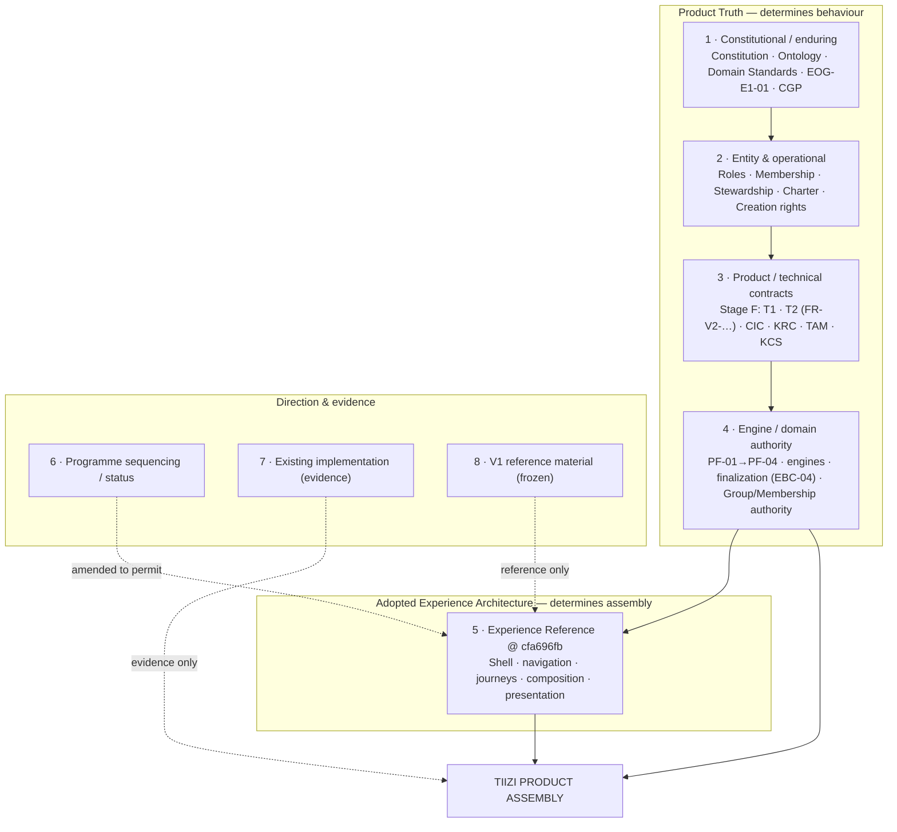
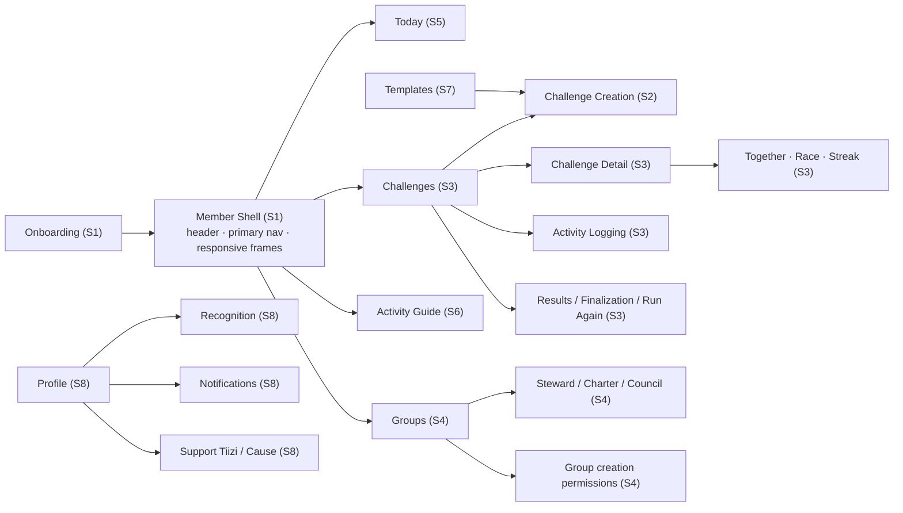
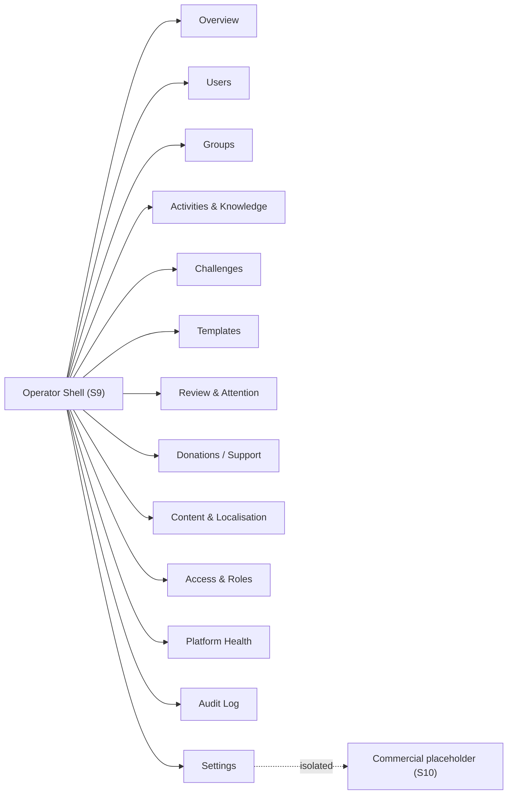
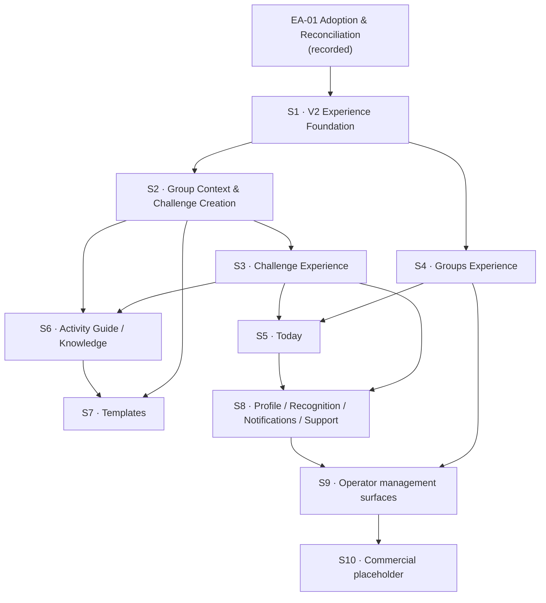

# Tiizi Experience Integration Map

**Document type:** Product Experience Architecture integration map

**Work package:** TIIZI-EA-01 — Experience Reference Adoption & Product-Truth Reconciliation

**Status:** COMPLETE / FOUNDER APPROVED FOR MERGE (EA-01-CORR-001, 2026-09-16)

**Date:** 2026-09-16

**Adopted Experience Reference:** `Fkenogo/tiizi-prototye` @
`cfa696fbd09180c6fdaeaf14d2e8784d8b05d6a6`

**Companion documents:**
[`TIIZI-EXPERIENCE-REFERENCE-ADOPTION-RECORD.md`](TIIZI-EXPERIENCE-REFERENCE-ADOPTION-RECORD.md)
·
[`TIIZI-EA-01-PRODUCT-TRUTH-RECONCILIATION.md`](TIIZI-EA-01-PRODUCT-TRUTH-RECONCILIATION.md)

---

## 1. Core formula

```text
PRODUCT TRUTH
+
ADOPTED EXPERIENCE REFERENCE
=
TIIZI PRODUCT ASSEMBLY
```

Product Truth determines **what Tiizi does**. The adopted Experience Reference
determines **how that truth is assembled into a coherent human-facing product**.

### 1.1 Implementation consequence — a new V2 shell

```text
NEW V2 SHELL
≠
V1 SHELL MODIFIED TO LOOK LIKE THE PROTOTYPE
```

The new V2 shell is **assembled from the adopted Experience Reference** and
**bound to existing Tiizi Product Truth**. V2 does not adapt the V1 shell, does
not import `BottomNav`, and does not preserve `/app` as a V2 experience
constraint. Any proposed V1 experience reuse requires explicit classification
and review before reuse (§10).

**May legitimately carry forward** (and does not make the V2 shell a derivative
of the V1 shell): approved Tiizi brand identity/assets; logo/icon/favicon/app
icons; brand colours; typography where appropriate; neutral reusable technical
primitives; shared infrastructure; governed Product Truth / domain capabilities.

## 2. Layer map



Precedence when layers disagree: **1–4 outrank 5**; **5 outranks 6, 7 and 8**.
Programme wording (6) is amended, not the experience. V1 UI (8) never overrides
the experience.

## 3. Member surface map



**Member surface → truth → slice**

| Surface | Truth source | Slice |
| ------- | ------------ | ----- |
| Shell / navigation | Firebase Auth boundary; experience decision | S1 |
| Onboarding | EOG §6 (admission modes); EOG §2/§11 | S1 |
| Challenge Creation | PF-04 Composer; PF-03 validator; PF-01/02 Knowledge | S2 |
| Challenge detail / join / logging | EOG §11; participation domain; ACT-03 deferred | S3 |
| Together / Race / Streak | EBC-04 / EBC-03 engines | S3 |
| Results / finalization / Run Again | EBC-04; T2 FR-V2-120…127; EOG §17; CIC Inv. #8 | S3 |
| Groups / creation / membership | EOG §3/§6/§7; HAD (Firestore live) | S4 |
| Stewards / Charter / Council | EOG §3/§5/§28; CG-08; deferred detail | S4 |
| Group creation permissions | EOG §10/§27 | S2 (enforcement) / S4 (surface) |
| Today | T1 §O; FR-V2-128/129 | S5 |
| Activity Guide / detail | PF-01/PF-02; EOG-03; CLU-01 | S6 |
| Knowledge / measurement | PF-02; Load Reporting Convention 08 | S6 |
| Templates | Master Programme PF-06 direction | S7 |
| Profile / privacy | EOG privacy/visibility (mechanisms downstream) | S8 |
| Recognition | EOG §33–36; T1 §U; T2 §24; CIC §4.23; **MOT-01** | S8 |
| Kudos | EOG §36; T1 §Q; T2 FR-V2-131/132; CIC §4.22 | S3/S8 |
| Notifications | Stage F Notifications baseline | S8 |
| Support Tiizi / Cause | T1 §V/§W; T2 §27/§28; CIC §4.24–4.26 | S8 |

## 4. Operator surface map



**Operator surface → truth → slice / gate**

| Surface | Truth source | Gate |
| ------- | ------------ | ---- |
| Shell / Overview | EOG §29; experience decision | S9; authority decision (FD-4) |
| Users | EOG §29; RBAC not Product Truth | FD-4 |
| Groups | EOG §3/§5/§10/§28; EOG-02 | FD-5 (moderation) |
| Activities & Knowledge | PF-01/PF-02; EOG-03; CLU-01 | none |
| Challenges | EBC-04 immutability; T1 §I.4 | FD-5; "reopen" → Run Again |
| Templates | Master Programme PF-06 direction | PF-06 |
| Review & Attention | authority unallocated | FD-4/FD-5 |
| Donations / Support | T1 §V/§W | FD-2/FD-3 |
| Content & Localisation | EOG-03; KCS | FD-7 |
| Access & Roles | EOG §29; RBAC not Product Truth | FD-4 |
| Platform Health | silent (labelled simulation) | none |
| Audit Log | EOG §29; EOG-01 | retention decision |
| Settings | silent | none |
| Commercial placeholder | none | FD-6 |

## 5. Boundary rules — what the Experience Reference may and may not do

| May determine | May never determine |
| ------------- | ------------------- |
| Application shell and navigation hierarchy | Domain authority, permissions, roles, RBAC |
| Screen composition and information hierarchy | Lifecycle, finalization, scoring, ranking, results |
| Journey assembly and interaction patterns | Challenge, Activity, Metric or Unit semantics |
| Presentation model and member/operator vocabulary | Knowledge and Recognition semantics |
| Empty / loading / error / state presentation | Group authority, Membership eligibility, Participation rules |
| Where governed truth is surfaced | Whether governed truth exists or what it says |

If the reference implies any item in the right-hand column, that implication is
**not adopted**; it is escalated or dispositioned as an experience adaptation.

## 6. Experience decisions made where Product Truth is silent

These are **experience decisions**, not Product Truth. They bind assembly and
must not be restated as governed behaviour.

| # | Decision | Basis |
| - | -------- | ----- |
| ED-1 | Primary member navigation is Today / Challenges / Groups, with the Activity Guide contextual/secondary | Experience hypothesis (reference Assumptions Register) |
| ED-2 | Today orders required activity → attention → invitations → upcoming → community summary | Experience hypothesis |
| ED-3 | Member vocabulary: Together / Race / Streak; plain-language copy; friendly time display; internal identifiers kept behind the experience | Experience presentation; internal domain terms unchanged |
| ED-4 | Lightweight social profile; no biometric dashboards | Experience hypothesis |
| ED-5 | Operator console is desktop-first and dense; 13 sections | Experience decision |
| ED-6 | Operator "Review & Attention" separates approvals / moderation / attention | Experience decision; authority **not** established |

## 7. Vertical slice dependency graph



Founder/authority gates:

- **S8 Recognition** requires **MOT-01** (FD-1).
- **S8 Support/Cause** requires donation authority (FD-2) and cause-custody
  scope (FD-3).
- **S4 reports/flags** and **S9 actions** require moderation/operator authority
  (FD-4, FD-5).
- **S7 Templates** requires **PF-06** authorisation.
- **S10** requires the commercial model decision (FD-6).

## 8. PF-05 integration map

| PF-05 element | Destination | Action |
| ------------- | ----------- | ------ |
| PF-04 Composer binding | S2 | RETAIN domain; re-bind experience |
| PF-03 validation/preview seam | S2 | RETAIN |
| Knowledge/activity selection | S2/S6 | RETAIN |
| Metric/unit compatibility | S2/S6 | RETAIN |
| Group identity bridge | S2 | RETAIN |
| Live membership eligibility | S2/S4 | RETAIN |
| V2 establishment | S2 | RETAIN |
| V2 read model | S3 | RETAIN |
| Preview infrastructure | S1/S2 tooling | RETAIN (reference/tooling) |
| `V2CreateChallengeWizard.tsx` | S2 | REWORK |
| `V2ChallengesScreen.tsx` / `V2ChallengeDetailScreen.tsx` | S3 | REWORK |
| `App.tsx` mixed root | S1 | REPLACE with the new V2 composition root |
| `BottomNav`, `/app/*` V1 containment, V1 onboarding/return paths | — | RETIRE from V2 (physical retirement/deletion timing = implementation sequencing matter, IS-1; temporary physical presence creates no compatibility obligation) |
| `TIIZI-V1-PRODUCT-EXPERIENCE-FREEZE.md` (branch) | PF-05 disposition | REFERENCE ONLY; amend status |

## 9. Invariants that must survive every slice

1. Product Truth is not changed by experience work.
2. The Experience Reference is not changed by Product Truth work — it is
   adapted at the experience layer, with conflicts recorded.
3. V1 UI and existing implementation never determine V2 shell, navigation,
   journeys, IA or composition.
4. Membership ≠ Participation; no silent enrolment.
5. Completed / finalized Challenges are immutable; Run Again creates a new
   identity.
6. The PF-03 validator remains the single semantic authority for Challenge
   establishment.
7. Kudos never affects truth; Recognition is policy-qualified (MOT-01).
8. Financial contribution never changes Challenge truth or Recognition; no
   custody or escrow is implied.
9. Group creation is open by default and restrictable only by a valid Charter
   rule; there is exactly one Accountable Steward at a time.
10. No implementation slice begins without its dependencies and Founder gates
    satisfied.
11. The V2 shell is **new**, assembled from the adopted Experience Reference —
    never the V1 shell adapted. V1 **cannot host V2**.
12. V1's physical presence in the repository creates no compatibility
    obligation; its physical retirement/deletion timing is an implementation
    sequencing matter, not an open Founder decision.

## 10. V1 reuse classification

Reuse of anything from V1 requires explicit classification **before** reuse. Do
not silently copy category D.

### A. BRAND ASSET — may carry forward where approved

- Tiizi logo / icon
- favicon / app icons
- brand colours
- approved visual identity assets

### B. NEUTRAL TECHNICAL PRIMITIVE — may be reused when it does not carry V1
journey/composition assumptions

- auth context/route protection (subject to the Firebase Auth boundary)
- API transport and query infrastructure
- neutral display / error / loading primitives
- generic control primitives and design tokens (subject to slice review)
- local emulator / preview wiring

### C. GOVERNED PRODUCT / DOMAIN CAPABILITY — preserve and bind into the new
experience

- V2 domain and API (`api/src/**`), PostgreSQL V2 model, read models
- PF-01 Knowledge, PF-02 Metrics/Units/components, PF-03 Challenge Definition,
  PF-04 Composer
- engines, finalization and result contracts
- Group authority and live Membership eligibility
- Group identity bridge / V2 establishment seam
- Firebase Auth identity boundary

### D. V1 EXPERIENCE COMPONENT — frozen / reference-only; explicit review and
authorisation required before any reuse in V2

Examples (non-exhaustive):

- `BottomNav`
- V1 Home composition
- V1 Groups journey
- V1 challenge navigation
- V1 onboarding journey
- V1 Profile composition
- V1 feed / navigation assumptions
- V1 return paths

Category D carries V1 journey, navigation, hierarchy or composition assumptions
and must not enter V2 merely because it already exists.
