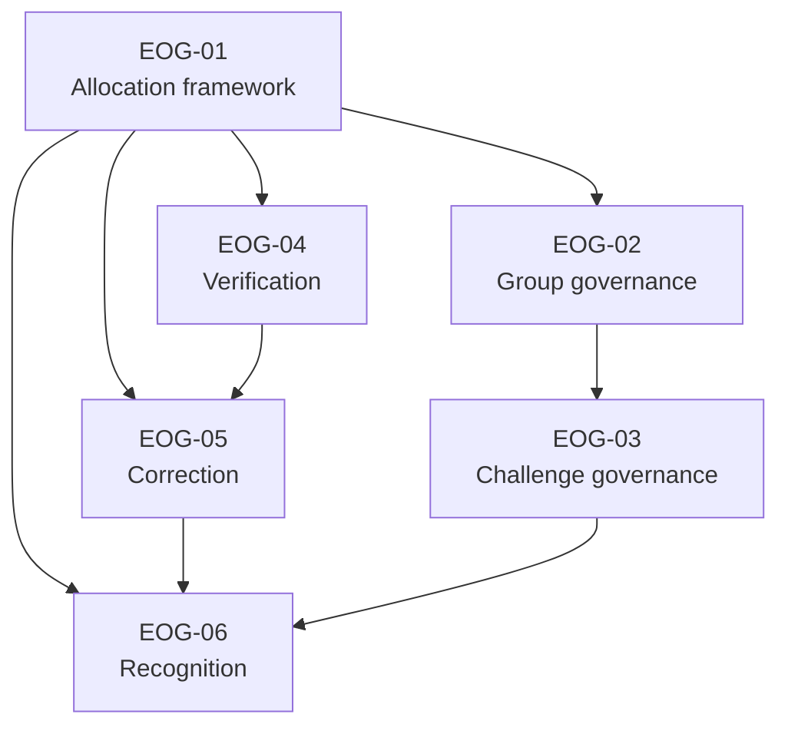

# Founder Accountability Decision Sequence

## 1. Purpose

This document defines the recommended order for founder review of EOG-01 through EOG-06. It minimizes repeated constitutional analysis while keeping accountability, source authority and downstream effects understandable.

The sequence does not approve a recommendation. The founder may approve, modify or defer each decision independently.

## 2. Recommended Review Structure

**Recommended number of founder sessions: two.**

Two sessions are the smallest practical structure because:

- EOG-01 establishes the allocation vocabulary used by every later decision;
- Group and Challenge governance are tightly dependent and belong together;
- Verification and correction share Activity Information and historical-integrity boundaries;
- Recognition depends on authoritative source truth and correction consequences;
- combining all six would create excessive context switching between organizational accountability and evidential integrity.

## 3. Dependency Map

The arrows indicate decision dependency, not lifecycle sequence or technical data flow.

## 4. Session 1 — Accountability, Group and Challenge Governance

### 4.1 Session Objective

Establish the constitutional allocation pattern and resolve who establishes and stewards Tiizi's primary collective and shared-undertaking contexts.

### 4.2 Decision Order

#### First: EOG-01 — Stewardship and Custody Allocation Framework

**Why first:** Every subsequent decision needs a stable distinction among Accountable steward, Custodian, Administrator, Operator and Presenter.

**Decision dependency:** None beyond the committed baseline.

**If approved:** Later decisions can name durable steward and custody patterns without inventing local definitions.

**If deferred:** EOG-02 through EOG-06 authority analysis can continue, but final stewardship and custody allocation remains blocked.

#### Second: EOG-02 — Group Identity, Purpose and Stewardship

**Why second:** Group is the primary Version 2 collective context. Challenge governance must know whether Group stewardship transfers, delegates or remains distinct.

**Decision dependency:** EOG-01 allocation framework.

**If approved:** Group stewardship, Group Lifecycle analysis and Group-role governance can proceed within a stable boundary.

**If deferred:** EOG-03 can still choose Challenge source authority, but its stewardship relationship to the Group cannot be finalized.

#### Third: EOG-03 — Challenge Identity, Purpose, Goal and Stewardship

**Why third:** Challenge exists within Group context but is a distinct Governed subject. The Group decision supplies the accountability boundary needed to evaluate Challenge delegation.

**Decision dependencies:** EOG-01 and EOG-02.

**If approved:** Challenge Lifecycle, Policy, amendment and role-governance work becomes constitutionally grounded.

**If deferred:** Activity Event authority remains intact, but Challenge stewardship and individual Challenge establishment remain unresolved.

### 4.3 Session 1 Founder Materials

- [Decision Agenda, Session 1](02-FOUNDER-ACCOUNTABILITY-DECISION-AGENDA.md#4-session-1-decisions)
- [Detailed EOG-01 Analysis](02-FOUNDER-ACCOUNTABILITY-DECISION-OPTIONS.md#2-eog-01--stewardship-and-custody-allocation-framework)
- [Detailed EOG-02 Analysis](02-FOUNDER-ACCOUNTABILITY-DECISION-OPTIONS.md#3-eog-02--group-identity-purpose-and-stewardship)
- [Detailed EOG-03 Analysis](02-FOUNDER-ACCOUNTABILITY-DECISION-OPTIONS.md#4-eog-03--challenge-identity-purpose-goal-and-stewardship)
- [Resolution Plan](02-ENTITY-OWNERSHIP-RESOLUTION-PLAN.md)

### 4.4 Session 1 Review Gate

Before closing Session 1, confirm separately:

1. allocation framework selected, amended or deferred;
2. Group truth-establishment Authority selected, amended or deferred;
3. Group stewardship model selected, amended or deferred;
4. Challenge truth-establishment Authority selected, amended or deferred;
5. Challenge stewardship relationship selected, amended or deferred;
6. no Group or Challenge lifecycle transition has been approved implicitly;
7. no Administrator has received unrestricted Authority;
8. KNW-04 remains pending unless separately decided in a later founder session.

### 4.5 Governance Phases Unlocked After Session 1

If all three decisions are approved:

- Entity Accountability and Custody Standard;
- Group stewardship reconciliation;
- Challenge stewardship reconciliation;
- Group Lifecycle Standard discovery and drafting;
- Challenge Lifecycle Standard discovery and drafting;
- Group and Challenge Roles and Permissions analysis;
- controlled amendment of the affected register rows.

Still blocked after Session 1:

- detailed Group and Challenge states and transitions;
- invitations, joining, leaving, removal and transfer workflows;
- Challenge amendment procedure;
- Privacy and Security Standards;
- Verification and correction governance;
- Recognition governance;
- implementation mapping.

## 5. Session 2 — Activity Integrity and Recognition

### 5.1 Session Objective

Resolve authoritative Verification, correction and Recognition qualification without collapsing acceptance, evidence, calculation, administration or presentation.

### 5.2 Decision Order

#### First: EOG-04 — Verification Authority

**Why first:** Correction must know whether Verification is a distinct authoritative fact, who establishes it and whether it may change after acceptance.

**Decision dependency:** EOG-01 for stewardship and custody. It does not depend on EOG-02 or EOG-03 source-authority approval.

**If approved:** Verification Standard and evidence-source governance can proceed.

**If deferred:** EOG-05 can still resolve correction of existing facts, but Verification correction remains pending.

#### Second: EOG-05 — Correction Authority

**Why second:** Recognition correction must follow corrected source truth. Correction analysis also incorporates the Verification decision without treating it as acceptance.

**Decision dependencies:** EOG-01 and, for complete scope, EOG-04.

**If approved:** Activity Correction, historical-integrity, audit and downstream recalculation governance can proceed.

**If deferred:** Recognition authority can be selected, but withdrawal or correction consequences cannot be finalized.

#### Third: EOG-06 — Recognition Authority

**Why third:** Formal Recognition must cite authoritative participation or Derived Truth and must respond coherently when those facts are corrected.

**Decision dependencies:** EOG-01 and EOG-05; EOG-03 provides the preferred Challenge-context clarity but is not required to preserve existing source authorities.

**If approved:** Motivation and Recognition governance, terminology and Feed/Notification relationship analysis can proceed.

**If deferred:** Progress, Completion and Ranking remain authoritative, but no formal Recognition qualification can be governed.

### 5.3 Session 2 Founder Materials

- [Decision Agenda, Session 2](02-FOUNDER-ACCOUNTABILITY-DECISION-AGENDA.md#5-session-2-decisions)
- [Detailed EOG-04 Analysis](02-FOUNDER-ACCOUNTABILITY-DECISION-OPTIONS.md#5-eog-04--verification-authority)
- [Detailed EOG-05 Analysis](02-FOUNDER-ACCOUNTABILITY-DECISION-OPTIONS.md#6-eog-05--correction-authority)
- [Detailed EOG-06 Analysis](02-FOUNDER-ACCOUNTABILITY-DECISION-OPTIONS.md#7-eog-06--recognition-authority)
- [Resolution Plan](02-ENTITY-OWNERSHIP-RESOLUTION-PLAN.md)

### 5.4 Session 2 Review Gate

Before closing Session 2, confirm separately:

1. Verification Authority and permitted timing model selected, amended or deferred;
2. Verification remains distinct from acceptance and Evidence Eligibility;
3. correction allocation model selected, amended or deferred;
4. no new Correction Authority has been created implicitly;
5. Recognition qualification model selected, amended or deferred;
6. formal Recognition remains distinct from participant acknowledgement and Reward;
7. Presentation Authority has not acquired qualification or correction authority;
8. no correction, Verification or Recognition lifecycle has been approved implicitly.

### 5.5 Governance Phases Unlocked After Session 2

If all three decisions are approved:

- Verification Standard;
- Activity Correction Standard;
- evidence-source and competition-fairness governance;
- historical-integrity and downstream recalculation governance;
- Motivation and Recognition Framework;
- Feed and Notification relationship governance;
- controlled amendment of AEV-08, AEV-09, DRV-09 and consequential rows.

Still blocked after Session 2:

- Verification and correction lifecycle transitions;
- disputes and appeals;
- time, grace and late-entry rules;
- ranking and Streak formulas;
- Reward governance;
- Privacy, Roles and Permissions, Security and implementation standards.

## 6. Optimal Decision Sequence Summary

| Order | Decision | Session | Primary dependency | Immediate governance unlock |
|---:|---|---:|---|---|
| 1 | EOG-01 | 1 | Constitutional baseline | Allocation framework and register-completion method |
| 2 | EOG-02 | 1 | EOG-01 | Group stewardship and lifecycle governance |
| 3 | EOG-03 | 1 | EOG-01, EOG-02 | Challenge stewardship, Policy and lifecycle governance |
| 4 | EOG-04 | 2 | EOG-01 | Verification and evidence-source governance |
| 5 | EOG-05 | 2 | EOG-01, preferably EOG-04 | Correction, audit and recalculation governance |
| 6 | EOG-06 | 2 | EOG-01, EOG-05 | Motivation and Recognition governance |

## 7. Deferral Handling

If a decision is deferred:

- retain its current pending register entries;
- do not amend its Domain Standard or validation report;
- continue only with later decisions whose source-authority analysis does not depend on it;
- record any provisional discussion as founder notes, not constitutional direction;
- do not treat a recommendation as an interim default.

## 8. Post-Decision Governance Sequence

After both sessions, and only for explicitly approved decisions:

1. create a founder approval report;
2. update the Consolidated Founder Decision Register;
3. execute the controlled amendment order in the [Resolution Plan](02-ENTITY-OWNERSHIP-RESOLUTION-PLAN.md#11-controlled-amendment-order);
4. revalidate the constitutional baseline and five Domain Standards;
5. update the Entity Ownership Register and Decision Gaps;
6. obtain founder review of the reconciled register;
7. begin later lifecycle or role standards only when their specific prerequisites are met.

## 9. Status

**Status:** Recommended founder decision sequence. All decisions and recommendations remain pending founder approval.
