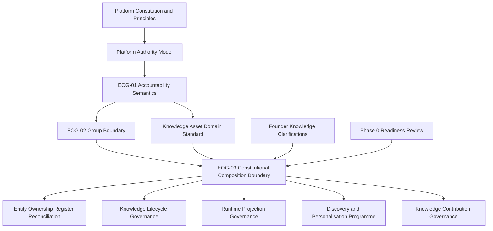

# EOG-03 Phase 1 — Constitutional Scope, Structure and Drafting Blueprint

## 1. Executive Summary

### Blueprint purpose

This document defines the scope, vocabulary, architecture, principle set, dependencies, risks and completion gates for the future EOG-03 constitutional document. It is a drafting blueprint, not EOG-03 itself.

The blueprint converts the findings of the [EOG-03 Phase 0 Readiness Review](09-EOG-03-PHASE-0-KNOWLEDGE-GOVERNANCE-CONSTITUTIONAL-READINESS-REVIEW.md) into an ordered drafting contract. It preserves EOG-01 and EOG-02 as approved constitutional baselines and applies the founder’s authoritative Knowledge philosophy without altering existing governance.

### Core drafting proposition

EOG-03 should govern the constitutional boundary through which authoritative Platform Knowledge is created, distinguished from adjacent concepts, composed into Group experiences, made available for runtime use and preserved as historically intelligible meaning.

The future document must establish that:

- primary Platform Knowledge Assets are Exercise Assets and Wellness Activity Assets;
- Platform Knowledge defines authoritative meaning;
- Groups may compose Platform Knowledge but may not redefine, modify or fork it;
- a Group Challenge is a governed Constitutional Composition of Platform Knowledge, applicable Policy, Group configuration and Community context;
- Templates are governed composition guides, not Knowledge Assets;
- a Challenge Wizard is a governed creation mechanism, not a Knowledge Asset or source Authority;
- a Runtime Projection is subordinate to its source Knowledge Asset and the single Runtime Catalogue authority;
- historical representation preserves meaning without creating a competing Knowledge fork;
- Interests, Goals, Preferences, Tags and Categories belong outside Platform Knowledge in a future Discovery and Personalisation Governance Programme;
- future trusted contribution may broaden origin, while canonical truth remains governed.

### Blueprint verdict

The constitutional subject is sufficiently defined to enter drafting. No additional Platform Authority, accountability allocation, lifecycle rule, role model or implementation design is required to start.

EOG-03 should not be considered complete merely because it defines Knowledge Assets. Its distinctive constitutional contribution must be a precise, authority-safe definition of **Constitutional Composition** and the boundary between Platform Knowledge and Group Experience.

## 2. Constitutional Scope Statement

### 2.1 EOG-03 responsibility

EOG-03 is responsible for governing the constitutional meaning and boundary of Platform Knowledge within Tiizi.

It must determine:

1. what Platform Knowledge is;
2. which primary Governed Subjects constitute Platform Knowledge at the current constitutional stage;
3. what authoritative meaning a Knowledge Asset establishes;
4. how Knowledge Authority differs from Policy, Calculation, Participation, Administration, Operation and Presentation Authority;
5. what a Group may do with Platform Knowledge without acquiring authority to redefine it;
6. what a Group Experience means at the Knowledge boundary;
7. what Constitutional Composition is and what it is not;
8. how Platform Knowledge, applicable Policy, Group configuration and Community context remain distinct within a Challenge composition;
9. why Templates are composition guides rather than Knowledge Assets;
10. why Challenge Wizards and similar facilities are creation mechanisms rather than constitutional sources of truth;
11. how Runtime Catalogue authority and Runtime Projections remain subordinate to canonical Knowledge meaning;
12. how historical use remains intelligible without pre-approving a snapshot or versioning contract;
13. how future trusted contribution can be recognised without transferring Knowledge Authority by implication;
14. why discovery and personalisation concepts remain outside Platform Knowledge;
15. which later decisions and standards must remain explicitly deferred.

### 2.2 Constitutional questions EOG-03 must answer

| Question | Required constitutional answer type |
|---|---|
| What meaning is authoritative Platform Knowledge? | Stable definition and authority boundary |
| What are the primary Platform Knowledge Assets? | Exercise Asset and Wellness Activity Asset classification boundary |
| May a Group change Platform Knowledge? | Explicit prohibition on modification, forking and local redefinition |
| What does a Group contribute to a Challenge? | Group configuration, local objectives and Community context boundary |
| What is formed when Knowledge and Group context are combined? | Constitutional Composition definition |
| Is composition copying, inheritance or modification? | Explicit negative definition: none of those |
| Does composition transfer Knowledge Authority? | Explicit no-transfer rule |
| What is a Template? | Governed composition guide |
| What is a Challenge Wizard? | Governed creation mechanism |
| What establishes runtime availability? | Existing single Runtime Catalogue authority boundary |
| What is a Runtime Projection? | Subordinate governed representation |
| How is past meaning preserved? | Historical intelligibility boundary without lifecycle design |
| What may a Contributor establish? | Attributable input only; no canonical truth by contribution alone |
| Where do Interests, Goals, Preferences, Tags and Categories belong? | Outside Platform Knowledge; future programme dependency |

### 2.3 Explicit exclusions

EOG-03 must not govern:

- individual Exercise or Wellness Activity content;
- catalogue membership, counts, identifiers or rationalisation outcomes;
- Accountable Steward, Custodian, Administrator, Operator or role allocation;
- lifecycle states, transitions, publication or retirement;
- version formats, snapshot minimums, checksums or retention;
- contributor eligibility, appointment or qualifications;
- review, approval, dispute or appeal workflows;
- Group, Challenge, Template or membership lifecycle;
- permissions, privacy rules or security controls;
- taxonomy dictionaries, tag lists or category values;
- recommendation, matching or personalisation behavior;
- Challenge types, eligibility or participation rules;
- validation, scoring, Progress, Completion, Ranking, Streak or Recognition formulas;
- interfaces, schemas, storage, APIs, services or technical architecture;
- migration, seeding, synchronization or deployment;
- operational procedures or implementation mapping.

### 2.4 Scope boundary test

A proposed EOG-03 statement is in scope only when it defines a stable constitutional concept, relationship or authority boundary that remains valid regardless of implementation technology.

A statement is out of scope when it prescribes a field, state, transition, actor title, workflow, formula, interface, storage mechanism, deployment behavior or specific catalogue content.

## 3. Recommended Vocabulary

### 3.1 Vocabulary discipline

EOG-03 must reuse EOG-01 terminology without redefinition. In particular, it must preserve the approved meanings of:

- Authority;
- Authority to Establish Truth;
- Accountable Steward;
- Custodian;
- Administrator;
- Operator;
- Contributor;
- Participant;
- Governed Subject;
- Information Subject;
- Attributable Originator;
- Delegate;
- Presenter;
- Downstream User.

The terms below are recommended additions or domain-specific refinements. Their final constitutional definitions belong in EOG-03, not in this blueprint.

### 3.2 Core vocabulary set

| Recommended term | Drafting purpose | Required boundary | Treatment |
|---|---|---|---|
| Platform Knowledge | Name the body of authoritative reusable meaning governed by Tiizi for declared platform purposes. | Distinct from Policy, personalisation, activity occurrence, Derived Truth and presentation. | Add as a principal EOG-03 concept. |
| Governed Knowledge | Describe Knowledge whose identity, meaning, provenance and authority are subject to approved governance. | A quality and governance condition, not a competing asset class or Authority. | Retain as a supporting term. |
| Knowledge Asset | Name a governed unit of authoritative reusable meaning. | Not an Activity Event, Challenge, Template, preference or Runtime Projection. | Retain from the Knowledge Asset Domain Standard. |
| Platform Knowledge Asset | Identify a Knowledge Asset whose canonical meaning is established for shared platform use. | Group use does not transfer Authority or create a local fork. | Add as the constitutional platform-level classification. |
| Exercise Asset | Identify an authoritative Fitness-domain Platform Knowledge Asset describing an Exercise. | It defines meaning, not occurrence, individual suitability or Challenge result. | Add as a primary Platform Knowledge Asset type. |
| Wellness Activity Asset | Identify an authoritative Wellness-domain Platform Knowledge Asset describing a Wellness Activity. | It defines meaning, not occurrence, individual outcome or universal suitability. | Add as a primary Platform Knowledge Asset type. |
| Authoritative Meaning | Name the canonical meaning established through Knowledge Authority for a declared Knowledge Asset and purpose. | Distinct from authorship, display wording, runtime availability, Policy and use. | Add and define explicitly. |
| Group Experience | Name the governed community experience created within a Group context, including Challenges and their local context. | Does not imply the Group owns or may redefine Platform Knowledge; formal accountability allocations remain separate. | Add with an EOG-01 terminology caution. |
| Constitutional Composition | Name the governed formation of a Group Challenge from Platform Knowledge, applicable Policy, Group configuration and Community context. | Not copying, inheritance, modification, forking or a transfer of source Authority. | Add as the central EOG-03 concept. |
| Composition Input | Refer collectively to one of the constitutionally distinct inputs used in a composition. | Input status does not merge identities or authorities. | Add only if it improves precision; do not make it a new Governed Subject automatically. |
| Applicable Policy | Identify approved Policy that governs permitted use or behavior in the particular composition. | Policy remains distinct from Knowledge and Calculation. | Retain as a cross-domain term. |
| Group Configuration | Name Group-provided configuration for a governed experience, such as timing or participation context where later governance permits. | Does not establish canonical Knowledge, Policy or Derived Truth. | Add as a composition-boundary term, not a field set. |
| Community Context | Name purpose-limited local meaning supplied by the Group experience. | Does not modify Platform Knowledge or prove participation. | Add as a composition-boundary term. |
| Template | Name a governed composition guide that helps arrange eligible inputs for Challenge creation. | Not a Knowledge Asset, Challenge, Policy, source Authority or proof of compatibility. | Refine existing usage. |
| Creation Mechanism | Name a governed means through which approved inputs are brought together to form a Group Challenge. | A mechanism has no Authority merely because it accepts, validates or presents inputs. | Add as the constitutional classification for a wizard or equivalent future mechanism. |
| Challenge Wizard | Name the present example of a creation mechanism. | Keep the constitutional document mechanism-neutral; the named wizard may appear as an explanatory example only. | Use sparingly; prefer Creation Mechanism in normative language. |
| Runtime Catalogue | Name the governed runtime-availability authority/function for approved Knowledge representations. | It establishes availability, not canonical meaning, and is not a twelfth Platform Authority. | Retain unchanged. |
| Runtime Projection | Name a subordinate governed representation of a Knowledge Asset for a declared runtime purpose. | Not a Knowledge Asset classification, local authority, snapshot or competing source of truth. | Retain unchanged. |
| Historical Representation | Name a representation that preserves the meaning and composition context relevant to historical use. | Does not pre-approve a snapshot payload, version scheme, immutability rule or Knowledge fork. | Add as the preferred constitutional term. |
| Contributor | Apply the EOG-01 term to attributable parties that supply proposed Knowledge material. | Contribution does not establish canonical meaning, approval, stewardship or custody. | Reuse without redefinition. |
| Governed Review | Name the constitutional requirement that proposed contribution be subject to approved review before authoritative status where later governance permits. | Does not define reviewers, stages, workflow or approval Authority beyond existing boundaries. | Add only as a future-direction boundary. |

### 3.3 Terms to remove, narrow or avoid

| Term or usage | Blueprint recommendation | Reason |
|---|---|---|
| Knowledge Item / Knowledge Object | Prefer Knowledge Asset in constitutional text. | Prevent parallel entity names. |
| Challenge Instance / instantiation | Prefer Group Challenge or governed Constitutional Composition. | “Instantiation” implies copying or implementation mechanics. |
| Knowledge snapshot | Prefer Historical Representation at constitutional level. | Snapshot content and versioning remain pending under KNW-02. |
| Knowledge owns / Group owns | Use the precise EOG-01 relationship in formal allocations; preserve “Group Experience” as a domain boundary, not an undeclared allocation. | “Owns” conflates Authority, stewardship, custody and context. |
| Source of Truth | Name the exact truth and Authority instead. | Different truths have different authorities. |
| Template Knowledge | Do not use. | Templates are composition guides, not Platform Knowledge Assets. |
| Interest Knowledge / Goal Knowledge | Do not use for personalisation concepts. | Interests and Goals are outside Platform Knowledge under founder direction. |
| Knowledge-driven scoring | Use “Policy-governed calculation using authoritative Knowledge meaning” where needed. | Prevent Knowledge, Policy and Calculation collapse. |
| Local Knowledge | Avoid where it suggests Group-modified canonical meaning. | Groups may supply context but may not fork Platform Knowledge. |

### 3.4 “Groups own their governed experiences” drafting rule

The founder phrase establishes a constitutional domain boundary: Group experiences belong to the Group-governed context rather than to Platform Knowledge.

EOG-03 must not convert that phrase into an undeclared Accountable Stewardship, Custody, Administration or Authority allocation. Formal provisions should describe the Group Experience as a distinct Governed Subject and state which meaning belongs to Platform Knowledge versus Group-provided context. Later Entity Ownership, Challenge and lifecycle governance will allocate the relevant EOG-01 relationships.

## 4. Recommended Document Architecture

The recommended architecture contains nineteen sections. The order is deliberate: establish precedence and Knowledge meaning before describing composition; establish composition before describing its guides, mechanisms and representations; defer operational detail only after all constitutional boundaries are visible.

| # | Proposed section | Purpose | Constitutional objective | Dependencies | Expected outcome |
|---:|---|---|---|---|---|
| 1 | Purpose | State why EOG-03 exists. | Connect truthful collective participation to stable authoritative Knowledge meaning. | Platform Constitution; Platform Principles | A concise mandate that does not claim implementation or lifecycle scope. |
| 2 | Constitutional Basis and Precedence | Identify binding inputs. | Preserve EOG-01, EOG-02, higher-order governance and founder clarification authority. | EOG-01; EOG-02; Constitution; Knowledge Domain Standard | Clear precedence and non-reopening statement. |
| 3 | Constitutional Scope | Define included, excluded and future areas. | Prevent scope creep into lifecycle, permissions, formulas, content or implementation. | Phase 0 review | An auditable scope boundary. |
| 4 | Canonical Vocabulary | Define EOG-03-specific terms. | Establish one stable meaning for Platform Knowledge, composition, Group Experience and subordinate representations. | EOG-01 terminology; Platform glossary | A non-duplicative vocabulary with explicit negative definitions. |
| 5 | Platform Knowledge | Define the constitutional Knowledge body. | Establish reusable authoritative meaning as distinct from Policy, evidence, discovery and presentation. | Knowledge Asset Domain Standard; Authority Model | A stable Platform Knowledge boundary. |
| 6 | Primary Platform Knowledge Assets | Define Exercise Assets and Wellness Activity Assets. | Recognise current primary asset types without approving content, taxonomy or records. | Fitness and Wellness launch scope | A bounded current asset classification with future-domain restraint. |
| 7 | Authoritative Meaning | Define what Knowledge Authority establishes. | Separate canonical meaning from authorship, stewardship, runtime availability, Policy and calculation. | EOG-01; Knowledge Authority | One precise source-authority boundary. |
| 8 | Knowledge Authority Boundaries | Map existing authorities at the Knowledge boundary. | Preserve Knowledge, Policy, Calculation, Participation, Administrative, Operational and Presentation separation. | Platform Authority Model | No new Authority and no implied allocation. |
| 9 | Platform Knowledge and Group Experience | Establish the cross-domain boundary. | State that Groups compose but cannot redefine Platform Knowledge; distinguish local context from canonical meaning. | EOG-02; Group Domain Standard | A non-overlapping domain relationship. |
| 10 | Constitutional Composition | Define the central composition model. | Establish four distinct inputs and reject copying, inheritance, modification and forking. | Sections 5–9; Challenge Domain Standard | A technology-neutral definition of Group Challenge formation. |
| 11 | Composition Integrity | State invariants that survive composition. | Prevent Authority transfer, semantic mutation, hidden substitution and local competing truth. | Constitutional Composition; Platform principles | A testable set of composition boundaries. |
| 12 | Templates as Composition Guides | Classify Templates. | Prevent Templates from becoming Knowledge Assets, Policy, Challenges or source Authority. | Constitutional Composition | A stable guide-versus-truth distinction. |
| 13 | Challenge Creation Mechanisms | Classify the wizard and future mechanisms. | Ensure mechanisms consume approved inputs without establishing constitutional truth. | Template and composition boundaries | Implementation-neutral creation-mechanism limits. |
| 14 | Runtime Knowledge | Preserve runtime authority boundaries. | Define Runtime Catalogue and Runtime Projection subordination without technical design. | KNW-01; Knowledge Asset Domain Standard | One runtime availability authority and no competing Knowledge source. |
| 15 | Historical Knowledge Integrity | Preserve historical intelligibility. | Distinguish Historical Representation from a fork or live authority while deferring KNW-02/03. | Data and Information Standard; KNW-02/03 | Integrity boundary without versioning or lifecycle design. |
| 16 | Knowledge Contribution Direction | Recognise current and future origin models. | Preserve Contributor attribution, governed review and Knowledge Authority despite possible decentralisation. | EOG-01 Contributor; founder clarification | Future direction without roles, workflow or allocation. |
| 17 | Discovery and Personalisation Boundary | Exclude Interests, Goals, Preferences, Tags and Categories. | Prevent discovery concepts from becoming Platform Knowledge; identify the future programme. | Phase 0; Profile Domain Standard; KNW-04 | Explicit non-Knowledge boundary and dependency. |
| 18 | Deferred Governance and Prohibited Inferences | Collect exclusions and pending decisions. | Keep KNW-02/03/04, accountability, lifecycle, permissions, security and implementation unresolved. | Founder decision register | A clear restraint section preventing silent approval. |
| 19 | Governance Status and Decision Traceability | State status, dependencies and amendment path. | Make draft/review/approval status and source trace explicit. | Constitutional hierarchy | Reviewable provenance and no false “approved/frozen” claim. |

### Architecture rationale

The document should not begin with Templates, runtime, catalogues or the wizard. Doing so would frame Knowledge through current product mechanisms. It should begin with constitutional purpose, meaning and authority, then establish how that meaning participates in a Group experience.

Historical integrity must follow runtime and composition boundaries because a Historical Representation preserves a prior governed use; it does not define source Knowledge. Contribution must follow authority boundaries so that contribution cannot be mistaken for approval.

## 5. Constitutional Principles Matrix

Each principle below is a required drafting proposition. The future EOG-03 document must state it constitutionally but need not use these titles or wording verbatim.

| ID | Principle statement | Rationale | Dependency | Implementation-neutral expression |
|---|---|---|---|---|
| E3-P01 | Platform Knowledge exists to preserve authoritative reusable meaning for truthful participation. | Knowledge serves platform truth, not catalogue convenience. | Platform Constitution; Truth Before Convenience | State purpose without naming a storage or service. |
| E3-P02 | Primary Platform Knowledge Assets are Exercise Assets and Wellness Activity Assets. | Reflects approved launch domains and founder direction. | Fitness and Wellness launch scope | Classify concepts, not records or collections. |
| E3-P03 | Platform Knowledge defines authoritative meaning. | Establishes the source meaning used by downstream contexts. | Knowledge Authority | Define meaning, not approval workflow. |
| E3-P04 | One canonical Knowledge meaning cannot have competing equal authorities. | Prevents local or runtime divergence from becoming constitutional truth. | Single Source of Truth; KNW-01 | State authority uniqueness without technical source selection. |
| E3-P05 | Knowledge authorship, contribution, stewardship, custody, administration and Authority remain distinct. | Applies EOG-01 and prevents role-title inference. | EOG-01 | Use relationship names without allocating actors. |
| E3-P06 | A Group may compose Platform Knowledge but may not redefine, modify or fork it. | Protects shared meaning while enabling local experience. | Founder clarification; EOG-02 | State domain boundary, not a permission mechanism. |
| E3-P07 | Group Experience remains distinct from Platform Knowledge. | Separates community context and local configuration from reusable meaning. | EOG-02; Group Domain Standard | Avoid formal ownership shorthand. |
| E3-P08 | Constitutional Composition forms a Group Challenge from Platform Knowledge, applicable Policy, Group configuration and Community context. | Supplies the missing cross-domain concept. | Phase 0 KRD-01 | Name conceptual inputs only. |
| E3-P09 | Constitutional Composition is not copying. | Prevents a copied representation from acquiring Knowledge identity. | Founder clarification | Negative constitutional definition. |
| E3-P10 | Constitutional Composition is not inheritance. | Prevents source-change or subtype assumptions. | Founder clarification | Negative constitutional definition. |
| E3-P11 | Constitutional Composition is not modification. | Protects source Knowledge meaning. | Founder clarification | Negative constitutional definition. |
| E3-P12 | Constitutional Composition does not transfer Authority among its inputs. | A Challenge cannot become Knowledge or Policy Authority by use. | Authority Model | State no-transfer rule. |
| E3-P13 | Composition inputs preserve their identities, authorities and provenance. | Enables historical and semantic intelligibility. | Data and Information Standard | Require attribution without specifying fields. |
| E3-P14 | Platform Knowledge and applicable Policy remain distinct. | Knowledge describes meaning; Policy governs use and behavior. | Knowledge/Policy boundary | No policy schema or formula. |
| E3-P15 | Platform Knowledge does not establish Progress, Completion, Ranking, Streak or Recognition. | Calculation Authority remains responsible for approved Derived Truth. | ACT-02; Calculation Authority | State authority boundary only. |
| E3-P16 | References to Knowledge-provided logic mean governed Knowledge and Policy inputs, not calculation by Knowledge Authority. | Reconciles founder language with existing authority separation. | Phase 0 KRD-03 | Use conceptual authority chain, no algorithm. |
| E3-P17 | A Template is a governed composition guide. | Allows reusable guidance without promoting it to Knowledge. | Founder clarification | Define purpose and negative boundaries. |
| E3-P18 | A Template is not a Knowledge Asset, Policy, Challenge or source Authority. | Prevents template drift from becoming truth. | Composition boundary | No template model or lifecycle. |
| E3-P19 | A Creation Mechanism consumes governed inputs and supports Challenge formation without establishing Knowledge truth. | Keeps the wizard subordinate and technology-neutral. | Founder clarification | Refer to mechanism, not interface behavior. |
| E3-P20 | There is one governed Runtime Catalogue authority for runtime availability. | Preserves KNW-01. | KNW-01 | Do not name a technical repository. |
| E3-P21 | Runtime Catalogue authority establishes availability, not canonical Knowledge meaning. | Prevents a twelfth Authority or runtime overwrite of meaning. | Knowledge Asset Domain Standard | Function boundary only. |
| E3-P22 | A Runtime Projection is a subordinate governed representation of a Knowledge Asset. | Protects rich Knowledge and prevents projection authority. | Foundational baseline | No projection fields or contract. |
| E3-P23 | A Historical Representation preserves historically intelligible use without becoming a Knowledge fork. | Separates integrity from copying and version design. | Information integrity; KNW-02/03 | No snapshot payload, version or retention rule. |
| E3-P24 | Interests, Goals, Preferences, Tags and Categories are not Platform Knowledge Assets. | Preserves Discovery and Personalisation separation. | Founder clarification | State exclusion and future dependency. |
| E3-P25 | Discovery and Personalisation may reference Platform Knowledge but cannot redefine it. | Supports future matching without authority transfer. | Future programme boundary | No recommendation behavior. |
| E3-P26 | A Contributor may supply attributable proposed material but does not establish canonical meaning through contribution alone. | Applies EOG-01 to future contribution. | EOG-01 Contributor | No contributor role or eligibility. |
| E3-P27 | Future decentralised contribution remains subject to governed review and existing Knowledge Authority. | Allows evolution while preserving truth. | Founder clarification | Direction only, no workflow. |
| E3-P28 | Current Platform-generated Knowledge does not preclude future governed contribution. | Preserves extensibility without claiming a launch capability. | Future Extensibility Principle | State future possibility only. |
| E3-P29 | Administrative, operational or presentation action cannot redefine Platform Knowledge. | Preserves least privilege and authority boundaries. | ADM-01; Authority Model | No control implementation. |
| E3-P30 | Similar labels, local context or repeated use do not establish Knowledge identity or equivalence. | Prevents discovery labels and Group context from creating canonical meaning. | Knowledge Asset Domain Standard | Identity rule without taxonomy decisions. |
| E3-P31 | Future domains require governed approval before becoming active Platform Knowledge domains. | Preserves current Fitness and Wellness scope. | PLT-03 | No future-domain design. |
| E3-P32 | EOG-03 cannot allocate accountability merely by defining a domain boundary. | Keeps this phase within its approved task. | EOG-01 | Explicit non-allocation statement. |

## 6. Deferred Governance Matrix

Every row below must remain outside EOG-03. A future document may refine the constitutional boundary only after its stated dependency is approved.

| Deferred area | What EOG-03 may say | What EOG-03 must not decide | Blocking decision or future standard |
|---|---|---|---|
| Knowledge lifecycle | Historically intelligible change is required. | States, transitions, publication, revision, deprecation, retirement or archive. | KNW-02, KNW-03; Knowledge Lifecycle Standard |
| Versioning and snapshots | Historical Representation must remain attributable to source meaning and composition context. | Version identity, snapshot minimum, checksum, immutability or update behavior. | KNW-02; Snapshot and Versioning Standard |
| Deletion and retention | Authoritative history may not be silently reinterpreted or concealed. | Hard deletion, tombstones, retention periods, emergency removal or archival access. | KNW-03; Retention and Knowledge Lifecycle Standards |
| Runtime Projection contract | Projection is subordinate and purpose-specific. | Fields, serialization, synchronisation, caching, fallback or API contract. | KNW-04; Runtime Projection Standard |
| Catalogue content | Exercise and Wellness Activity Assets are primary types. | Which records exist, IDs, counts, content or launch membership. | Catalogue rationalisation and approval programme |
| Taxonomy | Platform Knowledge may require governed semantic meaning. | Domains, families, variants, category values, tags or dictionary contents. | KNW-04; scoped Taxonomy Standards |
| Discovery and Personalisation | Interests, Goals, Preferences, Tags and Categories are outside Platform Knowledge. | Their authority, stewardship, lifecycle, matching, recommendation or privacy model. | Future Discovery and Personalisation Governance Programme |
| Contributor eligibility | Contribution may exist in a future governed model. | Who qualifies, appointment, credentials, trust level or participation rights. | Knowledge Contribution Standard; Roles and Permissions Standard |
| Governed review | Contribution does not become truth automatically. | Review stages, reviewers, voting, approval workflow, disputes or appeals. | Knowledge Contribution and Publication Standards |
| Knowledge accountability allocation | EOG-01 relationships remain distinct. | Accountable Steward, Custodian, Administrator, Operator or named actor allocations. | Future Knowledge Accountability decision and Entity Ownership Register reconciliation |
| Template governance | Template is a composition guide. | Template lifecycle, authorship, approval, versioning, availability or administration. | Template Governance Standard; Challenge governance |
| Challenge governance | Challenge is the result of governed composition in a Group context. | Creation Authority, lifecycle, amendment, participation, cancellation or completion. | Challenge governance and lifecycle decisions |
| Group governance | Group supplies configuration and Community context. | Who may supply or amend it, stewardship, administration or permissions. | EOG-02 deferred matters; Group Lifecycle and Roles Standards |
| Policy | Policy remains distinct and may be an input to composition. | Eligibility, validation, target, scoring, progress, ranking, streak or recognition rules. | Applicable Policy and domain standards |
| Calculation | Calculation Authority establishes approved Derived Truth. | Formulas, aggregation, normalization, rounding, tie-breaking or correction. | Activity integrity, ranking, streak and recognition decisions |
| Safety and content claims | Safety meaning may be governed Platform Knowledge. | Specific claims, evidence grades, reviewer qualifications or individual suitability. | Safety Knowledge and Editorial Standards |
| Privacy | Knowledge use remains constrained by approved visibility and privacy. | Audience rules, consent, sensitive fields or retention. | Privacy Standard |
| Permissions and security | Authority does not arise from interface access. | Roles, grants, enforcement, trusted execution or security controls. | Roles and Permissions; Security Standards |
| Operations | Runtime availability requires governed continuity. | Operators, service levels, reconciliation, incidents or fallback procedures. | Platform Operations Standard |
| Implementation | Concepts remain technology-neutral. | Schemas, databases, APIs, services, UI, seeds, migrations or deployment. | Implementation Mapping phase |

## 7. Cross-Governance Dependency Matrix

### 7.1 Dependency directions

| Source governance | Direction | EOG-03 dependency or downstream effect | Boundary |
|---|---|---|---|
| Platform Constitution and Principles | Constitution → EOG-03 | Supply platform identity, truth, single-source and extensibility principles. | EOG-03 may refine but not contradict. |
| Platform Authority Model | Authority Model → EOG-03 | Supplies the eleven Platform Authorities and their limits. | EOG-03 introduces no Authority type. |
| EOG-01 | EOG-01 → EOG-03 | Supplies mandatory accountability vocabulary and relationship boundaries. | EOG-03 defines no new relationship and makes no allocation. |
| EOG-02 | EOG-02 → EOG-03 | Supplies Group existence, persistence, participation and accountability boundaries. | Knowledge composition does not reopen Group governance. |
| EOG-03 Phase 0 | Phase 0 → EOG-03 | Supplies corpus disposition, gaps, vocabulary risks and recommended constitutional boundaries. | Phase 0 is evidence and blueprint input, not EOG-03 itself. |
| Knowledge Asset Domain Standard | Domain Standard → EOG-03 | Supplies Knowledge Asset, Runtime Catalogue, Runtime Projection and Knowledge/Policy/evidence boundaries. | EOG-03 consolidates accountability scope; it does not silently amend the standard. |
| Group Domain Standard | Group Standard → EOG-03 | Supplies Group context and separation from Knowledge Authority. | Later reconciliation may add approved composition references only. |
| Challenge Domain Standard | Challenge Standard → EOG-03 | Supplies Challenge as a Group-governed undertaking and Policy context. | EOG-03 defines composition at the Knowledge boundary, not Challenge lifecycle. |
| Activity Event Domain Standard | Activity Event Standard → EOG-03 | Supplies occurrence/evidence separation and historical meaning needs. | Knowledge does not prove occurrence or establish Accepted Activity Events. |
| Founder Knowledge clarifications | Founder direction → EOG-03 | Establishes primary Assets, composition, Group Experience, Template, mechanism, discovery and contribution direction. | Drafting must preserve EOG-01 authority semantics. |
| EOG-03 | EOG-03 → Entity Ownership Register | Supplies approved Knowledge Governed Subjects and boundaries for later row reconciliation. | Register allocations wait for separate founder decisions. |
| EOG-03 | EOG-03 → future Challenge reconciliation | Supplies composition and Knowledge-reference boundaries. | Does not resolve Challenge Authority or lifecycle. |
| EOG-03 | EOG-03 → future Knowledge Lifecycle Standard | Supplies the subject and integrity boundaries lifecycle must preserve. | KNW-02 and KNW-03 remain prerequisites. |
| EOG-03 | EOG-03 → future Runtime Projection Standard | Supplies source/projection and runtime-authority boundaries. | KNW-04 and technical design remain later. |
| EOG-03 | EOG-03 → future Discovery and Personalisation Programme | Supplies the exclusion and permitted-reference boundary. | The future programme owns its own constitutional analysis; EOG-03 does not design it. |
| EOG-03 | EOG-03 → future Knowledge Contribution Standard | Supplies contribution-versus-truth and governed-review boundaries. | Eligibility, roles, workflows and permissions remain later. |

### 7.2 Conceptual dependency flow

The arrows show constitutional dependency, not implementation sequence or Authority transfer.

## 8. Risk Assessment

| Risk ID | Drafting risk | Severity | Constitutional consequence | Mitigation in drafting | Readiness gate |
|---|---|---|---|---|---|
| E3-R01 | Treating “Group owns its experience” as a complete EOG-01 allocation | High | Silently assigns stewardship, custody or Authority. | State the domain boundary and defer formal allocations. | RG-16 |
| E3-R02 | Using “ownership” or “source of truth” without naming the relationship or truth | High | Reintroduces ambiguity resolved by EOG-01. | Apply canonical accountability vocabulary throughout. | RG-02, RG-15 |
| E3-R03 | Creating a new “Catalogue Authority” Platform Authority | High | Violates the eleven-authority model. | Describe Runtime Catalogue authority as the approved availability function only. | RG-14 |
| E3-R04 | Collapsing Knowledge, Policy and Calculation into “Knowledge logic” | High | Gives Knowledge Authority power over behavior and Derived Truth. | Include a dedicated boundary section and principle E3-P16. | RG-10 |
| E3-R05 | Defining composition as copying or snapshotting | High | Creates local Knowledge forks and competing truth. | Use the four-input Constitutional Composition definition and three negative definitions. | RG-06, RG-07 |
| E3-R06 | Treating a Template as Platform Knowledge | High | Makes reusable configuration an authority over meaning. | Define Template as a composition guide with explicit non-authorities. | RG-08 |
| E3-R07 | Treating the Challenge Wizard as a constitutional actor | High | Interface behavior becomes Authority. | Use Creation Mechanism and preserve actor/Authority distinction. | RG-09 |
| E3-R08 | Treating Runtime Projection as a Knowledge Asset or independent source | High | Competing authority and semantic drift. | Reuse the subordinate-representation rule. | RG-11 |
| E3-R09 | Using Historical Representation to pre-approve versioning or immutability | Medium | Silently resolves KNW-02 or KNW-03. | State integrity only and list exact deferred decisions. | RG-12, RG-18 |
| E3-R10 | Retaining Interests, Goals, Tags or Categories inside Platform Knowledge | High | Confuses personalisation, classification and canonical meaning. | Explicit exclusion and future programme dependency. | RG-13 |
| E3-R11 | Treating Contributor status as approval or Knowledge Authority | High | Decentralises truth without governance. | Reuse EOG-01 Contributor definition and require governed review direction. | RG-14, RG-17 |
| E3-R12 | Defining trusted-contributor roles or workflow prematurely | Medium | Introduces roles, permissions and lifecycle. | Limit EOG-03 to future-direction boundaries. | RG-17, RG-19 |
| E3-R13 | Importing current catalogue, template or wizard behavior as constitutional truth | High | Makes technology and legacy drift normative. | Use current audits only as evidence; keep implementation out. | RG-19 |
| E3-R14 | Reopening EOG-02 through Group composition language | High | Changes approved Group accountability or existence principles. | State EOG-02 precedence and no-reopening rule. | RG-03 |
| E3-R15 | Expanding beyond Fitness and Wellness by implication | Medium | Represents future domains as active. | Preserve current primary asset types and future-governance requirement. | RG-05 |
| E3-R16 | Turning Knowledge content or safety claims into constitutional facts | Medium | Approves unreviewed content and expertise. | Define asset types and authority only; defer content standards. | RG-19 |
| E3-R17 | Calling the draft “approved,” “canonical” or “frozen” before founder approval | Medium | Creates false governance precedence. | Use explicit Draft for founder review status until approval. | RG-21 |
| E3-R18 | Creating circular dependencies with future standards | Medium | Later standards become prerequisites for the constitutional boundary they depend on. | Keep EOG-03 conceptual and list one-way downstream refinements. | RG-20 |

## 9. Readiness Gates

The future EOG-03 document may be considered complete for founder review only when every gate passes.

| Gate | Objective completion criterion |
|---|---|
| RG-01 — Purpose | The document explains why authoritative Platform Knowledge is required for truthful collective participation. |
| RG-02 — EOG-01 preservation | Every formal accountability term uses EOG-01 meaning; Authority, stewardship, custody, administration, operation, contribution and presentation are not conflated. |
| RG-03 — EOG-02 preservation | Group existence, participation and accountability boundaries are preserved without reopening EOG-02. |
| RG-04 — Platform Knowledge definition | Platform Knowledge and Authoritative Meaning receive stable technology-neutral definitions. |
| RG-05 — Primary asset types | Exercise Assets and Wellness Activity Assets are identified as the primary current Platform Knowledge Assets without approving individual content. |
| RG-06 — Composition definition | Constitutional Composition explicitly contains Platform Knowledge, applicable Policy, Group configuration and Community context. |
| RG-07 — Composition negatives | Composition is explicitly not copying, inheritance, modification or forking and does not transfer source Authority. |
| RG-08 — Template boundary | Template is defined as a governed composition guide and explicitly not a Knowledge Asset or source Authority. |
| RG-09 — Creation-mechanism boundary | A Challenge Wizard or equivalent is classified as a creation mechanism and not an Authority or Knowledge Asset. |
| RG-10 — Authority separation | Knowledge, Policy, Participation, Calculation, Administrative, Operational and Presentation boundaries remain distinct. |
| RG-11 — Runtime boundary | One Runtime Catalogue authority is preserved; Runtime Projection remains subordinate and is not a Knowledge Asset classification. |
| RG-12 — Historical integrity | Historical Representation preserves intelligibility without defining snapshot content, versions, retention or lifecycle. |
| RG-13 — Discovery separation | Interests, Goals, Preferences, Tags and Categories are explicitly outside Platform Knowledge and linked only to a future programme. |
| RG-14 — No new Authority | Only the eleven approved Platform Authorities are used; Runtime Catalogue authority is not treated as a twelfth. |
| RG-15 — Ownership precision | “Own” and “ownership” are not used as formal shorthand for Authority, stewardship, custody or Group context. |
| RG-16 — No allocation | No Accountable Steward, Custodian, Administrator, Operator, Delegate or role is allocated by EOG-03. |
| RG-17 — Contribution restraint | Current Platform-generated Knowledge and future trusted contribution are recognised; contributor eligibility, roles, workflows and permissions remain deferred. |
| RG-18 — Pending decisions | KNW-02, KNW-03 and KNW-04 are named and remain pending. |
| RG-19 — Implementation neutrality | No schema, API, database, service, UI, workflow, algorithm, migration or catalogue record is prescribed. |
| RG-20 — Dependency integrity | Higher-order inputs and downstream standards are linked in one direction without circular authority. |
| RG-21 — Status truthfulness | The document states “Draft for founder review” until an explicit founder approval record exists. |
| RG-22 — Traceability | Every constitutional principle traces to approved governance, founder clarification or the Phase 0 finding that necessitates it. |
| RG-23 — Cross-document consistency | The draft is cross-validated against the Knowledge, Group, Challenge and Activity Event Domain Standards and the Entity Ownership Foundation. |
| RG-24 — Link and hygiene validation | All relative links resolve, required sections exist and whitespace validation passes. |

### Founder-review gate

Passing RG-01 through RG-24 makes the document ready for founder review. It does not make EOG-03 approved. Approval requires a separate explicit founder decision and approval record.

## 10. Recommendation

### Readiness to enter constitutional drafting

**Recommendation:** EOG-03 is ready to enter constitutional drafting using this blueprint.

The blueprint resolves the drafting architecture without resolving deferred governance. It provides:

- a complete scope boundary;
- a controlled vocabulary;
- an ordered nineteen-section document structure;
- thirty-two required constitutional principles;
- a comprehensive deferred-governance matrix;
- explicit cross-governance dependency direction;
- eighteen identified drafting risks with mitigations;
- twenty-four objective completion gates.

### Drafting instruction

The future drafting phase should produce EOG-03 as a constitutional accountability and boundary document, not as a catalogue specification, lifecycle standard, role model, Challenge design, contributor workflow or implementation plan.

If drafting cannot express “Platform Knowledge provides validation, scoring, progress and recognition logic” while preserving the existing Knowledge, Policy and Calculation Authority separation, drafting must pause and escalate the wording conflict rather than assigning those outcomes to Knowledge Authority.

### Governance effect of this blueprint

This blueprint:

- authorises no constitutional allocation;
- approves no new Platform Authority;
- creates no lifecycle, role, permission, privacy, security or implementation rule;
- does not amend EOG-01, EOG-02 or any existing standard;
- does not resolve KNW-02, KNW-03 or KNW-04;
- does not itself create EOG-03.

**Status:** Phase 1 drafting blueprint prepared for founder review. EOG-03 has not been drafted or approved.
