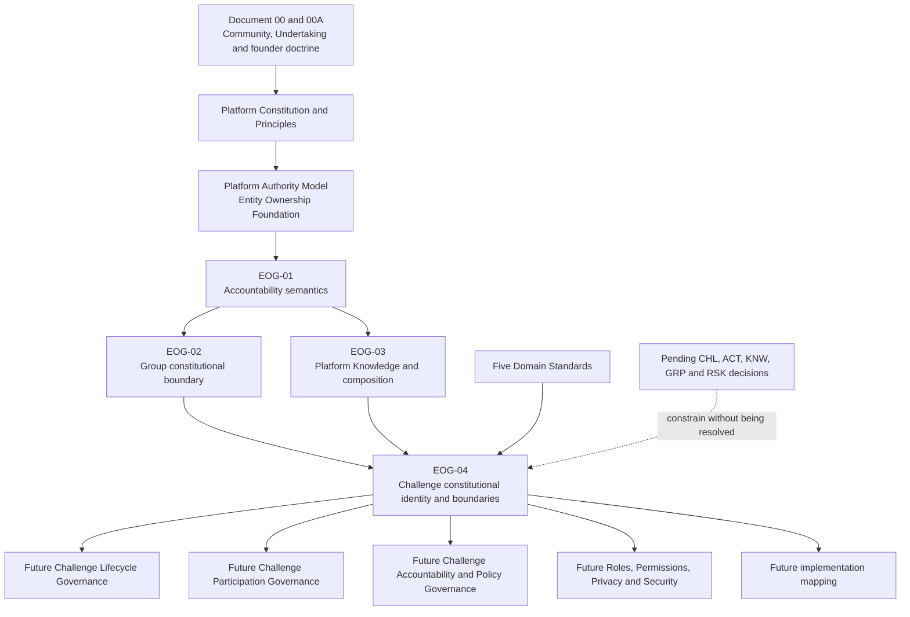

# EOG-04 Phase 0 — Constitutional Readiness Review

**Programme:** EOG-04 — Constitutional Governance of Challenges

**Review type:** Constitutional readiness analysis and drafting plan

**Status:** Phase 0 complete; no EOG-04 constitutional text drafted

**Review date:** 2026-07-20

## 1. EOG-04 Constitutional Readiness Review

### 1.1 Executive summary

The approved governance corpus provides a coherent basis for constitutional Challenge governance. A Challenge is already established as Tiizi's governed, time-bounded collective Undertaking within a Group. EOG-03 now governs the Constitutional Composition from which a Group Challenge is formed. EOG-04 therefore has a distinct and necessary task: it must define the constitutional identity and boundaries of the resulting Challenge without redefining composition, allocating accountability, or deciding lifecycle behavior.

The principal unresolved matters are intentional rather than contradictory. CHL-01 through CHL-04 remain pending. They leave the Authority and actor establishing an individual Challenge's identity, purpose and Goal; Accountable Stewardship; Custody; Administration; lifecycle; amendment; participation; finalization; and exceptional behavior unapproved. Related ACT, KNW, GRP and RSK decisions also remain pending where they govern evidence, history, Knowledge lifecycle, Group relationships or calculations.

There is one material planning ambiguity: the historical Founder Accountability Decision Sequence used **EOG-03** for Challenge governance and **EOG-04** for Verification. The approved programme now uses **EOG-03** for Platform Knowledge, while this task expressly defines **EOG-04** as Challenge governance. The collision does not prevent constitutional analysis, but it must be controlled in titles, links and future approval records. This review does not resolve or renumber it.

### 1.2 Review scope and method

This review treated approved governance as binding, pending decisions as unresolved, and current implementation evidence as non-constitutional context only.

#### Higher-order constitutional sources

- [Document 00 — Constitutional Ontology and Foundational Product Concepts](../00-TIIZI-CONSTITUTIONAL-ONTOLOGY-AND-FOUNDATIONAL-PRODUCT-CONCEPTS.md)
- [Document 00A — Founder Philosophy and Design Doctrine](../00A-TIIZI-FOUNDER-PHILOSOPHY-AND-DESIGN-DOCTRINE.md)
- [Platform Constitution](../platform/01-TIIZI-PLATFORM-CONSTITUTION.md)
- [Platform Principles](../platform/02-PLATFORM-PRINCIPLES.md)
- [Entity Ownership Foundation](../platform/06-ENTITY-OWNERSHIP-FOUNDATION.md)
- [Platform Authority Model](../platform/10-PLATFORM-AUTHORITY-MODEL.md)

#### Approved EOG sources

- [EOG-01 Platform Accountability Framework](04-PLATFORM-ACCOUNTABILITY-FRAMEWORK.md)
- [EOG-01 Founder Approval Record](05-EOG-01-FOUNDER-APPROVAL-RECORD.md)
- [EOG-02 Constitutional Accountability Framework for Groups](06-EOG-02-CONSTITUTIONAL-ACCOUNTABILITY-FRAMEWORK-FOR-GROUPS.md)
- [EOG-02 Founder Approval Record](07-EOG-02-FOUNDER-APPROVAL-RECORD.md)
- [EOG-03 Approved Constitutional Governance of Platform Knowledge](14-EOG-03-CONSTITUTIONAL-GOVERNANCE-OF-PLATFORM-KNOWLEDGE-APPROVED.md)
- [EOG-03 Founder Approval Record](14-EOG-03-FOUNDER-APPROVAL-RECORD.md)

#### Domain sources

- [Profile Domain Standard](../domains/01-PROFILE-DOMAIN-STANDARD.md)
- [Group Domain Standard](../domains/02-GROUP-DOMAIN-STANDARD.md)
- [Challenge Domain Standard](../domains/03-CHALLENGE-DOMAIN-STANDARD.md)
- [Activity Event Domain Standard](../domains/04-ACTIVITY-EVENT-DOMAIN-STANDARD.md)
- [Knowledge Asset Domain Standard](../domains/05-KNOWLEDGE-ASSET-DOMAIN-STANDARD.md)

#### Decision and register sources

- [Group, Membership and Role Decisions](../../reports/platform-foundation-decisions/03-GROUP-MEMBERSHIP-AND-ROLE-DECISIONS.md)
- [Challenge Product and Lifecycle Decisions](../../reports/platform-foundation-decisions/04-CHALLENGE-LIFECYCLE-DECISIONS.md)
- [Activity, Progress and Correction Decisions](../../reports/platform-foundation-decisions/05-ACTIVITY-PROGRESS-AND-CORRECTION-DECISIONS.md)
- [Ranking, Scoring and Streak Decisions](../../reports/platform-foundation-decisions/06-RANKING-SCORING-AND-STREAK-DECISIONS.md)
- [Knowledge Catalogue and Snapshot Decisions](../../reports/platform-foundation-decisions/07-KNOWLEDGE-CATALOGUE-AND-SNAPSHOT-DECISIONS.md)
- [Consolidated Founder Decision Register](../../reports/platform-foundation-decisions/10-CONSOLIDATED-DECISION-REGISTER.md)
- [Entity Ownership Register](01-TIIZI-ENTITY-OWNERSHIP-REGISTER.md)
- [Entity Ownership Decision Gaps](01-ENTITY-OWNERSHIP-DECISION-GAPS.md)
- [Historical Founder Accountability Decision Sequence](03-FOUNDER-DECISION-SEQUENCE.md)

### 1.3 Constitutional identity

The controlling ontology defines a Challenge as:

> A Challenge is Tiizi’s governed, time-bounded collective undertaking through which members of a Group voluntarily pursue a defined objective using agreed participation rules, measurement criteria and completion conditions.

This gives the Challenge five constitutional characteristics:

1. **Governed:** it is a Governed Subject whose meaning and use remain within approved constitutional boundaries.
2. **Time-bounded:** it is distinguishable from the persistent Group without this phrase defining states, dates or transition rules.
3. **Collective:** Version 2 Challenges are Group Challenges, not individual-challenge modes.
4. **Purposeful:** each Challenge provides one declared undertaking and objective context.
5. **Evaluable:** participation relates to governed Knowledge, Policy and evidence so that Progress and outcomes can be truthful.

The Challenge Domain Standard further establishes the Challenge as a distinct Information Subject of Challenge information and as a governed context rather than an actor or Authority. EOG-03 establishes that the Challenge resulting from Constitutional Composition is constitutionally distinct from every input.

### 1.4 Distinction from adjacent concepts

| Adjacent concept | Constitutional distinction | Planning consequence for EOG-04 |
|---|---|---|
| Group | The Group is the persistent governed Community; the Challenge is a time-bounded Undertaking within that Community. | Preserve Group continuity, identity and stewardship boundaries. Do not treat the Challenge as the Group or every Member as a Participant. |
| Platform Knowledge | Platform Knowledge bears reusable Authoritative Meaning established by Knowledge Authority. The Challenge uses that meaning but is not a Knowledge Asset. | Preserve Knowledge identity, provenance and Authority; prohibit local redefinition through Challenge configuration. |
| Policy | Policy establishes approved rules within declared scope. The Challenge is the context in which applicable Policy operates, not the Policy itself. | Keep Challenge purpose, configuration and Policy distinguishable. Do not let creation, a Template or an Administrator determine Policy applicability by implication. |
| Activity Event | An Accepted Activity Event is authoritative Activity Information established by Acceptance Authority. A Challenge provides context but does not prove occurrence. | Preserve Submission Intent, acceptance, Evidence Eligibility and Derived Truth as separate facts and authorities. |
| Template | A Template is a governed composition guide, not Knowledge, Policy, a Challenge or Authority. | Template use cannot determine Challenge truth, accountability or Policy applicability. |
| Runtime representation | Runtime Projection and presentation are subordinate representations of governed source meaning. | Runtime availability, display or local copies cannot establish or redefine Challenge identity. |
| Calculation result | Progress, Completion and Ranking are Derived Truth established by Calculation Authority. | Challenge identity, target or display must never be treated as a calculated outcome. |
| Feed or Notification | These communicate or contextualise activity. They do not establish Challenge, event or result truth. | Preserve presentation as subordinate to authoritative sources. |

### 1.5 Constitutional relationships

| Related concept | Constitutional relationship to Challenge | Required boundary |
|---|---|---|
| Group | Supplies the persistent Community context within which every Version 2 Challenge exists. | Group context does not automatically establish Challenge Authority, stewardship, participation or outcomes. |
| Platform Knowledge | Supplies reusable Authoritative Meaning for approved Activities, Metrics, Units and Knowledge relationships. | Selection and use do not copy, fork or modify Platform Knowledge. |
| Applicable Policy | Supplies governed rules for permitted behavior, evidence use and calculation within declared scope. | Policy remains distinct from Knowledge, local configuration, evidence and calculation. |
| Community Context | Supplies local purpose, framing and shared meaning from the Group Experience. | Local meaning may contextualise but cannot override Platform Meaning or applicable Policy. |
| Participation | Relates a Person to a specific Challenge as a Participant under later approved governance. | Group membership does not establish Challenge participation; participation grants no general governance Authority. |
| Activity Event | Supplies authoritative Activity Information after Acceptance Authority establishes an Accepted Activity Event. | Challenge context does not accept, verify or manufacture an event. |
| Evidence Eligibility | Relates an Accepted Activity Event to a declared calculation under Policy Authority. | Eligibility is neither acceptance nor Progress and may be calculation-specific. |
| Calculation | Produces authoritative Progress, Completion, Ranking or other approved Derived Truth. | Only Calculation Authority establishes those outcomes; the Challenge does not calculate itself. |
| Runtime | Makes subordinate Knowledge representations available for declared use. | Runtime availability and projection are not Challenge identity, Policy or source Authority. |
| History | Preserves the meaning, Policy and Community context applicable to past participation. | Later change must not silently reinterpret prior participation or calculated truth. |

### 1.6 Constitutional Composition readiness

EOG-03 defines enough of Constitutional Composition for EOG-04 to proceed. It already establishes:

- the four distinct inputs: Platform Knowledge, applicable Policy, Group configuration and Community context;
- composition as neither copying, inheritance, modification nor forking;
- preservation of input identity, Authority, meaning and provenance;
- no implied Authority transfer;
- the resulting Group Challenge as constitutionally distinct from every input;
- layered Platform, Policy and Community Meaning, with Historical Meaning as their historically applicable preservation;
- Templates and Creation Mechanisms as subordinate and non-authoritative.

EOG-04 must not restate this doctrine as if newly deciding it. Its necessary additional subject is **Challenge identity after composition**. It should explain, without allocation, that the resulting Challenge:

- is one distinct Governed Subject and Information Subject;
- has an attributable identity, purpose, Group context and composition basis;
- does not become any input or inherit an input's Authority;
- remains intelligible as the same undertaking through permitted presentation or contextual changes;
- requires later governance for the Authority establishing individual Challenge identity, purpose and Goal;
- requires later lifecycle governance for creation, amendment, activation, completion, closure and historical treatment.

### 1.7 Ownership and accountability readiness

Under the Entity Ownership Foundation and EOG-01, “ownership” means Accountable Stewardship. It must not be used as shorthand for Authority, attribution, custody, administration, operation, presentation, Group context or permitted use.

The approved phrase “Groups own their governed experiences” is a **domain boundary**, not an accountability allocation. It establishes that a Challenge belongs to the governed Group Experience rather than to Platform Knowledge. EOG-03 expressly prohibits interpreting this phrase as an allocation of Authority, Accountable Stewardship, Custody, Administration, Operation or permission.

Accordingly, the current constitutional answer to “Who owns a Challenge?” is:

- the Challenge is a distinct Governed Subject within a Group Experience;
- no final Accountable Steward for the Challenge has been approved;
- Group stewardship does not automatically become Challenge stewardship;
- a creator, Group Accountable Steward, Administrator, Member, Participant, Template or Creation Mechanism does not acquire Challenge stewardship by implication;
- Challenge identity, purpose and Goal establishment remain pending CHL-01 and related founder governance;
- Custodian, Administrator, Operator and Presenter allocations remain pending their later standards.

EOG-04 may define the accountability questions and boundaries. It must not answer them by provisional allocation.

### 1.8 Platform Authority interaction

No new Platform Authority is required or constitutionally viable for EOG-04.

| Approved Platform Authority | Challenge interaction already supported | Boundary EOG-04 must preserve |
|---|---|---|
| Governance Authority | Approves constitutional boundaries, standards, amendments and governed exceptions. | Does not establish an individual Challenge's identity, purpose or Goal. |
| Identity Authority | Supplies authoritative Identity and Profile context. | Does not establish Group membership, Challenge participation, activity or outcomes. |
| Participation Authority | Establishes governed Group and Challenge participation relationships where later standards permit. | Does not automatically establish Challenge identity, lifecycle, Knowledge, Policy or Derived Truth. |
| Participant Authority | Establishes a Participant's attributable Submission Intent and permitted expression. | Ends at Submission Intent; does not establish acceptance, eligibility, verification or results. |
| Knowledge Authority | Establishes Authoritative Meaning for Activities, Metrics, Units and Knowledge relationships and governs runtime availability within the approved boundary. | Does not establish Challenge purpose, participation, evidence or outcomes. |
| Policy Authority | Establishes applicable rules and Evidence Eligibility for a declared calculation. | Does not prove activity, create Knowledge or perform calculation merely by setting rules. |
| Acceptance Authority | Evaluates Submission Intent and establishes Accepted Activity Events. | Does not establish Challenge identity, Policy, Evidence Eligibility or Derived Truth. |
| Calculation Authority | Establishes Progress, Completion, Ranking and other approved Derived Truth from eligible evidence under Policy. | Does not invent evidence, set its own eligibility, or redefine Challenge purpose or Knowledge. |
| Administrative Authority | Performs only approved, explicit, purpose-limited high-impact Challenge actions. | Does not receive unrestricted Challenge, Acceptance, Calculation, Knowledge or Policy Authority. |
| Operational Authority | Supports reliable operation and reconciliation under approved scope. | Does not establish product truth or override constitutional governance. |
| Presentation Authority | Communicates approved Challenge information and authoritative results. | Does not establish or alter Challenge identity, participation, evidence or outcomes. |

The Authority establishing an individual Challenge's identity, purpose and Goal is not approved. This is a real pending allocation, not a reason to invent a “Challenge Authority.”

### 1.9 Lifecycle boundary

#### Constitutional identity concepts appropriate for EOG-04

EOG-04 may establish only the lifecycle-adjacent principles needed to protect constitutional identity:

- a Challenge is time-bounded while the Group is persistent;
- the Challenge remains one Governed Subject through any later permitted changes;
- identity evolution and presentation change do not themselves define lifecycle states;
- material meaning that affected participation must remain attributable and historically intelligible;
- a Challenge cannot be silently replaced by a new undertaking while being presented as the same one;
- one governed lifecycle and one canonical state vocabulary will be required later.

#### Concepts reserved for Challenge Lifecycle Governance

The later Challenge Lifecycle Standard must govern, after founder decisions:

- creation, readiness, start and participation-opening effects;
- draft, active, paused, completed, expired, cancelled, archived or any other approved states;
- allowed transitions and transition Authority;
- joining, withdrawal, removal and eligibility consequences;
- target, rule, purpose and configuration amendment;
- late activity, early Completion, finalization, correction and reopening;
- closure, retention, archival and historical access;
- stewardship succession, administration and exceptional recovery;
- state-dependent visibility, notification and analytical treatment.

EOG-04 Phase 0 approves none of those states, transitions or effects.

### 1.10 Historical integrity readiness

The constitutional minimum is already sufficient to support EOG-04:

1. the Knowledge, Policy, Group configuration and Community context applicable to participation must remain distinguishable;
2. Challenge identity, purpose and material changes must remain attributable;
3. accepted Activity Information remains distinct from Evidence Eligibility and Derived Truth;
4. later changes may not silently reinterpret prior participation or outcomes;
5. presentation, local copies, Templates and Runtime Projections cannot become competing history;
6. a Historical Representation may preserve the broader constitutional composition without becoming a new Authority.

EOG-04 should carry these boundaries into Challenge identity and history. It must defer snapshot content, version identifiers, immutability mechanics, amendment process, retention, archival, correction, recalculation and reopening to KNW-02, KNW-03, CHL-03, CHL-04, ACT-03, ACT-04 and later standards.

### 1.11 Future extensibility

The Challenge model is constitutionally extensible to education, rehabilitation, nutrition, mindfulness and other future Community experiences without amendment to its foundational identity, provided each future use remains:

- a governed collective Undertaking within a Group;
- voluntary at the participation relationship;
- directed toward a defined objective;
- supported by approved domain Knowledge and applicable Policy;
- measured or truthfully evaluated through governed evidence and calculation;
- subject to the same Authority, history, privacy and presentation boundaries;
- separately approved as an active domain or capability.

Future domains may require new Knowledge Assets, Policies, evidence meanings and lifecycle standards. They do not require the Challenge to become a Knowledge Asset, individual mode, open-ended Community, or domain-specific fitness object. A future proposal for an individual, non-Group, indefinite or non-evaluable undertaking would require separate constitutional review rather than silent expansion of EOG-04.

### 1.12 Founder-decision dependency assessment

| Decision set | Status relevant to EOG-04 | Effect on Phase 0 and later drafting |
|---|---|---|
| CHL-01 | Pending | Blocks final identity-establishment Authority, Accountable Stewardship, role and administrative allocations and final Challenge taxonomy. |
| CHL-02 | Pending | Blocks lifecycle vocabulary, state meanings and transition Authority. |
| CHL-03 | Pending | Blocks amendment permissions, immutable core meaning and detailed historical treatment after participation begins. |
| CHL-04 | Pending | Blocks withdrawal, late activity, early Completion, finalization, correction and reopening effects. |
| ACT-01 and ACT-02 | Approved | Supply the canonical Activity Event and participant-versus-trusted-authority boundary. |
| ACT-03 and ACT-04 | Pending | Block correction, deletion, Verification and their downstream effects. |
| KNW-01 | Approved | Supplies the one governed Runtime Catalogue boundary. |
| KNW-02, KNW-03 and KNW-04 | Pending | Block version/snapshot mechanics, Knowledge historical lifecycle, and detailed Goal/taxonomy/runtime relationships. |
| GRP-01 through GRP-04 | Pending, with EOG-02 principles approved separately | Block final Group roles, stewardship procedures, membership lifecycle, entry/removal and access consequences. |
| RSK-01 through RSK-04 | Pending | Block ranking source, metric, comparison vocabulary, fairness, finalization, time and Streak rules. |

None of these pending decisions prevents a bounded constitutional draft. They prevent EOG-04 from allocating accountability or defining the detailed behaviors they govern.

## 2. Constitutional Dependency Analysis

### 2.1 Dependency direction

The arrows express constitutional dependency, not a runtime flow, lifecycle or Authority allocation.

### 2.2 Upstream dependencies

| Upstream governance | What EOG-04 must inherit | What EOG-04 must not reopen |
|---|---|---|
| Document 00 | Challenge as the governed product expression of a time-bounded collective Undertaking. | Ontology, Community primacy and voluntary Commitment. |
| Document 00A | Community before competition, truthful participation and technology subordinate to philosophy. | Founder doctrine or product mission. |
| Constitution and Principles | Group-first Version 2, truthful shared Progress, single sources, governed Knowledge, historical integrity, least privilege and domain neutrality. | Launch scope or individual-challenge exclusion. |
| Authority Model | Eleven Platform Authorities and their declared boundaries. | Authority types, hierarchy or delegation semantics. |
| Entity Ownership Foundation | One Accountable Steward per Governed Subject; Authority, stewardship, custody and presentation separation. | Any approved authority allocation. |
| EOG-01 | Mandatory accountability vocabulary and relationship boundaries. | Definitions or the distinction among Authority, Stewardship, Custody, Administration and Operation. |
| EOG-02 | Persistent Group context, Group existence independent of participation, one Group Accountable Steward, membership distinct from participation. | Group creation, Group stewardship principles or deferred Group governance. |
| EOG-03 | Authoritative Meaning, composition, layered meaning, Group Experience boundary, runtime and history boundaries. | Platform Knowledge, Constitutional Composition or Knowledge Authority. |
| Domain Standards | Challenge, Group, Member, Participant, Activity Event, evidence, Knowledge and presentation boundaries. | Deferred lifecycle, role, formula, correction or visibility decisions. |

### 2.3 Downstream dependencies

| Future governance | Dependency on EOG-04 | Remains independently required |
|---|---|---|
| Challenge Lifecycle Standard | Needs stable Challenge identity, historical continuity and change boundaries. | States, transitions, actors, timing and recovery. |
| Challenge Participation Standard | Needs the Challenge/Group/Member/Participant distinction. | Eligibility, joining, withdrawal, removal and history. |
| Challenge Accountability Standard or register reconciliation | Needs constitutional Challenge subject and relationship boundaries. | Authority, Accountable Steward, Custodian, Administrator and Operator allocations. |
| Challenge Policy and Amendment Standard | Needs separation of purpose, Policy, Goal, target and composition. | Policy authorship, applicability, amendment and effect. |
| Ranking, Streak and Completion Standards | Need evidence and Derived Truth boundaries. | Metrics, formulas, time, tie, fairness and finalization rules. |
| Activity Verification and Correction Standards | Need Challenge context and historical-integrity boundaries. | Verification, correction and downstream recalculation governance. |
| Roles and Permissions Standard | Needs declared Challenge accountability relationships. | Role vocabulary, permitted actions and enforcement. |
| Privacy and Security Standards | Need Challenge Information Subject, audience and authority boundaries. | Visibility detail, minimum access, controls and threat response. |
| Implementation Mapping | Needs all preceding constitutional, lifecycle and control standards. | Technical realization and legacy reconciliation. |

### 2.4 Historical identifier collision

The [Historical Founder Accountability Decision Sequence](03-FOUNDER-DECISION-SEQUENCE.md) assigned:

- EOG-03 to Challenge identity, purpose, Goal and stewardship; and
- EOG-04 to Verification Authority.

Subsequent approved governance assigned EOG-03 to Platform Knowledge, and the present founder task assigns EOG-04 to Challenges. The collision affects:

- document filenames and headings;
- cross-references to historical analysis;
- approval and decision-register traceability;
- the future identifier for Verification governance;
- searches or automation based only on short IDs.

This does not alter the substance or readiness of Challenge governance. Until a separate controlled reconciliation occurs, every new artefact should use the full title **EOG-04 — Constitutional Governance of Challenges**, cite historical records as historical, and avoid claiming that the collision has been resolved. This report makes no identifier change.

## 3. Required Constitutional Principles

The following principles are supported by approved governance and should form EOG-04's constitutional content. They are planning requirements, not newly drafted constitutional clauses.

| Principle | Required constitutional effect | Source basis | Deferral guard |
|---|---|---|---|
| Challenge as Undertaking | Preserve the Challenge as a governed, time-bounded collective Undertaking. | Document 00; Challenge Domain Standard | Do not define time rules or states. |
| Group Challenge First | Every Version 2 Challenge exists within a governed Group context; individual challenges remain excluded. | Platform Constitution; EOG-02; Challenge Domain Standard | Do not create future individual-mode requirements. |
| Distinct Governed Subject | Treat each Challenge as distinct from Group, inputs, participants, events and results. | EOG-01; EOG-03; Challenge Domain Standard | Do not allocate its Accountable Steward. |
| One Governed Purpose | Require one declared purpose that gives the undertaking coherent meaning. | Challenge Domain Standard | Do not assign who establishes or amends purpose. |
| Constitutional Composition Inherited | Apply, but do not redefine, EOG-03 composition and integrity. | EOG-03 | Do not duplicate Knowledge governance. |
| Composition Produces Distinct Identity | Recognise the resulting Challenge as distinct from Platform Knowledge, Policy, Group configuration and Community context. | EOG-03 | Do not define the creation event or its authenticating Authority. |
| No Authority Transfer | Composition, selection, configuration and context transfer no Authority by implication. | Authority Model; EOG-03 | Do not infer Authority from creator, Group or mechanism. |
| Knowledge Meaning Preserved | Challenge use cannot copy, fork, modify or locally redefine Platform Knowledge. | EOG-03 | Do not decide Knowledge lifecycle or snapshots. |
| Policy Remains Distinct | Applicable Policy constrains the Challenge without becoming Knowledge, context, evidence or calculation. | Authority Model; EOG-03; Challenge Domain Standard | Do not define policy contents or applicability procedure. |
| Community Context Is Bounded | Group configuration and Community context contribute local meaning without overriding Knowledge or Policy. | EOG-02; EOG-03 | Do not treat local context as source Authority. |
| Membership Is Not Participation | Group membership does not establish Challenge participation. | EOG-02; Challenge Domain Standard | Do not define eligibility or joining. |
| Participation Is Voluntary and Specific | Participation is a Challenge-specific governed relationship, not general Group governance. | Document 00; EOG-02 | Do not define transitions or consequences. |
| Submission Is Not Acceptance | Participant Authority ends at Submission Intent. | EOG-01; Authority Model; Activity Event Domain | Do not define submission or acceptance workflow. |
| Evidence Eligibility Is Separate | Policy Authority establishes eligibility for a declared calculation; eligibility is not acceptance or Progress. | Entity Ownership Foundation; Challenge Domain Standard | Do not define criteria. |
| Outcomes Are Derived Truth | Calculation Authority establishes Progress, Completion, Ranking and other approved Derived Truth. | Authority Model; Entity Ownership Foundation | Do not define formulas, scoring or ranking. |
| Challenge Is Not an Authority | The Challenge supplies governed context but exercises no Platform Authority. | Authority Model; Challenge Domain Standard | Do not create a Challenge Authority. |
| Accountability Relationships Stay Explicit | Authority, Accountable Stewardship, Custody, Administration, Operation and Presentation remain distinct. | EOG-01 | Do not allocate any relationship. |
| Administration Is Scoped | Administrative action remains explicit, attributable and subordinate to source Authorities. | ADM-01; Authority Model | Do not define roles or permissions. |
| Meaning Precedes Representation | Templates, runtime, history and presentation remain subordinate to governed meaning. | EOG-03 | Do not define representations technically. |
| Historical Integrity | Material Challenge meaning and changes remain attributable and historically intelligible. | Platform Principles; EOG-03; Challenge Domain Standard | Do not decide versions, snapshots, retention or reopening. |
| Presentation Is Not Truth | Displays, feeds, notifications, leaderboards and summaries do not establish underlying facts. | Authority Model; Domain Standards | Do not define interfaces or display rules. |
| Classification Does Not Change Authority | Challenge Type labels do not create new Authority, evidence or calculation models. | Challenge Domain Standard | Do not approve final taxonomy. |
| Domain-Neutral Foundation | Challenge concepts support approved domains without becoming fitness-specific. | Constitution; Platform Principles; EOG-03 | Do not activate unapproved future domains. |
| Privacy and Least Privilege | Challenge governance remains constrained by minimum necessary use and approved visibility classes. | Constitution; Authority Model | Do not define privacy or permission rules. |

## 4. Required Constitutional Boundaries

| Boundary ID | Boundary to preserve | Prohibited collapse or inference | Later governance dependency |
|---|---|---|---|
| E04-B01 | Group ≠ Challenge | A Group, its steward or its administration automatically establishes every Challenge fact. | CHL-01; future Challenge Accountability Standard |
| E04-B02 | Member ≠ Participant | Membership automatically enrols a person in every Challenge. | CHL-04; Challenge Participation Standard |
| E04-B03 | Challenge ≠ Platform Knowledge | Challenge configuration becomes local Knowledge or modifies Authoritative Meaning. | EOG-03; KNW-02–04 |
| E04-B04 | Challenge ≠ Policy | Challenge purpose, target or mechanism silently becomes applicable Policy. | Future Policy Governance |
| E04-B05 | Challenge ≠ Template | Template use creates the Challenge's authority, identity or truth. | Future Template Governance |
| E04-B06 | Challenge ≠ Creation Mechanism | A wizard or other mechanism becomes Authority or part of constitutional identity. | Future Creation Governance; implementation mapping |
| E04-B07 | Challenge ≠ Runtime Projection | Runtime availability or representation establishes Challenge meaning. | Runtime Projection Standard |
| E04-B08 | Activity ≠ Activity Event | Referencing an Activity proves its occurrence. | Activity Event Governance |
| E04-B09 | Submission Intent ≠ Accepted Activity Event | A Participant claim establishes accepted evidence. | ACT-03, ACT-04 |
| E04-B10 | Accepted Activity Event ≠ Evidence Eligibility | Acceptance automatically qualifies an event for every calculation. | Future Evidence Standard |
| E04-B11 | Evidence Eligibility ≠ Derived Truth | Eligible evidence is treated as Progress, Completion or Ranking. | Calculation standards |
| E04-B12 | Goal ≠ Target ≠ Progress ≠ Completion | Objective, reference value and results become interchangeable. | CHL-01–04; calculation standards |
| E04-B13 | Challenge identity ≠ lifecycle state | A status label or state change creates a different identity without governance. | CHL-02; Challenge Lifecycle Standard |
| E04-B14 | Constitutional history ≠ snapshot mechanism | Historical integrity is interpreted as approving version or storage design. | KNW-02, KNW-03; CHL-03 |
| E04-B15 | Group Experience boundary ≠ stewardship allocation | “Groups own their governed experiences” assigns Accountable Stewardship. | CHL-01; register reconciliation |
| E04-B16 | Origin ≠ Authority | A creator, Contributor or configurable mechanism acquires Authority by originating information. | CHL-01; EOG-01 |
| E04-B17 | Administration ≠ source truth | Administrative access establishes identity, evidence, Policy or calculation. | Roles and Permissions; ADM-01 follow-on |
| E04-B18 | Calculation ≠ presentation | A leaderboard, recap or analytical view becomes authoritative Ranking or Completion. | RSK-01–04; Presentation Standard |
| E04-B19 | Fitness/Wellness launch ≠ permanent domain boundary | Challenge constitution is coupled to exercise-only semantics. | Future Domain Governance |
| E04-B20 | Future extensibility ≠ active scope | Education, rehabilitation, nutrition or mindfulness is claimed as implemented or launch scope. | Separate future-domain approval |

## 5. Drafting Risks

| Risk ID | Risk | Type | Severity | Constitutional consequence | Mitigation in EOG-04 drafting |
|---|---|---|---|---|---|
| E04-R01 | Using the short ID EOG-04 without its full title | Traceability ambiguity | Material | Challenge records could be confused with historical Verification governance. | Use the full programme title and preserve an explicit collision note until separately reconciled. |
| E04-R02 | Restating Constitutional Composition as a new Challenge doctrine | Knowledge leakage | Material | EOG-04 could contradict or duplicate approved EOG-03. | Incorporate EOG-03 by dependency; define only Challenge identity after composition. |
| E04-R03 | Reading “Groups own their governed experiences” as stewardship | Ownership leakage | Critical | Implicitly allocates Accountable Stewardship and bypasses CHL-01. | State that it is a domain boundary and retain all EOG-01 allocations as pending. |
| E04-R04 | Treating the Challenge as an actor or Authority | Authority leakage | Critical | Creates an unapproved twelfth Authority or obscures source Authority. | Name only the eleven approved Platform Authorities and describe the Challenge as context. |
| E04-R05 | Assigning Participation Authority to establish Challenge identity by analogy | Authority leakage | Critical | Silently resolves CHL-01 and collapses existence into participation. | Keep individual Challenge identity/purpose/Goal establishment explicitly pending. |
| E04-R06 | Making Group administration or creator status a source of Challenge truth | Ownership and authority leakage | Critical | Role/title/origin becomes unrestricted Authority. | Separate Attributable Originator, Authority, Stewardship and Administration. |
| E04-R07 | Treating Challenge Policy as Knowledge or configuration | Policy leakage | Material | Local settings could redefine meaning or evidence rules. | Preserve Knowledge, Policy, Group configuration and Community context as distinct inputs. |
| E04-R08 | Treating Templates or Creation Mechanisms as Authority | Implementation leakage | Material | Product mechanics would determine Policy, identity or permission. | Reaffirm their subordinate, non-authoritative status without specifying operation. |
| E04-R09 | Introducing states while explaining time-boundedness | Lifecycle leakage | Material | CHL-02 would be resolved implicitly. | Describe time-bounded identity only; list every state and transition as deferred. |
| E04-R10 | Defining immutable fields or snapshot contents | Lifecycle and implementation leakage | Material | CHL-03, KNW-02 and KNW-03 would be pre-approved. | Require historical intelligibility without choosing a mechanism. |
| E04-R11 | Resolving withdrawal, late activity or reopening | Lifecycle leakage | Material | CHL-04 and ACT correction governance would be bypassed. | State only that prior truth cannot be silently rewritten. |
| E04-R12 | Defining scoring, ranking, Streak or Completion formulas | Calculation leakage | Critical | RSK decisions and Calculation Authority constraints would be bypassed. | Limit EOG-04 to source and authority boundaries. |
| E04-R13 | Treating current type labels as constitutional taxonomy | Implementation leakage | Material | Existing labels would become approved product types without founder decision. | Keep final Challenge taxonomy pending CHL-01. |
| E04-R14 | Conflating Member and Participant | Group leakage | Critical | Group membership would create unwanted Commitment and data consequences. | Preserve voluntary, Challenge-specific participation. |
| E04-R15 | Allowing runtime or presentation to redefine Challenge identity | Runtime and presentation leakage | Material | A local/displayed representation would become competing truth. | Apply meaning-precedes-representation and source attribution. |
| E04-R16 | Overfitting the constitution to Fitness measurements | Extensibility risk | Material | Future governed domains would require unnecessary constitutional amendment. | Define evaluability and evidence neutrally while preserving launch scope. |
| E04-R17 | Treating future domains as current capabilities | Scope leakage | Material | Governance would promise unimplemented behavior. | Require separate domain approval and Knowledge/Policy before activation. |
| E04-R18 | Using current implementation as constitutional proof | Implementation leakage | Material | Legacy behavior could override approved governance. | Use implementation only as non-authoritative evidence of future mapping needs. |

## 6. Recommended Constitutional Structure

This is a section-level drafting architecture only. It does not supply EOG-04 constitutional wording.

| Proposed section | Purpose | Required outcome | Principal dependency |
|---|---|---|---|
| 1. Purpose | State why constitutional Challenge governance is required. | Bounded mandate for Challenge identity and relationships. | Constitution; Document 00 |
| 2. Status, Scope and Non-Allocation Boundary | Define what EOG-04 includes and excludes. | No lifecycle, permissions, formulas, implementation or accountability allocation. | EOG-01; pending CHL decisions |
| 3. Constitutional Definition of a Challenge | Apply the approved Challenge definition and Undertaking ontology. | Stable, group-first, time-bounded, collective identity. | Document 00; Challenge Domain Standard |
| 4. Challenge as a Distinct Governed Subject | Establish identity after composition and Information Subject boundaries. | Distinction from Group, inputs, actors, evidence and results. | EOG-01; EOG-03 |
| 5. Group-First Constitutional Context | Define how the persistent Group contains but does not collapse into the Challenge. | Group/Challenge, Member/Participant and stewardship boundaries. | EOG-02 |
| 6. Constitutional Composition Dependency | Incorporate EOG-03 without redefining it. | Clear composition-result boundary and no Authority transfer. | EOG-03 |
| 7. Challenge Identity, Purpose and Goal Boundaries | Distinguish these concepts and identify their unresolved establishment questions. | Clear decision surface without allocation. | CHL-01; KNW-04 |
| 8. Knowledge, Policy and Community Meaning | Apply layered meaning to Challenge context. | Knowledge, Policy, configuration and Community context remain separate. | EOG-03; Authority Model |
| 9. Participation and Commitment Boundary | Define Challenge-specific voluntary participation. | Member ≠ Participant; participation ≠ administration. | EOG-02; Challenge Domain Standard |
| 10. Activity, Evidence and Derived Truth Boundary | Apply the authoritative information chain to Challenges. | Submission, acceptance, eligibility, calculation and presentation remain distinct. | Activity Event Domain; Authority Model |
| 11. Challenge Accountability Relationship Questions | Apply EOG-01 vocabulary to Authority, stewardship, custody, administration, operation and presentation. | Explicit pending allocations; no use of “owner” shorthand. | EOG-01; CHL-01 |
| 12. Platform Authority Interaction | Describe the eleven existing Authorities in Challenge context. | No new Authority and no implicit role allocation. | Authority Model |
| 13. Challenge History and Continuity | Establish historically intelligible identity and meaning. | No silent reinterpretation; mechanisms remain deferred. | EOG-03; CHL-03 |
| 14. Domain Neutrality and Future Extensibility | Test future domains against the same Challenge concept. | Extensible foundation without activating future scope. | Platform Principles; EOG-03 |
| 15. Integrity Rules and Prohibited Inferences | Consolidate hard constitutional boundaries. | Clear tests preventing authority, ownership, lifecycle and implementation leakage. | All approved sources |
| 16. Deferred Governance | Enumerate every unresolved founder decision and later standard. | No pending matter appears approved by omission. | CHL, ACT, KNW, GRP and RSK registers |
| 17. Governance Status and Decision Trace | State review status, precedence and dependencies. | Full-title identifier discipline and attributable approval path. | Decision Register; historical sequence |

### 6.1 Drafting prerequisites

Before EOG-04 constitutional drafting begins, the drafting brief should explicitly record:

1. **Identifier control:** use the full title “EOG-04 — Constitutional Governance of Challenges” and disclose the unresolved collision with the historical sequence.
2. **Non-allocation rule:** Challenge identity-establishment Authority, Accountable Stewardship, Custody, Administration and Operation remain pending.
3. **Composition inheritance:** EOG-03 Constitutional Composition is incorporated by reference and is not reopened.
4. **Lifecycle restraint:** time-boundedness and historical identity may be described, but no state, transition or effect may be approved.
5. **Decision restraint:** CHL-01 through CHL-04 and related ACT, KNW, GRP and RSK decisions remain pending unless the founder separately approves them.
6. **Terminology discipline:** use EOG-01 formal relationships and avoid “owner” except when explaining accountable stewardship or quoting a historical source.

These prerequisites require no new product decision. They are controls needed to prevent the draft from silently resolving existing pending decisions.

## 7. Readiness Verdict

### Ready with prerequisites

EOG-04 is constitutionally ready to enter a bounded drafting phase once the six drafting controls in section 6.1 are adopted as the drafting contract.

The corpus already supplies:

- a stable ontological identity for the Challenge;
- a group-first boundary;
- approved EOG-01 accountability semantics;
- approved EOG-02 Group and membership boundaries;
- approved EOG-03 Constitutional Composition, Knowledge, runtime and historical-meaning boundaries;
- a complete set of eleven Platform Authorities;
- canonical Activity Event, evidence and Derived Truth distinctions;
- explicit deferral of lifecycle, taxonomy, formula, permission and implementation decisions.

No material constitutional contradiction blocks drafting. The unresolved identity-establishment Authority, Accountable Stewardship and lifecycle questions must remain labelled as pending decision surfaces inside the eventual founder-review draft. They do not need to be guessed or resolved during drafting.

The historical identifier collision is a traceability prerequisite, not a substantive blocker. This report does not resolve it.

### Validation

| Check | Result |
|---|---|
| Approved EOG-01, EOG-02 and EOG-03 treated as fixed | Pass |
| Challenge identity distinguished from Group, Knowledge, Policy, Activity Event, Template and runtime representation | Pass |
| Constitutional Composition applied without redefinition | Pass |
| No accountability relationship allocated | Pass |
| No new Platform Authority introduced | Pass |
| Challenge lifecycle states and transitions not defined | Pass |
| No formula, ranking, scoring or Streak rule defined | Pass |
| CHL-01 through CHL-04 remain pending | Pass |
| Related ACT, KNW, GRP and RSK dependencies preserved | Pass |
| Historical identifier collision identified but not resolved | Pass |
| Implementation neutrality preserved | Pass |
| Existing governance left unamended | Pass |
| Markdown structure validation | Pass |
| Relative-link validation | Pass |
| Whitespace and `git diff --check` validation | Pass |
