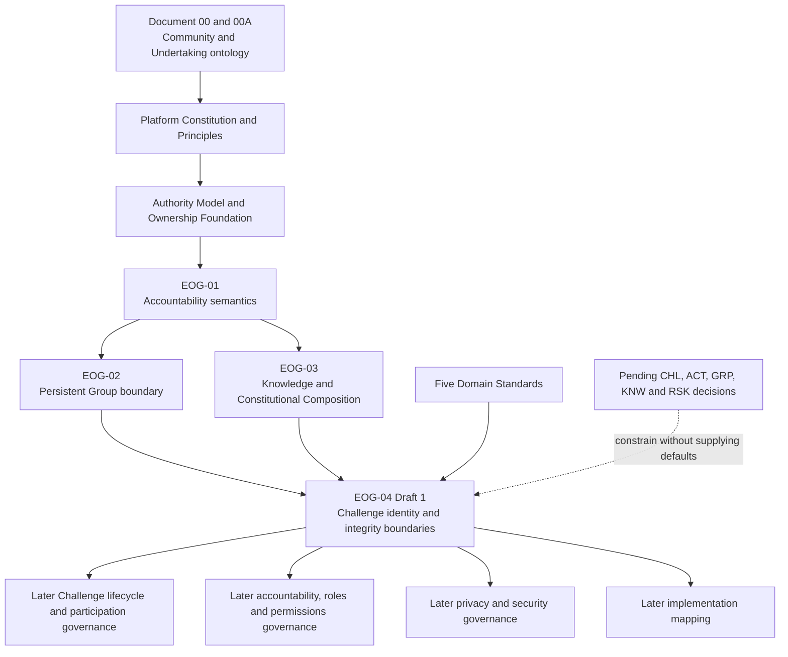

# EOG-04 Phase 1 — Constitutional Scope, Structure and Drafting Blueprint

**Programme:** EOG-04 — Constitutional Governance of Challenges

**Document type:** Drafting blueprint; not constitutional governance

**Status:** Prepared for founder review

**Date:** 2026-07-20

## Executive Summary

This blueprint converts the [EOG-04 Phase 0 Constitutional Readiness Review](15-EOG-04-PHASE-0-CONSTITUTIONAL-READINESS-REVIEW.md) into the complete drafting contract for EOG-04 — Constitutional Governance of Challenges.

The future EOG-04 document should govern the constitutional identity, relationships, integrity and continuity boundaries of a Challenge after Constitutional Composition. It must inherit composition from EOG-03 rather than redefine it. It must remain explicit that a Challenge is a Governed Subject and Information Subject, not a Group, Knowledge Asset, Policy, Activity Event, Participant, runtime representation, Derived Truth, Platform Authority or lifecycle state.

This blueprint does not draft EOG-04, allocate an accountability relationship, approve a lifecycle, or resolve any CHL, ACT, GRP, KNW or RSK decision. Its purpose is to make those omissions controlled and testable rather than implicit.

The historical identifier collision remains unresolved. Every subsequent artefact must use the full title **EOG-04 — Constitutional Governance of Challenges** and must not alter historical records that used EOG-03 for Challenge governance or EOG-04 for Verification.

## 1. EOG-04 Constitutional Scope

### 1.1 Constitutional responsibility

EOG-04 is responsible for defining what a Challenge constitutionally is after the approved EOG-03 Constitutional Composition has formed a distinct governed Group Experience.

It must answer the following constitutional questions without allocating actors or prescribing behavior:

1. What makes a Challenge one distinct Governed Subject?
2. What Challenge information concerns the Challenge as an Information Subject?
3. How does the resulting Challenge remain distinct from every composition input?
4. How does a Challenge relate to its persistent Group context without becoming the Group?
5. How do Platform Knowledge, applicable Policy, Group configuration and Community context contribute meaning without merging Authority?
6. How does a Challenge relate to participation without equating Member and Participant?
7. How does a Challenge contextualise Activity Information without accepting events or calculating outcomes?
8. What integrity rules preserve Challenge identity, meaning, provenance and historical intelligibility?
9. How do runtime representations, Historical Representations and presentations remain subordinate to Challenge truth?
10. Which approved Platform Authorities interact with Challenge information, and where does each Authority end?
11. How can the Challenge concept remain domain-neutral while Fitness and Wellness remain the approved Version 2 launch domains?
12. Which matters must remain for founder decisions and later lifecycle, accountability, control or implementation standards?

### 1.2 Included scope

| Included area | Constitutional drafting objective | Required boundary |
|---|---|---|
| Constitutional identity of a Challenge | Define the Challenge as a governed, time-bounded collective Undertaking. | Do not define creation behavior, states or transition criteria. |
| Challenge as a Governed Subject | Establish that the resulting Challenge is one distinct constitutional subject. | Do not allocate its Accountable Steward or other relationships. |
| Challenge as an Information Subject | Identify conceptually when information concerns the Challenge itself. | Do not define fields, records, storage or visibility rules. |
| Challenge constitutional relationships | Define stable relationships to Group, Knowledge, Policy, participation, activity, calculation, runtime and history. | Do not turn a relationship into ownership or Authority. |
| Identity after Constitutional Composition | Explain that the resulting Challenge is distinct from all composition inputs. | Inherit EOG-03; do not redefine composition or its inputs. |
| Challenge purpose and Goal boundaries | Distinguish identity, purpose, Goal and target conceptually. | Keep establishment Authority, authorship, amendment and formulas pending. |
| Challenge historical continuity | Preserve identity and historically applicable meaning across representations and any later permitted change. | Do not approve versions, snapshots, states, retention or amendment tests. |
| Challenge constitutional integrity | Define no-substitution, no-competing-truth and attribution requirements. | Do not prescribe enforcement or technical controls. |
| Relationship to Platform Authorities | Apply only the eleven approved Authority types to Challenge contexts. | Do not allocate the pending Authority for individual Challenge identity, purpose or Goal. |
| Relationship to Group | Preserve the persistent Community versus time-bounded Undertaking distinction. | Group context, stewardship or membership does not automatically establish Challenge governance or participation. |
| Relationship to Platform Knowledge | Preserve Authoritative Meaning and Knowledge provenance in Challenge use. | No copying, modification, inheritance, forking or local Knowledge Authority. |
| Relationship to Policy | Preserve applicable Policy as distinct rules governing declared use. | A Challenge, Template, mechanism or configuration does not establish Policy applicability by implication. |
| Relationship to Activity Event | Preserve the Challenge as context for Submission Intent and Accepted Activity Events. | A Challenge does not accept, verify, correct or manufacture Activity Information. |
| Relationship to Participation | Preserve voluntary, Challenge-specific participation. | Member does not equal Participant; participation does not grant governance Authority. |
| Relationship to Runtime | Preserve Runtime Catalogue and Runtime Projection subordination. | Runtime availability or representation does not establish Challenge identity or meaning. |
| Relationship to Historical Representation | Preserve historically applicable composition and meaning. | Historical Representation is not the Challenge, a lifecycle state or new Authority. |
| Future domain neutrality | Keep the Challenge model usable by later approved domains. | Do not activate or promise an unapproved domain or individual mode. |

### 1.3 Excluded scope

EOG-04 must not govern or approve:

- Challenge lifecycle;
- lifecycle states or state vocabulary;
- transitions, transition Authority or transition effects;
- Challenge creation workflows or creation mechanisms;
- roles, role vocabulary or role assignment;
- permissions or authorization controls;
- Accountable Stewardship allocation;
- Custody allocation or retention duties;
- Administration allocation or administrative powers;
- Operation allocation or operating procedures;
- identity, purpose, Goal or target establishment Authority where still pending;
- scoring, comparison values or scoring terminology;
- Progress, Completion or Ranking formulas;
- Ranking eligibility, fairness, tie or finalization rules;
- Streak qualification, time boundary or grace rules;
- Recognition or Reward qualification;
- Verification, correction, withdrawal, late activity or reopening behavior;
- Template lifecycle, authorship, approval or availability;
- Creation Mechanism behavior;
- historical storage, snapshot contents, versioning or retention;
- privacy classifications beyond reference to existing constitutional constraints;
- security controls or trusted-execution design;
- interfaces, APIs, schemas, storage, services or technical architecture;
- runtime design, synchronization, fallback or caching;
- implementation mapping, migration or legacy compatibility.

### 1.4 Scope decision test

A proposed Draft 1 statement is in scope only if it defines a durable Challenge concept, distinction, relationship or integrity boundary that remains true regardless of technology and does not require a pending founder decision.

A statement is out of scope if it:

- assigns an actor or accountability relationship;
- names a state or transition;
- determines an outcome, formula or threshold;
- prescribes action, timing, workflow or enforcement;
- selects a technical representation;
- makes current implementation behavior constitutional;
- converts a pending recommendation into approved governance.

### 1.5 Canonical vocabulary for drafting

The future document must reuse approved terminology and must not redefine EOG-01, EOG-02 or EOG-03 concepts.

| Term | Drafting use | Required precision |
|---|---|---|
| Challenge | The governed, time-bounded collective Undertaking within a Group. | Use the founder-approved definition; do not reduce it to a contest, task or record. |
| Undertaking | The ontological collective pursuit expressed in Tiizi by a Challenge. | Do not create a second Challenge entity or new product mode. |
| Governed Subject | The Challenge as the distinct subject requiring coherent governance. | Does not imply Authority, stewardship or personhood. |
| Information Subject | The Challenge insofar as Challenge information concerns it. | Persons remain Information Subjects of their own personal information. |
| Constitutional Composition | EOG-03 doctrine forming a distinct governed experience from four separate inputs. | Incorporate by reference; do not redefine. |
| Group Experience | The governed Community experience within which a Group Challenge exists. | Domain boundary, not an EOG-01 allocation. |
| Challenge Identity | The authoritative account by which the undertaking is distinguishable and historically intelligible as the same Challenge. | Establishment Authority and identity-change rules remain pending. |
| Challenge Purpose | The declared reason the collective Undertaking exists. | Not Policy, evidence, Goal, target or result by itself. |
| Goal | The objective toward which Challenge participation is directed. | Not automatically a Knowledge Asset, target, Progress or Completion condition. |
| Challenge Context | The bounded constitutional relationships that make Challenge participation and information intelligible. | Context does not establish source truth outside its scope. |
| Applicable Policy | Approved Policy whose declared scope governs the Challenge context. | Distinct from Knowledge, configuration, Community Meaning and calculation. |
| Community Context | Local purpose, framing and shared context contributed through the Group Experience. | Cannot override Platform Meaning or applicable Policy. |
| Participant | A Person in a governed Challenge participation relationship. | Distinct from Member and from all governance relationships. |
| Challenge Information | Information whose primary Information Subject is the Challenge. | Does not absorb Profile, Knowledge, Activity Event or Derived Information. |
| Challenge Integrity | The condition in which identity, meaning, Authority, provenance and history remain distinguishable and truthful. | Not a metric, state, score or implementation control. |
| Historical Representation | Subordinate representation preserving historically applicable meaning and composition context. | Not a versioning method, Challenge state or competing Authority. |
| Constitutional Continuity | Candidate interpretive label for preservation of one Challenge identity across non-reconstitutive, governed change. | Use only if treated as the bounded principle recommended in section 4, not as a new lifecycle doctrine. |

The words “owner” and “ownership” must not serve as formal allocation shorthand. When historical sources use them, Draft 1 must translate the issue into the exact EOG-01 relationship without changing the source's recorded wording.

## 2. Constitutional Principles

The matrices below define required drafting propositions, not final constitutional clauses.

### 2.1 Identity principles

| ID | Required principle | Constitutional purpose | Dependency | Deferred matters |
|---|---|---|---|---|
| E4-P01 | Challenge expresses the ontological Undertaking. | Anchor Challenge identity in the approved product ontology. | Document 00; Challenge Domain Standard | No new undertaking types. |
| E4-P02 | A Version 2 Challenge is a governed, time-bounded collective Undertaking within one governed Group context. | Preserve group-first scope and distinguish the persistent Community. | Platform Constitution; EOG-02 | Duration, states and individual mode remain outside scope. |
| E4-P03 | A Challenge is one distinct Governed Subject. | Prevent its identity from collapsing into its Group, creator, inputs, participants or results. | EOG-01; EOG-03 | Accountable Stewardship remains pending. |
| E4-P04 | A Challenge may be the Information Subject of Challenge information. | Separate information concerning the undertaking from information concerning Persons or adjacent subjects. | EOG-01; Data and Information Standard | Fields, visibility and retention remain pending. |
| E4-P05 | One Challenge has one coherent constitutional identity and one governed purpose. | Prevent competing Challenge meanings. | Challenge Domain Standard; Entity Ownership Foundation | Establishment and amendment Authority remain pending. |
| E4-P06 | Challenge identity is not created or changed by presentation, repetition, possession or local copying. | Preserve source truth over appearance or convenience. | Platform Principles; Authority Model | Identity-change process remains pending. |

### 2.2 Composition-dependency principles

| ID | Required principle | Constitutional purpose | Dependency | Deferred matters |
|---|---|---|---|---|
| E4-P07 | EOG-04 inherits Constitutional Composition from EOG-03. | Prevent duplicated or conflicting composition doctrine. | EOG-03 | No amendment to EOG-03. |
| E4-P08 | The resulting Challenge is constitutionally distinct from Platform Knowledge, applicable Policy, Group configuration and Community context. | Define Challenge identity after composition. | EOG-03 | Creation event and authenticating Authority remain pending. |
| E4-P09 | Composition transfers no Authority, stewardship, custody, administration or permission by implication. | Preserve EOG-01 accountability semantics. | EOG-01; EOG-03 | All Challenge allocations remain pending. |
| E4-P10 | Composition does not copy, inherit, modify or fork Platform Knowledge or Policy. | Protect source meaning and Authority. | EOG-03 | Knowledge and Policy lifecycle remain pending. |
| E4-P11 | Meaning precedes every Challenge representation. | Keep Templates, runtime, history and presentation subordinate to governed meaning. | EOG-03 | Representation design remains pending. |

### 2.3 Relationship principles

| ID | Required principle | Constitutional purpose | Dependency | Deferred matters |
|---|---|---|---|---|
| E4-P12 | Group supplies persistent Community context; Challenge remains a distinct Undertaking. | Preserve the Group–Challenge boundary. | EOG-02 | Challenge stewardship relationship remains pending. |
| E4-P13 | Platform Knowledge supplies Authoritative Meaning without becoming the Challenge. | Preserve the Knowledge–Challenge boundary. | EOG-03 | Knowledge versions and snapshots remain pending. |
| E4-P14 | Applicable Policy supplies governed rules without becoming Knowledge, context, evidence or calculation. | Preserve the Policy boundary. | Authority Model; EOG-03 | Policy authorship, applicability and lifecycle remain pending. |
| E4-P15 | Community Context supplies local purpose and framing without overriding Platform Meaning or Policy. | Preserve local meaning without local source Authority. | EOG-02; EOG-03 | Configuration Authority and amendment remain pending. |
| E4-P16 | Challenge context may relate participation and activity without establishing either by itself. | Keep context distinct from authoritative relationships and facts. | Challenge and Activity Event Domain Standards | Eligibility, acceptance and correction remain pending. |
| E4-P17 | A Template and Creation Mechanism remain subordinate guides or means, not Challenge identity or Authority. | Prevent implementation and guide leakage. | EOG-03 | Template and mechanism lifecycle remain pending. |

### 2.4 Participation principles

| ID | Required principle | Constitutional purpose | Dependency | Deferred matters |
|---|---|---|---|---|
| E4-P18 | Membership and Challenge participation are distinct governed relationships. | Prevent automatic Commitment through Group membership. | EOG-02; Challenge Domain Standard | Eligibility, joining and withdrawal remain pending. |
| E4-P19 | Challenge participation is voluntary and Challenge-specific. | Preserve voluntary Commitment and personal agency. | Document 00; Document 00A | Invitation and consent behavior remain pending. |
| E4-P20 | Participant status creates no Authority over the Challenge or other Participants. | Prevent participation from becoming governance. | EOG-01; Authority Model | Roles and permissions remain pending. |
| E4-P21 | Participant Authority ends at attributable Submission Intent. | Preserve origin-versus-acceptance truth. | ACT-02; Activity Event Domain Standard | Submission workflow and Verification remain pending. |

### 2.5 Activity and calculation principles

| ID | Required principle | Constitutional purpose | Dependency | Deferred matters |
|---|---|---|---|---|
| E4-P22 | Challenge identity, purpose, Goal and Activity references do not prove occurrence. | Separate undertaking meaning from evidence. | Activity Event Domain Standard | Acceptance criteria remain pending. |
| E4-P23 | Acceptance Authority establishes Accepted Activity Events; Policy Authority establishes Evidence Eligibility for declared calculations. | Preserve the constitutional information chain. | Authority Model; Entity Ownership Foundation | Verification and eligibility criteria remain pending. |
| E4-P24 | Calculation Authority establishes Progress, Completion, Ranking and other approved Derived Truth. | Prevent the Challenge, Participant, Group or presentation from authoring outcomes. | Authority Model; ACT-02 | Formulas, scoring, ranking and finalization remain pending. |
| E4-P25 | Accepted Activity Event, Evidence Eligibility and Derived Truth remain separate. | Prevent duplicated or premature authority. | Challenge and Activity Event Domain Standards | ACT-03, ACT-04 and RSK decisions remain pending. |
| E4-P26 | A Challenge is not Calculation Authority and does not calculate itself. | Keep Governed Subject distinct from actor and Authority. | Authority Model | Calculation execution remains implementation. |

### 2.6 Authority and accountability principles

| ID | Required principle | Constitutional purpose | Dependency | Deferred matters |
|---|---|---|---|---|
| E4-P27 | A Challenge is not a Platform Authority. | Prevent invention of a “Challenge Authority.” | Platform Authority Model | Identity-establishment Authority remains pending. |
| E4-P28 | Governance Authority approves Challenge constitutional boundaries but does not establish an individual Challenge's identity, purpose or Goal. | Preserve constitutional-versus-individual truth separation. | Authority Model; Challenge Domain Standard | Individual establishment Authority remains pending CHL-01. |
| E4-P29 | Every Platform Authority interacting with a Challenge remains within its approved purpose. | Prevent authority stacking by implication. | Authority Model | Actor and role allocations remain pending. |
| E4-P30 | Authority, Accountable Stewardship, Custody, Administration, Operation and Presentation remain separately declared. | Apply EOG-01 to the Challenge domain. | EOG-01 | All Challenge accountability allocations remain pending. |
| E4-P31 | “Groups own their governed experiences” is a domain boundary, not an accountability allocation. | Prevent ownership leakage from EOG-03 language. | EOG-03 | Challenge stewardship remains pending. |
| E4-P32 | Administrative or operational involvement does not grant source Authority or unrestricted access. | Preserve least privilege and answerability. | ADM-01; Authority Model | Roles, permissions and controls remain pending. |

### 2.7 Integrity and history principles

| ID | Required principle | Constitutional purpose | Dependency | Deferred matters |
|---|---|---|---|---|
| E4-P33 | Challenge identity, purpose, composition basis and material change remain attributable. | Preserve explanatory and historical integrity. | Platform Principles; EOG-03 | Audit structure and retention remain pending. |
| E4-P34 | Later representations or meaning changes must not silently reinterpret prior participation. | Protect truthful historical understanding. | EOG-03; Challenge Domain Standard | Snapshot, version and correction mechanics remain pending. |
| E4-P35 | Historical Representation remains subordinate to the source facts and Authorities it represents. | Prevent history from becoming a competing truth. | EOG-03 | Historical storage and access remain pending. |
| E4-P36 | Challenge identity must not be silently replaced while presented as the same undertaking. | Preserve identity continuity and prevent substitution. | Entity Ownership Foundation; Phase 0 | The test for new versus continuing Challenge remains pending. |
| E4-P37 | Challenge classification labels cannot change Authority, evidence, calculation or identity rules. | Prevent taxonomy from creating hidden governance. | Challenge Domain Standard | Final Challenge taxonomy remains pending. |

### 2.8 Presentation principles

| ID | Required principle | Constitutional purpose | Dependency | Deferred matters |
|---|---|---|---|---|
| E4-P38 | Presentation Authority may communicate but cannot establish or redefine Challenge truth. | Keep display subordinate to source Authority. | Authority Model | Interface and audience behavior remain pending. |
| E4-P39 | Feed items, Notifications, leaderboards, summaries and analytics do not establish the underlying Challenge fact. | Prevent communication or interpretation from becoming Authority. | Data and Information Standard; Domain Standards | Social, Notification and analytics governance remain pending. |
| E4-P40 | Public or shared presentation does not establish participation, evidence eligibility or unrestricted access. | Preserve visibility-versus-authority separation. | IDP-01; Authority Model | Privacy and permission rules remain pending. |

### 2.9 Extensibility principles

| ID | Required principle | Constitutional purpose | Dependency | Deferred matters |
|---|---|---|---|---|
| E4-P41 | Challenge foundations remain domain-neutral while Fitness and Wellness are the Version 2 launch domains. | Support future evolution without conceptual drift. | PLT-03; EOG-03 | No future domain is active by implication. |
| E4-P42 | A future domain must supply approved Knowledge, Policy and evidence meaning before using the Challenge model. | Preserve truthful participation in new domains. | EOG-03; Platform Principles | Domain approval and content remain future governance. |
| E4-P43 | Future extensibility does not authorize individual, non-Group or indefinite Challenge modes. | Preserve current constitutional identity and launch scope. | PLT-04; Document 00 | Any such future model requires separate constitutional review. |

## 3. Constitutional Boundaries

The following list is the definitive negative-definition set for Draft 1.

| Boundary ID | Required distinction | Why the distinction matters | Drafting prohibition |
|---|---|---|---|
| E4-B01 | Challenge ≠ Group | Community is persistent; Undertaking is time-bounded. | Do not give the Challenge Group identity, membership or stewardship by implication. |
| E4-B02 | Challenge ≠ Platform Knowledge | Knowledge supplies reusable Authoritative Meaning. | Do not treat Challenge configuration as a Knowledge Asset, modification or fork. |
| E4-B03 | Challenge ≠ Policy | Policy supplies rules within declared scope. | Do not treat purpose, Goal, target or configuration as Policy automatically. |
| E4-B04 | Challenge ≠ Activity | Activity is governed behavior meaning. | Do not treat an Activity reference as occurrence or participation. |
| E4-B05 | Challenge ≠ Activity Event | Accepted Activity Event is authoritative Activity Information. | Do not let Challenge context establish acceptance or evidence. |
| E4-B06 | Challenge ≠ Submission Intent | Submission Intent is attributable Participant expression. | Do not make Challenge content a participant claim. |
| E4-B07 | Challenge ≠ Evidence Eligibility | Policy relates an accepted event to a declared calculation. | Do not make Challenge existence or selection confer eligibility. |
| E4-B08 | Challenge ≠ Participant | Participant is a Person in a governed Challenge relationship. | Do not describe the Challenge as an actor or collapse participants into it. |
| E4-B09 | Challenge ≠ Member | Member belongs to the Group, not automatically to every Challenge. | Do not infer participation from membership. |
| E4-B10 | Challenge ≠ Template | Template is a composition guide. | Do not treat Template use, identity or defaults as Challenge truth. |
| E4-B11 | Challenge ≠ Creation Mechanism | Mechanism facilitates formation but is not a constitutional actor. | Do not make a wizard or equivalent an Authority or identity source. |
| E4-B12 | Challenge ≠ Runtime Catalogue | Runtime Catalogue governs Knowledge availability within the approved boundary. | Do not make availability establish Challenge identity or Policy. |
| E4-B13 | Challenge ≠ Runtime Projection | Projection represents a Knowledge Asset for declared runtime use. | Do not make projection identity or content the Challenge's source truth. |
| E4-B14 | Challenge ≠ Historical Representation | Historical Representation preserves applicable meaning and context. | Do not make history a live Challenge, state or independent Authority. |
| E4-B15 | Challenge ≠ Presentation | Presentation communicates source information. | Do not make labels, screens, summaries or copies authoritative. |
| E4-B16 | Challenge ≠ Derived Truth | Progress, Completion and Ranking arise from governed calculation. | Do not make Challenge identity or configuration an outcome. |
| E4-B17 | Challenge ≠ Platform Authority | Governed Subjects do not exercise Authority merely by existing. | Do not invent Challenge Authority or treat the Challenge as deciding. |
| E4-B18 | Challenge ≠ Lifecycle State | Identity and state are different constitutional concepts. | Do not define a Challenge by one state or allow a state label to create identity. |
| E4-B19 | Challenge ≠ Calculation | Calculation is the governed derivation performed through Calculation Authority. | Do not assign formulas, aggregation or ranking to the Challenge as actor. |
| E4-B20 | Challenge ≠ Notification | Notification communicates an underlying event or need for attention. | Do not let notification establish state, participation or outcome. |
| E4-B21 | Challenge ≠ Feed item | Feed content presents communication or activity context. | Do not treat Feed content as evidence or Challenge truth. |
| E4-B22 | Challenge ≠ Leaderboard | Leaderboard presents underlying Ranking. | Do not treat its order as an independent calculation Authority. |
| E4-B23 | Challenge ≠ Recognition | Recognition may acknowledge qualifying truth where later governed. | Do not make Challenge existence or completion presentation confer Recognition. |
| E4-B24 | Challenge ≠ Group Experience as a whole | Group Experience may contain context and relationships beyond one Challenge. | Do not make the Challenge absorb the Group's broader Community life. |
| E4-B25 | Challenge identity ≠ Challenge purpose | Identity distinguishes the undertaking; purpose states why it exists. | Do not assume the same Authority or amendment rule for both. |
| E4-B26 | Goal ≠ Target | Goal states an objective; target is a governed evaluation reference. | Do not make either automatically equal Progress or Completion. |
| E4-B27 | Origin ≠ Authority | A creator or Contributor may originate information without establishing authoritative truth. | Do not infer identity Authority from authorship or creation access. |
| E4-B28 | Stewardship ≠ Authority | Accountable Stewardship is answerability for coherent governance. | Do not infer truth-establishment Authority from stewardship. |
| E4-B29 | Custody ≠ Stewardship | Custody preserves assigned information for a purpose. | Do not infer accountability or Authority from possession or storage. |
| E4-B30 | Administration ≠ unrestricted control | Administration executes explicitly assigned high-impact action. | Do not let administrative title bypass Knowledge, Policy, Acceptance or Calculation Authority. |
| E4-B31 | Operation ≠ product truth | Operation supports continuity and reconciliation. | Do not let operational action establish Challenge meaning or outcomes. |
| E4-B32 | Visibility ≠ participation or Authority | Audience and access are separate constitutional concepts. | Do not infer participation, permission or truth from discoverability or display. |

## 4. Constitutional Continuity Assessment

### 4.1 Hypothesis examined

The hypothesis is:

> A Challenge remains the same constitutional undertaking despite approved presentation, runtime or contextual changes unless approved governance explicitly establishes a new Challenge.

This assessment evaluates the proposition only. It does not adopt constitutional doctrine.

### 4.2 Existing constitutional support

The proposition already exists implicitly through several approved rules:

- Document 00 distinguishes the time-bounded Challenge from the persistent Group without reducing Challenge identity to a lifecycle state.
- The Entity Ownership Foundation requires one lifecycle per entity and prohibits silent replacement of historical truth.
- The Challenge Domain Standard treats the Challenge as a distinct Governed Subject with attributable identity and prohibits presentation from redefining truth.
- EOG-03 establishes that the Challenge is constitutionally distinct from every composition input and that later changes must not silently reinterpret prior participation.
- EOG-03 makes Runtime Projection, Historical Representation and presentation subordinate to their source meaning.
- Phase 0 identifies preservation of the same undertaking through permitted presentation or contextual change as an identity concern while deferring amendment and lifecycle rules.

### 4.3 Ambiguity in the hypothesis

The phrase “contextual changes” is too broad to become a standalone doctrine without qualification. Community context and Group configuration are composition inputs. A material change to purpose, Goal, applicable Policy, measurement meaning or participation conditions may affect the undertaking's constitutional identity. The approved corpus does not yet decide which changes are:

- non-reconstitutive changes to the same Challenge;
- material amendments preserving identity;
- changes requiring a new Challenge;
- prohibited after participation begins.

Those questions depend on CHL-02, CHL-03 and later Challenge Lifecycle and Amendment Standards.

### 4.4 Options assessed

| Treatment | Benefit | Constitutional risk | Assessment |
|---|---|---|---|
| Adopt a standalone doctrine named Constitutional Continuity | Makes identity preservation highly visible. | Could create undeclared amendment and lifecycle tests, overlap historical integrity, or imply all contextual change preserves identity. | Not recommended at Phase 1. |
| Use an explicit bounded interpretive principle within Challenge Identity and History | Makes the implicit rule testable while preserving deferral of material-change tests. | Requires careful wording so it does not decide when a new Challenge is created. | Recommended for Draft 1, pending founder review. |
| Leave continuity entirely distributed | Avoids adding a label. | Readers may miss the relationship among identity, representation and historical integrity. | Constitutionally viable but less clear. |
| Reject continuity | Avoids ambiguity. | Conflicts with the existing one-entity, historical-integrity and no-silent-replacement principles. | Not viable. |

### 4.5 Recommendation

**Recommend an explicit bounded interpretive principle, not a new standalone constitutional doctrine.**

Draft 1 should place the principle within the Challenge Identity and Challenge History sections. Its architectural purpose should be limited to three propositions:

1. presentation, runtime representation and local copying do not create a new Challenge or change Challenge identity;
2. an existing Challenge may remain historically intelligible through later governed treatment without presentation silently replacing it;
3. only later approved governance may determine whether a material contextual or substantive change preserves identity or establishes a new Challenge.

The Draft must not define “material,” list identity-preserving amendments, establish a replacement test, or decide lifecycle effects. If the name “Constitutional Continuity” is retained, it should be expressly described as a Challenge-domain interpretive principle rather than a Platform Authority, lifecycle, state, status or process.

### 4.6 Founder-confirmation implication

The corpus supports drafting this bounded principle without a pre-drafting decision. Founder review should nevertheless confirm whether the named label improves constitutional clarity or whether the same content should remain under “Challenge Identity Continuity.” This confirmation can occur during Draft 1 review and does not block drafting.

## 5. Recommended Section Architecture

The recommended architecture contains eighteen sections. The order is deliberate: precedence and scope come before vocabulary; composition is inherited before the resulting Challenge identity is examined; identity and relationships precede integrity, Authority and history; deferrals close the document before status and traceability.

| # | Proposed section | Purpose | Constitutional objective | Dependencies | Expected outcome |
|---:|---|---|---|---|---|
| 1 | Purpose | State why constitutional Challenge governance is needed. | Connect Community, Undertaking, truthful participation and historically intelligible outcomes. | Document 00; Constitution | A bounded mandate, not product behavior. |
| 2 | Constitutional Basis, Precedence and Identifier Note | Name binding governance and the historical identifier collision. | Preserve EOG-01–03 and prevent trace ambiguity. | Phase 0; historical decision sequence | Full-title discipline without renumbering history. |
| 3 | Constitutional Scope and Non-Allocation Boundary | Define included, excluded and deferred areas. | Prevent accountability, lifecycle, formula and implementation leakage. | This blueprint | Auditable drafting perimeter. |
| 4 | Canonical Vocabulary | Define only Challenge-specific terms needed for precision. | Reuse EOG-01–03 and domain terminology without parallel meanings. | Platform glossary; section 1.5 | Stable vocabulary and negative definitions. |
| 5 | Challenge in the Constitutional Ontology | Relate Challenge to Community, Undertaking, Commitment, Evidence, Truth, Motivation and Growth. | Apply ontology without redefining it. | Document 00; EOG-02 | Philosophical placement of the Challenge. |
| 6 | Constitutional Composition Dependency | Incorporate EOG-03 composition as fixed upstream governance. | Establish inputs, no-transfer boundary and resulting-subject distinction without redrafting EOG-03. | EOG-03 | Clear inherited composition contract. |
| 7 | Challenge Identity | Define the resulting Challenge as a distinct Governed Subject and Information Subject. | Establish constitutional identity, purpose and Goal distinctions while leaving source Authority pending. | EOG-01; EOG-03; Challenge Domain | Stable post-composition identity boundary. |
| 8 | Challenge Context and Group Relationship | Define how the Group and Community context situate the Challenge. | Preserve Group ≠ Challenge and Member ≠ Participant. | EOG-02 | Group-first context without Group-governance leakage. |
| 9 | Knowledge, Policy and Community Meaning | Explain layered meaning in the Challenge context. | Keep Platform Meaning, Policy Meaning and Community Meaning separate. | EOG-03; Authority Model | No local redefinition or Policy collapse. |
| 10 | Challenge Participation Boundary | Define voluntary, Challenge-specific participation conceptually. | Separate membership, participation, origin and governance. | EOG-02; Challenge Domain | Participation boundary without eligibility or lifecycle. |
| 11 | Activity, Evidence and Calculation Boundary | Apply the information Authority chain to Challenge context. | Separate Submission Intent, acceptance, eligibility and Derived Truth. | Activity Event Domain; Authority Model | Challenge does not prove or calculate activity. |
| 12 | Platform Authority Interaction | Map the eleven approved Authorities to Challenge boundaries. | Prevent new Authority, role implication and source-authority drift. | Platform Authority Model | Complete interaction map with identity-establishment allocation left pending. |
| 13 | Accountability Relationship Boundary | Apply EOG-01 relationships without allocation. | Separate Authority, Stewardship, Custody, Administration, Operation and Presentation. | EOG-01; Entity Ownership Foundation | Explicit pending decision surfaces. |
| 14 | Challenge Integrity | Define identity, meaning, Policy, provenance, no-substitution and no-competing-truth invariants. | Provide constitutional tests independent of implementation. | Platform Principles; EOG-03 | Testable integrity rules without controls. |
| 15 | Challenge History and Identity Continuity | Preserve historically applicable meaning and bounded identity continuity. | Prevent silent reinterpretation while deferring lifecycle, versions and amendment tests. | EOG-03; section 4 assessment | History boundary without a new standalone doctrine. |
| 16 | Presentation, Runtime and Analytical Boundaries | Keep representations and interpretations subordinate. | Prevent runtime, Feed, Notification, leaderboard or analytics from becoming truth. | Data Standard; Domain Standards | Complete presentation boundary. |
| 17 | Domain Neutrality, Deferred Governance and Prohibited Inferences | Preserve future extensibility and enumerate pending matters. | Prevent future-scope claims and silent approval of CHL, ACT, GRP, KNW or RSK decisions. | Platform scope; decision register | Explicit downstream governance map. |
| 18 | Governance Status and Decision Traceability | State draft status, precedence, review requirements and sources. | Ensure Draft 1 cannot present itself as approved governance. | Founder approval process | Truthful status and attributable trace. |

### 5.1 Architecture dependency rules

| Rule ID | Dependency rule | Drafting consequence |
|---|---|---|
| E4-D01 | Document 00 and the Platform Constitution precede EOG-04. | Challenge identity must preserve Community-first ontology and group-first scope. |
| E4-D02 | EOG-01 precedes every Challenge accountability statement. | No local redefinition or allocation shorthand is permitted. |
| E4-D03 | EOG-02 precedes every Group–Challenge or Member–Participant statement. | Challenge drafting cannot reopen Group creation, existence, stewardship or membership governance. |
| E4-D04 | EOG-03 precedes every composition, Knowledge, Template, runtime and Historical Representation statement. | Composition must be incorporated, not replicated or refined locally. |
| E4-D05 | Platform Authority Model precedes every Authority interaction. | Only eleven approved Platform Authorities may appear. |
| E4-D06 | Domain Standards provide constitutional boundaries but do not approve their deferred matters. | Draft 1 may reuse definitions, not pending lifecycle, role or formula content. |
| E4-D07 | Pending founder decisions constrain EOG-04 but do not supply defaults. | CHL, ACT, GRP, KNW and RSK recommendations remain non-governing. |
| E4-D08 | EOG-04 precedes later Challenge lifecycle and accountability allocation work. | Draft 1 should define subjects and boundaries, not downstream rules. |
| E4-D09 | Lifecycle, privacy, permissions, security and implementation standards refine EOG-04 only after their prerequisites. | No circular dependency may make them prerequisites for basic Challenge identity. |
| E4-D10 | Historical planning records retain evidential value but not current identifier precedence. | Cite them as historical and use the full EOG-04 title. |

### 5.2 Conceptual dependency flow

The arrows express constitutional dependency, not lifecycle, workflow, technical flow or Authority transfer.

## 6. Drafting Risks

### 6.1 Risk and control register

| Risk ID | Leakage type | Risk | Severity | Drafting control | Gate |
|---|---|---|---|---|---|
| E4-R01 | Identifier leakage | Short-form EOG-04 is confused with historical Verification governance. | High | Use the full title and include a non-resolving identifier note. | DG-02 |
| E4-R02 | Ownership leakage | “Groups own their governed experiences” is read as Challenge Accountable Stewardship. | Critical | State it only as an EOG-03 domain boundary and list allocations as pending. | DG-11, DG-18 |
| E4-R03 | Ownership leakage | Creator, Group steward or Administrator is treated as Challenge steward by analogy. | Critical | Apply EOG-01 relationships separately; make no provisional allocation. | DG-11 |
| E4-R04 | Authority leakage | A Challenge, Template, mechanism or runtime function is described as an Authority. | Critical | Use only approved Authorities and grammatical subjects that can exercise them. | DG-10 |
| E4-R05 | Authority leakage | Participation Authority is assigned individual Challenge identity or purpose because participation occurs later. | Critical | Keep the establishment Authority explicitly pending CHL-01. | DG-10, DG-12 |
| E4-R06 | Authority leakage | Governance Authority is said to establish an individual Challenge. | Critical | Limit it to constitutional boundaries, standards and exceptions. | DG-10 |
| E4-R07 | Lifecycle leakage | Time-boundedness produces implicit draft, active, paused or completed states. | High | Define the identity distinction only; prohibit state vocabulary. | DG-13 |
| E4-R08 | Lifecycle leakage | Continuity language decides which amendments create a new Challenge. | High | Use the bounded interpretive principle and defer every material-change test. | DG-14 |
| E4-R09 | Implementation leakage | Challenge formation becomes a workflow, schema, API or wizard description. | High | Refer only to EOG-03 composition and subordinate Creation Mechanism. | DG-15 |
| E4-R10 | Participation leakage | Member is treated as Participant or participation as automatic. | Critical | Repeat voluntary, Challenge-specific relationship boundaries. | DG-07 |
| E4-R11 | Participation leakage | Participant status implies administration, stewardship or Authority. | Critical | Apply EOG-01 stacking rule; require each relationship to be separately declared. | DG-07, DG-11 |
| E4-R12 | Presentation leakage | Feed, Notification, leaderboard or recap is treated as Challenge truth. | High | Trace presentation to source truth and prohibit independent Authority. | DG-09 |
| E4-R13 | History leakage | Historical integrity is translated into snapshots, versions, immutable fields or retention. | High | Define intelligibility and attribution only; name KNW-02/03 and CHL-03 as pending. | DG-14, DG-16 |
| E4-R14 | History leakage | Later meaning silently rewrites prior participation or results. | Critical | Include explicit no-silent-reinterpretation and source-attribution principles. | DG-14 |
| E4-R15 | Calculation leakage | Goal, target or accepted event is treated as Progress or Completion. | Critical | Preserve the full evidence and calculation chain. | DG-08 |
| E4-R16 | Calculation leakage | Challenge or Administrator is described as calculating outcomes. | Critical | Name Calculation Authority and prohibit actor substitution. | DG-08, DG-10 |
| E4-R17 | Knowledge leakage | Configuration or Community context redefines Platform Knowledge. | Critical | Incorporate EOG-03 meaning and no-fork rules. | DG-05 |
| E4-R18 | Policy leakage | Template defaults, mechanism choices or local settings establish Policy applicability. | High | Separate Applicable Policy and preserve Policy Authority. | DG-06 |
| E4-R19 | Scope leakage | Current collective, competitive or Streak labels become approved Challenge types. | High | Keep final taxonomy pending CHL-01. | DG-16 |
| E4-R20 | Extensibility leakage | Future domains become active product capabilities. | Medium | State domain neutrality and require separate approval. | DG-17 |
| E4-R21 | Extensibility leakage | Fitness-specific metric assumptions become constitutional requirements. | High | Use domain-neutral Goal, evidence and evaluability language. | DG-17 |
| E4-R22 | Status leakage | Draft 1 is described as approved or canonical before founder approval. | High | Require “Founder Review Draft 1” status and separate approval record. | DG-20 |

### 6.2 Drafting escalation rule

Drafting must pause rather than choose a default if a sentence requires:

- an actor to establish Challenge identity, purpose or Goal;
- an Accountable Steward, Custodian, Administrator or Operator;
- a lifecycle state, transition or effect;
- a definition of material amendment or new-Challenge threshold;
- a formula, ranking method, Streak rule or Recognition qualification;
- a Verification, correction, late-entry or reopening rule;
- a snapshot, version, retention or technical representation;
- a role, permission, privacy or security rule.

The unresolved point should become a Drafting Note linked to the blocking decision or later standard. It must not become provisional constitutional language.

## 7. Drafting Gates

Draft 1 may begin only after gates DG-01 through DG-09 are accepted as the drafting contract. Draft 1 may be considered complete for founder review only when all gates pass.

| Gate | Objective completion criterion |
|---|---|
| DG-01 — Phase 0 contract | All six Phase 0 prerequisites are incorporated into the drafting brief. |
| DG-02 — Identifier control | The full title “EOG-04 — Constitutional Governance of Challenges” is used; the collision is disclosed and not resolved or propagated into a new conflict. |
| DG-03 — EOG-01 preservation | Every accountability term retains EOG-01 meaning; no allocation is made. |
| DG-04 — EOG-02 preservation | Group persistence, Group existence, membership and stewardship boundaries remain unchanged. |
| DG-05 — Composition inheritance | Constitutional Composition is inherited from EOG-03 without redefinition, duplication or amendment. |
| DG-06 — Knowledge and Policy separation | Platform Knowledge, applicable Policy, Group configuration and Community context remain distinct. |
| DG-07 — Participation boundary | Member and Participant remain distinct; participation is voluntary and creates no governance Authority. |
| DG-08 — Activity and calculation chain | Submission Intent, Acceptance Decision, Accepted Activity Event, Evidence Eligibility and Derived Truth remain distinct. |
| DG-09 — Presentation boundary | Runtime, Historical Representation, Presentation, Feed, Notification, leaderboard and analytics establish no independent Challenge truth. |
| DG-10 — No new Authority | Only the eleven approved Platform Authorities appear; the Challenge and subordinate mechanisms are not Authorities. |
| DG-11 — No accountability allocation | No Accountable Steward, Custodian, Administrator, Operator, Delegate or other relationship is assigned. |
| DG-12 — Pending establishment Authority | The Authority and actor establishing individual Challenge identity, purpose and Goal remain explicitly pending. |
| DG-13 — No lifecycle approval | No state, transition, timing rule, amendment effect, finalization or reopening behavior is approved. |
| DG-14 — Continuity restraint | Identity continuity and historical integrity are expressed without deciding material-change, replacement, versioning or lifecycle tests. |
| DG-15 — Implementation neutrality | No workflow, interface, API, schema, storage, runtime design, algorithm, migration or technical control is specified. |
| DG-16 — Pending-decision restraint | CHL-01–04 and related ACT, GRP, KNW and RSK decisions remain pending and are named where relevant. |
| DG-17 — Extensibility discipline | Domain neutrality is preserved without activating a future domain or individual Challenge mode. |
| DG-18 — Ownership precision | “Owner” and “ownership” are not used as unqualified formal relationship terms. |
| DG-19 — Historical artefact preservation | No prior governance or historical planning artefact is modified to resolve current drafting ambiguity. |
| DG-20 — Status truthfulness | The future document states “Founder Review Draft 1” until separately approved. |
| DG-21 — Traceability | Every constitutional proposition traces to an approved source or is labelled as a Drafting Note requiring founder review. |
| DG-22 — Structural completeness | All eighteen architecture sections are present or any adjustment is explained without changing scope. |
| DG-23 — Cross-domain consistency | Challenge, Group, Activity Event, Knowledge Asset and relevant Profile boundaries remain reciprocal and non-contradictory. |
| DG-24 — Validation | Markdown, relative links, whitespace and `git diff --check` pass. |

### 7.1 Pre-Draft 1 gate result

| Required pre-drafting confirmation | Result in this blueprint |
|---|---|
| Composition is inherited from EOG-03 | Satisfied |
| No accountability allocation | Satisfied |
| No new Platform Authority | Satisfied |
| No lifecycle approval | Satisfied |
| No implementation | Satisfied |
| No pending decision silently resolved | Satisfied |
| No identifier collision introduced | Satisfied; existing collision documented only |
| No historical artefact altered | Satisfied |

## 8. Founder Questions

### 8.1 Questions required before Draft 1

**None.**

The approved corpus and Phase 0 prerequisites are sufficient to prepare Draft 1 without a new founder decision, provided Draft 1 follows the gates above and leaves pending allocations and lifecycle matters unresolved.

### 8.2 Philosophical confirmations for Founder Review Draft 1

The following are not pre-drafting blockers. They are the only philosophical confirmations that should be presented during founder review because their treatment affects constitutional clarity rather than implementation or product behavior.

| Question ID | Founder confirmation | Why confirmation is useful | Blueprint recommendation |
|---|---|---|---|
| E4-FQ01 | Should identity continuity be named explicitly as a bounded Challenge-domain interpretive principle, or remain distributed across Challenge Identity and History? | A named principle improves clarity but could be mistaken for lifecycle governance. | Use “Challenge Identity Continuity” or a carefully bounded “Constitutional Continuity” subsection; do not make it a standalone cross-platform doctrine. |
| E4-FQ02 | Should EOG-04 state expressly that a Challenge is the constitutional product expression of an Undertaking after composition, while composition remains an upstream doctrine rather than part of Challenge identity? | This confirms the conceptual handoff from EOG-03 without reopening composition. | State the relationship expressly and preserve the no-redefinition rule. |
| E4-FQ03 | Should one governed purpose remain a defining constitutional characteristic of every Challenge across future domains? | The principle is present in the Challenge Domain Standard and affects long-term conceptual coherence. | Preserve one governed purpose while leaving multiple Goals or Activities to later Policy. |

These questions must not be expanded into creation, amendment, state, permission, formula or implementation decisions during EOG-04 review.

## 9. Readiness Verdict

### Ready for Draft 1

EOG-04 is ready to enter constitutional drafting using this blueprint.

The Phase 0 “Ready with prerequisites” conditions have been converted into explicit scope rules, forty-three drafting principles, thirty-two constitutional boundaries, eighteen ordered sections, ten dependency rules, twenty-two drafting risks and twenty-four objective gates.

The Constitutional Continuity hypothesis is supported only as a bounded Challenge identity and history principle. It is not adopted here and is not recommended as a standalone doctrine. No founder decision is required before Draft 1 because the draft can preserve the supported proposition while leaving its label and all material-change tests for founder review and later governance.

The future Draft 1 must:

- define Challenge identity after composition;
- preserve the Group, Knowledge, Policy, participation, activity, calculation, runtime and history boundaries;
- apply only approved Authorities and EOG-01 relationships;
- identify unresolved constitutional observations through Drafting Notes;
- remain a founder-review draft until explicit approval.

This blueprint creates no constitutional governance, makes no allocation, resolves no pending decision and modifies no approved source.

## Validation

| Check | Result |
|---|---|
| All nine required outputs present | Pass |
| Phase 0 prerequisites converted into drafting gates | Pass |
| Constitutional Continuity evaluated as a hypothesis | Pass |
| EOG-01, EOG-02 and EOG-03 preserved | Pass |
| No Authority or accountability relationship allocated | Pass |
| No lifecycle, role, permission, formula or implementation introduced | Pass |
| Pending CHL, ACT, GRP, KNW and RSK decisions remain pending | Pass |
| Historical identifier collision documented but not resolved | Pass |
| Relative links resolve | Pass |
| Markdown and whitespace validation | Pass |
| `git diff --check` | Pass |
