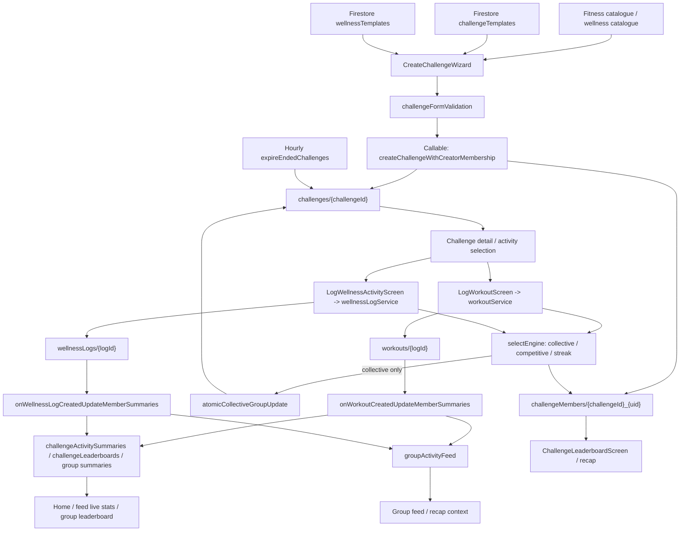
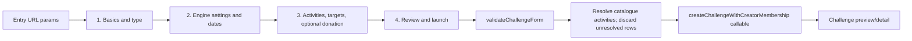

# Tiizi Challenge Creation and Runtime Engine Audit

**Audit date:** 2026-07-18

**Scope:** Current repository working tree; read-only source inspection.

**Runtime-data limitation:** No live Firestore reads were performed. Deployed code, rules, indexes, and production document populations were not assumed to equal this working tree.

# 1. Executive Summary

Tiizi has three current challenge types: `collective`, `competitive`, and `streak`. All three are first-class in the member creation wizard, fitness and wellness template flows, v2 runtime engines, logging screens, and member leaderboards. `individual` is not a stored challenge type: the current product is group-scoped, and “individual” appears only as explanatory language for each member's competitive target. Missing, `v1`, and unknown engine versions are treated as unsupported in user-facing v2 paths, although several services still default a missing `challengeType` to `collective`.

The active creation path is the four-step `CreateChallengeWizard` -> callable `createChallengeWithCreatorMembership` -> Firestore `challenges` and `challengeMembers`. Activities and template content are copied into a challenge snapshot. Launched challenges do not retain a template ID, template version, activity version, or inheritance link. Fitness templates come from `challengeTemplates`; wellness templates come from `wellnessTemplates`. The admin “Create Challenge” screen creates templates, not live challenges.

Progress has multiple stores and meanings. Client logging updates `challengeMembers`; collective logging additionally transactionally updates `challenges.groupCurrentTotal`; Cloud Functions asynchronously maintain `challengeActivitySummaries`, `challengeLeaderboards`, group score summaries, and `groupActivityFeed`. Competitive and streak completion is member-level; the challenge document stays active until the scheduled expiry job. Collective auto-completion can complete the challenge and cascade active members immediately.

The highest-risk findings are:

- **P0:** Firestore rules do not enforce the challenge schema or engine invariants. A signed-in group member can create logs without binding the activity, unit, target, date window, or challenge membership; a member can update their own `challengeMembers` aggregate fields. This permits forged progress, completion, streak, and point-like score values outside normal UI services.
- **P1:** The completion-causing log can be skipped by the asynchronous feed/summary trigger because client logging marks the member completed, or the collective transaction marks the challenge completed, before `canSummarizeActivity` checks for active state.
- **P1:** Current client code reads `challengeActivitySummaries`, `challengeLeaderboards`, `groupLeaderboards`, and `groupMemberStats`, but the inspected `firestore.rules` has no matching read grants for those collections.
- **P1/P2:** Competitive ranking is not authoritative in one place: the full leaderboard uses completion percentage with stored points as a tiebreaker, Home uses raw cumulative value, and feed live stats order by Cloud Function score.
- **P2:** Streak UI can present an all-activities daily checklist, but the engine advances the streak after any one log and does not require the configured target value to be met.
- **P2:** Log updates/deletes and duplicate submissions have no aggregate correction or idempotency mechanism.

The founder's statement that Tiizi does not currently use a points system is consistent with the absence of a user reward balance, XP wallet, redemption flow, or coherent points product. However, point-like scoring is **not dead metadata**: every normal fitness/wellness log calculates and writes `points`; member and Cloud Function aggregates consume it; competitive and streak tie-breaks use it; and a few completion/review screens expose “pts” copy. The correct classification is **active hidden normalized scoring and legacy UI residue, not an active rewards/points system**.

# 2. Scope and Method

The audit searched application source, types, hooks, services, engines, callable and scheduled Cloud Functions, Firestore rules/indexes, admin screens, seed/backfill/audit/test scripts, HTML prototypes, and prior architecture reports. Searches covered all terms requested in the task, plus Firestore collection names and runtime imports.

Evidence priority was:

1. Runtime entry point and import/call chain.
2. Current service/engine/Cloud Function implementation.
3. Current Firestore rules and index configuration.
4. Static guards and tests.
5. Seeds, prototypes, and documentation only as evidence of legacy or intended behavior.

No source, rule, configuration, seed, test, or Firestore data was changed. No seed, migration, backfill, deployment, emulator write, or production diagnostic was run. Fields absent from code are shown as `—`; unresolved production state is identified rather than inferred.

# 3. Challenge Architecture

## Active runtime flow

## Layer map

| Layer | Active entry or store | Responsibility | Evidence |
|---|---|---|---|
| Catalogue | Fitness catalogue services; `wellnessActivityService`/catalogue | Picker choices and default metadata | `ChallengeActivitySection.tsx`, catalogue audit reports |
| Template source | `challengeTemplates`, `wellnessTemplates` | Published suggestions and admin-managed presets | `challengeTemplateService.ts`, `wellnessTemplateService.ts` |
| Wizard | `CreateChallengeWizard` | Four-step member creation and template prefill | `src/features/Challenges/CreateChallengeWizard.tsx` |
| Validation | `validateChallengeForm`; callable validation | Client UX validation plus backend bounds/authorization | `challengeFormValidation.ts`, `functions/src/challengeCreationBackend.ts` |
| Challenge writes | callable `createChallengeWithCreatorMembership` | Creates challenge and, normally, creator membership transactionally | `functions/src/challengeCreationBackend.ts` |
| Member CRUD | `challengeService` | Join, leave, lists, reads | `src/services/challengeService.ts` |
| Fitness logging | `workoutService.createWorkout` | Engine update, log write, collective transaction | `src/services/workoutService.ts` |
| Wellness logging | `wellnessLogService.writeLog` | Engine update, log write, collective transaction | `src/services/wellnessLogService.ts` |
| Engines | `selectEngine` | Per-member collective/competitive/streak transitions | `src/services/challengeEngine/*` |
| Collective authority | `atomicCollectiveGroupUpdate` | Transactional capped team total and optional cascade completion | `src/services/challengeCompletion.ts` |
| Async aggregates/feed | `summarizeWorkoutCreated`, `summarizeWellnessLogCreated` | Scores, summary docs, feed items and milestones | `functions/src/memberActivitySummaries.ts`, `functions/src/index.ts` |
| Expiry | `expireEndedChallenges` | Hourly active -> completed status update | `functions/src/challengeLifecycleJobs.ts` |
| Rules | `firestore.rules` | Direct-client access authorization | `firestore.rules` |
| UI progress | `resolveChallengeProgress` | Best-known display state across asynchronous sources | `challengeProgressResolver.ts` |
| Tests/guards | `scripts/test*Challenge*`, `testGroupFeed*`, audits | Mostly static source and pure-function guards | `scripts/` |

**Runtime source of truth:** There is no single document for every concern. `challengeMembers` is authoritative for personal competitive/streak state; `challenges.groupCurrentTotal` and its transaction are authoritative for collective completion; `challengeActivitySummaries.totalValue` is the preferred asynchronous collective display total; raw logs are immutable-event inputs in the intended path but are mutable/deletable under rules; leaderboard/feed aggregates are Cloud Function projections. `resolveChallengeProgress` does not read `challenge.groupCurrentTotal` directly: callers must pass it as `priorTeamTotal`, after which the resolver takes the maximum of that explicit floor, the summary, member/log floors, and the current member contribution. This split must be preserved or deliberately consolidated in the future engine.

# 4. Challenge Type Matrix

| Challenge type | User label | Wizard | Template | Activity count | Fitness / wellness | Metric and target | Contribution | Completion | Streak | Ranking / leaderboard | Verification | Feed / recap | Runtime engine | Legacy/contradictions |
|---|---|---:|---:|---|---|---|---|---|---|---|---|---|---|---|
| `collective` | Collective | Yes | Yes | UI: exactly 1; backend: up to 30 if units match | Both | One cumulative group target; wizard uses activity target as `groupCumulativeTarget`; same-unit validator | Every accepted log value adds to personal and group totals | Auto-complete optional; transaction caps stored group total and can complete challenge plus active members | — | Members ranked by personal contribution in full leaderboard; no winner persisted | Ignored | Activity logs; first-log and 25/50/75/100 collective milestones; computed recap | `CollectiveEngine` + `atomicCollectiveGroupUpdate` | Async summary total is uncapped; backend permits multi-activity although UI does not |
| `competitive` | Competitive | Yes | Yes | UI: exactly 1; backend: up to 30 | Both | Per-member cumulative activity targets; completion rate averages per-activity capped percentages | Per-user only | Member completes when all configured activity rates reach 100%; challenge expires later | — | Full screen: completion rate, then `totalPoints`; Home: raw cumulative value; feed: score projection | Ignored | Log items; no competitive milestone/winner record; computed recap | `CompetitiveEngine` | Three ranking definitions; no direction/unit verification; copy says highest completion wins |
| `streak` | Streak | Yes | Yes | UI/backend: 1..30 | Both | Required consecutive days plus activity targets shown; any log advances engine regardless target | Per-user daily date state | Member completes at required streak; challenge expires later | Current/longest; same day no advance; next day increments; gap resets or “pauses” based on flag | Current streak, longest streak, then `totalPoints` on full screen | Ignored | Log items; no streak milestone generator found; computed recap | `StreakEngine` | UI can require all activities/day, engine accepts any one; “pause” counts nonconsecutive logged days |
| `individual` | — | No | No | — | — | — | — | — | — | — | — | — | — | Not a type. “Individual cumulative targets” is competitive explanatory copy only |
| missing / `v1` / unknown | Unsupported/legacy | No current wizard | Seed/admin service can produce missing version | Legacy-dependent | Legacy data may contain either | — | — | — | — | — | — | Unsupported screens | Rejected by `selectEngine` | Lists filter to `v2`; some helpers default missing `challengeType` to collective |

# 5. Creation Wizard Flow

## Entry points

The route is `/app/create-challenge` in `src/App.tsx`, guarded by onboarding and group-route guards. It is linked from Home/quick actions, group detail/shared header, fitness exercise detail (`exerciseId`), wellness activity detail (`wellnessActivityId`), fitness suggestions (`templateId`), and wellness template detail (`wellnessTemplateId`).

| Step | Component/file | Displayed/state | Conditional/default/validation behavior |
|---|---|---|---|
| 1 | `CreateChallengeWizard.tsx`; `ChallengeBasicInfoSection` | Cover, group, name, description, fitness/wellness mode, type | Defaults use form-default helpers. URL params prefill catalogue/template content. Type change from streak truncates activities to the first row. |
| 2 | `ChallengeEngineSettingsSection`; `ChallengeTimelineSection` | Collective auto-complete; streak required days/reset setting; competitive explanation; start/end | Duration derived from dates. Required streak days must be positive and no longer than duration. |
| 3 | `ChallengeActivitySection`; `ChallengeDonationSection` | Activity picker, target, unit; donation cause/contact fields | Only streak exposes add-activity. Fitness unit selector offers Reps/Seconds/Minutes/Km/Kg regardless catalogue. Wellness unit is editable free text. Catalogue defaults can be overwritten. |
| 4 | Wizard review | Snapshot summary/readiness; launch | Review includes point-related explanatory residue. `validateChallengeForm` runs, catalogue IDs are resolved, collective/competitive payload is sliced to one activity, then callable executes. |

State is component-local `useState`; there is no draft persistence. “Hydration” is URL/catalogue/template prefill, not stored wizard state. Back decrements a step; back from the first step navigates away. Submission errors are surfaced as wizard error state and formatted callable errors. Usage-count increments for templates are fire-and-forget.

Client validation checks name/description length, dates, positive targets for named rows, same units for collective rows, streak-day bounds, and donation fields. It does **not** enforce catalogue-compatible units/metrics, target bounds per activity, challenge status, engine version, or the final resolved activity ID. The backend adds authorization, broad numeric/string bounds, duplicate activity-ID checks, and type/category validation. The backend does not restrict collective/competitive to one activity and accepts omitted `engineVersion`; direct Firestore writes can bypass both validators under the current rules.

Fitness and wellness use the same wizard and engine controls. Their picker and snapshot richness differ: wellness carries description, content, warnings and frequency-like metadata; fitness launch rows primarily carry ID/name/target/unit. Challenge-level category becomes `wellness` for non-fitness rather than the activity's more specific wellness category.

# 6. Template System

| Source | Model and path | Runtime reads/writes | Launch behavior | Status |
|---|---|---|---|---|
| Fitness templates | `challengeTemplates/{id}`; `ChallengeTemplate` | Read by `challengeTemplateService`; admin CRUD/feature/publish/archive/soft-delete | Prefills wizard; user can edit; launched challenge has no reference/version | Active |
| Wellness templates | `wellnessTemplates/{id}`; `WellnessTemplate` | `wellnessTemplateService` reads only `templateSource == 'admin'`; admin CRUD | Same snapshot/prefill behavior | Active |
| Fitness seed templates | Fixed IDs in `scripts/seedAppData.ts` | Writes only with `--apply`; deletes/replaces seed-tagged/fixed records | Can appear through normal fitness template read if published | Seed-only; potentially destructive |
| Wellness sample seed | `scripts/wellness-templates-sample.json` via `seedWellnessTemplates.ts` | Dry-run default; `--apply` merge-writes fixed docs | Becomes admin/published runtime template | Seed-only; can overwrite fields |
| Suggested templates | Suggested screens backed by the two services | Read and route to wizard URL params | Prefill only | Active UI |
| HTML/UI references | `public/screen-layouts/**`, `docs/ui-reference/**` | No runtime imports | None | Prototype-only |

Template fields include identity/name/description/category/type, activity snapshots, duration, difficulty, image/icon/theme, publication/lifecycle, usage and admin metadata, and engine-specific settings. Some models retain `pointsPerCompletion`/default-point fields. Templates do not store active challenge `engineVersion`, activity version, safety acknowledgement state, or a versioned compatibility contract.

When launched, the wizard copies selected/evaluated values into `challenges.activities`; it does not store `templateId`, template version, or activity version. Future template/catalogue edits do not flow into the challenge. The challenge can diverge before launch. Usage-count increments perform read-then-absolute-update rather than atomic increment, so concurrent launches can lose increments.

The seeded collective “Squat Squad 100” contains mixed `reps` and `seconds`. The client collective validator rejects this as-is; the UI's later one-activity slice does not make the original prefilled form valid. Seeded demo challenges created by `buildChallenges` omit `engineVersion` and v2 fields, so current lists/engines treat them as legacy/unsupported.

# 7. Active Data Models

## Challenge and activity snapshot

| Field(s) | Type / requirement | Writer | Reader/purpose | Validation/status |
|---|---|---|---|---|
| `id` | document ID | Firestore/callable | All paths | Active |
| `name`, `description`, `coverImageUrl` | strings | Wizard/callable | Cards/detail/feed | Client/backend length validation for first two |
| `groupId`, `createdBy` | strings, active path required | Callable | Authorization, lists, feed | Callable verifies group/member/owner; rules are weaker |
| `challengeType` | `collective \| competitive \| streak`, optional in TS | Wizard/callable | Engine/UI branching | Callable validates if supplied; rules do not; many readers default missing to collective |
| `engineVersion` | intended `v2` | Wizard/callable | Lists, `selectEngine`, unsupported gates | Callable accepts omission; rules do not validate |
| `category` | broad enum | Wizard | Fitness/wellness display | Callable allowlist differs from broader catalogue categories |
| `activities[]` | snapshot objects | Wizard/callable | Selection, targets, engine config, detail | Backend requires 1..30 and unique IDs; rich optional metadata |
| Activity ID/type | `exerciseId` or `activityId`, `activityType` | Wizard | Logging route and catalogue lookup | Backend requires an ID, not catalogue existence |
| Activity content | name/description/category/difficulty/icon/instructions/protocol/benefits/guidelines/warnings | Mostly wellness snapshot/templates | Detail/content | Optional; no version/provenance |
| Target fields | `targetValue`, `unit`, `targetType`, daily/frequency metadata | Wizard/template | Engine and UI | Positive broad bound and unit length; no catalogue compatibility |
| Dates | `startDate`, `endDate`, `durationDays` | Wizard/callable | UI, logging, expiry | Backend 1..366; different date parsers elsewhere |
| Collective | `groupCumulativeTarget`, `groupCurrentTotal`, `autoComplete` | Callable/runtime transaction | Team progress/completion | Active; summary projection can exceed capped stored total |
| Streak | `requiredConsecutiveDays`, `streakResetOnMiss` | Wizard/callable | Streak engine/copy | Active |
| Status | draft/active/completed/expired in types/paths | Callable/admin/job/collective transaction | Lists and logging gates | Services do not consistently enforce; scheduled job uses completed |
| Visibility/moderation | visibility/group visibility/moderation status | Callable/admin | Discovery/admin | Partial rule protection |
| Donation | donation configuration/status | Wizard/callable/admin | Donation challenge workflow | Donation challenge starts draft and creator membership is omitted |
| `participantCount` | number | member triggers | Cards/admin | Projection; not transactionally coupled to join UI |
| Template/activity version | — | — | — | Absent |

## Membership, logs, projections and recap

| Entity/path | Important active fields | Writers | Readers | Active gaps |
|---|---|---|---|---|
| `challengeMembers/{challengeId}_{uid}` | challenge/user/group IDs, status, joined/completed timestamps, activitiesCompleted/totalActivities, completionRate, cumulative values, streaks, `totalPoints`, engineVersion | Callable, join service, log services, collective cascade | Detail, leaderboards, recap, Home | Owner can update aggregate fields under rules; meanings differ by type |
| `workouts/{id}` | user/group/challenge/exercise IDs, value/unit/date, notes, timestamps, `verified:false`, `points`, `scoringVersion` | `workoutService` | CF, streak/profile analytics, history | TS type omits some stored fields; mutable/deletable; no idempotency |
| `wellnessLogs/{id}` | user/group/challenge/activity IDs, logType, value/unit/date, notes/metadata, `points`, `scoringVersion` | `wellnessLogService` | CF, streak/profile analytics | No `verified`; mutable/deletable; service omits challenge date check |
| `challengeActivitySummaries/{challengeId}` | totalLogs, totalScore, totalValue, unique participant IDs/count, last activity | Cloud Function/backfill | progress resolver, Home, feed live stats | Client read rule absent; create-only projection; terminal log can be skipped |
| `challengeLeaderboards/{challengeId}_{uid}` | user/challenge/group/display, activityCount, score, scoring metadata | Cloud Function/backfill | Feed live stats/summary service | Ranking score differs from member leaderboard; read rule absent |
| `groupMemberStats`, `groupLeaderboards` | activity count, score, last activity | Cloud Function/backfill | Group leaderboard/summary paths | Point-like group ranking; read rules absent |
| `groupActivityFeed/{activityLogId or milestoneId}` | source IDs, labels/value/score, text/story, snapshot, feed/milestone type | Cloud Function | Group feed/recap context | Source log notes become story; terminal logs can be absent |
| Progress summary | Challenge/member plus projections | Multiple | `resolveChallengeProgress` | No single normalized document |
| Completion record | — | — | — | Completion is status/timestamps on member/challenge |
| Winner record | — | — | — | Winner is derived in UI; not persisted |
| Recap record | — | — | `ChallengeCompletedScreen` computes from current documents | No immutable recap snapshot |

# 8. Fitness and Wellness Differences

Both domains use the same three engines and member model. The distinction is explicit in `activities[].activityType`, log collection, picker mode, and optional snapshot fields; it is absent from engine arithmetic.

| Concern | Fitness | Wellness | Consequence |
|---|---|---|---|
| Catalogue/picker | Exercise catalogue; fixed generic unit menu | Firestore/catalogue wellness activities; editable free-text unit | Both can diverge from catalogue metrics in wizard |
| Challenge snapshot | Mostly ID/name/target/unit | Rich description/content/safety/frequency snapshot | Unequal provenance/content fidelity |
| Log store | `workouts` | `wellnessLogs` | CF normalizes both after creation |
| Date enforcement | `workoutService` checks challenge window | `wellnessLogService` does not | Service-level parity gap |
| Verification | Writes `verified:false` | Field absent | Verification cannot be uniformly modeled |
| Unknown activity fallback | Exercise ID retained | Unknown log type can normalize to meditation | Wellness semantics can be mislabeled |
| Engine | Same v2 engine | Same v2 engine | Fitness-specific sets/load and wellness-specific cadence/safety are not represented |

No engine validates that a log's domain, activity ID, metric, or unit matches the challenge snapshot. A fitness or wellness field can therefore be semantically reused incorrectly through direct service/rules paths.

# 9. Metric and Target Compatibility

| Active path | Metric/unit source | Allowed units/bounds | Target cadence/direction | Multi-activity behavior |
|---|---|---|---|---|
| Fitness wizard | Catalogue default, then generic selector | Reps, Seconds, Minutes, Km, Kg; target >0 | Daily/cumulative metadata exists; no direction model | Streak only in UI |
| Wellness wizard | Activity default, then free text | Any nonempty text accepted within backend length; target >0 | Catalogue/template target can be overwritten | Streak only in UI |
| Callable | Submitted snapshot | Unit 1..40 chars; value >0 and <=100,000,000 | Accepts target type; no activity-specific rules | Up to 30; only collective same-unit enforcement |
| Workout service | Submitted log | No service check that value is positive or unit/activity matches config | Engine receives value only; config unit is passed as empty string | Engine can update any submitted activity key |
| Wellness service | Submitted log | Same compatibility gap | Same | Same |
| Engines | Challenge targets and numeric value | Units ignored | Collective sums; competitive percentage; streak date event | Competitive averages rates; streak ignores all-activities requirement |

There is no stored target direction. Higher numeric values are always treated as progress. There is no activity-specific min/max, allowed alternatives, conversion, equivalence, or ascending/completion-time rule. `deriveDailyTargetValue` divides cumulative streak targets by duration in some cases, but the streak engine does not require that daily value to be reached.

Mixed units are rejected only for collective form/backend payloads. Competitive/streak multi-activity backend payloads can mix units; display resolvers sometimes sum targets and use the first unit. Current wizard limits competitive to one activity, but rules/services do not preserve that invariant.

# 10. Progress and Contribution Engines

| Type | Initial state | Update event/calculation | Denominator and aggregation | Caps/correction/time |
|---|---|---|---|---|
| Collective | Member counters 0; challenge group total 0 | Every log increments member value; transaction reads challenge and adds raw delta | Group target from `groupCumulativeTarget`/activity target; personal count rate also maintained | Stored group total capped; async summary raw total uncapped; no edit/delete rollback; local log date not used for sum |
| Competitive | Per-activity cumulative map and total 0 | Log adds value to activity key and total; each activity rate `min(100, value/target*100)` | Completion rate is average of activity rates; completion requires all at 100 | No value cap before cumulative; no correction; tie-break scoring separate |
| Streak | current/longest 0, no last date | First distinct log date -> 1; adjacent date -> +1; gap -> reset to 1 or increment when reset disabled | Required days, falling back to duration | Same-day duplicate does not advance streak but still creates/scorers log; browser-local date strings, no stored timezone |

`computeRequiredLogs(durationDays * activityCount)` seeds `totalActivities` and count-based UI fields, but it is not the completion denominator for competitive or streak. The authoritative completion calculations are the v2 engine member transition and, for collective group completion, `atomicCollectiveGroupUpdate`.

The collective display resolver deliberately takes the maximum of the explicitly supplied `priorTeamTotal`, activity-summary, member-sum/log floors, and current member contribution to hide asynchronous lag. It does **not** automatically read `challenge.groupCurrentTotal` from the challenge object. This is a presentation reconciliation strategy, not a transactional source of truth, and can display an uncapped total above the target.

Random log document IDs provide no idempotency. Rapid retries can create duplicate contributions. Owners may update/delete their raw logs, but only create triggers update projections and member/collective state, so corrections leave derived state stale. Late joins start fresh. Leave is blocked after normal activity; abandoned/rejoined and malformed records can retain inconsistent cumulative fields.

# 11. Completion Logic

| Type | Trigger | Member result | Challenge result | Early/end/tie/no-participation behavior |
|---|---|---|---|---|
| Collective | Transactional group total reaches target and `autoComplete` true | All active members cascaded to completed | Challenge status completed immediately | Over-target stored value capped. If auto-complete false, target does not complete it. Hourly expiry later changes challenge status only. No winner. |
| Competitive | Member reaches all activity targets | That member completed with timestamp | Remains active until expiry job | Multiple members can complete; no winner/tie record. No-participation challenge simply expires/completes status. |
| Streak | Member current streak reaches required days | That member completed | Remains active until expiry job | Same as competitive; no persisted streak winner. |

There is no manual user “complete challenge” action in the engine. Admin status management can complete/archive/deactivate a challenge without the same member cascade. `expireEndedChallenges` runs hourly and writes challenge status; it does not finalize active members or produce an immutable recap/winner.

Completion logic is duplicated or interpreted differently in `challengeCompletion.ts`, `challengeLifecycleJobs.ts`, `src/services/challengeLifecycle.ts`, `src/utils/challengeLifecycle.ts`, progress resolvers, and UI recap sorting. Date-only parsing differs between lifecycle helpers (midnight versus end-of-day behavior), creating possible UI/job boundary disagreements.

**Terminal-log race:** normal competitive/streak logging writes the member's completed status in the same batch as the log. The subsequent Cloud Function requires an active/joined challenge member, so it can skip the log that caused completion. Collective auto-completion can similarly mark the challenge completed before the trigger requires active status. The final log may therefore be absent from feed, score projections, and activity summaries.

# 12. Streak Logic

- A challenge streak day is a distinct submitted `YYYY-MM-DD` log date.
- The first logged date sets current streak to 1; another log on that date does not advance it.
- A next-calendar-day log increments it. A gap resets it to 1 when `streakResetOnMiss` is true. When false, the engine increments across the gap, so “pause” means logged-day count rather than a consecutive streak.
- No grace period, explicit timezone, minimum daily value, or target achievement check exists.
- One activity log is sufficient even when a streak challenge has several activities. The selection/logging UI can show a checklist implying all activities are required.
- Sequential multi-activity logging is not atomic. A partial failure leaves earlier logs committed, and the first successful activity can already advance the day.
- `currentStreak`, `longestStreak`, and `lastLogDate` on `challengeMembers` are runtime engine state.
- `streakService` separately recalculates user/profile streaks from recent workout and wellness log dates. It is active through `useStreak` and `userAnalyticsService`, but it is not the challenge completion authority and uses a 30-day query window.

UI copy, the checklist, `deriveDailyTargetValue`, and engine behavior therefore describe different daily obligations.

# 13. Competitive Logic

The member engine ranks progress conceptually by per-activity completion percentage and completes a participant when all targets reach 100%. It has no target direction, time-to-completion comparison, unit conversion, or verification gate.

Three active views disagree:

1. `ChallengeLeaderboardScreen` sorts completion rate descending, then `totalPoints`.
2. `challengeService.getCompetitiveLeaderboards` used by Home sorts `cumulativeLoggedValue` descending.
3. `feedLiveStatsService` orders Cloud Function `challengeLeaderboards.score`, then uses member cumulative values for displayed labels.

Tie behavior is thus view-specific; no winner is persisted. Manual logs are fully included. `verified` has no effect. Although the wizard constrains current competitive creation to one activity, backend/rules paths can create or log heterogeneous activities/units. Fair comparison across different activities, units, or lower-is-better metrics is not supported.

# 14. Collective Logic

The group target is stored in `groupCumulativeTarget`, normally derived from the single activity target. Each accepted member value is added equally; there is no role weighting, verification, unit conversion, per-member cap, or activity equivalence. `atomicCollectiveGroupUpdate` is the authoritative atomic update and clamps `groupCurrentTotal` to the target. With `autoComplete`, reaching the target completes the challenge and active members.

The current wizard supports only one activity; the callable would accept multiple collective activities when units are identical. This is numeric compatibility, not semantic equivalence. Late joins can contribute after joining. Removed/abandoned members' prior contributions and deleted/edited logs are not subtracted. The async `challengeActivitySummaries.totalValue` continues to reflect raw create events and can exceed the capped challenge total. All contributions are treated equally by numeric value.

# 15. Individual Challenge Behavior

`individual` is not present in the active challenge type union, wizard selector, callable allowlist, engine selector, rules-specific logic, templates, or completion engines. All active challenges require a `groupId` and group membership. A competitive challenge gives each member an individual target, but remains a group challenge. Privacy or a one-member group does not create a first-class individual type. References to “individual cumulative targets” are descriptive terminology only.

# 16. Verification

| Mode | Evidence/status |
|---|---|
| Manual self-report | Active; all current logging is manual client submission |
| `verified` field | Fitness logs are created with `verified:false` |
| Admin verification | — |
| Device/wearable/external API | — |
| Photo evidence | — |
| None | Effective runtime behavior |

No current writer turns `verified` true. No active engine, aggregate, leaderboard, completion, or display path conditions on it. Wellness logs do not store it. It is dead/placeholder metadata in the current challenge runtime, and self-reported values affect all progress and rankings.

# 17. Points and Scoring Classification

| Reference | Classification | Evidence and effect |
|---|---|---|
| `computeActivityScore` in client scoring config | Active hidden scoring | Called by both normal log services for every accepted log |
| `workouts.points`, `wellnessLogs.points`, `scoringVersion` | Active stored metadata | Written by logging services; consumed by Cloud Function projections |
| `challengeMembers.totalPoints` | Active aggregate | Incremented by log services; competitive/streak leaderboard tie-breaker |
| `challengeLeaderboards.score`, group score docs, summary `totalScore` | Active projection | Cloud Function increments from stored log score; feed live stats orders by score |
| Feed item `score` | Active metadata | Written by Cloud Function; not a reward balance |
| “earned N pts”/`N pts` completion copy | UI legacy/residue | Present in challenge detail/completed lists despite v2 no-points messaging elsewhere |
| Wizard review points explanations | UI-only contradictory copy | Describes point behavior not aligned with founder product intent |
| Template/catalogue `pointsPerCompletion`, `defaultPoints`, bonus fields | Legacy/planned stored fields | Accepted/stored in places; current engines ignore template `pointsPerCompletion` |
| `functions/src/scoringConfig.ts` | Duplicate/uncertain helper | Server module exists; aggregate trigger consumes stored log points rather than recomputing |
| Seeded member/template points | Seed-only legacy | Demo generator calculates points; generated challenges omit v2 compatibility fields |
| Backfill/inspection scripts | Operational, not runtime | Can rebuild/inspect scores but were not run in this audit |
| XP, reward wallet, redemption/balance | — | No end-to-end active system found |

**Conclusion:** Tiizi does not have an active user-facing reward points system. It does have active point-like normalized scoring machinery with runtime writes, projection reads, ranking tie-break effects, and residual UI. Treating all points references as dead would be inaccurate; treating them as a founder-approved points product would also be inaccurate.

Social reactions/comments are separate feed engagement data and are not challenge points. Challenge progress percentages and raw contribution are also distinct from score fields.

# 18. Seed and Template Safety

| Script/path | Default safety | Risk |
|---|---|---|
| `scripts/seedAppData.ts` | Dry-run unless `--apply` | Apply deletes seed-tagged docs and overwrites fixed template IDs; can replace admin edits. Creates legacy challenges without `engineVersion` and a mixed-unit collective template. |
| `scripts/seedWellnessTemplates.ts` | Dry-run unless `--apply`; reads credentials/Firestore | Apply uses merge writes to fixed template docs and can overwrite admin-managed fields. |
| `scripts/backfillMemberActivitySummaries.ts` | Write/backfill script | Rebuilds projections; not safe for this audit and not run. |
| `scripts/backfillLeaderboardScoring.ts` | Dry-run/apply design | Writes leaderboard scores when applied; not run. |
| `scripts/cleanupSeededChallengeMembers.ts` | Destructive cleanup | Not run. |
| Production diagnostic scripts | Mostly reads; credentials-dependent | Not run because live state was outside audit authorization. |

The member wizard always submits `engineVersion:'v2'`, but the callable accepts omission. The unused admin live-challenge service and demo seed builder omit v2 fields. No template has a schema/engine/activity version contract. Seed reruns can conflict with admin-managed template ownership.

# 19. Active versus Legacy Map

| Component/helper/service | Classification | Evidence |
|---|---|---|
| `CreateChallengeWizard` | Active v2 | App route and multiple member entry links |
| `createChallengeWithCreatorMembership` callable | Active v2 | Wizard callable; exported Cloud Function |
| `challengeService` join/list/leave | Active compatibility service | Hooks/screens import it; filters v2 in user-facing lists but has fallback defaults |
| `CollectiveEngine`, `CompetitiveEngine`, `StreakEngine`, `selectEngine` | Active v2 | Both log services call selector |
| `workoutService`, `wellnessLogService` | Active v2 | Logging screens/hooks call them |
| `atomicCollectiveGroupUpdate` | Active v2 collective | Called after both fitness/wellness collective logs |
| `resolveChallengeProgress` | Active display compatibility layer | Used across Home/detail/logged/leaderboard/completed screens |
| `memberActivitySummaries` Cloud Functions | Active async projection | Exported create triggers in `functions/src/index.ts` |
| `expireEndedChallenges` | Active scheduled lifecycle | Hourly export in `functions/src/index.ts` |
| `challengeTemplateService`, `wellnessTemplateService` | Active | Suggested/gallery/admin/member launch paths |
| `adminChallengeService.createChallengeFromAdmin` | Unused/incompatible | No UI caller found; direct challenge shape omits v2 fields |
| `CreateChallengeScreen` admin | Active template creator | Route/admin flow writes templates, not challenge documents |
| `activityLogSessionService` | Unused/experimental legacy | No runtime imports; count-based semantics differ; debug path can make real writes |
| `src/services/challengeLifecycle.ts` | Compatibility/duplicated | Imported UI paths; overlaps util/job with different date handling |
| `src/utils/challengeLifecycle.ts` | Compatibility/duplicated | UI utility; different boundary interpretation |
| `streakService` | Active profile analytics, not challenge engine | Imported by `useStreak` and `userAnalyticsService` |
| Missing/v1 screens/data | Legacy unsupported | v2 filters and unsupported gates; audit script classifies records |
| Seed challenge generator | Seed-only legacy | No `engineVersion`; fixed demo patterns |
| HTML prototypes | Prototype-only | No application imports |
| Static guards | Test-only | Read source/pure functions; do not serve runtime |

# 20. Knowledge-Engine Requirements

## Must preserve current behavior

- Three explicit types: collective, competitive, streak; group scope; fitness and wellness activity selection.
- Versioned challenge snapshot sufficient to keep an in-progress challenge stable after catalogue/template edits.
- Per-member cumulative state, per-activity targets, streak current/longest state, collective atomic team aggregation, and asynchronous feed projections.
- Type-specific completion semantics and optional collective auto-completion.
- Published/archived/soft-deleted template lifecycle and separate admin ownership metadata.

## Must correct contradictions

- Provide an authoritative compatibility contract: eligible types, allowed metric/unit, conversion, direction, target bounds/cadence, and single/multi-activity policy.
- Define one ranking strategy and deterministic ties per type; make raw progress, normalized score, and reward points separate concepts.
- Define streak day completion (any activity versus all, target threshold, timezone, grace/reset/pause semantics).
- Make log ingestion server-authoritative, idempotent, schema-bound, and correction-aware; prevent client aggregate forgery.
- Ensure the terminal log is projected before/while completion transitions, or make projections derive idempotently from events.
- Reconcile challenge status expiry with member completion and immutable recap/winner output.
- Add rules for every client-readable projection, or remove client dependency on inaccessible stores.
- Give fitness and wellness parity for date, verification, activity identity, and safety checks.

## Recommended enhancement

- Separate `ActivityDefinition`, `ChallengeTemplate`, `ChallengeSnapshot`, `ChallengeParticipant`, `ActivityLogEvent`, `ProgressProjection`, `LeaderboardProjection`, and `Recap` entities.
- Store `knowledgeActivityId`, activity version/hash, template ID/version, evaluation timestamp, and field provenance.
- Model contribution/completion/ranking strategies as explicit versioned policies rather than branching on labels.
- Support verification requirements/modes, manual-log eligibility, public/competitive/streak eligibility, safety acknowledgement, and audience restrictions.
- Store challenge timezone and canonical date-window semantics.
- Add event IDs, correction/tombstone semantics, audit fields, and projection rebuild version.

## Future capability

- Device/wearable/photo/admin verification and trust tiers.
- Fitness sets/reps/load/RPE/heart-rate/distance and workout-session verification; wellness cadence and qualitative/clinical constraints.
- Personal records, lower-is-better or completion-time ranking, team weighting, substitutions, and equivalence/conversion rules.
- A reward/XP strategy only if separately approved; it must not reuse normalized ranking score implicitly.

# 21. Risk Register

| ID | Severity | Evidence | User impact / types | Recommended design response | Change timing |
|---|---|---|---|---|---|
| R-01 | P0 | Rules allow owner updates to `challengeMembers` and weakly constrained workout/wellness creates | Forged progress, streak, completion and score; all | Server-authoritative ingestion; field allowlists and challenge-bound validation | Now |
| R-02 | P1 | Trigger requires active member/challenge after client batch/collective transaction can complete them | Completion-causing log absent from feed/summary/ranking; all | Idempotent trigger that accepts terminal transition or transactionally projects event | Now |
| R-03 | P1 | No inspected rules match for four client-read projection collections | Permission failures in Home/feed/group leaderboard; all | Add explicit least-privilege reads or move reads behind server | Now; verify deployed rules first |
| R-04 | P1 | Full leaderboard, Home and feed use different competitive sort sources | Conflicting leaders/winners; competitive | One versioned ranking projection and tie policy | Now/design phase |
| R-05 | P1 | Callable accepts missing engine version; unused admin/seed creators omit it | Newly created unsupported/invisible challenges | Require version and centralize all creation | Now |
| R-06 | P2 | Streak engine advances on any log; UI can imply all activities/target completion | Misleading completion; streak | Explicit daily completion predicate in knowledge policy | Design phase |
| R-07 | P2 | Log update/delete permitted; create-only aggregates; random IDs | Stale or duplicated totals; all | Immutable/idempotent events plus correction projection | Now/design phase |
| R-08 | P2 | Wellness service lacks date-window check and neither service validates activity/unit/value against snapshot | Out-of-window or incompatible progress; all/domain-specific | Shared server validator using knowledge contract | Now |
| R-09 | P2 | Active hidden score affects ties while founder states no points; UI says pts | Misleading product behavior; competitive/streak | Rename/remove normalized score effects; eliminate reward copy unless approved | Design decision now |
| R-10 | P2 | Hourly expiry only updates challenge status, not active members/recap | Incomplete participant state and mutable recap | Versioned finalization transaction/job | Design phase |
| R-11 | P2 | Collective displayed async raw total can exceed capped challenge total | Conflicting percentages/totals; collective | Define projection cap and authority | Design phase |
| R-12 | P2 | Direct joins do not consistently enforce v2/status/date | Membership in stale/completed/legacy challenge | Centralized join validator/rules | Now |
| R-13 | P2 | Lifecycle helpers disagree on date-only end boundary | UI/job status inconsistency; all | One timezone-aware lifecycle policy | Design phase |
| R-14 | P3 | No template/activity versions or provenance | Cannot reproduce or migrate challenge meaning safely | Versioned snapshots and template references | Knowledge-engine design |
| R-15 | P3 | Seed reruns overwrite fixed admin template IDs; demo data is v1-shaped | Admin content loss/incompatible demo records | Namespace seeds, ownership guards, schema validation | Before next seed use |
| R-16 | P3 | `activityLogSessionService` is unreachable and semantically different | Maintenance risk/dangerous accidental reuse | Remove or quarantine after separate approval | Later |

# 22. Source Files

## Runtime, models and configuration used as primary evidence

- `src/App.tsx`
- `src/types/index.ts`
- `src/features/Challenges/CreateChallengeWizard.tsx`
- `src/features/Challenges/components/ChallengeActivitySection.tsx`
- `src/features/Challenges/components/ChallengeBasicInfoSection.tsx`
- `src/features/Challenges/components/ChallengeEngineSettingsSection.tsx`
- `src/features/Challenges/components/ChallengeTimelineSection.tsx`
- `src/features/Challenges/components/ChallengeDonationSection.tsx`
- `src/features/Challenges/utils/challengeFormDefaults.ts`
- `src/features/Challenges/utils/challengeFormValidation.ts`
- `src/features/Challenges/utils/challengeDuration.ts`
- `src/features/Challenges/utils/challengeFormCopy.ts`
- `src/features/Challenges/ChallengeDetailScreen.tsx`
- `src/features/Challenges/ChallengeLeaderboardScreen.tsx`
- `src/features/Challenges/ChallengeCompletedScreen.tsx`
- `src/features/Challenges/CompletedChallengesScreen.tsx`
- `src/features/Challenges/SuggestedChallengesScreen.tsx`
- `src/features/Challenges/WellnessTemplateDetailScreen.tsx`
- `src/features/Challenges/WellnessTemplateGalleryScreen.tsx`
- `src/features/Challenges/challengeProgressResolver.ts`
- `src/features/Challenges/challengeProgressDisplay.ts`
- `src/features/Workouts/ChooseChallengeToLogScreen.tsx`
- `src/features/Workouts/SelectChallengeActivityScreen.tsx`
- `src/features/Workouts/LogWorkoutScreen.tsx`
- `src/features/Workouts/LogWellnessActivityScreen.tsx`
- `src/features/Workouts/WorkoutLoggedScreen.tsx`
- `src/features/Groups/GroupFeedScreen.tsx`
- `src/features/Groups/FeedCard.tsx`
- `src/features/Groups/GroupLeaderboardScreen.tsx`
- `src/features/Home/useHomeScreen.ts`
- `src/features/Admin/Challenges/CreateChallengeScreen.tsx`
- `src/features/Admin/Challenges/EditChallengeTemplateScreen.tsx`
- `src/features/Admin/Challenges/EditWellnessTemplateScreen.tsx`
- `src/features/Admin/Challenges/ChallengeTemplatesScreen.tsx`
- `src/features/Admin/Challenges/ActiveChallengesScreen.tsx`
- `src/features/Admin/Challenges/AdminChallengeDetailScreen.tsx`
- `src/hooks/useChallenges.ts`
- `src/hooks/useChallengeTemplates.ts`
- `src/hooks/useWellnessTemplates.ts`
- `src/hooks/useGroupInsights.ts`
- `src/hooks/useStreak.ts`
- `src/services/challengeService.ts`
- `src/services/challengeTemplateService.ts`
- `src/services/wellnessTemplateService.ts`
- `src/services/adminChallengeService.ts`
- `src/services/workoutService.ts`
- `src/services/wellnessLogService.ts`
- `src/services/challengeCompletion.ts`
- `src/services/challengeLifecycle.ts`
- `src/utils/challengeLifecycle.ts`
- `src/services/challengeEngine/index.ts`
- `src/services/challengeEngine/types.ts`
- `src/services/challengeEngine/collectiveEngine.ts`
- `src/services/challengeEngine/competitiveEngine.ts`
- `src/services/challengeEngine/streakEngine.ts`
- `src/services/scoringConfig.ts`
- `src/services/activityLogMetrics.ts`
- `src/services/activityLogSessionService.ts`
- `src/services/memberActivitySummaryService.ts`
- `src/services/feedLiveStatsService.ts`
- `src/services/streakService.ts`
- `src/services/userAnalyticsService.ts`
- `src/utils/leaderboardSort.ts`
- `functions/src/index.ts`
- `functions/src/challengeCreationBackend.ts`
- `functions/src/challengeLifecycleJobs.ts`
- `functions/src/memberActivitySummaries.ts`
- `functions/src/scoringConfig.ts`
- `firestore.rules`
- `firestore.indexes.json`

## Seed, audit and guard evidence

- `scripts/seedAppData.ts`
- `scripts/seedWellnessTemplates.ts`
- `scripts/wellness-templates-sample.json`
- `scripts/auditChallengeCreationPayloads.ts`
- `scripts/auditChallengeProgressIntegrity.ts`
- `scripts/auditLegacyV1Challenges.ts`
- `scripts/auditChallengeTemplates.ts`
- `scripts/backfillMemberActivitySummaries.ts`
- `scripts/backfillLeaderboardScoring.ts`
- `scripts/cleanupSeededChallengeMembers.ts`
- `scripts/testChallengeCreationBackend.ts`
- `scripts/testChallengeCreation6Combinations.ts`
- `scripts/testChallengeActivityModel.ts`
- `scripts/testChallengeLifecycleGuards.ts`
- `scripts/testLegacyChallengeRemovalGuards.ts`
- `scripts/testCollectiveDoubleCountGuards.ts`
- `scripts/testCollectiveTeamProgressRegressionGuards.ts`
- `scripts/testChallengeRecapScreenGuards.ts`
- `scripts/testWorkoutLoggedCompletionCtaGuards.ts`
- `scripts/testChallengePerformanceFinalRegressionGuards.ts`
- `scripts/testChallengePerformanceSourceOfTruthGuards.ts`
- `scripts/testGroupFeedDataModelGuards.ts`
- `scripts/testGroupFeedAccuracyGuards.ts`
- `scripts/testGroupFeedLiveStatsGuards.ts`
- `scripts/testGroupFeedMilestoneGuards.ts`
- `scripts/testGroupFeedProgressSnapshotGuards.ts`
- `scripts/testScoringGuards.ts`

Prior reports and architecture documents were searched for terminology and historical intent, but current runtime code was used when they differed. Prototype-only HTML under `public/screen-layouts/` and `docs/ui-reference/` was inspected and excluded from the active model.

# 23. Open Questions

1. Which Firestore rules, indexes, and Cloud Function revisions are actually deployed? The working-tree rules appear to deny several active projection reads.
2. How many production challenges/templates are v2, missing-version, mixed-unit, or otherwise incompatible? No live Firestore query was authorized or performed.
3. Does the founder want normalized scoring retained under a non-points name for feed ordering/ties, or removed entirely? Current execution and current product statement conflict.
4. For streak challenges, must a day satisfy any one activity, all activities, or a configurable predicate, and must each target value be met?
5. What is the canonical competitive ranking: raw value, completion percentage, normalized score, completion time, or an activity-specific direction?
6. Should an ended competitive/streak challenge mark unfinished members abandoned/expired, and should a winner/recap be immutable?
7. Are donation challenges intentionally created without creator membership, and which workflow activates and enrolls them?
8. Are users intended to edit/delete activity logs? If yes, what correction ledger should rebuild member, collective, leaderboard, and feed projections?
9. Which timezone governs challenge dates and streak days: creator, participant, group, or a stored challenge timezone?
10. Should seed-owned templates be isolated from admin-owned templates so reruns cannot overwrite editorial content?

## Verification record

The static/read-only verification run performed after report creation produced these results:

- 16 focused creation, engine, lifecycle, legacy, recap, collective, and feed commands passed. Notable totals: `testChallengeActivityModel.ts` 53/53 and `testLegacyChallengeRemovalGuards.ts` 35/35.
- `auditChallengeTemplates.ts` passed 28/28 and independently warned that `seedAppData.ts` can overwrite templates.
- `testScoringGuards.ts` passed.
- `auditLegacyV1Challenges.ts` completed read-only and reported zero challenge documents in the Firebase project reached by its current credentials. This does not establish the contents of any separately deployed production project.
- `auditChallengeProgressIntegrity.ts` **failed its static expectations/fixtures**: S-03, F-02, and F-08 expect `challenge.groupCurrentTotal` to be read automatically. Current `resolveChallengeProgress` instead accepts the team aggregate through the separate `priorTeamTotal` input. The behavioral production audit then did not provide a normal process exit during the bounded run. This command is recorded as failed/incomplete, not passed; no repair flags were supplied.
- Final repository checks are reported in the task handoff. No write-capable audit flags were used.
