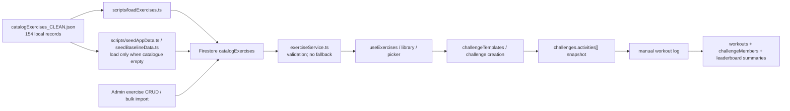

# Tiizi Fitness Activity Catalogue Audit

## 1. Executive Summary

This audit found **154 canonical local exercise records** in `catalogExercises_CLEAN.json`. The file is the intended local seed source, but it is **not the runtime fallback**. The application reads the Firestore `catalogExercises` collection directly; if Firestore is empty, unavailable, stale, or changed through admin CRUD, the member exercise library reflects that state or fails rather than returning the JSON catalogue.

There is no standalone reusable workout catalogue or workout entity. The `workouts` collection stores individual completed activity logs. Reusable multi-exercise definitions are Firestore `challengeTemplates`; launched challenges snapshot activities into `challenges.activities[]`. Locally, `scripts/seedAppData.ts` defines three challenge templates and three generator patterns that produce 18 demo challenge instances across six seeded groups.

Highest-severity findings:

- Runtime Firestore can diverge from the 154-record JSON because member reads have no local fallback and admin CRUD/import writes directly to Firestore.
- The catalogue model is bodyweight/isometric-heavy and cannot model sets, load, rest, tempo prescriptions, RPE, heart-rate zones, bilateral structure, primary versus secondary muscles, substitutions, contraindications, population suitability, or exercise-specific challenge eligibility.
- **45 exercises** use `Balance & Stability`, `Power & Explosiveness`, or `Mobility & Flexibility`, while admin validation accepts only `Balance`, `Power`, and `Mobility`.
- **32 time-metric exercises** recommend reps/sets and **49 reps-metric exercises** recommend seconds/minutes in their stored recommended-volume text.
- Seventeen exercises store nested `metric.metricOptions`, but `ExerciseMetric` omits that field; several alternatives assign distance/km to exercises such as plank arm lifts, butt bridge, and standing side bend.
- The seeded collective template `Squat Squad 100` contains Squat/reps plus Plank/seconds, contradicting v2 collective mixed-unit validation. The current creation UI also caps collective and competitive challenges to one activity.
- All workout verification records are created with `verified: false`; no device-verification or per-exercise verification model exists.

## 2. Scope and Method

The repository was searched excluding `.git`, dependency, build, and distribution directories. Searches covered the requested fitness/exercise/workout vocabulary, catalogue symbols, Firestore collection access, seed imports, challenge activity fields, logging/scoring engines, prototypes, UI references, audits, and historical architecture documents.

Evidence rules used in this report:

- Canonical inventory rows come only from the evaluated `documents[]` array in `catalogExercises_CLEAN.json`.
- Stored strings and arrays are reproduced without rewriting. Missing fields are `—`.
- Runtime claims are tied to current services, hooks, Cloud Function validation, Firestore rules, and scoring engines.
- Safety Review Flags are deterministic audit flags based on names/difficulty keywords stated in this report. They are not medical advice and do not replace expert review.
- Live Firestore was not queried. Therefore remote admin additions, edits, soft-deleted templates, and current document counts remain unresolved.

## 3. Source-of-Truth and Runtime Flow

| Source | Classification | Read/write behavior | Runtime precedence |
| --- | --- | --- | --- |
| `catalogExercises_CLEAN.json` | Canonical local seed catalogue | Read by loaders/seeds/tests; not imported by member runtime service | Intended seed source only |
| Firestore `catalogExercises` | Runtime source of truth | Read by `exerciseService`; public read by rules | Wins completely; no JSON fallback |
| `scripts/loadExercises.ts` | Direct loader | Writes all JSON records with `batch.set`; despite output mentioning `--apply`, any invocation without `--dry-run` enters write mode | Seed path |
| `scripts/seedAppData.ts` | App/demo seed | Loads JSON only when `catalogExercises` is empty; then creates demo challenges/workout logs/templates | Conditional seed path |
| `scripts/seedBaselineData.ts` | Baseline seed | Loads JSON with merge only when catalogue is empty | Conditional seed path |
| `adminExerciseService.ts` | Admin CRUD/import | Creates, updates, deletes, and bulk imports directly in `catalogExercises` | Can diverge runtime from JSON |
| Firestore `challengeTemplates` | Runtime fitness routine/template source | Read and mutated by `challengeTemplateService`; no static fallback | Wins for suggested/admin templates |
| Firestore `challenges.activities[]` | Launched challenge snapshot | Stores selected activity ID/name/target/unit and optional wellness-oriented content | Wins for logging an existing challenge |
| Firestore `workouts` | Activity-log collection, not workout catalogue | One numeric fitness activity log per document | Runtime history only |
| `docs/input/ISOMETRIC-EXERCISES-CONTENT-DETAIL.md` | Content input/reference | Not imported by runtime | Supporting/non-canonical |
| `public/screen-layouts/**` and `docs/ui-reference/**` | Prototype/static UI content | Not imported as data by runtime | Prototype only |

Runtime source winner: Firestore `catalogExercises` for exercises, Firestore `challengeTemplates` for reusable fitness templates, and each launched challenge's denormalized `activities[]` for logging. The JSON catalogue does not rescue a failed or empty runtime read.

## 4. Complete Fitness Activity Master Table

The table contains all **154** canonical local records. There is no exercise factory or inheritance helper in the repository: fields are stored directly in JSON. Repetition may indicate earlier bulk generation, but no generator source was found, so it is not represented as inheritance.

| ID | Name | Short Name | Category (tier_1) | Subcategory (tier_2) | Activity Family | Exercise Type / Movement Type | Workout Type | Difficulty | Fitness Level | Intensity | Primary Muscle Groups (stored unsplit) | Secondary Muscle Groups | Movement Pattern | Equipment | Location | Metric Type | Metric Unit | Metric Alternatives | Allow Custom Unit | Target Value | Target Direction | Repetitions | Sets | Duration | Distance | Load / Weight | Rest Interval | Tempo | RPE / Intensity Target | Calories | Heart-Rate Target | About / Description | Benefits | Setup | Execution / Instructions | Protocol | Breathing | Form Guidance | Warm-Up | Cool-Down | Progression | Regression | Advanced Variations | Substitutions | Common Mistakes | Safety Notes | Contraindications | Prerequisites | Training Goals | Tags | Search Keywords | Image / Icon | Colour / Theme | Suggested Frequency | Recommended Challenge Duration | Default Points | Bonus Conditions | Popular | Medical Supervision Required | Public Challenge Eligibility | Competitive Eligibility | Streak Eligibility | Tracking Method | Verification Method | Recommended Volume | Status / Visibility / Publication | Created / Updated | Hold Based | Safety Review Flags | Source / Inheritance |
| --- | --- | --- | --- | --- | --- | --- | --- | --- | --- | --- | --- | --- | --- | --- | --- | --- | --- | --- | --- | --- | --- | --- | --- | --- | --- | --- | --- | --- | --- | --- | --- | --- | --- | --- | --- | --- | --- | --- | --- | --- | --- | --- | --- | --- | --- | --- | --- | --- | --- | --- | --- | --- | --- | --- | --- | --- | --- | --- | --- | --- | --- | --- | --- | --- | --- | --- | --- | --- | --- | --- |
| plank-forearm-plank | Plank (Forearm Plank) | — | Core | Strength | — | isometric | — | Beginner | — | — | <ul><li>Abs</li><li>Obliques</li><li>Lower Back</li><li>Shoulders</li><li>Glutes</li></ul> | — | — | <ul><li>Bodyweight</li></ul> | — | time | seconds | — | false | — | — | — | — | — | — | — | — | — | — | — | — | A strength exercise targeting Abs, Obliques for beginner-level fitness enthusiasts. This core movement focuses on strength development. | — | <ol><li>Start in kneeling position on mat</li><li>Place forearms on ground, elbows under shoulders</li><li>Extend legs back one at a time onto toes</li><li>Create straight line from head to heels</li></ol> | <ol><li>Lift body into plank position</li><li>Maintain straight line throughout body</li><li>Squeeze glutes and engage core</li><li>Hold for designated time</li><li>Lower with control to finish</li></ol> | — | <ul><li>inhale: Take steady breaths in through your nose</li><li>exhale: Breathe out through your mouth</li><li>pattern: Maintain steady, rhythmic breathing throughout the hold - never hold your breath</li></ul> | <ul><li>Keep hips level - don't sag or pike</li><li>Squeeze glutes to stabilize pelvis</li><li>Press away from ground with forearms</li><li>Look at floor 6 inches ahead</li><li>Breathe steadily throughout hold</li></ul> | — | — | <ul><li>Start with knee plank variation</li><li>Hold for shorter durations (10-15 sec)</li><li>Perform on elevated surface (hands on bench)</li></ul> | — | <ul><li>Add leg or arm raises</li><li>Increase hold duration significantly</li><li>Add weight plate on back</li><li>Perform on unstable surface</li></ul> | — | <ul><li>Allowing hips to sag toward ground</li><li>Piking hips too high in air</li><li>Holding breath during hold</li><li>Looking up and straining neck</li><li>Collapsing into shoulders</li></ul> | <ul><li>Stop immediately if you feel sharp pain</li><li>Avoid if you have recent shoulder injuries</li><li>Modify if experiencing lower back pain</li><li>Don't hold breath - breathe continuously</li></ul> | — | — | <ul><li>Strength</li><li>Hypertrophy</li><li>Endurance</li></ul> | <ul><li>isometric</li></ul> | — | — | — | — | — | — | — | — | — | — | — | — | Manual numeric value using challenge-snapshotted unit (time / seconds) | Workout documents are stored with verified: false | <ul><li>beginner: 15–20 sec</li><li>intermediate: 20–30 sec</li><li>advanced: 30–40 sec</li></ul> | — | — | true | — | Stored directly in catalogExercises_CLEAN.json; no runtime inheritance helper |
| side-plank-left | Side Plank Left | — | Core | Strength | — | isometric | — | Intermediate | — | — | <ul><li>Obliques</li><li>Abs</li><li>Hip Abductors</li><li>Shoulders</li></ul> | — | — | <ul><li>Bodyweight</li></ul> | — | time | seconds | — | false | — | — | — | — | — | — | — | — | — | — | — | — | A strength exercise targeting Obliques, Abs for intermediate-level fitness enthusiasts. This core movement focuses on strength development. | — | <ol><li>Lie on your side with legs extended</li><li>Place forearm on ground with elbow directly under shoulder</li><li>Stack feet on top of each other</li><li>Engage your core before lifting</li></ol> | <ol><li>Lift body into plank position</li><li>Maintain straight line throughout body</li><li>Squeeze glutes and engage core</li><li>Hold for designated time</li><li>Lower with control to finish</li></ol> | — | <ul><li>inhale: Take steady breaths in through your nose</li><li>exhale: Breathe out through your mouth</li><li>pattern: Maintain steady, rhythmic breathing throughout the hold - never hold your breath</li></ul> | <ul><li>Keep hips level - don't sag or pike</li><li>Squeeze glutes to stabilize pelvis</li><li>Press away from ground with forearms</li><li>Look at floor 6 inches ahead</li><li>Breathe steadily throughout hold</li><li>Stack body vertically - no rotation</li></ul> | — | — | <ul><li>Start with knee plank variation</li><li>Hold for shorter durations (10-15 sec)</li><li>Perform on elevated surface (hands on bench)</li></ul> | — | <ul><li>Add leg or arm raises</li><li>Increase hold duration significantly</li><li>Add weight plate on back</li><li>Perform on unstable surface</li></ul> | — | <ul><li>Allowing hips to sag toward ground</li><li>Piking hips too high in air</li><li>Holding breath during hold</li><li>Looking up and straining neck</li><li>Collapsing into shoulders</li></ul> | <ul><li>Stop immediately if you feel sharp pain</li><li>Avoid if you have recent shoulder injuries</li><li>Modify if experiencing lower back pain</li><li>Don't hold breath - breathe continuously</li></ul> | — | — | <ul><li>Strength</li><li>Hypertrophy</li><li>Endurance</li></ul> | <ul><li>isometric</li></ul> | — | — | — | — | — | — | — | — | — | — | — | — | Manual numeric value using challenge-snapshotted unit (time / seconds) | Workout documents are stored with verified: false | <ul><li>beginner: 20–30 sec</li><li>intermediate: 30–45 sec</li><li>advanced: 45–60 sec</li></ul> | — | — | true | — | Stored directly in catalogExercises_CLEAN.json; no runtime inheritance helper |
| side-plank-right | Side Plank Right | — | Core | Strength | — | isometric | — | Intermediate | — | — | <ul><li>Obliques</li><li>Abs</li><li>Hip Abductors</li><li>Shoulders</li></ul> | — | — | <ul><li>Bodyweight</li></ul> | — | time | seconds | — | false | — | — | — | — | — | — | — | — | — | — | — | — | A strength exercise targeting Obliques, Abs for intermediate-level fitness enthusiasts. This core movement focuses on strength development. | — | <ol><li>Lie on your side with legs extended</li><li>Place forearm on ground with elbow directly under shoulder</li><li>Stack feet on top of each other</li><li>Engage your core before lifting</li></ol> | <ol><li>Lift body into plank position</li><li>Maintain straight line throughout body</li><li>Squeeze glutes and engage core</li><li>Hold for designated time</li><li>Lower with control to finish</li></ol> | — | <ul><li>inhale: Take steady breaths in through your nose</li><li>exhale: Breathe out through your mouth</li><li>pattern: Maintain steady, rhythmic breathing throughout the hold - never hold your breath</li></ul> | <ul><li>Keep hips level - don't sag or pike</li><li>Squeeze glutes to stabilize pelvis</li><li>Press away from ground with forearms</li><li>Look at floor 6 inches ahead</li><li>Breathe steadily throughout hold</li><li>Stack body vertically - no rotation</li></ul> | — | — | <ul><li>Start with knee plank variation</li><li>Hold for shorter durations (10-15 sec)</li><li>Perform on elevated surface (hands on bench)</li></ul> | — | <ul><li>Add leg or arm raises</li><li>Increase hold duration significantly</li><li>Add weight plate on back</li><li>Perform on unstable surface</li></ul> | — | <ul><li>Allowing hips to sag toward ground</li><li>Piking hips too high in air</li><li>Holding breath during hold</li><li>Looking up and straining neck</li><li>Collapsing into shoulders</li></ul> | <ul><li>Stop immediately if you feel sharp pain</li><li>Avoid if you have recent shoulder injuries</li><li>Modify if experiencing lower back pain</li><li>Don't hold breath - breathe continuously</li></ul> | — | — | <ul><li>Strength</li><li>Hypertrophy</li><li>Endurance</li></ul> | <ul><li>isometric</li></ul> | — | — | — | — | — | — | — | — | — | — | — | — | Manual numeric value using challenge-snapshotted unit (time / seconds) | Workout documents are stored with verified: false | <ul><li>beginner: 20–30 sec</li><li>intermediate: 30–45 sec</li><li>advanced: 45–60 sec</li></ul> | — | — | true | — | Stored directly in catalogExercises_CLEAN.json; no runtime inheritance helper |
| kneeling-side-plank-left | Kneeling Side Plank Left | — | Core | Strength | — | isometric | — | Beginner | — | — | <ul><li>Obliques</li><li>Abs</li><li>Shoulders</li></ul> | — | — | <ul><li>Bodyweight</li></ul> | — | time | seconds | — | false | — | — | — | — | — | — | — | — | — | — | — | — | A strength exercise targeting Obliques, Abs for beginner-level fitness enthusiasts. This core movement focuses on strength development. | — | <ol><li>Lie on your side with legs extended</li><li>Place forearm on ground with elbow directly under shoulder</li><li>Stack feet on top of each other</li><li>Engage your core before lifting</li></ol> | <ol><li>Lift body into plank position</li><li>Maintain straight line throughout body</li><li>Squeeze glutes and engage core</li><li>Hold for designated time</li><li>Lower with control to finish</li></ol> | — | <ul><li>inhale: Take steady breaths in through your nose</li><li>exhale: Breathe out through your mouth</li><li>pattern: Maintain steady, rhythmic breathing throughout the hold - never hold your breath</li></ul> | <ul><li>Keep hips level - don't sag or pike</li><li>Squeeze glutes to stabilize pelvis</li><li>Press away from ground with forearms</li><li>Look at floor 6 inches ahead</li><li>Breathe steadily throughout hold</li><li>Stack body vertically - no rotation</li></ul> | — | — | <ul><li>Practice against wall first</li><li>Very brief holds (5-10 seconds)</li><li>Focus on perfect form over duration</li></ul> | — | <ul><li>Add leg or arm raises</li><li>Increase hold duration significantly</li><li>Add weight plate on back</li><li>Perform on unstable surface</li></ul> | — | <ul><li>Allowing hips to sag toward ground</li><li>Piking hips too high in air</li><li>Holding breath during hold</li><li>Looking up and straining neck</li><li>Collapsing into shoulders</li></ul> | <ul><li>Stop immediately if you feel sharp pain</li><li>Avoid if you have recent shoulder injuries</li><li>Modify if experiencing lower back pain</li><li>Don't hold breath - breathe continuously</li></ul> | — | — | <ul><li>Strength</li><li>Hypertrophy</li><li>Endurance</li></ul> | <ul><li>isometric</li></ul> | — | — | — | — | — | — | — | — | — | — | — | — | Manual numeric value using challenge-snapshotted unit (time / seconds) | Workout documents are stored with verified: false | <ul><li>beginner: 15–20 sec</li><li>intermediate: 20–30 sec</li><li>advanced: 30–40 sec</li></ul> | — | — | true | — | Stored directly in catalogExercises_CLEAN.json; no runtime inheritance helper |
| kneeling-side-plank-right | Kneeling Side Plank Right | — | Core | Strength | — | isometric | — | Beginner | — | — | <ul><li>Obliques</li><li>Abs</li><li>Shoulders</li></ul> | — | — | <ul><li>Bodyweight</li></ul> | — | time | seconds | — | false | — | — | — | — | — | — | — | — | — | — | — | — | A strength exercise targeting Obliques, Abs for beginner-level fitness enthusiasts. This core movement focuses on strength development. | — | <ol><li>Lie on your side with legs extended</li><li>Place forearm on ground with elbow directly under shoulder</li><li>Stack feet on top of each other</li><li>Engage your core before lifting</li></ol> | <ol><li>Lift body into plank position</li><li>Maintain straight line throughout body</li><li>Squeeze glutes and engage core</li><li>Hold for designated time</li><li>Lower with control to finish</li></ol> | — | <ul><li>inhale: Take steady breaths in through your nose</li><li>exhale: Breathe out through your mouth</li><li>pattern: Maintain steady, rhythmic breathing throughout the hold - never hold your breath</li></ul> | <ul><li>Keep hips level - don't sag or pike</li><li>Squeeze glutes to stabilize pelvis</li><li>Press away from ground with forearms</li><li>Look at floor 6 inches ahead</li><li>Breathe steadily throughout hold</li><li>Stack body vertically - no rotation</li></ul> | — | — | <ul><li>Practice against wall first</li><li>Very brief holds (5-10 seconds)</li><li>Focus on perfect form over duration</li></ul> | — | <ul><li>Add leg or arm raises</li><li>Increase hold duration significantly</li><li>Add weight plate on back</li><li>Perform on unstable surface</li></ul> | — | <ul><li>Allowing hips to sag toward ground</li><li>Piking hips too high in air</li><li>Holding breath during hold</li><li>Looking up and straining neck</li><li>Collapsing into shoulders</li></ul> | <ul><li>Stop immediately if you feel sharp pain</li><li>Avoid if you have recent shoulder injuries</li><li>Modify if experiencing lower back pain</li><li>Don't hold breath - breathe continuously</li></ul> | — | — | <ul><li>Strength</li><li>Hypertrophy</li><li>Endurance</li></ul> | <ul><li>isometric</li></ul> | — | — | — | — | — | — | — | — | — | — | — | — | Manual numeric value using challenge-snapshotted unit (time / seconds) | Workout documents are stored with verified: false | <ul><li>beginner: 15–20 sec</li><li>intermediate: 20–30 sec</li><li>advanced: 30–40 sec</li></ul> | — | — | true | — | Stored directly in catalogExercises_CLEAN.json; no runtime inheritance helper |
| leg-up-side-plank-left | Leg Up Side Plank Left | — | Core | Strength | — | isometric | — | Advanced | — | — | <ul><li>Obliques</li><li>Abs</li><li>Hip Abductors</li><li>Glutes</li></ul> | — | — | <ul><li>Bodyweight</li></ul> | — | time | seconds | — | false | — | — | — | — | — | — | — | — | — | — | — | — | A strength exercise targeting Obliques, Abs for advanced-level fitness enthusiasts. This core movement focuses on strength development. | — | <ol><li>Lie on your side with legs extended</li><li>Place forearm on ground with elbow directly under shoulder</li><li>Stack feet on top of each other</li><li>Engage your core before lifting</li></ol> | <ol><li>Lift body into plank position</li><li>Maintain straight line throughout body</li><li>Squeeze glutes and engage core</li><li>Hold for designated time</li><li>Lower with control to finish</li></ol> | — | <ul><li>inhale: Take steady breaths in through your nose</li><li>exhale: Breathe out through your mouth</li><li>pattern: Maintain steady, rhythmic breathing throughout the hold - never hold your breath</li></ul> | <ul><li>Keep hips level - don't sag or pike</li><li>Squeeze glutes to stabilize pelvis</li><li>Press away from ground with forearms</li><li>Look at floor 6 inches ahead</li><li>Breathe steadily throughout hold</li><li>Stack body vertically - no rotation</li></ul> | — | — | <ul><li>Start with knee plank variation</li><li>Hold for shorter durations (10-15 sec)</li><li>Perform on elevated surface (hands on bench)</li></ul> | — | <ul><li>Add leg or arm raises</li><li>Increase hold duration significantly</li><li>Add weight plate on back</li><li>Perform on unstable surface</li></ul> | — | <ul><li>Allowing hips to sag toward ground</li><li>Piking hips too high in air</li><li>Holding breath during hold</li><li>Looking up and straining neck</li><li>Collapsing into shoulders</li></ul> | <ul><li>Stop immediately if you feel sharp pain</li><li>Avoid if you have recent shoulder injuries</li><li>Modify if experiencing lower back pain</li><li>Don't hold breath - breathe continuously</li></ul> | — | — | <ul><li>Strength</li><li>Hypertrophy</li><li>Endurance</li></ul> | <ul><li>isometric</li></ul> | — | — | — | — | — | — | — | — | — | — | — | — | Manual numeric value using challenge-snapshotted unit (time / seconds) | Workout documents are stored with verified: false | <ul><li>beginner: Not recommended - build foundation first</li><li>intermediate: 20–30 sec</li><li>advanced: 30–60 sec</li></ul> | — | — | true | <ul><li>Advanced or maximal effort</li></ul> | Stored directly in catalogExercises_CLEAN.json; no runtime inheritance helper |
| leg-up-side-plank-right | Leg Up Side Plank Right | — | Core | Strength | — | isometric | — | Advanced | — | — | <ul><li>Obliques</li><li>Abs</li><li>Hip Abductors</li><li>Glutes</li></ul> | — | — | <ul><li>Bodyweight</li></ul> | — | time | seconds | — | false | — | — | — | — | — | — | — | — | — | — | — | — | A strength exercise targeting Obliques, Abs for advanced-level fitness enthusiasts. This core movement focuses on strength development. | — | <ol><li>Lie on your side with legs extended</li><li>Place forearm on ground with elbow directly under shoulder</li><li>Stack feet on top of each other</li><li>Engage your core before lifting</li></ol> | <ol><li>Lift body into plank position</li><li>Maintain straight line throughout body</li><li>Squeeze glutes and engage core</li><li>Hold for designated time</li><li>Lower with control to finish</li></ol> | — | <ul><li>inhale: Take steady breaths in through your nose</li><li>exhale: Breathe out through your mouth</li><li>pattern: Maintain steady, rhythmic breathing throughout the hold - never hold your breath</li></ul> | <ul><li>Keep hips level - don't sag or pike</li><li>Squeeze glutes to stabilize pelvis</li><li>Press away from ground with forearms</li><li>Look at floor 6 inches ahead</li><li>Breathe steadily throughout hold</li><li>Stack body vertically - no rotation</li></ul> | — | — | <ul><li>Start with knee plank variation</li><li>Hold for shorter durations (10-15 sec)</li><li>Perform on elevated surface (hands on bench)</li></ul> | — | <ul><li>Add leg or arm raises</li><li>Increase hold duration significantly</li><li>Add weight plate on back</li><li>Perform on unstable surface</li></ul> | — | <ul><li>Allowing hips to sag toward ground</li><li>Piking hips too high in air</li><li>Holding breath during hold</li><li>Looking up and straining neck</li><li>Collapsing into shoulders</li></ul> | <ul><li>Stop immediately if you feel sharp pain</li><li>Avoid if you have recent shoulder injuries</li><li>Modify if experiencing lower back pain</li><li>Don't hold breath - breathe continuously</li></ul> | — | — | <ul><li>Strength</li><li>Hypertrophy</li><li>Endurance</li></ul> | <ul><li>isometric</li></ul> | — | — | — | — | — | — | — | — | — | — | — | — | Manual numeric value using challenge-snapshotted unit (time / seconds) | Workout documents are stored with verified: false | <ul><li>beginner: Not recommended - build foundation first</li><li>intermediate: 20–30 sec</li><li>advanced: 30–60 sec</li></ul> | — | — | true | <ul><li>Advanced or maximal effort</li></ul> | Stored directly in catalogExercises_CLEAN.json; no runtime inheritance helper |
| left-side-plank-with-arm-raised | Left Side Plank with Arm Raised | — | Core | Balance &amp; Stability | — | isometric | — | Intermediate | — | — | <ul><li>Obliques</li><li>Abs</li><li>Shoulders</li></ul> | — | — | <ul><li>Bodyweight</li></ul> | — | time | seconds | — | false | — | — | — | — | — | — | — | — | — | — | — | — | A balance &amp; stability exercise targeting Obliques, Abs for intermediate-level fitness enthusiasts. This core movement focuses on balance &amp; stability development. | — | <ol><li>Lie on your side with legs extended</li><li>Place forearm on ground with elbow directly under shoulder</li><li>Stack feet on top of each other</li><li>Engage your core before lifting</li></ol> | <ol><li>Lift body into plank position</li><li>Maintain straight line throughout body</li><li>Squeeze glutes and engage core</li><li>Hold for designated time</li><li>Lower with control to finish</li></ol> | — | <ul><li>inhale: Take steady breaths in through your nose</li><li>exhale: Breathe out through your mouth</li><li>pattern: Maintain steady, rhythmic breathing throughout the hold - never hold your breath</li></ul> | <ul><li>Keep hips level - don't sag or pike</li><li>Squeeze glutes to stabilize pelvis</li><li>Press away from ground with forearms</li><li>Look at floor 6 inches ahead</li><li>Breathe steadily throughout hold</li><li>Stack body vertically - no rotation</li></ul> | — | — | <ul><li>Start with knee plank variation</li><li>Hold for shorter durations (10-15 sec)</li><li>Perform on elevated surface (hands on bench)</li></ul> | — | <ul><li>Add leg or arm raises</li><li>Increase hold duration significantly</li><li>Add weight plate on back</li><li>Perform on unstable surface</li></ul> | — | <ul><li>Allowing hips to sag toward ground</li><li>Piking hips too high in air</li><li>Holding breath during hold</li><li>Looking up and straining neck</li><li>Collapsing into shoulders</li></ul> | <ul><li>Stop immediately if you feel sharp pain</li><li>Avoid if you have recent shoulder injuries</li><li>Modify if experiencing lower back pain</li><li>Don't hold breath - breathe continuously</li></ul> | — | — | <ul><li>Balance</li><li>Core Stability</li><li>Functional Fitness</li></ul> | <ul><li>isometric</li></ul> | — | — | — | — | — | — | — | — | — | — | — | — | Manual numeric value using challenge-snapshotted unit (time / seconds) | Workout documents are stored with verified: false | <ul><li>beginner: 20–30 sec</li><li>intermediate: 30–45 sec</li><li>advanced: 45–60 sec</li></ul> | — | — | true | — | Stored directly in catalogExercises_CLEAN.json; no runtime inheritance helper |
| right-side-plank-with-arm-raised | Right Side Plank with Arm Raised | — | Core | Balance &amp; Stability | — | isometric | — | Intermediate | — | — | <ul><li>Obliques</li><li>Abs</li><li>Shoulders</li></ul> | — | — | <ul><li>Bodyweight</li></ul> | — | time | seconds | — | false | — | — | — | — | — | — | — | — | — | — | — | — | A balance &amp; stability exercise targeting Obliques, Abs for intermediate-level fitness enthusiasts. This core movement focuses on balance &amp; stability development. | — | <ol><li>Lie on your side with legs extended</li><li>Place forearm on ground with elbow directly under shoulder</li><li>Stack feet on top of each other</li><li>Engage your core before lifting</li></ol> | <ol><li>Lift body into plank position</li><li>Maintain straight line throughout body</li><li>Squeeze glutes and engage core</li><li>Hold for designated time</li><li>Lower with control to finish</li></ol> | — | <ul><li>inhale: Take steady breaths in through your nose</li><li>exhale: Breathe out through your mouth</li><li>pattern: Maintain steady, rhythmic breathing throughout the hold - never hold your breath</li></ul> | <ul><li>Keep hips level - don't sag or pike</li><li>Squeeze glutes to stabilize pelvis</li><li>Press away from ground with forearms</li><li>Look at floor 6 inches ahead</li><li>Breathe steadily throughout hold</li><li>Stack body vertically - no rotation</li></ul> | — | — | <ul><li>Start with knee plank variation</li><li>Hold for shorter durations (10-15 sec)</li><li>Perform on elevated surface (hands on bench)</li></ul> | — | <ul><li>Add leg or arm raises</li><li>Increase hold duration significantly</li><li>Add weight plate on back</li><li>Perform on unstable surface</li></ul> | — | <ul><li>Allowing hips to sag toward ground</li><li>Piking hips too high in air</li><li>Holding breath during hold</li><li>Looking up and straining neck</li><li>Collapsing into shoulders</li></ul> | <ul><li>Stop immediately if you feel sharp pain</li><li>Avoid if you have recent shoulder injuries</li><li>Modify if experiencing lower back pain</li><li>Don't hold breath - breathe continuously</li></ul> | — | — | <ul><li>Balance</li><li>Core Stability</li><li>Functional Fitness</li></ul> | <ul><li>isometric</li></ul> | — | — | — | — | — | — | — | — | — | — | — | — | Manual numeric value using challenge-snapshotted unit (time / seconds) | Workout documents are stored with verified: false | <ul><li>beginner: 20–30 sec</li><li>intermediate: 30–45 sec</li><li>advanced: 45–60 sec</li></ul> | — | — | true | — | Stored directly in catalogExercises_CLEAN.json; no runtime inheritance helper |
| side-plank-with-left-leg-raised | Side Plank with Left Leg Raised | — | Core | Strength | — | isometric | — | Advanced | — | — | <ul><li>Obliques</li><li>Hip Abductors</li><li>Glutes</li></ul> | — | — | <ul><li>Bodyweight</li></ul> | — | time | seconds | — | false | — | — | — | — | — | — | — | — | — | — | — | — | A strength exercise targeting Obliques, Hip Abductors for advanced-level fitness enthusiasts. This core movement focuses on strength development. | — | <ol><li>Lie on your side with legs extended</li><li>Place forearm on ground with elbow directly under shoulder</li><li>Stack feet on top of each other</li><li>Engage your core before lifting</li></ol> | <ol><li>Lift body into plank position</li><li>Maintain straight line throughout body</li><li>Squeeze glutes and engage core</li><li>Hold for designated time</li><li>Lower with control to finish</li></ol> | — | <ul><li>inhale: Take steady breaths in through your nose</li><li>exhale: Breathe out through your mouth</li><li>pattern: Maintain steady, rhythmic breathing throughout the hold - never hold your breath</li></ul> | <ul><li>Keep hips level - don't sag or pike</li><li>Squeeze glutes to stabilize pelvis</li><li>Press away from ground with forearms</li><li>Look at floor 6 inches ahead</li><li>Breathe steadily throughout hold</li><li>Stack body vertically - no rotation</li></ul> | — | — | <ul><li>Start with knee plank variation</li><li>Hold for shorter durations (10-15 sec)</li><li>Perform on elevated surface (hands on bench)</li></ul> | — | <ul><li>Add leg or arm raises</li><li>Increase hold duration significantly</li><li>Add weight plate on back</li><li>Perform on unstable surface</li></ul> | — | <ul><li>Allowing hips to sag toward ground</li><li>Piking hips too high in air</li><li>Holding breath during hold</li><li>Looking up and straining neck</li><li>Collapsing into shoulders</li></ul> | <ul><li>Stop immediately if you feel sharp pain</li><li>Avoid if you have recent shoulder injuries</li><li>Modify if experiencing lower back pain</li><li>Don't hold breath - breathe continuously</li></ul> | — | — | <ul><li>Strength</li><li>Hypertrophy</li><li>Endurance</li></ul> | <ul><li>isometric</li></ul> | — | — | — | — | — | — | — | — | — | — | — | — | Manual numeric value using challenge-snapshotted unit (time / seconds) | Workout documents are stored with verified: false | <ul><li>beginner: Not recommended - build foundation first</li><li>intermediate: 20–30 sec</li><li>advanced: 30–60 sec</li></ul> | — | — | true | <ul><li>Complex form / balance or falls risk</li><li>Advanced or maximal effort</li></ul> | Stored directly in catalogExercises_CLEAN.json; no runtime inheritance helper |
| side-plank-with-right-leg-raised | Side Plank with Right Leg Raised | — | Core | Strength | — | isometric | — | Advanced | — | — | <ul><li>Obliques</li><li>Hip Abductors</li><li>Glutes</li></ul> | — | — | <ul><li>Bodyweight</li></ul> | — | time | seconds | — | false | — | — | — | — | — | — | — | — | — | — | — | — | A strength exercise targeting Obliques, Hip Abductors for advanced-level fitness enthusiasts. This core movement focuses on strength development. | — | <ol><li>Lie on your side with legs extended</li><li>Place forearm on ground with elbow directly under shoulder</li><li>Stack feet on top of each other</li><li>Engage your core before lifting</li></ol> | <ol><li>Lift body into plank position</li><li>Maintain straight line throughout body</li><li>Squeeze glutes and engage core</li><li>Hold for designated time</li><li>Lower with control to finish</li></ol> | — | <ul><li>inhale: Take steady breaths in through your nose</li><li>exhale: Breathe out through your mouth</li><li>pattern: Maintain steady, rhythmic breathing throughout the hold - never hold your breath</li></ul> | <ul><li>Keep hips level - don't sag or pike</li><li>Squeeze glutes to stabilize pelvis</li><li>Press away from ground with forearms</li><li>Look at floor 6 inches ahead</li><li>Breathe steadily throughout hold</li><li>Stack body vertically - no rotation</li></ul> | — | — | <ul><li>Start with knee plank variation</li><li>Hold for shorter durations (10-15 sec)</li><li>Perform on elevated surface (hands on bench)</li></ul> | — | <ul><li>Add leg or arm raises</li><li>Increase hold duration significantly</li><li>Add weight plate on back</li><li>Perform on unstable surface</li></ul> | — | <ul><li>Allowing hips to sag toward ground</li><li>Piking hips too high in air</li><li>Holding breath during hold</li><li>Looking up and straining neck</li><li>Collapsing into shoulders</li></ul> | <ul><li>Stop immediately if you feel sharp pain</li><li>Avoid if you have recent shoulder injuries</li><li>Modify if experiencing lower back pain</li><li>Don't hold breath - breathe continuously</li></ul> | — | — | <ul><li>Strength</li><li>Hypertrophy</li><li>Endurance</li></ul> | <ul><li>isometric</li></ul> | — | — | — | — | — | — | — | — | — | — | — | — | Manual numeric value using challenge-snapshotted unit (time / seconds) | Workout documents are stored with verified: false | <ul><li>beginner: Not recommended - build foundation first</li><li>intermediate: 20–30 sec</li><li>advanced: 30–60 sec</li></ul> | — | — | true | <ul><li>Complex form / balance or falls risk</li><li>Advanced or maximal effort</li></ul> | Stored directly in catalogExercises_CLEAN.json; no runtime inheritance helper |
| knee-plank | Knee Plank | — | Core | Strength | — | isometric | — | Beginner | — | — | <ul><li>Abs</li><li>Obliques</li><li>Shoulders</li></ul> | — | — | <ul><li>Bodyweight</li></ul> | — | time | seconds | — | false | — | — | — | — | — | — | — | — | — | — | — | — | A strength exercise targeting Abs, Obliques for beginner-level fitness enthusiasts. This core movement focuses on strength development. | — | <ol><li>Start kneeling on a mat</li><li>Place forearms on ground, elbows under shoulders</li><li>Keep knees hip-width apart</li><li>Form straight line from head to knees</li></ol> | <ol><li>Lift body into plank position</li><li>Maintain straight line throughout body</li><li>Squeeze glutes and engage core</li><li>Hold for designated time</li><li>Lower with control to finish</li></ol> | — | <ul><li>inhale: Take steady breaths in through your nose</li><li>exhale: Breathe out through your mouth</li><li>pattern: Maintain steady, rhythmic breathing throughout the hold - never hold your breath</li></ul> | <ul><li>Keep hips level - don't sag or pike</li><li>Squeeze glutes to stabilize pelvis</li><li>Press away from ground with forearms</li><li>Look at floor 6 inches ahead</li><li>Breathe steadily throughout hold</li></ul> | — | — | <ul><li>Practice against wall first</li><li>Very brief holds (5-10 seconds)</li><li>Focus on perfect form over duration</li></ul> | — | <ul><li>Add leg or arm raises</li><li>Increase hold duration significantly</li><li>Add weight plate on back</li><li>Perform on unstable surface</li></ul> | — | <ul><li>Allowing hips to sag toward ground</li><li>Piking hips too high in air</li><li>Holding breath during hold</li><li>Looking up and straining neck</li><li>Collapsing into shoulders</li></ul> | <ul><li>Stop immediately if you feel sharp pain</li><li>Avoid if you have recent shoulder injuries</li><li>Modify if experiencing lower back pain</li><li>Don't hold breath - breathe continuously</li></ul> | — | — | <ul><li>Strength</li><li>Hypertrophy</li><li>Endurance</li></ul> | <ul><li>isometric</li></ul> | — | — | — | — | — | — | — | — | — | — | — | — | Manual numeric value using challenge-snapshotted unit (time / seconds) | Workout documents are stored with verified: false | <ul><li>beginner: 15–20 sec</li><li>intermediate: 20–30 sec</li><li>advanced: 30–40 sec</li></ul> | — | — | true | — | Stored directly in catalogExercises_CLEAN.json; no runtime inheritance helper |
| straight-arm-knee-plank | Straight Arm Knee Plank | — | Core | Strength | — | isometric | — | Beginner | — | — | <ul><li>Abs</li><li>Shoulders</li><li>Chest</li></ul> | — | — | <ul><li>Bodyweight</li></ul> | — | time | seconds | — | false | — | — | — | — | — | — | — | — | — | — | — | — | A strength exercise targeting Abs, Shoulders for beginner-level fitness enthusiasts. This core movement focuses on strength development. | — | <ol><li>Start kneeling on a mat</li><li>Place forearms on ground, elbows under shoulders</li><li>Keep knees hip-width apart</li><li>Form straight line from head to knees</li></ol> | <ol><li>Lift body into plank position</li><li>Maintain straight line throughout body</li><li>Squeeze glutes and engage core</li><li>Hold for designated time</li><li>Lower with control to finish</li></ol> | — | <ul><li>inhale: Take steady breaths in through your nose</li><li>exhale: Breathe out through your mouth</li><li>pattern: Maintain steady, rhythmic breathing throughout the hold - never hold your breath</li></ul> | <ul><li>Keep hips level - don't sag or pike</li><li>Squeeze glutes to stabilize pelvis</li><li>Press away from ground with forearms</li><li>Look at floor 6 inches ahead</li><li>Breathe steadily throughout hold</li></ul> | — | — | <ul><li>Practice against wall first</li><li>Very brief holds (5-10 seconds)</li><li>Focus on perfect form over duration</li></ul> | — | <ul><li>Add leg or arm raises</li><li>Increase hold duration significantly</li><li>Add weight plate on back</li><li>Perform on unstable surface</li></ul> | — | <ul><li>Allowing hips to sag toward ground</li><li>Piking hips too high in air</li><li>Holding breath during hold</li><li>Looking up and straining neck</li><li>Collapsing into shoulders</li></ul> | <ul><li>Stop immediately if you feel sharp pain</li><li>Avoid if you have recent shoulder injuries</li><li>Modify if experiencing lower back pain</li><li>Don't hold breath - breathe continuously</li></ul> | — | — | <ul><li>Strength</li><li>Hypertrophy</li><li>Endurance</li></ul> | <ul><li>isometric</li></ul> | — | — | — | — | — | — | — | — | — | — | — | — | Manual numeric value using challenge-snapshotted unit (time / seconds) | Workout documents are stored with verified: false | <ul><li>beginner: 15–20 sec</li><li>intermediate: 20–30 sec</li><li>advanced: 30–40 sec</li></ul> | — | — | true | — | Stored directly in catalogExercises_CLEAN.json; no runtime inheritance helper |
| straight-arm-plank-high-plank | Straight Arm Plank (High Plank) | — | Core | Strength | — | isometric | — | Beginner | — | — | <ul><li>Abs</li><li>Shoulders</li><li>Chest</li><li>Obliques</li></ul> | — | — | <ul><li>Bodyweight</li></ul> | — | time | seconds | — | false | — | — | — | — | — | — | — | — | — | — | — | — | A strength exercise targeting Abs, Shoulders for beginner-level fitness enthusiasts. This core movement focuses on strength development. | — | <ol><li>Start in kneeling position on mat</li><li>Place forearms on ground, elbows under shoulders</li><li>Extend legs back one at a time onto toes</li><li>Create straight line from head to heels</li></ol> | <ol><li>Lift body into plank position</li><li>Maintain straight line throughout body</li><li>Squeeze glutes and engage core</li><li>Hold for designated time</li><li>Lower with control to finish</li></ol> | — | <ul><li>inhale: Take steady breaths in through your nose</li><li>exhale: Breathe out through your mouth</li><li>pattern: Maintain steady, rhythmic breathing throughout the hold - never hold your breath</li></ul> | <ul><li>Keep hips level - don't sag or pike</li><li>Squeeze glutes to stabilize pelvis</li><li>Press away from ground with forearms</li><li>Look at floor 6 inches ahead</li><li>Breathe steadily throughout hold</li></ul> | — | — | <ul><li>Start with knee plank variation</li><li>Hold for shorter durations (10-15 sec)</li><li>Perform on elevated surface (hands on bench)</li></ul> | — | <ul><li>Add leg or arm raises</li><li>Increase hold duration significantly</li><li>Add weight plate on back</li><li>Perform on unstable surface</li></ul> | — | <ul><li>Allowing hips to sag toward ground</li><li>Piking hips too high in air</li><li>Holding breath during hold</li><li>Looking up and straining neck</li><li>Collapsing into shoulders</li></ul> | <ul><li>Stop immediately if you feel sharp pain</li><li>Avoid if you have recent shoulder injuries</li><li>Modify if experiencing lower back pain</li><li>Don't hold breath - breathe continuously</li></ul> | — | — | <ul><li>Strength</li><li>Hypertrophy</li><li>Endurance</li></ul> | <ul><li>isometric</li></ul> | — | — | — | — | — | — | — | — | — | — | — | — | Manual numeric value using challenge-snapshotted unit (time / seconds) | Workout documents are stored with verified: false | <ul><li>beginner: 15–20 sec</li><li>intermediate: 20–30 sec</li><li>advanced: 30–40 sec</li></ul> | — | — | true | — | Stored directly in catalogExercises_CLEAN.json; no runtime inheritance helper |
| wide-arm-plank | Wide Arm Plank | — | Core | Strength | — | isometric | — | Intermediate | — | — | <ul><li>Abs</li><li>Chest</li><li>Shoulders</li></ul> | — | — | <ul><li>Bodyweight</li></ul> | — | time | seconds | — | false | — | — | — | — | — | — | — | — | — | — | — | — | A strength exercise targeting Abs, Chest for intermediate-level fitness enthusiasts. This core movement focuses on strength development. | — | <ol><li>Start in kneeling position on mat</li><li>Place forearms on ground, elbows under shoulders</li><li>Extend legs back one at a time onto toes</li><li>Create straight line from head to heels</li></ol> | <ol><li>Lift body into plank position</li><li>Maintain straight line throughout body</li><li>Squeeze glutes and engage core</li><li>Hold for designated time</li><li>Lower with control to finish</li></ol> | — | <ul><li>inhale: Take steady breaths in through your nose</li><li>exhale: Breathe out through your mouth</li><li>pattern: Maintain steady, rhythmic breathing throughout the hold - never hold your breath</li></ul> | <ul><li>Keep hips level - don't sag or pike</li><li>Squeeze glutes to stabilize pelvis</li><li>Press away from ground with forearms</li><li>Look at floor 6 inches ahead</li><li>Breathe steadily throughout hold</li></ul> | — | — | <ul><li>Start with knee plank variation</li><li>Hold for shorter durations (10-15 sec)</li><li>Perform on elevated surface (hands on bench)</li></ul> | — | <ul><li>Add leg or arm raises</li><li>Increase hold duration significantly</li><li>Add weight plate on back</li><li>Perform on unstable surface</li></ul> | — | <ul><li>Allowing hips to sag toward ground</li><li>Piking hips too high in air</li><li>Holding breath during hold</li><li>Looking up and straining neck</li><li>Collapsing into shoulders</li></ul> | <ul><li>Stop immediately if you feel sharp pain</li><li>Avoid if you have recent shoulder injuries</li><li>Modify if experiencing lower back pain</li><li>Don't hold breath - breathe continuously</li></ul> | — | — | <ul><li>Strength</li><li>Hypertrophy</li><li>Endurance</li></ul> | <ul><li>isometric</li></ul> | — | — | — | — | — | — | — | — | — | — | — | — | Manual numeric value using challenge-snapshotted unit (time / seconds) | Workout documents are stored with verified: false | <ul><li>beginner: 20–30 sec</li><li>intermediate: 30–45 sec</li><li>advanced: 45–60 sec</li></ul> | — | — | true | — | Stored directly in catalogExercises_CLEAN.json; no runtime inheritance helper |
| plank-with-left-arm-lift | Plank with Left Arm Lift | — | Core | Balance &amp; Stability | — | isometric | — | Intermediate | — | — | <ul><li>Abs</li><li>Obliques</li><li>Shoulders</li></ul> | — | — | <ul><li>Bodyweight</li></ul> | — | time | seconds | <ul><li>{"type":"time","unit":"minutes"}</li><li>{"type":"distance","unit":"km"}</li></ul> | true | — | — | — | — | — | — | — | — | — | — | — | — | A balance &amp; stability exercise targeting Abs, Obliques for intermediate-level fitness enthusiasts. This core movement focuses on balance &amp; stability development. | — | <ol><li>Start in kneeling position on mat</li><li>Place forearms on ground, elbows under shoulders</li><li>Extend legs back one at a time onto toes</li><li>Create straight line from head to heels</li></ol> | <ol><li>Lift body into plank position</li><li>Maintain straight line throughout body</li><li>Squeeze glutes and engage core</li><li>Hold for designated time</li><li>Lower with control to finish</li></ol> | — | <ul><li>inhale: Take steady breaths in through your nose</li><li>exhale: Breathe out through your mouth</li><li>pattern: Maintain steady, rhythmic breathing throughout the hold - never hold your breath</li></ul> | <ul><li>Keep hips level - don't sag or pike</li><li>Squeeze glutes to stabilize pelvis</li><li>Press away from ground with forearms</li><li>Look at floor 6 inches ahead</li><li>Breathe steadily throughout hold</li></ul> | — | — | <ul><li>Start with knee plank variation</li><li>Hold for shorter durations (10-15 sec)</li><li>Perform on elevated surface (hands on bench)</li></ul> | — | <ul><li>Add leg or arm raises</li><li>Increase hold duration significantly</li><li>Add weight plate on back</li><li>Perform on unstable surface</li></ul> | — | <ul><li>Allowing hips to sag toward ground</li><li>Piking hips too high in air</li><li>Holding breath during hold</li><li>Looking up and straining neck</li><li>Collapsing into shoulders</li></ul> | <ul><li>Stop immediately if you feel sharp pain</li><li>Avoid if you have recent shoulder injuries</li><li>Modify if experiencing lower back pain</li><li>Don't hold breath - breathe continuously</li></ul> | — | — | <ul><li>Balance</li><li>Core Stability</li><li>Functional Fitness</li></ul> | <ul><li>isometric</li></ul> | — | — | — | — | — | — | — | — | — | — | — | — | Manual numeric value using challenge-snapshotted unit (time / seconds) | Workout documents are stored with verified: false | <ul><li>beginner: 20–30 sec</li><li>intermediate: 30–45 sec</li><li>advanced: 45–60 sec</li></ul> | — | — | true | <ul><li>Complex form / balance or falls risk</li></ul> | Stored directly in catalogExercises_CLEAN.json; no runtime inheritance helper |
| plank-with-right-arm-lift | Plank with Right Arm Lift | — | Core | Balance &amp; Stability | — | isometric | — | Intermediate | — | — | <ul><li>Abs</li><li>Obliques</li><li>Shoulders</li></ul> | — | — | <ul><li>Bodyweight</li></ul> | — | time | seconds | <ul><li>{"type":"time","unit":"minutes"}</li><li>{"type":"distance","unit":"km"}</li></ul> | true | — | — | — | — | — | — | — | — | — | — | — | — | A balance &amp; stability exercise targeting Abs, Obliques for intermediate-level fitness enthusiasts. This core movement focuses on balance &amp; stability development. | — | <ol><li>Start in kneeling position on mat</li><li>Place forearms on ground, elbows under shoulders</li><li>Extend legs back one at a time onto toes</li><li>Create straight line from head to heels</li></ol> | <ol><li>Lift body into plank position</li><li>Maintain straight line throughout body</li><li>Squeeze glutes and engage core</li><li>Hold for designated time</li><li>Lower with control to finish</li></ol> | — | <ul><li>inhale: Take steady breaths in through your nose</li><li>exhale: Breathe out through your mouth</li><li>pattern: Maintain steady, rhythmic breathing throughout the hold - never hold your breath</li></ul> | <ul><li>Keep hips level - don't sag or pike</li><li>Squeeze glutes to stabilize pelvis</li><li>Press away from ground with forearms</li><li>Look at floor 6 inches ahead</li><li>Breathe steadily throughout hold</li></ul> | — | — | <ul><li>Start with knee plank variation</li><li>Hold for shorter durations (10-15 sec)</li><li>Perform on elevated surface (hands on bench)</li></ul> | — | <ul><li>Add leg or arm raises</li><li>Increase hold duration significantly</li><li>Add weight plate on back</li><li>Perform on unstable surface</li></ul> | — | <ul><li>Allowing hips to sag toward ground</li><li>Piking hips too high in air</li><li>Holding breath during hold</li><li>Looking up and straining neck</li><li>Collapsing into shoulders</li></ul> | <ul><li>Stop immediately if you feel sharp pain</li><li>Avoid if you have recent shoulder injuries</li><li>Modify if experiencing lower back pain</li><li>Don't hold breath - breathe continuously</li></ul> | — | — | <ul><li>Balance</li><li>Core Stability</li><li>Functional Fitness</li></ul> | <ul><li>isometric</li></ul> | — | — | — | — | — | — | — | — | — | — | — | — | Manual numeric value using challenge-snapshotted unit (time / seconds) | Workout documents are stored with verified: false | <ul><li>beginner: 20–30 sec</li><li>intermediate: 30–45 sec</li><li>advanced: 45–60 sec</li></ul> | — | — | true | <ul><li>Complex form / balance or falls risk</li></ul> | Stored directly in catalogExercises_CLEAN.json; no runtime inheritance helper |
| single-left-leg-plank | Single Left Leg Plank | — | Core | Balance &amp; Stability | — | isometric | — | Intermediate | — | — | <ul><li>Abs</li><li>Glutes</li><li>Lower Back</li></ul> | — | — | <ul><li>Bodyweight</li></ul> | — | time | seconds | — | false | — | — | — | — | — | — | — | — | — | — | — | — | A balance &amp; stability exercise targeting Abs, Glutes for intermediate-level fitness enthusiasts. This core movement focuses on balance &amp; stability development. | — | <ol><li>Start in kneeling position on mat</li><li>Place forearms on ground, elbows under shoulders</li><li>Extend legs back one at a time onto toes</li><li>Create straight line from head to heels</li></ol> | <ol><li>Lift body into plank position</li><li>Maintain straight line throughout body</li><li>Squeeze glutes and engage core</li><li>Hold for designated time</li><li>Lower with control to finish</li></ol> | — | <ul><li>inhale: Take steady breaths in through your nose</li><li>exhale: Breathe out through your mouth</li><li>pattern: Maintain steady, rhythmic breathing throughout the hold - never hold your breath</li></ul> | <ul><li>Keep hips level - don't sag or pike</li><li>Squeeze glutes to stabilize pelvis</li><li>Press away from ground with forearms</li><li>Look at floor 6 inches ahead</li><li>Breathe steadily throughout hold</li></ul> | — | — | <ul><li>Start with knee plank variation</li><li>Hold for shorter durations (10-15 sec)</li><li>Perform on elevated surface (hands on bench)</li></ul> | — | <ul><li>Add leg or arm raises</li><li>Increase hold duration significantly</li><li>Add weight plate on back</li><li>Perform on unstable surface</li></ul> | — | <ul><li>Allowing hips to sag toward ground</li><li>Piking hips too high in air</li><li>Holding breath during hold</li><li>Looking up and straining neck</li><li>Collapsing into shoulders</li></ul> | <ul><li>Stop immediately if you feel sharp pain</li><li>Avoid if you have recent shoulder injuries</li><li>Modify if experiencing lower back pain</li><li>Don't hold breath - breathe continuously</li></ul> | — | — | <ul><li>Balance</li><li>Core Stability</li><li>Functional Fitness</li></ul> | <ul><li>isometric</li></ul> | — | — | — | — | — | — | — | — | — | — | — | — | Manual numeric value using challenge-snapshotted unit (time / seconds) | Workout documents are stored with verified: false | <ul><li>beginner: 20–30 sec</li><li>intermediate: 30–45 sec</li><li>advanced: 45–60 sec</li></ul> | — | — | true | — | Stored directly in catalogExercises_CLEAN.json; no runtime inheritance helper |
| single-right-leg-plank | Single Right Leg Plank | — | Core | Balance &amp; Stability | — | isometric | — | Intermediate | — | — | <ul><li>Abs</li><li>Glutes</li><li>Lower Back</li></ul> | — | — | <ul><li>Bodyweight</li></ul> | — | time | seconds | — | false | — | — | — | — | — | — | — | — | — | — | — | — | A balance &amp; stability exercise targeting Abs, Glutes for intermediate-level fitness enthusiasts. This core movement focuses on balance &amp; stability development. | — | <ol><li>Start in kneeling position on mat</li><li>Place forearms on ground, elbows under shoulders</li><li>Extend legs back one at a time onto toes</li><li>Create straight line from head to heels</li></ol> | <ol><li>Lift body into plank position</li><li>Maintain straight line throughout body</li><li>Squeeze glutes and engage core</li><li>Hold for designated time</li><li>Lower with control to finish</li></ol> | — | <ul><li>inhale: Take steady breaths in through your nose</li><li>exhale: Breathe out through your mouth</li><li>pattern: Maintain steady, rhythmic breathing throughout the hold - never hold your breath</li></ul> | <ul><li>Keep hips level - don't sag or pike</li><li>Squeeze glutes to stabilize pelvis</li><li>Press away from ground with forearms</li><li>Look at floor 6 inches ahead</li><li>Breathe steadily throughout hold</li></ul> | — | — | <ul><li>Start with knee plank variation</li><li>Hold for shorter durations (10-15 sec)</li><li>Perform on elevated surface (hands on bench)</li></ul> | — | <ul><li>Add leg or arm raises</li><li>Increase hold duration significantly</li><li>Add weight plate on back</li><li>Perform on unstable surface</li></ul> | — | <ul><li>Allowing hips to sag toward ground</li><li>Piking hips too high in air</li><li>Holding breath during hold</li><li>Looking up and straining neck</li><li>Collapsing into shoulders</li></ul> | <ul><li>Stop immediately if you feel sharp pain</li><li>Avoid if you have recent shoulder injuries</li><li>Modify if experiencing lower back pain</li><li>Don't hold breath - breathe continuously</li></ul> | — | — | <ul><li>Balance</li><li>Core Stability</li><li>Functional Fitness</li></ul> | <ul><li>isometric</li></ul> | — | — | — | — | — | — | — | — | — | — | — | — | Manual numeric value using challenge-snapshotted unit (time / seconds) | Workout documents are stored with verified: false | <ul><li>beginner: 20–30 sec</li><li>intermediate: 30–45 sec</li><li>advanced: 45–60 sec</li></ul> | — | — | true | — | Stored directly in catalogExercises_CLEAN.json; no runtime inheritance helper |
| leg-raised-plank-left | Leg Raised Plank Left | — | Core | Strength | — | isometric | — | Intermediate | — | — | <ul><li>Abs</li><li>Glutes</li><li>Hamstrings</li></ul> | — | — | <ul><li>Bodyweight</li></ul> | — | time | seconds | — | false | — | — | — | — | — | — | — | — | — | — | — | — | A strength exercise targeting Abs, Glutes for intermediate-level fitness enthusiasts. This core movement focuses on strength development. | — | <ol><li>Start in kneeling position on mat</li><li>Place forearms on ground, elbows under shoulders</li><li>Extend legs back one at a time onto toes</li><li>Create straight line from head to heels</li></ol> | <ol><li>Lift body into plank position</li><li>Maintain straight line throughout body</li><li>Squeeze glutes and engage core</li><li>Hold for designated time</li><li>Lower with control to finish</li></ol> | — | <ul><li>inhale: Take steady breaths in through your nose</li><li>exhale: Breathe out through your mouth</li><li>pattern: Maintain steady, rhythmic breathing throughout the hold - never hold your breath</li></ul> | <ul><li>Keep hips level - don't sag or pike</li><li>Squeeze glutes to stabilize pelvis</li><li>Press away from ground with forearms</li><li>Look at floor 6 inches ahead</li><li>Breathe steadily throughout hold</li></ul> | — | — | <ul><li>Start with knee plank variation</li><li>Hold for shorter durations (10-15 sec)</li><li>Perform on elevated surface (hands on bench)</li></ul> | — | <ul><li>Add leg or arm raises</li><li>Increase hold duration significantly</li><li>Add weight plate on back</li><li>Perform on unstable surface</li></ul> | — | <ul><li>Allowing hips to sag toward ground</li><li>Piking hips too high in air</li><li>Holding breath during hold</li><li>Looking up and straining neck</li><li>Collapsing into shoulders</li></ul> | <ul><li>Stop immediately if you feel sharp pain</li><li>Avoid if you have recent shoulder injuries</li><li>Modify if experiencing lower back pain</li><li>Don't hold breath - breathe continuously</li></ul> | — | — | <ul><li>Strength</li><li>Hypertrophy</li><li>Endurance</li></ul> | <ul><li>isometric</li></ul> | — | — | — | — | — | — | — | — | — | — | — | — | Manual numeric value using challenge-snapshotted unit (time / seconds) | Workout documents are stored with verified: false | <ul><li>beginner: 20–30 sec</li><li>intermediate: 30–45 sec</li><li>advanced: 45–60 sec</li></ul> | — | — | true | <ul><li>Complex form / balance or falls risk</li></ul> | Stored directly in catalogExercises_CLEAN.json; no runtime inheritance helper |
| leg-raised-plank-right | Leg Raised Plank Right | — | Core | Strength | — | isometric | — | Intermediate | — | — | <ul><li>Abs</li><li>Glutes</li><li>Hamstrings</li></ul> | — | — | <ul><li>Bodyweight</li></ul> | — | time | seconds | — | false | — | — | — | — | — | — | — | — | — | — | — | — | A strength exercise targeting Abs, Glutes for intermediate-level fitness enthusiasts. This core movement focuses on strength development. | — | <ol><li>Start in kneeling position on mat</li><li>Place forearms on ground, elbows under shoulders</li><li>Extend legs back one at a time onto toes</li><li>Create straight line from head to heels</li></ol> | <ol><li>Lift body into plank position</li><li>Maintain straight line throughout body</li><li>Squeeze glutes and engage core</li><li>Hold for designated time</li><li>Lower with control to finish</li></ol> | — | <ul><li>inhale: Take steady breaths in through your nose</li><li>exhale: Breathe out through your mouth</li><li>pattern: Maintain steady, rhythmic breathing throughout the hold - never hold your breath</li></ul> | <ul><li>Keep hips level - don't sag or pike</li><li>Squeeze glutes to stabilize pelvis</li><li>Press away from ground with forearms</li><li>Look at floor 6 inches ahead</li><li>Breathe steadily throughout hold</li></ul> | — | — | <ul><li>Start with knee plank variation</li><li>Hold for shorter durations (10-15 sec)</li><li>Perform on elevated surface (hands on bench)</li></ul> | — | <ul><li>Add leg or arm raises</li><li>Increase hold duration significantly</li><li>Add weight plate on back</li><li>Perform on unstable surface</li></ul> | — | <ul><li>Allowing hips to sag toward ground</li><li>Piking hips too high in air</li><li>Holding breath during hold</li><li>Looking up and straining neck</li><li>Collapsing into shoulders</li></ul> | <ul><li>Stop immediately if you feel sharp pain</li><li>Avoid if you have recent shoulder injuries</li><li>Modify if experiencing lower back pain</li><li>Don't hold breath - breathe continuously</li></ul> | — | — | <ul><li>Strength</li><li>Hypertrophy</li><li>Endurance</li></ul> | <ul><li>isometric</li></ul> | — | — | — | — | — | — | — | — | — | — | — | — | Manual numeric value using challenge-snapshotted unit (time / seconds) | Workout documents are stored with verified: false | <ul><li>beginner: 20–30 sec</li><li>intermediate: 30–45 sec</li><li>advanced: 45–60 sec</li></ul> | — | — | true | <ul><li>Complex form / balance or falls risk</li></ul> | Stored directly in catalogExercises_CLEAN.json; no runtime inheritance helper |
| diagonal-plank-hold-left | Diagonal Plank Hold Left | — | Core | Balance &amp; Stability | — | isometric | — | Advanced | — | — | <ul><li>Abs</li><li>Obliques</li><li>Glutes</li><li>Shoulders</li></ul> | — | — | <ul><li>Bodyweight</li></ul> | — | time | seconds | — | false | — | — | — | — | — | — | — | — | — | — | — | — | A balance &amp; stability exercise targeting Abs, Obliques for advanced-level fitness enthusiasts. This core movement focuses on balance &amp; stability development. | — | <ol><li>Start in kneeling position on mat</li><li>Place forearms on ground, elbows under shoulders</li><li>Extend legs back one at a time onto toes</li><li>Create straight line from head to heels</li></ol> | <ol><li>Perform movement with controlled tempo</li><li>Maintain proper form throughout</li><li>Complete full range of motion</li><li>Breathe steadily throughout</li><li>Repeat for designated volume</li></ol> | — | <ul><li>inhale: Take steady breaths in through your nose</li><li>exhale: Breathe out through your mouth</li><li>pattern: Maintain steady, rhythmic breathing throughout the hold - never hold your breath</li></ul> | <ul><li>Keep hips level - don't sag or pike</li><li>Squeeze glutes to stabilize pelvis</li><li>Press away from ground with forearms</li><li>Look at floor 6 inches ahead</li><li>Breathe steadily throughout hold</li></ul> | — | — | <ul><li>Start with knee plank variation</li><li>Hold for shorter durations (10-15 sec)</li><li>Perform on elevated surface (hands on bench)</li></ul> | — | <ul><li>Add leg or arm raises</li><li>Increase hold duration significantly</li><li>Add weight plate on back</li><li>Perform on unstable surface</li></ul> | — | <ul><li>Allowing hips to sag toward ground</li><li>Piking hips too high in air</li><li>Holding breath during hold</li><li>Looking up and straining neck</li><li>Collapsing into shoulders</li></ul> | <ul><li>Stop immediately if you feel sharp pain</li><li>Avoid if you have recent shoulder injuries</li><li>Modify if experiencing lower back pain</li><li>Don't hold breath - breathe continuously</li></ul> | — | — | <ul><li>Balance</li><li>Core Stability</li><li>Functional Fitness</li></ul> | <ul><li>isometric</li></ul> | — | — | — | — | — | — | — | — | — | — | — | — | Manual numeric value using challenge-snapshotted unit (time / seconds) | Workout documents are stored with verified: false | <ul><li>beginner: Not recommended - build foundation first</li><li>intermediate: 20–30 sec</li><li>advanced: 30–60 sec</li></ul> | — | — | true | <ul><li>Advanced or maximal effort</li></ul> | Stored directly in catalogExercises_CLEAN.json; no runtime inheritance helper |
| diagonal-plank-hold-right | Diagonal Plank Hold Right | — | Core | Balance &amp; Stability | — | isometric | — | Advanced | — | — | <ul><li>Abs</li><li>Obliques</li><li>Glutes</li><li>Shoulders</li></ul> | — | — | <ul><li>Bodyweight</li></ul> | — | time | seconds | — | false | — | — | — | — | — | — | — | — | — | — | — | — | A balance &amp; stability exercise targeting Abs, Obliques for advanced-level fitness enthusiasts. This core movement focuses on balance &amp; stability development. | — | <ol><li>Start in kneeling position on mat</li><li>Place forearms on ground, elbows under shoulders</li><li>Extend legs back one at a time onto toes</li><li>Create straight line from head to heels</li></ol> | <ol><li>Perform movement with controlled tempo</li><li>Maintain proper form throughout</li><li>Complete full range of motion</li><li>Breathe steadily throughout</li><li>Repeat for designated volume</li></ol> | — | <ul><li>inhale: Take steady breaths in through your nose</li><li>exhale: Breathe out through your mouth</li><li>pattern: Maintain steady, rhythmic breathing throughout the hold - never hold your breath</li></ul> | <ul><li>Keep hips level - don't sag or pike</li><li>Squeeze glutes to stabilize pelvis</li><li>Press away from ground with forearms</li><li>Look at floor 6 inches ahead</li><li>Breathe steadily throughout hold</li></ul> | — | — | <ul><li>Start with knee plank variation</li><li>Hold for shorter durations (10-15 sec)</li><li>Perform on elevated surface (hands on bench)</li></ul> | — | <ul><li>Add leg or arm raises</li><li>Increase hold duration significantly</li><li>Add weight plate on back</li><li>Perform on unstable surface</li></ul> | — | <ul><li>Allowing hips to sag toward ground</li><li>Piking hips too high in air</li><li>Holding breath during hold</li><li>Looking up and straining neck</li><li>Collapsing into shoulders</li></ul> | <ul><li>Stop immediately if you feel sharp pain</li><li>Avoid if you have recent shoulder injuries</li><li>Modify if experiencing lower back pain</li><li>Don't hold breath - breathe continuously</li></ul> | — | — | <ul><li>Balance</li><li>Core Stability</li><li>Functional Fitness</li></ul> | <ul><li>isometric</li></ul> | — | — | — | — | — | — | — | — | — | — | — | — | Manual numeric value using challenge-snapshotted unit (time / seconds) | Workout documents are stored with verified: false | <ul><li>beginner: Not recommended - build foundation first</li><li>intermediate: 20–30 sec</li><li>advanced: 30–60 sec</li></ul> | — | — | true | <ul><li>Advanced or maximal effort</li></ul> | Stored directly in catalogExercises_CLEAN.json; no runtime inheritance helper |
| plank-and-reach-left | Plank and Reach Left | — | Core | Balance &amp; Stability | — | isometric | — | Intermediate | — | — | <ul><li>Abs</li><li>Obliques</li><li>Shoulders</li></ul> | — | — | <ul><li>Bodyweight</li></ul> | — | reps | reps | — | false | — | — | — | — | — | — | — | — | — | — | — | — | A balance &amp; stability exercise targeting Abs, Obliques for intermediate-level fitness enthusiasts. This core movement focuses on balance &amp; stability development. | — | <ol><li>Start in kneeling position on mat</li><li>Place forearms on ground, elbows under shoulders</li><li>Extend legs back one at a time onto toes</li><li>Create straight line from head to heels</li></ol> | <ol><li>Perform movement with controlled tempo</li><li>Maintain proper form throughout</li><li>Complete full range of motion</li><li>Breathe steadily throughout</li><li>Repeat for designated volume</li></ol> | — | <ul><li>inhale: Take steady breaths in through your nose</li><li>exhale: Breathe out through your mouth</li><li>pattern: Maintain steady, rhythmic breathing throughout the hold - never hold your breath</li></ul> | <ul><li>Keep hips level - don't sag or pike</li><li>Squeeze glutes to stabilize pelvis</li><li>Press away from ground with forearms</li><li>Look at floor 6 inches ahead</li><li>Breathe steadily throughout hold</li></ul> | — | — | <ul><li>Start with knee plank variation</li><li>Hold for shorter durations (10-15 sec)</li><li>Perform on elevated surface (hands on bench)</li></ul> | — | <ul><li>Add leg or arm raises</li><li>Increase hold duration significantly</li><li>Add weight plate on back</li><li>Perform on unstable surface</li></ul> | — | <ul><li>Allowing hips to sag toward ground</li><li>Piking hips too high in air</li><li>Holding breath during hold</li><li>Looking up and straining neck</li><li>Collapsing into shoulders</li></ul> | <ul><li>Stop immediately if you feel sharp pain</li><li>Avoid if you have recent shoulder injuries</li><li>Modify if experiencing lower back pain</li><li>Don't hold breath - breathe continuously</li></ul> | — | — | <ul><li>Balance</li><li>Core Stability</li><li>Functional Fitness</li></ul> | <ul><li>isometric</li></ul> | — | — | — | — | — | — | — | — | — | — | — | — | Manual numeric value using challenge-snapshotted unit (reps / reps) | Workout documents are stored with verified: false | <ul><li>beginner: 2-3 sets of 10-12 reps or 20-30 seconds</li><li>intermediate: 3-4 sets of 12-15 reps or 30-45 seconds</li><li>advanced: 4-5 sets of 15-20 reps or 45-60 seconds</li></ul> | — | — | false | <ul><li>Complex form / balance or falls risk</li></ul> | Stored directly in catalogExercises_CLEAN.json; no runtime inheritance helper |
| plank-and-reach-right | Plank and Reach Right | — | Core | Balance &amp; Stability | — | isometric | — | Intermediate | — | — | <ul><li>Abs</li><li>Obliques</li><li>Shoulders</li></ul> | — | — | <ul><li>Bodyweight</li></ul> | — | reps | reps | — | false | — | — | — | — | — | — | — | — | — | — | — | — | A balance &amp; stability exercise targeting Abs, Obliques for intermediate-level fitness enthusiasts. This core movement focuses on balance &amp; stability development. | — | <ol><li>Start in kneeling position on mat</li><li>Place forearms on ground, elbows under shoulders</li><li>Extend legs back one at a time onto toes</li><li>Create straight line from head to heels</li></ol> | <ol><li>Perform movement with controlled tempo</li><li>Maintain proper form throughout</li><li>Complete full range of motion</li><li>Breathe steadily throughout</li><li>Repeat for designated volume</li></ol> | — | <ul><li>inhale: Take steady breaths in through your nose</li><li>exhale: Breathe out through your mouth</li><li>pattern: Maintain steady, rhythmic breathing throughout the hold - never hold your breath</li></ul> | <ul><li>Keep hips level - don't sag or pike</li><li>Squeeze glutes to stabilize pelvis</li><li>Press away from ground with forearms</li><li>Look at floor 6 inches ahead</li><li>Breathe steadily throughout hold</li></ul> | — | — | <ul><li>Start with knee plank variation</li><li>Hold for shorter durations (10-15 sec)</li><li>Perform on elevated surface (hands on bench)</li></ul> | — | <ul><li>Add leg or arm raises</li><li>Increase hold duration significantly</li><li>Add weight plate on back</li><li>Perform on unstable surface</li></ul> | — | <ul><li>Allowing hips to sag toward ground</li><li>Piking hips too high in air</li><li>Holding breath during hold</li><li>Looking up and straining neck</li><li>Collapsing into shoulders</li></ul> | <ul><li>Stop immediately if you feel sharp pain</li><li>Avoid if you have recent shoulder injuries</li><li>Modify if experiencing lower back pain</li><li>Don't hold breath - breathe continuously</li></ul> | — | — | <ul><li>Balance</li><li>Core Stability</li><li>Functional Fitness</li></ul> | <ul><li>isometric</li></ul> | — | — | — | — | — | — | — | — | — | — | — | — | Manual numeric value using challenge-snapshotted unit (reps / reps) | Workout documents are stored with verified: false | <ul><li>beginner: 2-3 sets of 10-12 reps or 20-30 seconds</li><li>intermediate: 3-4 sets of 12-15 reps or 30-45 seconds</li><li>advanced: 4-5 sets of 15-20 reps or 45-60 seconds</li></ul> | — | — | false | <ul><li>Complex form / balance or falls risk</li></ul> | Stored directly in catalogExercises_CLEAN.json; no runtime inheritance helper |
| reverse-plank | Reverse Plank | — | Core | Strength | — | isometric | — | Intermediate | — | — | <ul><li>Abs</li><li>Lower Back</li><li>Glutes</li><li>Hamstrings</li></ul> | — | — | <ul><li>Bodyweight</li></ul> | — | time | seconds | — | false | — | — | — | — | — | — | — | — | — | — | — | — | A strength exercise targeting Abs, Lower Back for intermediate-level fitness enthusiasts. This core movement focuses on strength development. | — | <ol><li>Sit on floor with legs extended</li><li>Place hands behind you, fingers pointing toward feet</li><li>Engage core and prepare to lift hips</li></ol> | <ol><li>Lift body into plank position</li><li>Maintain straight line throughout body</li><li>Squeeze glutes and engage core</li><li>Hold for designated time</li><li>Lower with control to finish</li></ol> | — | <ul><li>inhale: Take steady breaths in through your nose</li><li>exhale: Breathe out through your mouth</li><li>pattern: Maintain steady, rhythmic breathing throughout the hold - never hold your breath</li></ul> | <ul><li>Keep hips level - don't sag or pike</li><li>Squeeze glutes to stabilize pelvis</li><li>Press away from ground with forearms</li><li>Look at floor 6 inches ahead</li><li>Breathe steadily throughout hold</li></ul> | — | — | <ul><li>Start with knee plank variation</li><li>Hold for shorter durations (10-15 sec)</li><li>Perform on elevated surface (hands on bench)</li></ul> | — | <ul><li>Add leg or arm raises</li><li>Increase hold duration significantly</li><li>Add weight plate on back</li><li>Perform on unstable surface</li></ul> | — | <ul><li>Allowing hips to sag toward ground</li><li>Piking hips too high in air</li><li>Holding breath during hold</li><li>Looking up and straining neck</li><li>Collapsing into shoulders</li></ul> | <ul><li>Stop immediately if you feel sharp pain</li><li>Avoid if you have recent shoulder injuries</li><li>Modify if experiencing lower back pain</li><li>Don't hold breath - breathe continuously</li></ul> | — | — | <ul><li>Strength</li><li>Hypertrophy</li><li>Endurance</li></ul> | <ul><li>isometric</li></ul> | — | — | — | — | — | — | — | — | — | — | — | — | Manual numeric value using challenge-snapshotted unit (time / seconds) | Workout documents are stored with verified: false | <ul><li>beginner: 20–30 sec</li><li>intermediate: 30–45 sec</li><li>advanced: 45–60 sec</li></ul> | — | — | true | — | Stored directly in catalogExercises_CLEAN.json; no runtime inheritance helper |
| reverse-plank-with-left-leg-raised | Reverse Plank with Left Leg Raised | — | Core | Strength | — | isometric | — | Advanced | — | — | <ul><li>Abs</li><li>Glutes</li><li>Hamstrings</li><li>Lower Back</li></ul> | — | — | <ul><li>Bodyweight</li></ul> | — | time | seconds | — | false | — | — | — | — | — | — | — | — | — | — | — | — | A strength exercise targeting Abs, Glutes for advanced-level fitness enthusiasts. This core movement focuses on strength development. | — | <ol><li>Sit on floor with legs extended</li><li>Place hands behind you, fingers pointing toward feet</li><li>Engage core and prepare to lift hips</li></ol> | <ol><li>Lift body into plank position</li><li>Maintain straight line throughout body</li><li>Squeeze glutes and engage core</li><li>Hold for designated time</li><li>Lower with control to finish</li></ol> | — | <ul><li>inhale: Take steady breaths in through your nose</li><li>exhale: Breathe out through your mouth</li><li>pattern: Maintain steady, rhythmic breathing throughout the hold - never hold your breath</li></ul> | <ul><li>Keep hips level - don't sag or pike</li><li>Squeeze glutes to stabilize pelvis</li><li>Press away from ground with forearms</li><li>Look at floor 6 inches ahead</li><li>Breathe steadily throughout hold</li></ul> | — | — | <ul><li>Start with knee plank variation</li><li>Hold for shorter durations (10-15 sec)</li><li>Perform on elevated surface (hands on bench)</li></ul> | — | <ul><li>Add leg or arm raises</li><li>Increase hold duration significantly</li><li>Add weight plate on back</li><li>Perform on unstable surface</li></ul> | — | <ul><li>Allowing hips to sag toward ground</li><li>Piking hips too high in air</li><li>Holding breath during hold</li><li>Looking up and straining neck</li><li>Collapsing into shoulders</li></ul> | <ul><li>Stop immediately if you feel sharp pain</li><li>Avoid if you have recent shoulder injuries</li><li>Modify if experiencing lower back pain</li><li>Don't hold breath - breathe continuously</li></ul> | — | — | <ul><li>Strength</li><li>Hypertrophy</li><li>Endurance</li></ul> | <ul><li>isometric</li></ul> | — | — | — | — | — | — | — | — | — | — | — | — | Manual numeric value using challenge-snapshotted unit (time / seconds) | Workout documents are stored with verified: false | <ul><li>beginner: Not recommended - build foundation first</li><li>intermediate: 20–30 sec</li><li>advanced: 30–60 sec</li></ul> | — | — | true | <ul><li>Complex form / balance or falls risk</li><li>Advanced or maximal effort</li></ul> | Stored directly in catalogExercises_CLEAN.json; no runtime inheritance helper |
| reverse-plank-with-right-leg-raised | Reverse Plank with Right Leg Raised | — | Core | Strength | — | isometric | — | Advanced | — | — | <ul><li>Abs</li><li>Glutes</li><li>Hamstrings</li><li>Lower Back</li></ul> | — | — | <ul><li>Bodyweight</li></ul> | — | time | seconds | — | false | — | — | — | — | — | — | — | — | — | — | — | — | A strength exercise targeting Abs, Glutes for advanced-level fitness enthusiasts. This core movement focuses on strength development. | — | <ol><li>Sit on floor with legs extended</li><li>Place hands behind you, fingers pointing toward feet</li><li>Engage core and prepare to lift hips</li></ol> | <ol><li>Lift body into plank position</li><li>Maintain straight line throughout body</li><li>Squeeze glutes and engage core</li><li>Hold for designated time</li><li>Lower with control to finish</li></ol> | — | <ul><li>inhale: Take steady breaths in through your nose</li><li>exhale: Breathe out through your mouth</li><li>pattern: Maintain steady, rhythmic breathing throughout the hold - never hold your breath</li></ul> | <ul><li>Keep hips level - don't sag or pike</li><li>Squeeze glutes to stabilize pelvis</li><li>Press away from ground with forearms</li><li>Look at floor 6 inches ahead</li><li>Breathe steadily throughout hold</li></ul> | — | — | <ul><li>Start with knee plank variation</li><li>Hold for shorter durations (10-15 sec)</li><li>Perform on elevated surface (hands on bench)</li></ul> | — | <ul><li>Add leg or arm raises</li><li>Increase hold duration significantly</li><li>Add weight plate on back</li><li>Perform on unstable surface</li></ul> | — | <ul><li>Allowing hips to sag toward ground</li><li>Piking hips too high in air</li><li>Holding breath during hold</li><li>Looking up and straining neck</li><li>Collapsing into shoulders</li></ul> | <ul><li>Stop immediately if you feel sharp pain</li><li>Avoid if you have recent shoulder injuries</li><li>Modify if experiencing lower back pain</li><li>Don't hold breath - breathe continuously</li></ul> | — | — | <ul><li>Strength</li><li>Hypertrophy</li><li>Endurance</li></ul> | <ul><li>isometric</li></ul> | — | — | — | — | — | — | — | — | — | — | — | — | Manual numeric value using challenge-snapshotted unit (time / seconds) | Workout documents are stored with verified: false | <ul><li>beginner: Not recommended - build foundation first</li><li>intermediate: 20–30 sec</li><li>advanced: 30–60 sec</li></ul> | — | — | true | <ul><li>Complex form / balance or falls risk</li><li>Advanced or maximal effort</li></ul> | Stored directly in catalogExercises_CLEAN.json; no runtime inheritance helper |
| abdominal-crunches | Abdominal Crunches | — | Core | Strength | — | isotonic | — | Beginner | — | — | <ul><li>Abs</li><li>Hip Flexors</li></ul> | — | — | <ul><li>Bodyweight</li></ul> | — | reps | reps | — | false | — | — | — | — | — | — | — | — | — | — | — | — | A strength exercise targeting Abs, Hip Flexors for beginner-level fitness enthusiasts. This core movement focuses on strength development. | — | <ol><li>Lie flat on your back on a mat</li><li>Bend knees with feet flat on floor</li><li>Place hands behind head or crossed on chest</li><li>Engage core and prepare to lift</li></ol> | <ol><li>Engage core and lift shoulders off ground</li><li>Pause briefly at top of movement</li><li>Lower back down with control</li><li>Repeat for designated repetitions</li><li>Keep movements smooth and controlled</li></ol> | — | <ul><li>inhale: Breathe in during the eccentric (lowering) phase</li><li>exhale: Breathe out during the concentric (exertion) phase</li><li>pattern: Coordinate breath with movement - never hold your breath</li></ul> | <ul><li>Engage core by pulling navel to spine</li><li>Keep lower back pressed to floor</li><li>Move with control, not momentum</li><li>Focus on quality over quantity</li><li>Maintain steady breathing</li></ul> | — | — | <ul><li>Reduce range of motion</li><li>Decrease number of repetitions</li><li>Add support or assistance</li><li>Slow down movement tempo</li></ul> | — | <ul><li>Add external resistance or weight</li><li>Increase time under tension</li><li>Perform on unstable surface</li><li>Combine with other movements</li></ul> | — | <ul><li>Pulling on neck with hands</li><li>Using momentum instead of muscle</li><li>Not engaging core properly</li><li>Lifting too high off ground</li><li>Holding breath</li></ul> | <ul><li>Stop immediately if you feel sharp pain</li><li>Avoid if you have recent shoulder injuries</li><li>Modify if experiencing lower back pain</li><li>Don't hold breath - breathe continuously</li></ul> | — | — | <ul><li>Strength</li><li>Hypertrophy</li><li>Endurance</li></ul> | <ul><li>isotonic</li></ul> | — | — | — | — | — | — | — | — | — | — | — | — | Manual numeric value using challenge-snapshotted unit (reps / reps) | Workout documents are stored with verified: false | <ul><li>beginner: 1-2 sets of 8-10 reps or 15-20 seconds</li><li>intermediate: 2-3 sets of 10-12 reps or 20-30 seconds</li><li>advanced: 3-4 sets of 12-15 reps or 30-40 seconds</li></ul> | — | — | false | — | Stored directly in catalogExercises_CLEAN.json; no runtime inheritance helper |
| reverse-crunches | Reverse Crunches | — | Core | Strength | — | isotonic | — | Beginner | — | — | <ul><li>Lower Abs</li><li>Hip Flexors</li></ul> | — | — | <ul><li>Bodyweight</li></ul> | — | reps | reps | — | false | — | — | — | — | — | — | — | — | — | — | — | — | A strength exercise targeting Lower Abs, Hip Flexors for beginner-level fitness enthusiasts. This core movement focuses on strength development. | — | <ol><li>Lie flat on your back on a mat</li><li>Bend knees with feet flat on floor</li><li>Place hands behind head or crossed on chest</li><li>Engage core and prepare to lift</li></ol> | <ol><li>Engage core and lift shoulders off ground</li><li>Pause briefly at top of movement</li><li>Lower back down with control</li><li>Repeat for designated repetitions</li><li>Keep movements smooth and controlled</li></ol> | — | <ul><li>inhale: Breathe in during the eccentric (lowering) phase</li><li>exhale: Breathe out during the concentric (exertion) phase</li><li>pattern: Coordinate breath with movement - never hold your breath</li></ul> | <ul><li>Engage core by pulling navel to spine</li><li>Keep lower back pressed to floor</li><li>Move with control, not momentum</li><li>Focus on quality over quantity</li><li>Maintain steady breathing</li></ul> | — | — | <ul><li>Reduce range of motion</li><li>Decrease number of repetitions</li><li>Add support or assistance</li><li>Slow down movement tempo</li></ul> | — | <ul><li>Add external resistance or weight</li><li>Increase time under tension</li><li>Perform on unstable surface</li><li>Combine with other movements</li></ul> | — | <ul><li>Pulling on neck with hands</li><li>Using momentum instead of muscle</li><li>Not engaging core properly</li><li>Lifting too high off ground</li><li>Holding breath</li></ul> | <ul><li>Stop immediately if you feel sharp pain</li><li>Avoid if you have recent shoulder injuries</li><li>Modify if experiencing lower back pain</li><li>Don't hold breath - breathe continuously</li></ul> | — | — | <ul><li>Strength</li><li>Hypertrophy</li><li>Endurance</li></ul> | <ul><li>isotonic</li></ul> | — | — | — | — | — | — | — | — | — | — | — | — | Manual numeric value using challenge-snapshotted unit (reps / reps) | Workout documents are stored with verified: false | <ul><li>beginner: 1-2 sets of 8-10 reps or 15-20 seconds</li><li>intermediate: 2-3 sets of 10-12 reps or 20-30 seconds</li><li>advanced: 3-4 sets of 12-15 reps or 30-40 seconds</li></ul> | — | — | false | — | Stored directly in catalogExercises_CLEAN.json; no runtime inheritance helper |
| bicycle-crunches | Bicycle Crunches | — | Core | Strength | — | isotonic | — | Intermediate | — | — | <ul><li>Abs</li><li>Obliques</li><li>Hip Flexors</li></ul> | — | — | <ul><li>Bodyweight</li></ul> | — | reps | reps | — | false | — | — | — | — | — | — | — | — | — | — | — | — | A strength exercise targeting Abs, Obliques for intermediate-level fitness enthusiasts. This core movement focuses on strength development. | — | <ol><li>Lie flat on your back on a mat</li><li>Bend knees with feet flat on floor</li><li>Place hands behind head or crossed on chest</li><li>Engage core and prepare to lift</li></ol> | <ol><li>Engage core and lift shoulders off ground</li><li>Pause briefly at top of movement</li><li>Lower back down with control</li><li>Repeat for designated repetitions</li><li>Keep movements smooth and controlled</li></ol> | — | <ul><li>inhale: Breathe in during the eccentric (lowering) phase</li><li>exhale: Breathe out during the concentric (exertion) phase</li><li>pattern: Coordinate breath with movement - never hold your breath</li></ul> | <ul><li>Engage core by pulling navel to spine</li><li>Keep lower back pressed to floor</li><li>Move with control, not momentum</li><li>Focus on quality over quantity</li><li>Maintain steady breathing</li></ul> | — | — | <ul><li>Reduce range of motion</li><li>Decrease number of repetitions</li><li>Add support or assistance</li><li>Slow down movement tempo</li></ul> | — | <ul><li>Add external resistance or weight</li><li>Increase time under tension</li><li>Perform on unstable surface</li><li>Combine with other movements</li></ul> | — | <ul><li>Pulling on neck with hands</li><li>Using momentum instead of muscle</li><li>Not engaging core properly</li><li>Lifting too high off ground</li><li>Holding breath</li></ul> | <ul><li>Stop immediately if you feel sharp pain</li><li>Avoid if you have recent shoulder injuries</li><li>Modify if experiencing lower back pain</li><li>Don't hold breath - breathe continuously</li></ul> | — | — | <ul><li>Strength</li><li>Hypertrophy</li><li>Endurance</li></ul> | <ul><li>isotonic</li></ul> | — | — | — | — | — | — | — | — | — | — | — | — | Manual numeric value using challenge-snapshotted unit (reps / reps) | Workout documents are stored with verified: false | <ul><li>beginner: 2-3 sets of 10-12 reps or 20-30 seconds</li><li>intermediate: 3-4 sets of 12-15 reps or 30-45 seconds</li><li>advanced: 4-5 sets of 15-20 reps or 45-60 seconds</li></ul> | — | — | false | — | Stored directly in catalogExercises_CLEAN.json; no runtime inheritance helper |
| russian-twist | Russian Twist | — | Core | Strength | — | isotonic | — | Intermediate | — | — | <ul><li>Obliques</li><li>Abs</li><li>Hip Flexors</li></ul> | — | — | <ul><li>Bodyweight</li></ul> | — | reps | reps | — | false | — | — | — | — | — | — | — | — | — | — | — | — | A strength exercise targeting Obliques, Abs for intermediate-level fitness enthusiasts. This core movement focuses on strength development. | — | <ol><li>Start in proper starting position</li><li>Ensure safe, stable surface</li><li>Warm up muscles if needed</li><li>Engage core and maintain posture</li></ol> | <ol><li>Perform movement with controlled tempo</li><li>Maintain proper form throughout</li><li>Complete full range of motion</li><li>Breathe steadily throughout</li><li>Repeat for designated volume</li></ol> | — | <ul><li>inhale: Breathe in during the eccentric (lowering) phase</li><li>exhale: Breathe out during the concentric (exertion) phase</li><li>pattern: Coordinate breath with movement - never hold your breath</li></ul> | <ul><li>Engage core by pulling navel to spine</li><li>Keep lower back pressed to floor</li><li>Move with control, not momentum</li><li>Focus on quality over quantity</li><li>Maintain steady breathing</li></ul> | — | — | <ul><li>Reduce range of motion</li><li>Decrease number of repetitions</li><li>Add support or assistance</li><li>Slow down movement tempo</li></ul> | — | <ul><li>Add external resistance or weight</li><li>Increase time under tension</li><li>Perform on unstable surface</li><li>Combine with other movements</li></ul> | — | <ul><li>Using momentum instead of control</li><li>Compromising form for more reps</li><li>Holding breath during exertion</li><li>Moving too quickly</li><li>Not maintaining proper alignment</li></ul> | <ul><li>Stop immediately if you feel sharp pain</li><li>Avoid if you have recent shoulder injuries</li><li>Modify if experiencing lower back pain</li><li>Don't hold breath - breathe continuously</li></ul> | — | — | <ul><li>Strength</li><li>Hypertrophy</li><li>Endurance</li></ul> | <ul><li>isotonic</li></ul> | — | — | — | — | — | — | — | — | — | — | — | — | Manual numeric value using challenge-snapshotted unit (reps / reps) | Workout documents are stored with verified: false | <ul><li>beginner: 2-3 sets of 10-12 reps or 20-30 seconds</li><li>intermediate: 3-4 sets of 12-15 reps or 30-45 seconds</li><li>advanced: 4-5 sets of 15-20 reps or 45-60 seconds</li></ul> | — | — | false | — | Stored directly in catalogExercises_CLEAN.json; no runtime inheritance helper |
| crossover-crunch | Crossover Crunch | — | Core | Strength | — | isotonic | — | Intermediate | — | — | <ul><li>Obliques</li><li>Abs</li></ul> | — | — | <ul><li>Bodyweight</li></ul> | — | reps | reps | — | false | — | — | — | — | — | — | — | — | — | — | — | — | A strength exercise targeting Obliques, Abs for intermediate-level fitness enthusiasts. This core movement focuses on strength development. | — | <ol><li>Lie flat on your back on a mat</li><li>Bend knees with feet flat on floor</li><li>Place hands behind head or crossed on chest</li><li>Engage core and prepare to lift</li></ol> | <ol><li>Engage core and lift shoulders off ground</li><li>Pause briefly at top of movement</li><li>Lower back down with control</li><li>Repeat for designated repetitions</li><li>Keep movements smooth and controlled</li></ol> | — | <ul><li>inhale: Breathe in during the eccentric (lowering) phase</li><li>exhale: Breathe out during the concentric (exertion) phase</li><li>pattern: Coordinate breath with movement - never hold your breath</li></ul> | <ul><li>Engage core by pulling navel to spine</li><li>Keep lower back pressed to floor</li><li>Move with control, not momentum</li><li>Focus on quality over quantity</li><li>Maintain steady breathing</li></ul> | — | — | <ul><li>Reduce range of motion</li><li>Decrease number of repetitions</li><li>Add support or assistance</li><li>Slow down movement tempo</li></ul> | — | <ul><li>Add external resistance or weight</li><li>Increase time under tension</li><li>Perform on unstable surface</li><li>Combine with other movements</li></ul> | — | <ul><li>Pulling on neck with hands</li><li>Using momentum instead of muscle</li><li>Not engaging core properly</li><li>Lifting too high off ground</li><li>Holding breath</li></ul> | <ul><li>Stop immediately if you feel sharp pain</li><li>Avoid if you have recent shoulder injuries</li><li>Modify if experiencing lower back pain</li><li>Don't hold breath - breathe continuously</li></ul> | — | — | <ul><li>Strength</li><li>Hypertrophy</li><li>Endurance</li></ul> | <ul><li>isotonic</li></ul> | — | — | — | — | — | — | — | — | — | — | — | — | Manual numeric value using challenge-snapshotted unit (reps / reps) | Workout documents are stored with verified: false | <ul><li>beginner: 2-3 sets of 10-12 reps or 20-30 seconds</li><li>intermediate: 3-4 sets of 12-15 reps or 30-45 seconds</li><li>advanced: 4-5 sets of 15-20 reps or 45-60 seconds</li></ul> | — | — | false | — | Stored directly in catalogExercises_CLEAN.json; no runtime inheritance helper |
| oblique-crunch-reach | Oblique Crunch Reach | — | Core | Strength | — | isotonic | — | Beginner | — | — | <ul><li>Obliques</li><li>Abs</li></ul> | — | — | <ul><li>Bodyweight</li></ul> | — | reps | reps | — | false | — | — | — | — | — | — | — | — | — | — | — | — | A strength exercise targeting Obliques, Abs for beginner-level fitness enthusiasts. This core movement focuses on strength development. | — | <ol><li>Lie flat on your back on a mat</li><li>Bend knees with feet flat on floor</li><li>Place hands behind head or crossed on chest</li><li>Engage core and prepare to lift</li></ol> | <ol><li>Engage core and lift shoulders off ground</li><li>Pause briefly at top of movement</li><li>Lower back down with control</li><li>Repeat for designated repetitions</li><li>Keep movements smooth and controlled</li></ol> | — | <ul><li>inhale: Breathe in during the eccentric (lowering) phase</li><li>exhale: Breathe out during the concentric (exertion) phase</li><li>pattern: Coordinate breath with movement - never hold your breath</li></ul> | <ul><li>Engage core by pulling navel to spine</li><li>Keep lower back pressed to floor</li><li>Move with control, not momentum</li><li>Focus on quality over quantity</li><li>Maintain steady breathing</li></ul> | — | — | <ul><li>Reduce range of motion</li><li>Decrease number of repetitions</li><li>Add support or assistance</li><li>Slow down movement tempo</li></ul> | — | <ul><li>Add external resistance or weight</li><li>Increase time under tension</li><li>Perform on unstable surface</li><li>Combine with other movements</li></ul> | — | <ul><li>Pulling on neck with hands</li><li>Using momentum instead of muscle</li><li>Not engaging core properly</li><li>Lifting too high off ground</li><li>Holding breath</li></ul> | <ul><li>Stop immediately if you feel sharp pain</li><li>Avoid if you have recent shoulder injuries</li><li>Modify if experiencing lower back pain</li><li>Don't hold breath - breathe continuously</li></ul> | — | — | <ul><li>Strength</li><li>Hypertrophy</li><li>Endurance</li></ul> | <ul><li>isotonic</li></ul> | — | — | — | — | — | — | — | — | — | — | — | — | Manual numeric value using challenge-snapshotted unit (reps / reps) | Workout documents are stored with verified: false | <ul><li>beginner: 1-2 sets of 8-10 reps or 15-20 seconds</li><li>intermediate: 2-3 sets of 10-12 reps or 20-30 seconds</li><li>advanced: 3-4 sets of 12-15 reps or 30-40 seconds</li></ul> | — | — | false | — | Stored directly in catalogExercises_CLEAN.json; no runtime inheritance helper |
| reclined-oblique-twist | Reclined Oblique Twist | — | Core | Strength | — | isotonic | — | Beginner | — | — | <ul><li>Obliques</li><li>Abs</li></ul> | — | — | <ul><li>Bodyweight</li></ul> | — | reps | reps | — | false | — | — | — | — | — | — | — | — | — | — | — | — | A strength exercise targeting Obliques, Abs for beginner-level fitness enthusiasts. This core movement focuses on strength development. | — | <ol><li>Start in proper starting position</li><li>Ensure safe, stable surface</li><li>Warm up muscles if needed</li><li>Engage core and maintain posture</li></ol> | <ol><li>Perform movement with controlled tempo</li><li>Maintain proper form throughout</li><li>Complete full range of motion</li><li>Breathe steadily throughout</li><li>Repeat for designated volume</li></ol> | — | <ul><li>inhale: Breathe in during the eccentric (lowering) phase</li><li>exhale: Breathe out during the concentric (exertion) phase</li><li>pattern: Coordinate breath with movement - never hold your breath</li></ul> | <ul><li>Engage core by pulling navel to spine</li><li>Keep lower back pressed to floor</li><li>Move with control, not momentum</li><li>Focus on quality over quantity</li><li>Maintain steady breathing</li></ul> | — | — | <ul><li>Reduce range of motion</li><li>Decrease number of repetitions</li><li>Add support or assistance</li><li>Slow down movement tempo</li></ul> | — | <ul><li>Add external resistance or weight</li><li>Increase time under tension</li><li>Perform on unstable surface</li><li>Combine with other movements</li></ul> | — | <ul><li>Using momentum instead of control</li><li>Compromising form for more reps</li><li>Holding breath during exertion</li><li>Moving too quickly</li><li>Not maintaining proper alignment</li></ul> | <ul><li>Stop immediately if you feel sharp pain</li><li>Avoid if you have recent shoulder injuries</li><li>Modify if experiencing lower back pain</li><li>Don't hold breath - breathe continuously</li></ul> | — | — | <ul><li>Strength</li><li>Hypertrophy</li><li>Endurance</li></ul> | <ul><li>isotonic</li></ul> | — | — | — | — | — | — | — | — | — | — | — | — | Manual numeric value using challenge-snapshotted unit (reps / reps) | Workout documents are stored with verified: false | <ul><li>beginner: 1-2 sets of 8-10 reps or 15-20 seconds</li><li>intermediate: 2-3 sets of 10-12 reps or 20-30 seconds</li><li>advanced: 3-4 sets of 12-15 reps or 30-40 seconds</li></ul> | — | — | false | — | Stored directly in catalogExercises_CLEAN.json; no runtime inheritance helper |
| sit-ups | Sit-Ups | — | Core | Strength | — | isotonic | — | Beginner | — | — | <ul><li>Abs</li><li>Hip Flexors</li></ul> | — | — | <ul><li>Bodyweight</li></ul> | — | reps | reps | — | false | — | — | — | — | — | — | — | — | — | — | — | — | A strength exercise targeting Abs, Hip Flexors for beginner-level fitness enthusiasts. This core movement focuses on strength development. | — | <ol><li>Lie flat on your back on a mat</li><li>Bend knees with feet flat on floor</li><li>Place hands behind head or crossed on chest</li><li>Engage core and prepare to lift</li></ol> | <ol><li>Perform movement with controlled tempo</li><li>Maintain proper form throughout</li><li>Complete full range of motion</li><li>Breathe steadily throughout</li><li>Repeat for designated volume</li></ol> | — | <ul><li>inhale: Breathe in during the eccentric (lowering) phase</li><li>exhale: Breathe out during the concentric (exertion) phase</li><li>pattern: Coordinate breath with movement - never hold your breath</li></ul> | <ul><li>Engage core by pulling navel to spine</li><li>Keep lower back pressed to floor</li><li>Move with control, not momentum</li><li>Focus on quality over quantity</li><li>Maintain steady breathing</li></ul> | — | — | <ul><li>Reduce range of motion</li><li>Decrease number of repetitions</li><li>Add support or assistance</li><li>Slow down movement tempo</li></ul> | — | <ul><li>Add external resistance or weight</li><li>Increase time under tension</li><li>Perform on unstable surface</li><li>Combine with other movements</li></ul> | — | <ul><li>Using momentum instead of control</li><li>Compromising form for more reps</li><li>Holding breath during exertion</li><li>Moving too quickly</li><li>Not maintaining proper alignment</li></ul> | <ul><li>Stop immediately if you feel sharp pain</li><li>Avoid if you have recent shoulder injuries</li><li>Modify if experiencing lower back pain</li><li>Don't hold breath - breathe continuously</li></ul> | — | — | <ul><li>Strength</li><li>Hypertrophy</li><li>Endurance</li></ul> | <ul><li>isotonic</li></ul> | — | — | — | — | — | — | — | — | — | — | — | — | Manual numeric value using challenge-snapshotted unit (reps / reps) | Workout documents are stored with verified: false | <ul><li>beginner: 1-2 sets of 8-10 reps or 15-20 seconds</li><li>intermediate: 2-3 sets of 10-12 reps or 20-30 seconds</li><li>advanced: 3-4 sets of 12-15 reps or 30-40 seconds</li></ul> | — | — | false | — | Stored directly in catalogExercises_CLEAN.json; no runtime inheritance helper |
| heel-touch | Heel Touch | — | Core | Strength | — | isotonic | — | Beginner | — | — | <ul><li>Obliques</li><li>Abs</li></ul> | — | — | <ul><li>Bodyweight</li></ul> | — | reps | reps | — | false | — | — | — | — | — | — | — | — | — | — | — | — | A strength exercise targeting Obliques, Abs for beginner-level fitness enthusiasts. This core movement focuses on strength development. | — | <ol><li>Start in proper starting position</li><li>Ensure safe, stable surface</li><li>Warm up muscles if needed</li><li>Engage core and maintain posture</li></ol> | <ol><li>Perform movement with controlled tempo</li><li>Maintain proper form throughout</li><li>Complete full range of motion</li><li>Breathe steadily throughout</li><li>Repeat for designated volume</li></ol> | — | <ul><li>inhale: Breathe in during the eccentric (lowering) phase</li><li>exhale: Breathe out during the concentric (exertion) phase</li><li>pattern: Coordinate breath with movement - never hold your breath</li></ul> | <ul><li>Engage core by pulling navel to spine</li><li>Keep lower back pressed to floor</li><li>Move with control, not momentum</li><li>Focus on quality over quantity</li><li>Maintain steady breathing</li></ul> | — | — | <ul><li>Reduce range of motion</li><li>Decrease number of repetitions</li><li>Add support or assistance</li><li>Slow down movement tempo</li></ul> | — | <ul><li>Add external resistance or weight</li><li>Increase time under tension</li><li>Perform on unstable surface</li><li>Combine with other movements</li></ul> | — | <ul><li>Using momentum instead of control</li><li>Compromising form for more reps</li><li>Holding breath during exertion</li><li>Moving too quickly</li><li>Not maintaining proper alignment</li></ul> | <ul><li>Stop immediately if you feel sharp pain</li><li>Avoid if you have recent shoulder injuries</li><li>Modify if experiencing lower back pain</li><li>Don't hold breath - breathe continuously</li></ul> | — | — | <ul><li>Strength</li><li>Hypertrophy</li><li>Endurance</li></ul> | <ul><li>isotonic</li></ul> | — | — | — | — | — | — | — | — | — | — | — | — | Manual numeric value using challenge-snapshotted unit (reps / reps) | Workout documents are stored with verified: false | <ul><li>beginner: 1-2 sets of 8-10 reps or 15-20 seconds</li><li>intermediate: 2-3 sets of 10-12 reps or 20-30 seconds</li><li>advanced: 3-4 sets of 12-15 reps or 30-40 seconds</li></ul> | — | — | false | — | Stored directly in catalogExercises_CLEAN.json; no runtime inheritance helper |
| toe-tap | Toe Tap | — | Core | Strength | — | isotonic | — | Beginner | — | — | <ul><li>Lower Abs</li><li>Hip Flexors</li></ul> | — | — | <ul><li>Bodyweight</li></ul> | — | reps | reps | — | false | — | — | — | — | — | — | — | — | — | — | — | — | A strength exercise targeting Lower Abs, Hip Flexors for beginner-level fitness enthusiasts. This core movement focuses on strength development. | — | <ol><li>Start in proper starting position</li><li>Ensure safe, stable surface</li><li>Warm up muscles if needed</li><li>Engage core and maintain posture</li></ol> | <ol><li>Perform movement with controlled tempo</li><li>Maintain proper form throughout</li><li>Complete full range of motion</li><li>Breathe steadily throughout</li><li>Repeat for designated volume</li></ol> | — | <ul><li>inhale: Breathe in during the eccentric (lowering) phase</li><li>exhale: Breathe out during the concentric (exertion) phase</li><li>pattern: Coordinate breath with movement - never hold your breath</li></ul> | <ul><li>Engage core by pulling navel to spine</li><li>Keep lower back pressed to floor</li><li>Move with control, not momentum</li><li>Focus on quality over quantity</li><li>Maintain steady breathing</li></ul> | — | — | <ul><li>Reduce range of motion</li><li>Decrease number of repetitions</li><li>Add support or assistance</li><li>Slow down movement tempo</li></ul> | — | <ul><li>Add external resistance or weight</li><li>Increase time under tension</li><li>Perform on unstable surface</li><li>Combine with other movements</li></ul> | — | <ul><li>Using momentum instead of control</li><li>Compromising form for more reps</li><li>Holding breath during exertion</li><li>Moving too quickly</li><li>Not maintaining proper alignment</li></ul> | <ul><li>Stop immediately if you feel sharp pain</li><li>Avoid if you have recent shoulder injuries</li><li>Modify if experiencing lower back pain</li><li>Don't hold breath - breathe continuously</li></ul> | — | — | <ul><li>Strength</li><li>Hypertrophy</li><li>Endurance</li></ul> | <ul><li>isotonic</li></ul> | — | — | — | — | — | — | — | — | — | — | — | — | Manual numeric value using challenge-snapshotted unit (reps / reps) | Workout documents are stored with verified: false | <ul><li>beginner: 1-2 sets of 8-10 reps or 15-20 seconds</li><li>intermediate: 2-3 sets of 10-12 reps or 20-30 seconds</li><li>advanced: 3-4 sets of 12-15 reps or 30-40 seconds</li></ul> | — | — | false | — | Stored directly in catalogExercises_CLEAN.json; no runtime inheritance helper |
| dead-bug | Dead Bug | — | Core | Balance &amp; Stability | — | isotonic | — | Beginner | — | — | <ul><li>Abs</li><li>Hip Flexors</li></ul> | — | — | <ul><li>Bodyweight</li></ul> | — | reps | reps | — | false | — | — | — | — | — | — | — | — | — | — | — | — | A balance &amp; stability exercise targeting Abs, Hip Flexors for beginner-level fitness enthusiasts. This core movement focuses on balance &amp; stability development. | — | <ol><li>Start in proper starting position</li><li>Ensure safe, stable surface</li><li>Warm up muscles if needed</li><li>Engage core and maintain posture</li></ol> | <ol><li>Perform movement with controlled tempo</li><li>Maintain proper form throughout</li><li>Complete full range of motion</li><li>Breathe steadily throughout</li><li>Repeat for designated volume</li></ol> | — | <ul><li>inhale: Breathe in during the eccentric (lowering) phase</li><li>exhale: Breathe out during the concentric (exertion) phase</li><li>pattern: Coordinate breath with movement - never hold your breath</li></ul> | <ul><li>Engage core by pulling navel to spine</li><li>Keep lower back pressed to floor</li><li>Move with control, not momentum</li><li>Focus on quality over quantity</li><li>Maintain steady breathing</li></ul> | — | — | <ul><li>Reduce range of motion</li><li>Decrease number of repetitions</li><li>Add support or assistance</li><li>Slow down movement tempo</li></ul> | — | <ul><li>Add external resistance or weight</li><li>Increase time under tension</li><li>Perform on unstable surface</li><li>Combine with other movements</li></ul> | — | <ul><li>Using momentum instead of control</li><li>Compromising form for more reps</li><li>Holding breath during exertion</li><li>Moving too quickly</li><li>Not maintaining proper alignment</li></ul> | <ul><li>Stop immediately if you feel sharp pain</li><li>Avoid if you have recent shoulder injuries</li><li>Modify if experiencing lower back pain</li><li>Don't hold breath - breathe continuously</li></ul> | — | — | <ul><li>Balance</li><li>Core Stability</li><li>Functional Fitness</li></ul> | <ul><li>isotonic</li></ul> | — | — | — | — | — | — | — | — | — | — | — | — | Manual numeric value using challenge-snapshotted unit (reps / reps) | Workout documents are stored with verified: false | <ul><li>beginner: 1-2 sets of 8-10 reps or 15-20 seconds</li><li>intermediate: 2-3 sets of 10-12 reps or 20-30 seconds</li><li>advanced: 3-4 sets of 12-15 reps or 30-40 seconds</li></ul> | — | — | false | — | Stored directly in catalogExercises_CLEAN.json; no runtime inheritance helper |
| bird-dog | Bird Dog | — | Core | Balance &amp; Stability | — | isotonic | — | Beginner | — | — | <ul><li>Abs</li><li>Lower Back</li><li>Glutes</li></ul> | — | — | <ul><li>Bodyweight</li></ul> | — | reps | reps | — | false | — | — | — | — | — | — | — | — | — | — | — | — | A balance &amp; stability exercise targeting Abs, Lower Back for beginner-level fitness enthusiasts. This core movement focuses on balance &amp; stability development. | — | <ol><li>Start in proper starting position</li><li>Ensure safe, stable surface</li><li>Warm up muscles if needed</li><li>Engage core and maintain posture</li></ol> | <ol><li>Perform movement with controlled tempo</li><li>Maintain proper form throughout</li><li>Complete full range of motion</li><li>Breathe steadily throughout</li><li>Repeat for designated volume</li></ol> | — | <ul><li>inhale: Breathe in during the eccentric (lowering) phase</li><li>exhale: Breathe out during the concentric (exertion) phase</li><li>pattern: Coordinate breath with movement - never hold your breath</li></ul> | <ul><li>Engage core by pulling navel to spine</li><li>Keep lower back pressed to floor</li><li>Move with control, not momentum</li><li>Focus on quality over quantity</li><li>Maintain steady breathing</li></ul> | — | — | <ul><li>Reduce range of motion</li><li>Decrease number of repetitions</li><li>Add support or assistance</li><li>Slow down movement tempo</li></ul> | — | <ul><li>Add external resistance or weight</li><li>Increase time under tension</li><li>Perform on unstable surface</li><li>Combine with other movements</li></ul> | — | <ul><li>Using momentum instead of control</li><li>Compromising form for more reps</li><li>Holding breath during exertion</li><li>Moving too quickly</li><li>Not maintaining proper alignment</li></ul> | <ul><li>Stop immediately if you feel sharp pain</li><li>Avoid if you have recent shoulder injuries</li><li>Modify if experiencing lower back pain</li><li>Don't hold breath - breathe continuously</li></ul> | — | — | <ul><li>Balance</li><li>Core Stability</li><li>Functional Fitness</li></ul> | <ul><li>isotonic</li></ul> | — | — | — | — | — | — | — | — | — | — | — | — | Manual numeric value using challenge-snapshotted unit (reps / reps) | Workout documents are stored with verified: false | <ul><li>beginner: 1-2 sets of 8-10 reps or 15-20 seconds</li><li>intermediate: 2-3 sets of 10-12 reps or 20-30 seconds</li><li>advanced: 3-4 sets of 12-15 reps or 30-40 seconds</li></ul> | — | — | false | — | Stored directly in catalogExercises_CLEAN.json; no runtime inheritance helper |
| mountain-climber | Mountain Climber | — | Core | Cardio | — | isotonic | — | Intermediate | — | — | <ul><li>Abs</li><li>Hip Flexors</li><li>Shoulders</li></ul> | — | — | <ul><li>Bodyweight</li></ul> | — | reps | reps | <ul><li>{"type":"time","unit":"minutes"}</li><li>{"type":"distance","unit":"km"}</li></ul> | true | — | — | — | — | — | — | — | — | — | — | — | — | A cardio exercise targeting Abs, Hip Flexors for intermediate-level fitness enthusiasts. This core movement focuses on cardio development. | — | <ol><li>Start in proper starting position</li><li>Ensure safe, stable surface</li><li>Warm up muscles if needed</li><li>Engage core and maintain posture</li></ol> | <ol><li>Perform movement with controlled tempo</li><li>Maintain proper form throughout</li><li>Complete full range of motion</li><li>Breathe steadily throughout</li><li>Repeat for designated volume</li></ol> | — | <ul><li>inhale: Breathe in during the eccentric (lowering) phase</li><li>exhale: Breathe out during the concentric (exertion) phase</li><li>pattern: Coordinate breath with movement - never hold your breath</li></ul> | <ul><li>Engage core by pulling navel to spine</li><li>Keep lower back pressed to floor</li><li>Move with control, not momentum</li><li>Focus on quality over quantity</li><li>Maintain steady breathing</li></ul> | — | — | <ul><li>Reduce range of motion</li><li>Decrease number of repetitions</li><li>Add support or assistance</li><li>Slow down movement tempo</li></ul> | — | <ul><li>Add external resistance or weight</li><li>Increase time under tension</li><li>Perform on unstable surface</li><li>Combine with other movements</li></ul> | — | <ul><li>Using momentum instead of control</li><li>Compromising form for more reps</li><li>Holding breath during exertion</li><li>Moving too quickly</li><li>Not maintaining proper alignment</li></ul> | <ul><li>Stop immediately if you feel sharp pain</li><li>Avoid if you have recent shoulder injuries</li><li>Modify if experiencing lower back pain</li><li>Don't hold breath - breathe continuously</li></ul> | — | — | <ul><li>Cardiovascular Endurance</li><li>Weight Loss</li><li>Athletic Performance</li></ul> | <ul><li>isotonic</li></ul> | — | — | — | — | — | — | — | — | — | — | — | — | Manual numeric value using challenge-snapshotted unit (reps / reps) | Workout documents are stored with verified: false | <ul><li>beginner: 2-3 sets of 10-12 reps or 20-30 seconds</li><li>intermediate: 3-4 sets of 12-15 reps or 30-45 seconds</li><li>advanced: 4-5 sets of 15-20 reps or 45-60 seconds</li></ul> | — | — | false | <ul><li>High impact / cardiovascular demand</li></ul> | Stored directly in catalogExercises_CLEAN.json; no runtime inheritance helper |
| slow-mountain-climber | Slow Mountain Climber | — | Core | Strength | — | isotonic | — | Intermediate | — | — | <ul><li>Abs</li><li>Hip Flexors</li><li>Shoulders</li></ul> | — | — | <ul><li>Bodyweight</li></ul> | — | reps | reps | — | false | — | — | — | — | — | — | — | — | — | — | — | — | A strength exercise targeting Abs, Hip Flexors for intermediate-level fitness enthusiasts. This core movement focuses on strength development. | — | <ol><li>Start in proper starting position</li><li>Ensure safe, stable surface</li><li>Warm up muscles if needed</li><li>Engage core and maintain posture</li></ol> | <ol><li>Perform movement with controlled tempo</li><li>Maintain proper form throughout</li><li>Complete full range of motion</li><li>Breathe steadily throughout</li><li>Repeat for designated volume</li></ol> | — | <ul><li>inhale: Breathe in during the eccentric (lowering) phase</li><li>exhale: Breathe out during the concentric (exertion) phase</li><li>pattern: Coordinate breath with movement - never hold your breath</li></ul> | <ul><li>Engage core by pulling navel to spine</li><li>Keep lower back pressed to floor</li><li>Move with control, not momentum</li><li>Focus on quality over quantity</li><li>Maintain steady breathing</li></ul> | — | — | <ul><li>Reduce range of motion</li><li>Decrease number of repetitions</li><li>Add support or assistance</li><li>Slow down movement tempo</li></ul> | — | <ul><li>Add external resistance or weight</li><li>Increase time under tension</li><li>Perform on unstable surface</li><li>Combine with other movements</li></ul> | — | <ul><li>Using momentum instead of control</li><li>Compromising form for more reps</li><li>Holding breath during exertion</li><li>Moving too quickly</li><li>Not maintaining proper alignment</li></ul> | <ul><li>Stop immediately if you feel sharp pain</li><li>Avoid if you have recent shoulder injuries</li><li>Modify if experiencing lower back pain</li><li>Don't hold breath - breathe continuously</li></ul> | — | — | <ul><li>Strength</li><li>Hypertrophy</li><li>Endurance</li></ul> | <ul><li>isotonic</li></ul> | — | — | — | — | — | — | — | — | — | — | — | — | Manual numeric value using challenge-snapshotted unit (reps / reps) | Workout documents are stored with verified: false | <ul><li>beginner: 2-3 sets of 10-12 reps or 20-30 seconds</li><li>intermediate: 3-4 sets of 12-15 reps or 30-45 seconds</li><li>advanced: 4-5 sets of 15-20 reps or 45-60 seconds</li></ul> | — | — | false | <ul><li>High impact / cardiovascular demand</li></ul> | Stored directly in catalogExercises_CLEAN.json; no runtime inheritance helper |
| leg-raises | Leg Raises | — | Core | Strength | — | isotonic | — | Intermediate | — | — | <ul><li>Lower Abs</li><li>Hip Flexors</li></ul> | — | — | <ul><li>Bodyweight</li></ul> | — | reps | reps | — | false | — | — | — | — | — | — | — | — | — | — | — | — | A strength exercise targeting Lower Abs, Hip Flexors for intermediate-level fitness enthusiasts. This core movement focuses on strength development. | — | <ol><li>Start in proper starting position</li><li>Ensure safe, stable surface</li><li>Warm up muscles if needed</li><li>Engage core and maintain posture</li></ol> | <ol><li>Perform movement with controlled tempo</li><li>Maintain proper form throughout</li><li>Complete full range of motion</li><li>Breathe steadily throughout</li><li>Repeat for designated volume</li></ol> | — | <ul><li>inhale: Breathe in during the eccentric (lowering) phase</li><li>exhale: Breathe out during the concentric (exertion) phase</li><li>pattern: Coordinate breath with movement - never hold your breath</li></ul> | <ul><li>Engage core by pulling navel to spine</li><li>Keep lower back pressed to floor</li><li>Move with control, not momentum</li><li>Focus on quality over quantity</li><li>Maintain steady breathing</li></ul> | — | — | <ul><li>Reduce range of motion</li><li>Decrease number of repetitions</li><li>Add support or assistance</li><li>Slow down movement tempo</li></ul> | — | <ul><li>Add external resistance or weight</li><li>Increase time under tension</li><li>Perform on unstable surface</li><li>Combine with other movements</li></ul> | — | <ul><li>Using momentum instead of control</li><li>Compromising form for more reps</li><li>Holding breath during exertion</li><li>Moving too quickly</li><li>Not maintaining proper alignment</li></ul> | <ul><li>Stop immediately if you feel sharp pain</li><li>Avoid if you have recent shoulder injuries</li><li>Modify if experiencing lower back pain</li><li>Don't hold breath - breathe continuously</li></ul> | — | — | <ul><li>Strength</li><li>Hypertrophy</li><li>Endurance</li></ul> | <ul><li>isotonic</li></ul> | — | — | — | — | — | — | — | — | — | — | — | — | Manual numeric value using challenge-snapshotted unit (reps / reps) | Workout documents are stored with verified: false | <ul><li>beginner: 2-3 sets of 10-12 reps or 20-30 seconds</li><li>intermediate: 3-4 sets of 12-15 reps or 30-45 seconds</li><li>advanced: 4-5 sets of 15-20 reps or 45-60 seconds</li></ul> | — | — | false | — | Stored directly in catalogExercises_CLEAN.json; no runtime inheritance helper |
| single-leg-drops | Single Leg Drops | — | Core | Strength | — | isotonic | — | Intermediate | — | — | <ul><li>Lower Abs</li><li>Hip Flexors</li></ul> | — | — | <ul><li>Bodyweight</li></ul> | — | reps | reps | — | false | — | — | — | — | — | — | — | — | — | — | — | — | A strength exercise targeting Lower Abs, Hip Flexors for intermediate-level fitness enthusiasts. This core movement focuses on strength development. | — | <ol><li>Start in proper starting position</li><li>Ensure safe, stable surface</li><li>Warm up muscles if needed</li><li>Engage core and maintain posture</li></ol> | <ol><li>Perform movement with controlled tempo</li><li>Maintain proper form throughout</li><li>Complete full range of motion</li><li>Breathe steadily throughout</li><li>Repeat for designated volume</li></ol> | — | <ul><li>inhale: Breathe in during the eccentric (lowering) phase</li><li>exhale: Breathe out during the concentric (exertion) phase</li><li>pattern: Coordinate breath with movement - never hold your breath</li></ul> | <ul><li>Engage core by pulling navel to spine</li><li>Keep lower back pressed to floor</li><li>Move with control, not momentum</li><li>Focus on quality over quantity</li><li>Maintain steady breathing</li></ul> | — | — | <ul><li>Reduce range of motion</li><li>Decrease number of repetitions</li><li>Add support or assistance</li><li>Slow down movement tempo</li></ul> | — | <ul><li>Add external resistance or weight</li><li>Increase time under tension</li><li>Perform on unstable surface</li><li>Combine with other movements</li></ul> | — | <ul><li>Using momentum instead of control</li><li>Compromising form for more reps</li><li>Holding breath during exertion</li><li>Moving too quickly</li><li>Not maintaining proper alignment</li></ul> | <ul><li>Stop immediately if you feel sharp pain</li><li>Avoid if you have recent shoulder injuries</li><li>Modify if experiencing lower back pain</li><li>Don't hold breath - breathe continuously</li></ul> | — | — | <ul><li>Strength</li><li>Hypertrophy</li><li>Endurance</li></ul> | <ul><li>isotonic</li></ul> | — | — | — | — | — | — | — | — | — | — | — | — | Manual numeric value using challenge-snapshotted unit (reps / reps) | Workout documents are stored with verified: false | <ul><li>beginner: 2-3 sets of 10-12 reps or 20-30 seconds</li><li>intermediate: 3-4 sets of 12-15 reps or 30-45 seconds</li><li>advanced: 4-5 sets of 15-20 reps or 45-60 seconds</li></ul> | — | — | false | <ul><li>Complex form / balance or falls risk</li></ul> | Stored directly in catalogExercises_CLEAN.json; no runtime inheritance helper |
| kick-crunch | Kick Crunch | — | Core | Strength | — | isotonic | — | Intermediate | — | — | <ul><li>Abs</li><li>Hip Flexors</li></ul> | — | — | <ul><li>Bodyweight</li></ul> | — | reps | reps | — | false | — | — | — | — | — | — | — | — | — | — | — | — | A strength exercise targeting Abs, Hip Flexors for intermediate-level fitness enthusiasts. This core movement focuses on strength development. | — | <ol><li>Lie flat on your back on a mat</li><li>Bend knees with feet flat on floor</li><li>Place hands behind head or crossed on chest</li><li>Engage core and prepare to lift</li></ol> | <ol><li>Engage core and lift shoulders off ground</li><li>Pause briefly at top of movement</li><li>Lower back down with control</li><li>Repeat for designated repetitions</li><li>Keep movements smooth and controlled</li></ol> | — | <ul><li>inhale: Breathe in during the eccentric (lowering) phase</li><li>exhale: Breathe out during the concentric (exertion) phase</li><li>pattern: Coordinate breath with movement - never hold your breath</li></ul> | <ul><li>Engage core by pulling navel to spine</li><li>Keep lower back pressed to floor</li><li>Move with control, not momentum</li><li>Focus on quality over quantity</li><li>Maintain steady breathing</li></ul> | — | — | <ul><li>Reduce range of motion</li><li>Decrease number of repetitions</li><li>Add support or assistance</li><li>Slow down movement tempo</li></ul> | — | <ul><li>Add external resistance or weight</li><li>Increase time under tension</li><li>Perform on unstable surface</li><li>Combine with other movements</li></ul> | — | <ul><li>Pulling on neck with hands</li><li>Using momentum instead of muscle</li><li>Not engaging core properly</li><li>Lifting too high off ground</li><li>Holding breath</li></ul> | <ul><li>Stop immediately if you feel sharp pain</li><li>Avoid if you have recent shoulder injuries</li><li>Modify if experiencing lower back pain</li><li>Don't hold breath - breathe continuously</li></ul> | — | — | <ul><li>Strength</li><li>Hypertrophy</li><li>Endurance</li></ul> | <ul><li>isotonic</li></ul> | — | — | — | — | — | — | — | — | — | — | — | — | Manual numeric value using challenge-snapshotted unit (reps / reps) | Workout documents are stored with verified: false | <ul><li>beginner: 2-3 sets of 10-12 reps or 20-30 seconds</li><li>intermediate: 3-4 sets of 12-15 reps or 30-45 seconds</li><li>advanced: 4-5 sets of 15-20 reps or 45-60 seconds</li></ul> | — | — | false | — | Stored directly in catalogExercises_CLEAN.json; no runtime inheritance helper |
| high-knee-with-twist | High Knee with Twist | — | Core | Cardio | — | isotonic | — | Beginner | — | — | <ul><li>Abs</li><li>Obliques</li><li>Hip Flexors</li></ul> | — | — | <ul><li>Bodyweight</li></ul> | — | reps | reps | <ul><li>{"type":"time","unit":"minutes"}</li><li>{"type":"distance","unit":"km"}</li></ul> | true | — | — | — | — | — | — | — | — | — | — | — | — | A cardio exercise targeting Abs, Obliques for beginner-level fitness enthusiasts. This core movement focuses on cardio development. | — | <ol><li>Start in proper starting position</li><li>Ensure safe, stable surface</li><li>Warm up muscles if needed</li><li>Engage core and maintain posture</li></ol> | <ol><li>Perform movement with controlled tempo</li><li>Maintain proper form throughout</li><li>Complete full range of motion</li><li>Breathe steadily throughout</li><li>Repeat for designated volume</li></ol> | — | <ul><li>inhale: Breathe in during the eccentric (lowering) phase</li><li>exhale: Breathe out during the concentric (exertion) phase</li><li>pattern: Coordinate breath with movement - never hold your breath</li></ul> | <ul><li>Engage core by pulling navel to spine</li><li>Keep lower back pressed to floor</li><li>Move with control, not momentum</li><li>Focus on quality over quantity</li><li>Maintain steady breathing</li></ul> | — | — | <ul><li>Reduce range of motion</li><li>Decrease number of repetitions</li><li>Add support or assistance</li><li>Slow down movement tempo</li></ul> | — | <ul><li>Add external resistance or weight</li><li>Increase time under tension</li><li>Perform on unstable surface</li><li>Combine with other movements</li></ul> | — | <ul><li>Using momentum instead of control</li><li>Compromising form for more reps</li><li>Holding breath during exertion</li><li>Moving too quickly</li><li>Not maintaining proper alignment</li></ul> | <ul><li>Stop immediately if you feel sharp pain</li><li>Avoid if you have recent shoulder injuries</li><li>Modify if experiencing lower back pain</li><li>Don't hold breath - breathe continuously</li></ul> | — | — | <ul><li>Cardiovascular Endurance</li><li>Weight Loss</li><li>Athletic Performance</li></ul> | <ul><li>isotonic</li></ul> | — | — | — | — | — | — | — | — | — | — | — | — | Manual numeric value using challenge-snapshotted unit (reps / reps) | Workout documents are stored with verified: false | <ul><li>beginner: 1-2 sets of 8-10 reps or 15-20 seconds</li><li>intermediate: 2-3 sets of 10-12 reps or 20-30 seconds</li><li>advanced: 3-4 sets of 12-15 reps or 30-40 seconds</li></ul> | — | — | false | <ul><li>High impact / cardiovascular demand</li></ul> | Stored directly in catalogExercises_CLEAN.json; no runtime inheritance helper |
| standing-bicycle-crunches | Standing Bicycle Crunches | — | Core | Cardio | — | isotonic | — | Beginner | — | — | <ul><li>Abs</li><li>Obliques</li></ul> | — | — | <ul><li>Bodyweight</li></ul> | — | reps | reps | — | false | — | — | — | — | — | — | — | — | — | — | — | — | A cardio exercise targeting Abs, Obliques for beginner-level fitness enthusiasts. This core movement focuses on cardio development. | — | <ol><li>Lie flat on your back on a mat</li><li>Bend knees with feet flat on floor</li><li>Place hands behind head or crossed on chest</li><li>Engage core and prepare to lift</li></ol> | <ol><li>Engage core and lift shoulders off ground</li><li>Pause briefly at top of movement</li><li>Lower back down with control</li><li>Repeat for designated repetitions</li><li>Keep movements smooth and controlled</li></ol> | — | <ul><li>inhale: Breathe in during the eccentric (lowering) phase</li><li>exhale: Breathe out during the concentric (exertion) phase</li><li>pattern: Coordinate breath with movement - never hold your breath</li></ul> | <ul><li>Engage core by pulling navel to spine</li><li>Keep lower back pressed to floor</li><li>Move with control, not momentum</li><li>Focus on quality over quantity</li><li>Maintain steady breathing</li></ul> | — | — | <ul><li>Reduce range of motion</li><li>Decrease number of repetitions</li><li>Add support or assistance</li><li>Slow down movement tempo</li></ul> | — | <ul><li>Add external resistance or weight</li><li>Increase time under tension</li><li>Perform on unstable surface</li><li>Combine with other movements</li></ul> | — | <ul><li>Pulling on neck with hands</li><li>Using momentum instead of muscle</li><li>Not engaging core properly</li><li>Lifting too high off ground</li><li>Holding breath</li></ul> | <ul><li>Stop immediately if you feel sharp pain</li><li>Avoid if you have recent shoulder injuries</li><li>Modify if experiencing lower back pain</li><li>Don't hold breath - breathe continuously</li></ul> | — | — | <ul><li>Cardiovascular Endurance</li><li>Weight Loss</li><li>Athletic Performance</li></ul> | <ul><li>isotonic</li></ul> | — | — | — | — | — | — | — | — | — | — | — | — | Manual numeric value using challenge-snapshotted unit (reps / reps) | Workout documents are stored with verified: false | <ul><li>beginner: 1-2 sets of 8-10 reps or 15-20 seconds</li><li>intermediate: 2-3 sets of 10-12 reps or 20-30 seconds</li><li>advanced: 3-4 sets of 12-15 reps or 30-40 seconds</li></ul> | — | — | false | — | Stored directly in catalogExercises_CLEAN.json; no runtime inheritance helper |
| squats | Squats | — | Lower Body | Strength | — | isotonic | — | Beginner | — | — | <ul><li>Quadriceps</li><li>Glutes</li><li>Hamstrings</li><li>Calves</li></ul> | — | — | <ul><li>Bodyweight</li></ul> | — | reps | reps | — | false | — | — | — | — | — | — | — | — | — | — | — | — | A strength exercise targeting Quadriceps, Glutes for beginner-level fitness enthusiasts. This lower body movement focuses on strength development. | — | <ol><li>Stand with feet shoulder-width apart</li><li>Point toes slightly outward (5-15 degrees)</li><li>Keep chest up and shoulders back</li><li>Engage core and prepare to lower</li></ol> | <ol><li>Push hips back and bend knees to lower</li><li>Lower until thighs parallel to ground</li><li>Keep knees tracking over toes</li><li>Push through feet to return to standing</li><li>Squeeze glutes at top of movement</li></ol> | — | <ul><li>inhale: Breathe in during the eccentric (lowering) phase</li><li>exhale: Breathe out during the concentric (exertion) phase</li><li>pattern: Coordinate breath with movement - never hold your breath</li></ul> | <ul><li>Keep chest up and proud</li><li>Knees track over toes, don't cave in</li><li>Full foot contact with ground</li><li>Control descent and ascent</li><li>Engage glutes throughout</li></ul> | — | — | <ul><li>Use box or chair for box squats</li><li>Reduce depth to quarter or half squats</li><li>Hold onto stable surface for support</li><li>Start with narrow range of motion</li></ul> | — | <ul><li>Add jump at top (jump squats)</li><li>Progress to pistol squats (single leg)</li><li>Hold weight at chest (goblet squat)</li><li>Add pause at bottom of squat</li></ul> | — | <ul><li>Knees caving inward (valgus collapse)</li><li>Heels lifting off ground</li><li>Rounding lower back</li><li>Not squatting deep enough</li><li>Rising onto toes</li></ul> | <ul><li>Stop immediately if you feel sharp pain</li><li>Protect knees by maintaining proper alignment</li><li>Avoid if you have acute knee injuries</li><li>Warm up thoroughly before starting</li></ul> | — | — | <ul><li>Strength</li><li>Hypertrophy</li><li>Endurance</li></ul> | <ul><li>isotonic</li></ul> | — | — | — | — | — | — | — | — | — | — | — | — | Manual numeric value using challenge-snapshotted unit (reps / reps) | Workout documents are stored with verified: false | <ul><li>beginner: 1-2 sets of 8-10 reps or 15-20 seconds</li><li>intermediate: 2-3 sets of 10-12 reps or 20-30 seconds</li><li>advanced: 3-4 sets of 12-15 reps or 30-40 seconds</li></ul> | — | — | false | — | Stored directly in catalogExercises_CLEAN.json; no runtime inheritance helper |
| lunges | Lunges | — | Lower Body | Strength | — | isotonic | — | Beginner | — | — | <ul><li>Quadriceps</li><li>Glutes</li><li>Hamstrings</li></ul> | — | — | <ul><li>Bodyweight</li></ul> | — | reps | reps | — | false | — | — | — | — | — | — | — | — | — | — | — | — | A strength exercise targeting Quadriceps, Glutes for beginner-level fitness enthusiasts. This lower body movement focuses on strength development. | — | <ol><li>Stand tall with feet hip-width apart</li><li>Keep chest up and core engaged</li><li>Prepare to step forward or back</li><li>Maintain proper posture throughout</li></ol> | <ol><li>Step forward or back into lunge position</li><li>Lower until both knees at 90 degrees</li><li>Keep front knee over ankle</li><li>Push through front heel to return</li><li>Repeat on opposite side</li></ol> | — | <ul><li>inhale: Breathe in during the eccentric (lowering) phase</li><li>exhale: Breathe out during the concentric (exertion) phase</li><li>pattern: Coordinate breath with movement - never hold your breath</li></ul> | <ul><li>Keep chest up and proud</li><li>Knees track over toes, don't cave in</li><li>Full foot contact with ground</li><li>Control descent and ascent</li><li>Engage glutes throughout</li></ul> | — | — | <ul><li>Reduce range of motion</li><li>Decrease number of repetitions</li><li>Add support or assistance</li><li>Slow down movement tempo</li></ul> | — | <ul><li>Add external resistance or weight</li><li>Increase time under tension</li><li>Perform on unstable surface</li><li>Combine with other movements</li></ul> | — | <ul><li>Using momentum instead of control</li><li>Compromising form for more reps</li><li>Holding breath during exertion</li><li>Moving too quickly</li><li>Not maintaining proper alignment</li></ul> | <ul><li>Stop immediately if you feel sharp pain</li><li>Protect knees by maintaining proper alignment</li><li>Avoid if you have acute knee injuries</li><li>Warm up thoroughly before starting</li></ul> | — | — | <ul><li>Strength</li><li>Hypertrophy</li><li>Endurance</li></ul> | <ul><li>isotonic</li></ul> | — | — | — | — | — | — | — | — | — | — | — | — | Manual numeric value using challenge-snapshotted unit (reps / reps) | Workout documents are stored with verified: false | <ul><li>beginner: 1-2 sets of 8-10 reps or 15-20 seconds</li><li>intermediate: 2-3 sets of 10-12 reps or 20-30 seconds</li><li>advanced: 3-4 sets of 12-15 reps or 30-40 seconds</li></ul> | — | — | false | — | Stored directly in catalogExercises_CLEAN.json; no runtime inheritance helper |
| side-lunges | Side Lunges | — | Lower Body | Strength | — | isotonic | — | Beginner | — | — | <ul><li>Quadriceps</li><li>Glutes</li><li>Adductors</li></ul> | — | — | <ul><li>Bodyweight</li></ul> | — | reps | reps | — | false | — | — | — | — | — | — | — | — | — | — | — | — | A strength exercise targeting Quadriceps, Glutes for beginner-level fitness enthusiasts. This lower body movement focuses on strength development. | — | <ol><li>Stand tall with feet hip-width apart</li><li>Keep chest up and core engaged</li><li>Prepare to step forward or back</li><li>Maintain proper posture throughout</li></ol> | <ol><li>Step forward or back into lunge position</li><li>Lower until both knees at 90 degrees</li><li>Keep front knee over ankle</li><li>Push through front heel to return</li><li>Repeat on opposite side</li></ol> | — | <ul><li>inhale: Breathe in during the eccentric (lowering) phase</li><li>exhale: Breathe out during the concentric (exertion) phase</li><li>pattern: Coordinate breath with movement - never hold your breath</li></ul> | <ul><li>Keep chest up and proud</li><li>Knees track over toes, don't cave in</li><li>Full foot contact with ground</li><li>Control descent and ascent</li><li>Engage glutes throughout</li></ul> | — | — | <ul><li>Reduce range of motion</li><li>Decrease number of repetitions</li><li>Add support or assistance</li><li>Slow down movement tempo</li></ul> | — | <ul><li>Add external resistance or weight</li><li>Increase time under tension</li><li>Perform on unstable surface</li><li>Combine with other movements</li></ul> | — | <ul><li>Using momentum instead of control</li><li>Compromising form for more reps</li><li>Holding breath during exertion</li><li>Moving too quickly</li><li>Not maintaining proper alignment</li></ul> | <ul><li>Stop immediately if you feel sharp pain</li><li>Protect knees by maintaining proper alignment</li><li>Avoid if you have acute knee injuries</li><li>Warm up thoroughly before starting</li></ul> | — | — | <ul><li>Strength</li><li>Hypertrophy</li><li>Endurance</li></ul> | <ul><li>isotonic</li></ul> | — | — | — | — | — | — | — | — | — | — | — | — | Manual numeric value using challenge-snapshotted unit (reps / reps) | Workout documents are stored with verified: false | <ul><li>beginner: 1-2 sets of 8-10 reps or 15-20 seconds</li><li>intermediate: 2-3 sets of 10-12 reps or 20-30 seconds</li><li>advanced: 3-4 sets of 12-15 reps or 30-40 seconds</li></ul> | — | — | false | — | Stored directly in catalogExercises_CLEAN.json; no runtime inheritance helper |
| wall-sit | Wall Sit | — | Lower Body | Strength | — | isometric | — | Beginner | — | — | <ul><li>Quadriceps</li><li>Glutes</li></ul> | — | — | <ul><li>Wall</li></ul> | — | time | seconds | — | false | — | — | — | — | — | — | — | — | — | — | — | — | A strength exercise targeting Quadriceps, Glutes for beginner-level fitness enthusiasts. This lower body movement focuses on strength development. | — | <ol><li>Start in proper starting position</li><li>Ensure safe, stable surface</li><li>Warm up muscles if needed</li><li>Engage core and maintain posture</li></ol> | <ol><li>Perform movement with controlled tempo</li><li>Maintain proper form throughout</li><li>Complete full range of motion</li><li>Breathe steadily throughout</li><li>Repeat for designated volume</li></ol> | — | <ul><li>inhale: Breathe in during the eccentric (lowering) phase</li><li>exhale: Breathe out during the concentric (exertion) phase</li><li>pattern: Coordinate breath with movement - never hold your breath</li></ul> | <ul><li>Keep chest up and proud</li><li>Knees track over toes, don't cave in</li><li>Full foot contact with ground</li><li>Control descent and ascent</li><li>Engage glutes throughout</li></ul> | — | — | <ul><li>Reduce range of motion</li><li>Decrease number of repetitions</li><li>Add support or assistance</li><li>Slow down movement tempo</li></ul> | — | <ul><li>Add external resistance or weight</li><li>Increase time under tension</li><li>Perform on unstable surface</li><li>Combine with other movements</li></ul> | — | <ul><li>Using momentum instead of control</li><li>Compromising form for more reps</li><li>Holding breath during exertion</li><li>Moving too quickly</li><li>Not maintaining proper alignment</li></ul> | <ul><li>Stop immediately if you feel sharp pain</li><li>Protect knees by maintaining proper alignment</li><li>Avoid if you have acute knee injuries</li><li>Warm up thoroughly before starting</li></ul> | — | — | <ul><li>Strength</li><li>Hypertrophy</li><li>Endurance</li></ul> | <ul><li>isometric</li></ul> | — | — | — | — | — | — | — | — | — | — | — | — | Manual numeric value using challenge-snapshotted unit (time / seconds) | Workout documents are stored with verified: false | <ul><li>beginner: 15–20 sec</li><li>intermediate: 20–30 sec</li><li>advanced: 30–40 sec</li></ul> | — | — | true | — | Stored directly in catalogExercises_CLEAN.json; no runtime inheritance helper |
| butt-bridge | Butt Bridge | — | Lower Body | Strength | — | isotonic | — | Beginner | — | — | <ul><li>Glutes</li><li>Hamstrings</li><li>Lower Back</li></ul> | — | — | <ul><li>Bodyweight</li></ul> | — | reps | reps | <ul><li>{"type":"time","unit":"minutes"}</li><li>{"type":"distance","unit":"km"}</li></ul> | true | — | — | — | — | — | — | — | — | — | — | — | — | A strength exercise targeting Glutes, Hamstrings for beginner-level fitness enthusiasts. This lower body movement focuses on strength development. | — | <ol><li>Start in proper starting position</li><li>Ensure safe, stable surface</li><li>Warm up muscles if needed</li><li>Engage core and maintain posture</li></ol> | <ol><li>Perform movement with controlled tempo</li><li>Maintain proper form throughout</li><li>Complete full range of motion</li><li>Breathe steadily throughout</li><li>Repeat for designated volume</li></ol> | — | <ul><li>inhale: Breathe in during the eccentric (lowering) phase</li><li>exhale: Breathe out during the concentric (exertion) phase</li><li>pattern: Coordinate breath with movement - never hold your breath</li></ul> | <ul><li>Keep chest up and proud</li><li>Knees track over toes, don't cave in</li><li>Full foot contact with ground</li><li>Control descent and ascent</li><li>Engage glutes throughout</li></ul> | — | — | <ul><li>Reduce range of motion</li><li>Decrease number of repetitions</li><li>Add support or assistance</li><li>Slow down movement tempo</li></ul> | — | <ul><li>Add external resistance or weight</li><li>Increase time under tension</li><li>Perform on unstable surface</li><li>Combine with other movements</li></ul> | — | <ul><li>Using momentum instead of control</li><li>Compromising form for more reps</li><li>Holding breath during exertion</li><li>Moving too quickly</li><li>Not maintaining proper alignment</li></ul> | <ul><li>Stop immediately if you feel sharp pain</li><li>Protect knees by maintaining proper alignment</li><li>Avoid if you have acute knee injuries</li><li>Warm up thoroughly before starting</li></ul> | — | — | <ul><li>Strength</li><li>Hypertrophy</li><li>Endurance</li></ul> | <ul><li>isotonic</li></ul> | — | — | — | — | — | — | — | — | — | — | — | — | Manual numeric value using challenge-snapshotted unit (reps / reps) | Workout documents are stored with verified: false | <ul><li>beginner: 1-2 sets of 8-10 reps or 15-20 seconds</li><li>intermediate: 2-3 sets of 10-12 reps or 20-30 seconds</li><li>advanced: 3-4 sets of 12-15 reps or 30-40 seconds</li></ul> | — | — | false | — | Stored directly in catalogExercises_CLEAN.json; no runtime inheritance helper |
| step-up-onto-chair | Step-Up Onto Chair | — | Lower Body | Strength | — | isotonic | — | Beginner | — | — | <ul><li>Quadriceps</li><li>Glutes</li><li>Hamstrings</li></ul> | — | — | <ul><li>Chair or Step</li></ul> | — | reps | reps | — | false | — | — | — | — | — | — | — | — | — | — | — | — | A strength exercise targeting Quadriceps, Glutes for beginner-level fitness enthusiasts. This lower body movement focuses on strength development. | — | <ol><li>Start in proper starting position</li><li>Ensure safe, stable surface</li><li>Warm up muscles if needed</li><li>Engage core and maintain posture</li></ol> | <ol><li>Perform movement with controlled tempo</li><li>Maintain proper form throughout</li><li>Complete full range of motion</li><li>Breathe steadily throughout</li><li>Repeat for designated volume</li></ol> | — | <ul><li>inhale: Breathe in during the eccentric (lowering) phase</li><li>exhale: Breathe out during the concentric (exertion) phase</li><li>pattern: Coordinate breath with movement - never hold your breath</li></ul> | <ul><li>Keep chest up and proud</li><li>Knees track over toes, don't cave in</li><li>Full foot contact with ground</li><li>Control descent and ascent</li><li>Engage glutes throughout</li></ul> | — | — | <ul><li>Reduce range of motion</li><li>Decrease number of repetitions</li><li>Add support or assistance</li><li>Slow down movement tempo</li></ul> | — | <ul><li>Add external resistance or weight</li><li>Increase time under tension</li><li>Perform on unstable surface</li><li>Combine with other movements</li></ul> | — | <ul><li>Using momentum instead of control</li><li>Compromising form for more reps</li><li>Holding breath during exertion</li><li>Moving too quickly</li><li>Not maintaining proper alignment</li></ul> | <ul><li>Stop immediately if you feel sharp pain</li><li>Protect knees by maintaining proper alignment</li><li>Avoid if you have acute knee injuries</li><li>Warm up thoroughly before starting</li></ul> | — | — | <ul><li>Strength</li><li>Hypertrophy</li><li>Endurance</li></ul> | <ul><li>isotonic</li></ul> | — | — | — | — | — | — | — | — | — | — | — | — | Manual numeric value using challenge-snapshotted unit (reps / reps) | Workout documents are stored with verified: false | <ul><li>beginner: 1-2 sets of 8-10 reps or 15-20 seconds</li><li>intermediate: 2-3 sets of 10-12 reps or 20-30 seconds</li><li>advanced: 3-4 sets of 12-15 reps or 30-40 seconds</li></ul> | — | — | false | <ul><li>Complex form / balance or falls risk</li></ul> | Stored directly in catalogExercises_CLEAN.json; no runtime inheritance helper |
| calf-raises | Calf Raises | — | Lower Body | Strength | — | isotonic | — | Beginner | — | — | <ul><li>Calves</li></ul> | — | — | <ul><li>Bodyweight</li></ul> | — | reps | reps | — | false | — | — | — | — | — | — | — | — | — | — | — | — | A strength exercise targeting Calves for beginner-level fitness enthusiasts. This lower body movement focuses on strength development. | — | <ol><li>Start in proper starting position</li><li>Ensure safe, stable surface</li><li>Warm up muscles if needed</li><li>Engage core and maintain posture</li></ol> | <ol><li>Perform movement with controlled tempo</li><li>Maintain proper form throughout</li><li>Complete full range of motion</li><li>Breathe steadily throughout</li><li>Repeat for designated volume</li></ol> | — | <ul><li>inhale: Breathe in during the eccentric (lowering) phase</li><li>exhale: Breathe out during the concentric (exertion) phase</li><li>pattern: Coordinate breath with movement - never hold your breath</li></ul> | <ul><li>Keep chest up and proud</li><li>Knees track over toes, don't cave in</li><li>Full foot contact with ground</li><li>Control descent and ascent</li><li>Engage glutes throughout</li></ul> | — | — | <ul><li>Reduce range of motion</li><li>Decrease number of repetitions</li><li>Add support or assistance</li><li>Slow down movement tempo</li></ul> | — | <ul><li>Add external resistance or weight</li><li>Increase time under tension</li><li>Perform on unstable surface</li><li>Combine with other movements</li></ul> | — | <ul><li>Using momentum instead of control</li><li>Compromising form for more reps</li><li>Holding breath during exertion</li><li>Moving too quickly</li><li>Not maintaining proper alignment</li></ul> | <ul><li>Stop immediately if you feel sharp pain</li><li>Protect knees by maintaining proper alignment</li><li>Avoid if you have acute knee injuries</li><li>Warm up thoroughly before starting</li></ul> | — | — | <ul><li>Strength</li><li>Hypertrophy</li><li>Endurance</li></ul> | <ul><li>isotonic</li></ul> | — | — | — | — | — | — | — | — | — | — | — | — | Manual numeric value using challenge-snapshotted unit (reps / reps) | Workout documents are stored with verified: false | <ul><li>beginner: 1-2 sets of 8-10 reps or 15-20 seconds</li><li>intermediate: 2-3 sets of 10-12 reps or 20-30 seconds</li><li>advanced: 3-4 sets of 12-15 reps or 30-40 seconds</li></ul> | — | — | false | — | Stored directly in catalogExercises_CLEAN.json; no runtime inheritance helper |
| glute-kickbacks | Glute Kickbacks | — | Lower Body | Strength | — | isotonic | — | Beginner | — | — | <ul><li>Glutes</li><li>Hamstrings</li></ul> | — | — | <ul><li>Bodyweight</li></ul> | — | reps | reps | — | false | — | — | — | — | — | — | — | — | — | — | — | — | A strength exercise targeting Glutes, Hamstrings for beginner-level fitness enthusiasts. This lower body movement focuses on strength development. | — | <ol><li>Start in proper starting position</li><li>Ensure safe, stable surface</li><li>Warm up muscles if needed</li><li>Engage core and maintain posture</li></ol> | <ol><li>Perform movement with controlled tempo</li><li>Maintain proper form throughout</li><li>Complete full range of motion</li><li>Breathe steadily throughout</li><li>Repeat for designated volume</li></ol> | — | <ul><li>inhale: Breathe in during the eccentric (lowering) phase</li><li>exhale: Breathe out during the concentric (exertion) phase</li><li>pattern: Coordinate breath with movement - never hold your breath</li></ul> | <ul><li>Keep chest up and proud</li><li>Knees track over toes, don't cave in</li><li>Full foot contact with ground</li><li>Control descent and ascent</li><li>Engage glutes throughout</li></ul> | — | — | <ul><li>Reduce range of motion</li><li>Decrease number of repetitions</li><li>Add support or assistance</li><li>Slow down movement tempo</li></ul> | — | <ul><li>Add external resistance or weight</li><li>Increase time under tension</li><li>Perform on unstable surface</li><li>Combine with other movements</li></ul> | — | <ul><li>Using momentum instead of control</li><li>Compromising form for more reps</li><li>Holding breath during exertion</li><li>Moving too quickly</li><li>Not maintaining proper alignment</li></ul> | <ul><li>Stop immediately if you feel sharp pain</li><li>Protect knees by maintaining proper alignment</li><li>Avoid if you have acute knee injuries</li><li>Warm up thoroughly before starting</li></ul> | — | — | <ul><li>Strength</li><li>Hypertrophy</li><li>Endurance</li></ul> | <ul><li>isotonic</li></ul> | — | — | — | — | — | — | — | — | — | — | — | — | Manual numeric value using challenge-snapshotted unit (reps / reps) | Workout documents are stored with verified: false | <ul><li>beginner: 1-2 sets of 8-10 reps or 15-20 seconds</li><li>intermediate: 2-3 sets of 10-12 reps or 20-30 seconds</li><li>advanced: 3-4 sets of 12-15 reps or 30-40 seconds</li></ul> | — | — | false | — | Stored directly in catalogExercises_CLEAN.json; no runtime inheritance helper |
| donkey-kicks | Donkey Kicks | — | Lower Body | Strength | — | isotonic | — | Beginner | — | — | <ul><li>Glutes</li><li>Hamstrings</li></ul> | — | — | <ul><li>Bodyweight</li></ul> | — | reps | reps | — | false | — | — | — | — | — | — | — | — | — | — | — | — | A strength exercise targeting Glutes, Hamstrings for beginner-level fitness enthusiasts. This lower body movement focuses on strength development. | — | <ol><li>Start in proper starting position</li><li>Ensure safe, stable surface</li><li>Warm up muscles if needed</li><li>Engage core and maintain posture</li></ol> | <ol><li>Perform movement with controlled tempo</li><li>Maintain proper form throughout</li><li>Complete full range of motion</li><li>Breathe steadily throughout</li><li>Repeat for designated volume</li></ol> | — | <ul><li>inhale: Breathe in during the eccentric (lowering) phase</li><li>exhale: Breathe out during the concentric (exertion) phase</li><li>pattern: Coordinate breath with movement - never hold your breath</li></ul> | <ul><li>Keep chest up and proud</li><li>Knees track over toes, don't cave in</li><li>Full foot contact with ground</li><li>Control descent and ascent</li><li>Engage glutes throughout</li></ul> | — | — | <ul><li>Reduce range of motion</li><li>Decrease number of repetitions</li><li>Add support or assistance</li><li>Slow down movement tempo</li></ul> | — | <ul><li>Add external resistance or weight</li><li>Increase time under tension</li><li>Perform on unstable surface</li><li>Combine with other movements</li></ul> | — | <ul><li>Using momentum instead of control</li><li>Compromising form for more reps</li><li>Holding breath during exertion</li><li>Moving too quickly</li><li>Not maintaining proper alignment</li></ul> | <ul><li>Stop immediately if you feel sharp pain</li><li>Protect knees by maintaining proper alignment</li><li>Avoid if you have acute knee injuries</li><li>Warm up thoroughly before starting</li></ul> | — | — | <ul><li>Strength</li><li>Hypertrophy</li><li>Endurance</li></ul> | <ul><li>isotonic</li></ul> | — | — | — | — | — | — | — | — | — | — | — | — | Manual numeric value using challenge-snapshotted unit (reps / reps) | Workout documents are stored with verified: false | <ul><li>beginner: 1-2 sets of 8-10 reps or 15-20 seconds</li><li>intermediate: 2-3 sets of 10-12 reps or 20-30 seconds</li><li>advanced: 3-4 sets of 12-15 reps or 30-40 seconds</li></ul> | — | — | false | — | Stored directly in catalogExercises_CLEAN.json; no runtime inheritance helper |
| fire-hydrants | Fire Hydrants | — | Lower Body | Strength | — | isotonic | — | Beginner | — | — | <ul><li>Glutes</li><li>Hip Abductors</li></ul> | — | — | <ul><li>Bodyweight</li></ul> | — | reps | reps | — | false | — | — | — | — | — | — | — | — | — | — | — | — | A strength exercise targeting Glutes, Hip Abductors for beginner-level fitness enthusiasts. This lower body movement focuses on strength development. | — | <ol><li>Start in proper starting position</li><li>Ensure safe, stable surface</li><li>Warm up muscles if needed</li><li>Engage core and maintain posture</li></ol> | <ol><li>Perform movement with controlled tempo</li><li>Maintain proper form throughout</li><li>Complete full range of motion</li><li>Breathe steadily throughout</li><li>Repeat for designated volume</li></ol> | — | <ul><li>inhale: Breathe in during the eccentric (lowering) phase</li><li>exhale: Breathe out during the concentric (exertion) phase</li><li>pattern: Coordinate breath with movement - never hold your breath</li></ul> | <ul><li>Keep chest up and proud</li><li>Knees track over toes, don't cave in</li><li>Full foot contact with ground</li><li>Control descent and ascent</li><li>Engage glutes throughout</li></ul> | — | — | <ul><li>Reduce range of motion</li><li>Decrease number of repetitions</li><li>Add support or assistance</li><li>Slow down movement tempo</li></ul> | — | <ul><li>Add external resistance or weight</li><li>Increase time under tension</li><li>Perform on unstable surface</li><li>Combine with other movements</li></ul> | — | <ul><li>Using momentum instead of control</li><li>Compromising form for more reps</li><li>Holding breath during exertion</li><li>Moving too quickly</li><li>Not maintaining proper alignment</li></ul> | <ul><li>Stop immediately if you feel sharp pain</li><li>Protect knees by maintaining proper alignment</li><li>Avoid if you have acute knee injuries</li><li>Warm up thoroughly before starting</li></ul> | — | — | <ul><li>Strength</li><li>Hypertrophy</li><li>Endurance</li></ul> | <ul><li>isotonic</li></ul> | — | — | — | — | — | — | — | — | — | — | — | — | Manual numeric value using challenge-snapshotted unit (reps / reps) | Workout documents are stored with verified: false | <ul><li>beginner: 1-2 sets of 8-10 reps or 15-20 seconds</li><li>intermediate: 2-3 sets of 10-12 reps or 20-30 seconds</li><li>advanced: 3-4 sets of 12-15 reps or 30-40 seconds</li></ul> | — | — | false | — | Stored directly in catalogExercises_CLEAN.json; no runtime inheritance helper |
| bulgarian-split-squats | Bulgarian Split Squats | — | Lower Body | Strength | — | isotonic | — | Intermediate | — | — | <ul><li>Quadriceps</li><li>Glutes</li><li>Hamstrings</li></ul> | — | — | <ul><li>Bench or Chair</li></ul> | — | reps | reps | — | false | — | — | — | — | — | — | — | — | — | — | — | — | A strength exercise targeting Quadriceps, Glutes for intermediate-level fitness enthusiasts. This lower body movement focuses on strength development. | — | <ol><li>Stand with feet shoulder-width apart</li><li>Point toes slightly outward (5-15 degrees)</li><li>Keep chest up and shoulders back</li><li>Engage core and prepare to lower</li></ol> | <ol><li>Push hips back and bend knees to lower</li><li>Lower until thighs parallel to ground</li><li>Keep knees tracking over toes</li><li>Push through feet to return to standing</li><li>Squeeze glutes at top of movement</li></ol> | — | <ul><li>inhale: Breathe in during the eccentric (lowering) phase</li><li>exhale: Breathe out during the concentric (exertion) phase</li><li>pattern: Coordinate breath with movement - never hold your breath</li></ul> | <ul><li>Keep chest up and proud</li><li>Knees track over toes, don't cave in</li><li>Full foot contact with ground</li><li>Control descent and ascent</li><li>Engage glutes throughout</li></ul> | — | — | <ul><li>Use box or chair for box squats</li><li>Reduce depth to quarter or half squats</li><li>Hold onto stable surface for support</li><li>Start with narrow range of motion</li></ul> | — | <ul><li>Add jump at top (jump squats)</li><li>Progress to pistol squats (single leg)</li><li>Hold weight at chest (goblet squat)</li><li>Add pause at bottom of squat</li></ul> | — | <ul><li>Knees caving inward (valgus collapse)</li><li>Heels lifting off ground</li><li>Rounding lower back</li><li>Not squatting deep enough</li><li>Rising onto toes</li></ul> | <ul><li>Stop immediately if you feel sharp pain</li><li>Protect knees by maintaining proper alignment</li><li>Avoid if you have acute knee injuries</li><li>Warm up thoroughly before starting</li></ul> | — | — | <ul><li>Strength</li><li>Hypertrophy</li><li>Endurance</li></ul> | <ul><li>isotonic</li></ul> | — | — | — | — | — | — | — | — | — | — | — | — | Manual numeric value using challenge-snapshotted unit (reps / reps) | Workout documents are stored with verified: false | <ul><li>beginner: 2-3 sets of 10-12 reps or 20-30 seconds</li><li>intermediate: 3-4 sets of 12-15 reps or 30-45 seconds</li><li>advanced: 4-5 sets of 15-20 reps or 45-60 seconds</li></ul> | — | — | false | <ul><li>Complex form / balance or falls risk</li></ul> | Stored directly in catalogExercises_CLEAN.json; no runtime inheritance helper |
| reverse-lunges | Reverse Lunges | — | Lower Body | Strength | — | isotonic | — | Beginner | — | — | <ul><li>Quadriceps</li><li>Glutes</li><li>Hamstrings</li></ul> | — | — | <ul><li>Bodyweight</li></ul> | — | reps | reps | — | false | — | — | — | — | — | — | — | — | — | — | — | — | A strength exercise targeting Quadriceps, Glutes for beginner-level fitness enthusiasts. This lower body movement focuses on strength development. | — | <ol><li>Stand tall with feet hip-width apart</li><li>Keep chest up and core engaged</li><li>Prepare to step forward or back</li><li>Maintain proper posture throughout</li></ol> | <ol><li>Step forward or back into lunge position</li><li>Lower until both knees at 90 degrees</li><li>Keep front knee over ankle</li><li>Push through front heel to return</li><li>Repeat on opposite side</li></ol> | — | <ul><li>inhale: Breathe in during the eccentric (lowering) phase</li><li>exhale: Breathe out during the concentric (exertion) phase</li><li>pattern: Coordinate breath with movement - never hold your breath</li></ul> | <ul><li>Keep chest up and proud</li><li>Knees track over toes, don't cave in</li><li>Full foot contact with ground</li><li>Control descent and ascent</li><li>Engage glutes throughout</li></ul> | — | — | <ul><li>Reduce range of motion</li><li>Decrease number of repetitions</li><li>Add support or assistance</li><li>Slow down movement tempo</li></ul> | — | <ul><li>Add external resistance or weight</li><li>Increase time under tension</li><li>Perform on unstable surface</li><li>Combine with other movements</li></ul> | — | <ul><li>Using momentum instead of control</li><li>Compromising form for more reps</li><li>Holding breath during exertion</li><li>Moving too quickly</li><li>Not maintaining proper alignment</li></ul> | <ul><li>Stop immediately if you feel sharp pain</li><li>Protect knees by maintaining proper alignment</li><li>Avoid if you have acute knee injuries</li><li>Warm up thoroughly before starting</li></ul> | — | — | <ul><li>Strength</li><li>Hypertrophy</li><li>Endurance</li></ul> | <ul><li>isotonic</li></ul> | — | — | — | — | — | — | — | — | — | — | — | — | Manual numeric value using challenge-snapshotted unit (reps / reps) | Workout documents are stored with verified: false | <ul><li>beginner: 1-2 sets of 8-10 reps or 15-20 seconds</li><li>intermediate: 2-3 sets of 10-12 reps or 20-30 seconds</li><li>advanced: 3-4 sets of 12-15 reps or 30-40 seconds</li></ul> | — | — | false | — | Stored directly in catalogExercises_CLEAN.json; no runtime inheritance helper |
| jumping-jacks | Jumping Jacks | — | Full Body | Cardio | — | isotonic | — | Beginner | — | — | <ul><li>Full Body</li></ul> | — | — | <ul><li>Bodyweight</li></ul> | — | time | seconds | <ul><li>{"type":"time","unit":"minutes"}</li><li>{"type":"distance","unit":"km"}</li></ul> | true | — | — | — | — | — | — | — | — | — | — | — | — | A cardio exercise targeting Full Body for beginner-level fitness enthusiasts. This full body movement focuses on cardio development. | — | <ol><li>Stand in open space with room to move</li><li>Warm up with light movement</li><li>Maintain good posture</li><li>Prepare to move dynamically</li></ol> | <ol><li>Perform movement with controlled tempo</li><li>Maintain proper form throughout</li><li>Complete full range of motion</li><li>Breathe steadily throughout</li><li>Repeat for designated volume</li></ol> | — | <ul><li>inhale: Breathe in during the eccentric (lowering) phase</li><li>exhale: Breathe out during the concentric (exertion) phase</li><li>pattern: Coordinate breath with movement - never hold your breath</li></ul> | <ul><li>Maintain proper alignment throughout</li><li>Move with intention and control</li><li>Focus on target muscles working</li><li>Keep breathing steady and rhythmic</li><li>Quality reps over quantity</li></ul> | — | — | <ul><li>Reduce range of motion</li><li>Decrease number of repetitions</li><li>Add support or assistance</li><li>Slow down movement tempo</li></ul> | — | <ul><li>Add external resistance or weight</li><li>Increase time under tension</li><li>Perform on unstable surface</li><li>Combine with other movements</li></ul> | — | <ul><li>Using momentum instead of control</li><li>Compromising form for more reps</li><li>Holding breath during exertion</li><li>Moving too quickly</li><li>Not maintaining proper alignment</li></ul> | <ul><li>Stop immediately if you feel sharp pain</li><li>Land softly to protect joints</li><li>Avoid on hard surfaces if possible</li><li>Not recommended if you have joint issues</li></ul> | — | — | <ul><li>Cardiovascular Endurance</li><li>Weight Loss</li><li>Athletic Performance</li></ul> | <ul><li>isotonic</li></ul> | — | — | — | — | — | — | — | — | — | — | — | — | Manual numeric value using challenge-snapshotted unit (time / seconds) | Workout documents are stored with verified: false | <ul><li>beginner: 1-2 sets of 8-10 reps or 15-20 seconds</li><li>intermediate: 2-3 sets of 10-12 reps or 20-30 seconds</li><li>advanced: 3-4 sets of 12-15 reps or 30-40 seconds</li></ul> | — | — | false | <ul><li>High impact / cardiovascular demand</li></ul> | Stored directly in catalogExercises_CLEAN.json; no runtime inheritance helper |
| high-stepping | High Stepping | — | Full Body | Cardio | — | isotonic | — | Beginner | — | — | <ul><li>Hip Flexors</li><li>Quadriceps</li><li>Calves</li></ul> | — | — | <ul><li>Bodyweight</li></ul> | — | time | seconds | <ul><li>{"type":"time","unit":"minutes"}</li><li>{"type":"distance","unit":"km"}</li></ul> | true | — | — | — | — | — | — | — | — | — | — | — | — | A cardio exercise targeting Hip Flexors, Quadriceps for beginner-level fitness enthusiasts. This full body movement focuses on cardio development. | — | <ol><li>Start in proper starting position</li><li>Ensure safe, stable surface</li><li>Warm up muscles if needed</li><li>Engage core and maintain posture</li></ol> | <ol><li>Perform movement with controlled tempo</li><li>Maintain proper form throughout</li><li>Complete full range of motion</li><li>Breathe steadily throughout</li><li>Repeat for designated volume</li></ol> | — | <ul><li>inhale: Breathe in during the eccentric (lowering) phase</li><li>exhale: Breathe out during the concentric (exertion) phase</li><li>pattern: Coordinate breath with movement - never hold your breath</li></ul> | <ul><li>Maintain proper alignment throughout</li><li>Move with intention and control</li><li>Focus on target muscles working</li><li>Keep breathing steady and rhythmic</li><li>Quality reps over quantity</li></ul> | — | — | <ul><li>Reduce range of motion</li><li>Decrease number of repetitions</li><li>Add support or assistance</li><li>Slow down movement tempo</li></ul> | — | <ul><li>Add external resistance or weight</li><li>Increase time under tension</li><li>Perform on unstable surface</li><li>Combine with other movements</li></ul> | — | <ul><li>Using momentum instead of control</li><li>Compromising form for more reps</li><li>Holding breath during exertion</li><li>Moving too quickly</li><li>Not maintaining proper alignment</li></ul> | <ul><li>Stop immediately if you feel sharp pain</li><li>Maintain proper form throughout</li><li>Warm up adequately before exercise</li><li>Listen to your body's signals</li></ul> | — | — | <ul><li>Cardiovascular Endurance</li><li>Weight Loss</li><li>Athletic Performance</li></ul> | <ul><li>isotonic</li></ul> | — | — | — | — | — | — | — | — | — | — | — | — | Manual numeric value using challenge-snapshotted unit (time / seconds) | Workout documents are stored with verified: false | <ul><li>beginner: 1-2 sets of 8-10 reps or 15-20 seconds</li><li>intermediate: 2-3 sets of 10-12 reps or 20-30 seconds</li><li>advanced: 3-4 sets of 12-15 reps or 30-40 seconds</li></ul> | — | — | false | — | Stored directly in catalogExercises_CLEAN.json; no runtime inheritance helper |
| butt-kicks | Butt Kicks | — | Full Body | Cardio | — | isotonic | — | Beginner | — | — | <ul><li>Hamstrings</li><li>Glutes</li><li>Calves</li></ul> | — | — | <ul><li>Bodyweight</li></ul> | — | time | seconds | <ul><li>{"type":"time","unit":"minutes"}</li><li>{"type":"distance","unit":"km"}</li></ul> | true | — | — | — | — | — | — | — | — | — | — | — | — | A cardio exercise targeting Hamstrings, Glutes for beginner-level fitness enthusiasts. This full body movement focuses on cardio development. | — | <ol><li>Start in proper starting position</li><li>Ensure safe, stable surface</li><li>Warm up muscles if needed</li><li>Engage core and maintain posture</li></ol> | <ol><li>Perform movement with controlled tempo</li><li>Maintain proper form throughout</li><li>Complete full range of motion</li><li>Breathe steadily throughout</li><li>Repeat for designated volume</li></ol> | — | <ul><li>inhale: Breathe in during the eccentric (lowering) phase</li><li>exhale: Breathe out during the concentric (exertion) phase</li><li>pattern: Coordinate breath with movement - never hold your breath</li></ul> | <ul><li>Maintain proper alignment throughout</li><li>Move with intention and control</li><li>Focus on target muscles working</li><li>Keep breathing steady and rhythmic</li><li>Quality reps over quantity</li></ul> | — | — | <ul><li>Reduce range of motion</li><li>Decrease number of repetitions</li><li>Add support or assistance</li><li>Slow down movement tempo</li></ul> | — | <ul><li>Add external resistance or weight</li><li>Increase time under tension</li><li>Perform on unstable surface</li><li>Combine with other movements</li></ul> | — | <ul><li>Using momentum instead of control</li><li>Compromising form for more reps</li><li>Holding breath during exertion</li><li>Moving too quickly</li><li>Not maintaining proper alignment</li></ul> | <ul><li>Stop immediately if you feel sharp pain</li><li>Maintain proper form throughout</li><li>Warm up adequately before exercise</li><li>Listen to your body's signals</li></ul> | — | — | <ul><li>Cardiovascular Endurance</li><li>Weight Loss</li><li>Athletic Performance</li></ul> | <ul><li>isotonic</li></ul> | — | — | — | — | — | — | — | — | — | — | — | — | Manual numeric value using challenge-snapshotted unit (time / seconds) | Workout documents are stored with verified: false | <ul><li>beginner: 1-2 sets of 8-10 reps or 15-20 seconds</li><li>intermediate: 2-3 sets of 10-12 reps or 20-30 seconds</li><li>advanced: 3-4 sets of 12-15 reps or 30-40 seconds</li></ul> | — | — | false | <ul><li>High impact / cardiovascular demand</li></ul> | Stored directly in catalogExercises_CLEAN.json; no runtime inheritance helper |
| skater-jump | Skater Jump | — | Full Body | Power &amp; Explosiveness | — | isotonic | — | Intermediate | — | — | <ul><li>Glutes</li><li>Quadriceps</li><li>Calves</li></ul> | — | — | <ul><li>Bodyweight</li></ul> | — | reps | reps | — | false | — | — | — | — | — | — | — | — | — | — | — | — | A power &amp; explosiveness exercise targeting Glutes, Quadriceps for intermediate-level fitness enthusiasts. This full body movement focuses on power &amp; explosiveness development. | — | <ol><li>Stand in open space with room to move</li><li>Warm up with light movement</li><li>Maintain good posture</li><li>Prepare to move dynamically</li></ol> | <ol><li>Perform movement with controlled tempo</li><li>Maintain proper form throughout</li><li>Complete full range of motion</li><li>Breathe steadily throughout</li><li>Repeat for designated volume</li></ol> | — | <ul><li>inhale: Breathe in during the eccentric (lowering) phase</li><li>exhale: Breathe out during the concentric (exertion) phase</li><li>pattern: Coordinate breath with movement - never hold your breath</li></ul> | <ul><li>Maintain proper alignment throughout</li><li>Move with intention and control</li><li>Focus on target muscles working</li><li>Keep breathing steady and rhythmic</li><li>Quality reps over quantity</li></ul> | — | — | <ul><li>Reduce range of motion</li><li>Decrease number of repetitions</li><li>Add support or assistance</li><li>Slow down movement tempo</li></ul> | — | <ul><li>Add external resistance or weight</li><li>Increase time under tension</li><li>Perform on unstable surface</li><li>Combine with other movements</li></ul> | — | <ul><li>Using momentum instead of control</li><li>Compromising form for more reps</li><li>Holding breath during exertion</li><li>Moving too quickly</li><li>Not maintaining proper alignment</li></ul> | <ul><li>Stop immediately if you feel sharp pain</li><li>Land softly to protect joints</li><li>Avoid on hard surfaces if possible</li><li>Not recommended if you have joint issues</li></ul> | — | — | <ul><li>Power</li><li>Athletic Performance</li><li>Explosiveness</li></ul> | <ul><li>isotonic</li></ul> | — | — | — | — | — | — | — | — | — | — | — | — | Manual numeric value using challenge-snapshotted unit (reps / reps) | Workout documents are stored with verified: false | <ul><li>beginner: 2-3 sets of 10-12 reps or 20-30 seconds</li><li>intermediate: 3-4 sets of 12-15 reps or 30-45 seconds</li><li>advanced: 4-5 sets of 15-20 reps or 45-60 seconds</li></ul> | — | — | false | <ul><li>High impact / cardiovascular demand</li><li>Advanced or maximal effort</li></ul> | Stored directly in catalogExercises_CLEAN.json; no runtime inheritance helper |
| side-hop | Side Hop | — | Full Body | Power &amp; Explosiveness | — | isotonic | — | Beginner | — | — | <ul><li>Calves</li><li>Quadriceps</li><li>Hip Abductors</li></ul> | — | — | <ul><li>Bodyweight</li></ul> | — | time | seconds | <ul><li>{"type":"time","unit":"minutes"}</li><li>{"type":"distance","unit":"km"}</li></ul> | true | — | — | — | — | — | — | — | — | — | — | — | — | A power &amp; explosiveness exercise targeting Calves, Quadriceps for beginner-level fitness enthusiasts. This full body movement focuses on power &amp; explosiveness development. | — | <ol><li>Start in proper starting position</li><li>Ensure safe, stable surface</li><li>Warm up muscles if needed</li><li>Engage core and maintain posture</li></ol> | <ol><li>Perform movement with controlled tempo</li><li>Maintain proper form throughout</li><li>Complete full range of motion</li><li>Breathe steadily throughout</li><li>Repeat for designated volume</li></ol> | — | <ul><li>inhale: Breathe in during the eccentric (lowering) phase</li><li>exhale: Breathe out during the concentric (exertion) phase</li><li>pattern: Coordinate breath with movement - never hold your breath</li></ul> | <ul><li>Maintain proper alignment throughout</li><li>Move with intention and control</li><li>Focus on target muscles working</li><li>Keep breathing steady and rhythmic</li><li>Quality reps over quantity</li></ul> | — | — | <ul><li>Reduce range of motion</li><li>Decrease number of repetitions</li><li>Add support or assistance</li><li>Slow down movement tempo</li></ul> | — | <ul><li>Add external resistance or weight</li><li>Increase time under tension</li><li>Perform on unstable surface</li><li>Combine with other movements</li></ul> | — | <ul><li>Using momentum instead of control</li><li>Compromising form for more reps</li><li>Holding breath during exertion</li><li>Moving too quickly</li><li>Not maintaining proper alignment</li></ul> | <ul><li>Stop immediately if you feel sharp pain</li><li>Maintain proper form throughout</li><li>Warm up adequately before exercise</li><li>Listen to your body's signals</li></ul> | — | — | <ul><li>Power</li><li>Athletic Performance</li><li>Explosiveness</li></ul> | <ul><li>isotonic</li></ul> | — | — | — | — | — | — | — | — | — | — | — | — | Manual numeric value using challenge-snapshotted unit (time / seconds) | Workout documents are stored with verified: false | <ul><li>beginner: 1-2 sets of 8-10 reps or 15-20 seconds</li><li>intermediate: 2-3 sets of 10-12 reps or 20-30 seconds</li><li>advanced: 3-4 sets of 12-15 reps or 30-40 seconds</li></ul> | — | — | false | <ul><li>High impact / cardiovascular demand</li><li>Advanced or maximal effort</li></ul> | Stored directly in catalogExercises_CLEAN.json; no runtime inheritance helper |
| burpees | Burpees | — | Full Body | Cardio | — | isotonic | — | Intermediate | — | — | <ul><li>Full Body</li></ul> | — | — | <ul><li>Bodyweight</li></ul> | — | reps | reps | — | false | — | — | — | — | — | — | — | — | — | — | — | — | A cardio exercise targeting Full Body for intermediate-level fitness enthusiasts. This full body movement focuses on cardio development. | — | <ol><li>Start in proper starting position</li><li>Ensure safe, stable surface</li><li>Warm up muscles if needed</li><li>Engage core and maintain posture</li></ol> | <ol><li>Perform movement with controlled tempo</li><li>Maintain proper form throughout</li><li>Complete full range of motion</li><li>Breathe steadily throughout</li><li>Repeat for designated volume</li></ol> | — | <ul><li>inhale: Breathe in during the eccentric (lowering) phase</li><li>exhale: Breathe out during the concentric (exertion) phase</li><li>pattern: Coordinate breath with movement - never hold your breath</li></ul> | <ul><li>Maintain proper alignment throughout</li><li>Move with intention and control</li><li>Focus on target muscles working</li><li>Keep breathing steady and rhythmic</li><li>Quality reps over quantity</li></ul> | — | — | <ul><li>Reduce range of motion</li><li>Decrease number of repetitions</li><li>Add support or assistance</li><li>Slow down movement tempo</li></ul> | — | <ul><li>Add external resistance or weight</li><li>Increase time under tension</li><li>Perform on unstable surface</li><li>Combine with other movements</li></ul> | — | <ul><li>Using momentum instead of control</li><li>Compromising form for more reps</li><li>Holding breath during exertion</li><li>Moving too quickly</li><li>Not maintaining proper alignment</li></ul> | <ul><li>Stop immediately if you feel sharp pain</li><li>Maintain proper form throughout</li><li>Warm up adequately before exercise</li><li>Listen to your body's signals</li></ul> | — | — | <ul><li>Cardiovascular Endurance</li><li>Weight Loss</li><li>Athletic Performance</li></ul> | <ul><li>isotonic</li></ul> | — | — | — | — | — | — | — | — | — | — | — | — | Manual numeric value using challenge-snapshotted unit (reps / reps) | Workout documents are stored with verified: false | <ul><li>beginner: 2-3 sets of 10-12 reps or 20-30 seconds</li><li>intermediate: 3-4 sets of 12-15 reps or 30-45 seconds</li><li>advanced: 4-5 sets of 15-20 reps or 45-60 seconds</li></ul> | — | — | false | <ul><li>High impact / cardiovascular demand</li></ul> | Stored directly in catalogExercises_CLEAN.json; no runtime inheritance helper |
| skipping-without-rope | Skipping Without Rope | — | Full Body | Cardio | — | isotonic | — | Beginner | — | — | <ul><li>Calves</li><li>Quadriceps</li></ul> | — | — | <ul><li>Bodyweight</li></ul> | — | time | seconds | <ul><li>{"type":"time","unit":"minutes"}</li><li>{"type":"distance","unit":"km"}</li></ul> | true | — | — | — | — | — | — | — | — | — | — | — | — | A cardio exercise targeting Calves, Quadriceps for beginner-level fitness enthusiasts. This full body movement focuses on cardio development. | — | <ol><li>Start in proper starting position</li><li>Ensure safe, stable surface</li><li>Warm up muscles if needed</li><li>Engage core and maintain posture</li></ol> | <ol><li>Perform movement with controlled tempo</li><li>Maintain proper form throughout</li><li>Complete full range of motion</li><li>Breathe steadily throughout</li><li>Repeat for designated volume</li></ol> | — | <ul><li>inhale: Breathe in during the eccentric (lowering) phase</li><li>exhale: Breathe out during the concentric (exertion) phase</li><li>pattern: Coordinate breath with movement - never hold your breath</li></ul> | <ul><li>Maintain proper alignment throughout</li><li>Move with intention and control</li><li>Focus on target muscles working</li><li>Keep breathing steady and rhythmic</li><li>Quality reps over quantity</li></ul> | — | — | <ul><li>Reduce range of motion</li><li>Decrease number of repetitions</li><li>Add support or assistance</li><li>Slow down movement tempo</li></ul> | — | <ul><li>Add external resistance or weight</li><li>Increase time under tension</li><li>Perform on unstable surface</li><li>Combine with other movements</li></ul> | — | <ul><li>Using momentum instead of control</li><li>Compromising form for more reps</li><li>Holding breath during exertion</li><li>Moving too quickly</li><li>Not maintaining proper alignment</li></ul> | <ul><li>Stop immediately if you feel sharp pain</li><li>Maintain proper form throughout</li><li>Warm up adequately before exercise</li><li>Listen to your body's signals</li></ul> | — | — | <ul><li>Cardiovascular Endurance</li><li>Weight Loss</li><li>Athletic Performance</li></ul> | <ul><li>isotonic</li></ul> | — | — | — | — | — | — | — | — | — | — | — | — | Manual numeric value using challenge-snapshotted unit (time / seconds) | Workout documents are stored with verified: false | <ul><li>beginner: 1-2 sets of 8-10 reps or 15-20 seconds</li><li>intermediate: 2-3 sets of 10-12 reps or 20-30 seconds</li><li>advanced: 3-4 sets of 12-15 reps or 30-40 seconds</li></ul> | — | — | false | <ul><li>High impact / cardiovascular demand</li></ul> | Stored directly in catalogExercises_CLEAN.json; no runtime inheritance helper |
| side-step-jacks | Side Step Jacks | — | Full Body | Cardio | — | isotonic | — | Beginner | — | — | <ul><li>Hip Abductors</li><li>Calves</li></ul> | — | — | <ul><li>Bodyweight</li></ul> | — | time | seconds | <ul><li>{"type":"time","unit":"minutes"}</li><li>{"type":"distance","unit":"km"}</li></ul> | true | — | — | — | — | — | — | — | — | — | — | — | — | A cardio exercise targeting Hip Abductors, Calves for beginner-level fitness enthusiasts. This full body movement focuses on cardio development. | — | <ol><li>Start in proper starting position</li><li>Ensure safe, stable surface</li><li>Warm up muscles if needed</li><li>Engage core and maintain posture</li></ol> | <ol><li>Perform movement with controlled tempo</li><li>Maintain proper form throughout</li><li>Complete full range of motion</li><li>Breathe steadily throughout</li><li>Repeat for designated volume</li></ol> | — | <ul><li>inhale: Breathe in during the eccentric (lowering) phase</li><li>exhale: Breathe out during the concentric (exertion) phase</li><li>pattern: Coordinate breath with movement - never hold your breath</li></ul> | <ul><li>Maintain proper alignment throughout</li><li>Move with intention and control</li><li>Focus on target muscles working</li><li>Keep breathing steady and rhythmic</li><li>Quality reps over quantity</li></ul> | — | — | <ul><li>Reduce range of motion</li><li>Decrease number of repetitions</li><li>Add support or assistance</li><li>Slow down movement tempo</li></ul> | — | <ul><li>Add external resistance or weight</li><li>Increase time under tension</li><li>Perform on unstable surface</li><li>Combine with other movements</li></ul> | — | <ul><li>Using momentum instead of control</li><li>Compromising form for more reps</li><li>Holding breath during exertion</li><li>Moving too quickly</li><li>Not maintaining proper alignment</li></ul> | <ul><li>Stop immediately if you feel sharp pain</li><li>Maintain proper form throughout</li><li>Warm up adequately before exercise</li><li>Listen to your body's signals</li></ul> | — | — | <ul><li>Cardiovascular Endurance</li><li>Weight Loss</li><li>Athletic Performance</li></ul> | <ul><li>isotonic</li></ul> | — | — | — | — | — | — | — | — | — | — | — | — | Manual numeric value using challenge-snapshotted unit (time / seconds) | Workout documents are stored with verified: false | <ul><li>beginner: 1-2 sets of 8-10 reps or 15-20 seconds</li><li>intermediate: 2-3 sets of 10-12 reps or 20-30 seconds</li><li>advanced: 3-4 sets of 12-15 reps or 30-40 seconds</li></ul> | — | — | false | — | Stored directly in catalogExercises_CLEAN.json; no runtime inheritance helper |
| jump-squats | Jump Squats | — | Full Body | Power &amp; Explosiveness | — | isotonic | — | Intermediate | — | — | <ul><li>Quadriceps</li><li>Glutes</li><li>Calves</li></ul> | — | — | <ul><li>Bodyweight</li></ul> | — | reps | reps | — | false | — | — | — | — | — | — | — | — | — | — | — | — | A power &amp; explosiveness exercise targeting Quadriceps, Glutes for intermediate-level fitness enthusiasts. This full body movement focuses on power &amp; explosiveness development. | — | <ol><li>Stand with feet shoulder-width apart</li><li>Point toes slightly outward (5-15 degrees)</li><li>Keep chest up and shoulders back</li><li>Engage core and prepare to lower</li></ol> | <ol><li>Push hips back and bend knees to lower</li><li>Lower until thighs parallel to ground</li><li>Keep knees tracking over toes</li><li>Push through feet to return to standing</li><li>Squeeze glutes at top of movement</li></ol> | — | <ul><li>inhale: Breathe in during the eccentric (lowering) phase</li><li>exhale: Breathe out during the concentric (exertion) phase</li><li>pattern: Coordinate breath with movement - never hold your breath</li></ul> | <ul><li>Maintain proper alignment throughout</li><li>Move with intention and control</li><li>Focus on target muscles working</li><li>Keep breathing steady and rhythmic</li><li>Quality reps over quantity</li></ul> | — | — | <ul><li>Reduce range of motion</li><li>Decrease number of repetitions</li><li>Add support or assistance</li><li>Slow down movement tempo</li></ul> | — | <ul><li>Add external resistance or weight</li><li>Increase time under tension</li><li>Perform on unstable surface</li><li>Combine with other movements</li></ul> | — | <ul><li>Knees caving inward (valgus collapse)</li><li>Heels lifting off ground</li><li>Rounding lower back</li><li>Not squatting deep enough</li><li>Rising onto toes</li></ul> | <ul><li>Stop immediately if you feel sharp pain</li><li>Land softly to protect joints</li><li>Avoid on hard surfaces if possible</li><li>Not recommended if you have joint issues</li></ul> | — | — | <ul><li>Power</li><li>Athletic Performance</li><li>Explosiveness</li></ul> | <ul><li>isotonic</li></ul> | — | — | — | — | — | — | — | — | — | — | — | — | Manual numeric value using challenge-snapshotted unit (reps / reps) | Workout documents are stored with verified: false | <ul><li>beginner: 2-3 sets of 10-12 reps or 20-30 seconds</li><li>intermediate: 3-4 sets of 12-15 reps or 30-45 seconds</li><li>advanced: 4-5 sets of 15-20 reps or 45-60 seconds</li></ul> | — | — | false | <ul><li>High impact / cardiovascular demand</li><li>Advanced or maximal effort</li></ul> | Stored directly in catalogExercises_CLEAN.json; no runtime inheritance helper |
| running | Running | — | Full Body | Cardio | — | isotonic | — | Beginner | — | — | <ul><li>Legs</li><li>Cardiovascular System</li></ul> | — | — | <ul><li>None</li></ul> | — | time | minutes | <ul><li>{"type":"time","unit":"minutes"}</li><li>{"type":"distance","unit":"km"}</li></ul> | true | — | — | — | — | — | — | — | — | — | — | — | — | A cardio exercise targeting Legs, Cardiovascular System for beginner-level fitness enthusiasts. This full body movement focuses on cardio development. | — | <ol><li>Start in proper starting position</li><li>Ensure safe, stable surface</li><li>Warm up muscles if needed</li><li>Engage core and maintain posture</li></ol> | <ol><li>Perform movement with controlled tempo</li><li>Maintain proper form throughout</li><li>Complete full range of motion</li><li>Breathe steadily throughout</li><li>Repeat for designated volume</li></ol> | — | <ul><li>inhale: Breathe in during the eccentric (lowering) phase</li><li>exhale: Breathe out during the concentric (exertion) phase</li><li>pattern: Coordinate breath with movement - never hold your breath</li></ul> | <ul><li>Maintain proper alignment throughout</li><li>Move with intention and control</li><li>Focus on target muscles working</li><li>Keep breathing steady and rhythmic</li><li>Quality reps over quantity</li></ul> | — | — | <ul><li>Reduce range of motion</li><li>Decrease number of repetitions</li><li>Add support or assistance</li><li>Slow down movement tempo</li></ul> | — | <ul><li>Add external resistance or weight</li><li>Increase time under tension</li><li>Perform on unstable surface</li><li>Combine with other movements</li></ul> | — | <ul><li>Using momentum instead of control</li><li>Compromising form for more reps</li><li>Holding breath during exertion</li><li>Moving too quickly</li><li>Not maintaining proper alignment</li></ul> | <ul><li>Stop immediately if you feel sharp pain</li><li>Maintain proper form throughout</li><li>Warm up adequately before exercise</li><li>Listen to your body's signals</li></ul> | — | — | <ul><li>Cardiovascular Endurance</li><li>Weight Loss</li><li>Athletic Performance</li></ul> | <ul><li>isotonic</li></ul> | — | — | — | — | — | — | — | — | — | — | — | — | Manual numeric value using challenge-snapshotted unit (time / minutes) | Workout documents are stored with verified: false | <ul><li>beginner: 1-2 sets of 8-10 reps or 15-20 seconds</li><li>intermediate: 2-3 sets of 10-12 reps or 20-30 seconds</li><li>advanced: 3-4 sets of 12-15 reps or 30-40 seconds</li></ul> | — | — | false | — | Stored directly in catalogExercises_CLEAN.json; no runtime inheritance helper |
| walking | Walking | — | Full Body | Cardio | — | isotonic | — | Beginner | — | — | <ul><li>Legs</li><li>Cardiovascular System</li></ul> | — | — | <ul><li>None</li></ul> | — | time | minutes | <ul><li>{"type":"time","unit":"minutes"}</li><li>{"type":"distance","unit":"km"}</li></ul> | true | — | — | — | — | — | — | — | — | — | — | — | — | A cardio exercise targeting Legs, Cardiovascular System for beginner-level fitness enthusiasts. This full body movement focuses on cardio development. | — | <ol><li>Start in proper starting position</li><li>Ensure safe, stable surface</li><li>Warm up muscles if needed</li><li>Engage core and maintain posture</li></ol> | <ol><li>Perform movement with controlled tempo</li><li>Maintain proper form throughout</li><li>Complete full range of motion</li><li>Breathe steadily throughout</li><li>Repeat for designated volume</li></ol> | — | <ul><li>inhale: Breathe in during the eccentric (lowering) phase</li><li>exhale: Breathe out during the concentric (exertion) phase</li><li>pattern: Coordinate breath with movement - never hold your breath</li></ul> | <ul><li>Maintain proper alignment throughout</li><li>Move with intention and control</li><li>Focus on target muscles working</li><li>Keep breathing steady and rhythmic</li><li>Quality reps over quantity</li></ul> | — | — | <ul><li>Reduce range of motion</li><li>Decrease number of repetitions</li><li>Add support or assistance</li><li>Slow down movement tempo</li></ul> | — | <ul><li>Add external resistance or weight</li><li>Increase time under tension</li><li>Perform on unstable surface</li><li>Combine with other movements</li></ul> | — | <ul><li>Using momentum instead of control</li><li>Compromising form for more reps</li><li>Holding breath during exertion</li><li>Moving too quickly</li><li>Not maintaining proper alignment</li></ul> | <ul><li>Stop immediately if you feel sharp pain</li><li>Maintain proper form throughout</li><li>Warm up adequately before exercise</li><li>Listen to your body's signals</li></ul> | — | — | <ul><li>Cardiovascular Endurance</li><li>Weight Loss</li><li>Athletic Performance</li></ul> | <ul><li>isotonic</li></ul> | — | — | — | — | — | — | — | — | — | — | — | — | Manual numeric value using challenge-snapshotted unit (time / minutes) | Workout documents are stored with verified: false | <ul><li>beginner: 1-2 sets of 8-10 reps or 15-20 seconds</li><li>intermediate: 2-3 sets of 10-12 reps or 20-30 seconds</li><li>advanced: 3-4 sets of 12-15 reps or 30-40 seconds</li></ul> | — | — | false | — | Stored directly in catalogExercises_CLEAN.json; no runtime inheritance helper |
| push-ups | Push-Ups | — | Upper Body | Strength | — | isotonic | — | Beginner | — | — | <ul><li>Chest</li><li>Triceps</li><li>Shoulders</li><li>Core</li></ul> | — | — | <ul><li>Bodyweight</li></ul> | — | reps | reps | — | false | — | — | — | — | — | — | — | — | — | — | — | — | A strength exercise targeting Chest, Triceps for beginner-level fitness enthusiasts. This upper body movement focuses on strength development. | — | <ol><li>Start in high plank position</li><li>Place hands slightly wider than shoulders</li><li>Keep body in straight line</li><li>Engage core and glutes</li></ol> | <ol><li>Lower chest toward ground with control</li><li>Keep elbows at 45-degree angle</li><li>Descend until chest nearly touches floor</li><li>Push back up to starting position</li><li>Repeat for designated repetitions</li></ol> | — | <ul><li>inhale: Breathe in during the eccentric (lowering) phase</li><li>exhale: Breathe out during the concentric (exertion) phase</li><li>pattern: Coordinate breath with movement - never hold your breath</li></ul> | <ul><li>Keep core tight for stability</li><li>Control the entire movement</li><li>Don't lock elbows at extension</li><li>Maintain shoulder blade stability</li><li>Breathe with movement rhythm</li></ul> | — | — | <ul><li>Perform on knees instead of toes</li><li>Use elevated surface (hands on bench)</li><li>Start with wall push-ups</li><li>Perform partial range of motion</li></ul> | — | <ul><li>Add explosive push (clap push-ups)</li><li>Elevate feet on bench or box</li><li>Perform single-arm push-ups</li><li>Add weight plate on back</li></ul> | — | <ul><li>Flaring elbows out to 90 degrees</li><li>Sagging hips and lower back</li><li>Not going deep enough</li><li>Rushing through repetitions</li><li>Looking up and straining neck</li></ul> | <ul><li>Stop immediately if you feel sharp pain</li><li>Maintain proper form throughout</li><li>Warm up adequately before exercise</li><li>Listen to your body's signals</li></ul> | — | — | <ul><li>Strength</li><li>Hypertrophy</li><li>Endurance</li></ul> | <ul><li>isotonic</li></ul> | — | — | — | — | — | — | — | — | — | — | — | — | Manual numeric value using challenge-snapshotted unit (reps / reps) | Workout documents are stored with verified: false | <ul><li>beginner: 1-2 sets of 8-10 reps or 15-20 seconds</li><li>intermediate: 2-3 sets of 10-12 reps or 20-30 seconds</li><li>advanced: 3-4 sets of 12-15 reps or 30-40 seconds</li></ul> | — | — | false | — | Stored directly in catalogExercises_CLEAN.json; no runtime inheritance helper |
| modified-push-up | Modified Push-Up | — | Upper Body | Strength | — | isotonic | — | Beginner | — | — | <ul><li>Chest</li><li>Triceps</li><li>Shoulders</li></ul> | — | — | <ul><li>Bodyweight</li></ul> | — | reps | reps | — | false | — | — | — | — | — | — | — | — | — | — | — | — | A strength exercise targeting Chest, Triceps for beginner-level fitness enthusiasts. This upper body movement focuses on strength development. | — | <ol><li>Start in high plank position</li><li>Place hands slightly wider than shoulders</li><li>Keep body in straight line</li><li>Engage core and glutes</li></ol> | <ol><li>Lower chest toward ground with control</li><li>Keep elbows at 45-degree angle</li><li>Descend until chest nearly touches floor</li><li>Push back up to starting position</li><li>Repeat for designated repetitions</li></ol> | — | <ul><li>inhale: Breathe in during the eccentric (lowering) phase</li><li>exhale: Breathe out during the concentric (exertion) phase</li><li>pattern: Coordinate breath with movement - never hold your breath</li></ul> | <ul><li>Keep core tight for stability</li><li>Control the entire movement</li><li>Don't lock elbows at extension</li><li>Maintain shoulder blade stability</li><li>Breathe with movement rhythm</li></ul> | — | — | <ul><li>Perform on knees instead of toes</li><li>Use elevated surface (hands on bench)</li><li>Start with wall push-ups</li><li>Perform partial range of motion</li></ul> | — | <ul><li>Add explosive push (clap push-ups)</li><li>Elevate feet on bench or box</li><li>Perform single-arm push-ups</li><li>Add weight plate on back</li></ul> | — | <ul><li>Flaring elbows out to 90 degrees</li><li>Sagging hips and lower back</li><li>Not going deep enough</li><li>Rushing through repetitions</li><li>Looking up and straining neck</li></ul> | <ul><li>Stop immediately if you feel sharp pain</li><li>Maintain proper form throughout</li><li>Warm up adequately before exercise</li><li>Listen to your body's signals</li></ul> | — | — | <ul><li>Strength</li><li>Hypertrophy</li><li>Endurance</li></ul> | <ul><li>isotonic</li></ul> | — | — | — | — | — | — | — | — | — | — | — | — | Manual numeric value using challenge-snapshotted unit (reps / reps) | Workout documents are stored with verified: false | <ul><li>beginner: 1-2 sets of 8-10 reps or 15-20 seconds</li><li>intermediate: 2-3 sets of 10-12 reps or 20-30 seconds</li><li>advanced: 3-4 sets of 12-15 reps or 30-40 seconds</li></ul> | — | — | false | — | Stored directly in catalogExercises_CLEAN.json; no runtime inheritance helper |
| push-up-hold | Push Up Hold | — | Upper Body | Strength | — | isometric | — | Intermediate | — | — | <ul><li>Chest</li><li>Triceps</li><li>Shoulders</li><li>Core</li></ul> | — | — | <ul><li>Bodyweight</li></ul> | — | time | seconds | — | false | — | — | — | — | — | — | — | — | — | — | — | — | A strength exercise targeting Chest, Triceps for intermediate-level fitness enthusiasts. This upper body movement focuses on strength development. | — | <ol><li>Start in high plank position</li><li>Place hands slightly wider than shoulders</li><li>Keep body in straight line</li><li>Engage core and glutes</li></ol> | <ol><li>Lower chest toward ground with control</li><li>Keep elbows at 45-degree angle</li><li>Descend until chest nearly touches floor</li><li>Push back up to starting position</li><li>Repeat for designated repetitions</li></ol> | — | <ul><li>inhale: Take steady breaths in through your nose</li><li>exhale: Breathe out through your mouth</li><li>pattern: Maintain steady, rhythmic breathing throughout the hold - never hold your breath</li></ul> | <ul><li>Keep core tight for stability</li><li>Control the entire movement</li><li>Don't lock elbows at extension</li><li>Maintain shoulder blade stability</li><li>Breathe with movement rhythm</li></ul> | — | — | <ul><li>Perform on knees instead of toes</li><li>Use elevated surface (hands on bench)</li><li>Start with wall push-ups</li><li>Perform partial range of motion</li></ul> | — | <ul><li>Add explosive push (clap push-ups)</li><li>Elevate feet on bench or box</li><li>Perform single-arm push-ups</li><li>Add weight plate on back</li></ul> | — | <ul><li>Flaring elbows out to 90 degrees</li><li>Sagging hips and lower back</li><li>Not going deep enough</li><li>Rushing through repetitions</li><li>Looking up and straining neck</li></ul> | <ul><li>Stop immediately if you feel sharp pain</li><li>Maintain proper form throughout</li><li>Warm up adequately before exercise</li><li>Listen to your body's signals</li></ul> | — | — | <ul><li>Strength</li><li>Hypertrophy</li><li>Endurance</li></ul> | <ul><li>isometric</li></ul> | — | — | — | — | — | — | — | — | — | — | — | — | Manual numeric value using challenge-snapshotted unit (time / seconds) | Workout documents are stored with verified: false | <ul><li>beginner: 20–30 sec</li><li>intermediate: 30–45 sec</li><li>advanced: 45–60 sec</li></ul> | — | — | true | — | Stored directly in catalogExercises_CLEAN.json; no runtime inheritance helper |
| modified-push-up-low-hold | Modified Push-Up Low Hold | — | Upper Body | Strength | — | isometric | — | Intermediate | — | — | <ul><li>Chest</li><li>Triceps</li><li>Shoulders</li></ul> | — | — | <ul><li>Bodyweight</li></ul> | — | time | seconds | — | false | — | — | — | — | — | — | — | — | — | — | — | — | A strength exercise targeting Chest, Triceps for intermediate-level fitness enthusiasts. This upper body movement focuses on strength development. | — | <ol><li>Start in high plank position</li><li>Place hands slightly wider than shoulders</li><li>Keep body in straight line</li><li>Engage core and glutes</li></ol> | <ol><li>Lower chest toward ground with control</li><li>Keep elbows at 45-degree angle</li><li>Descend until chest nearly touches floor</li><li>Push back up to starting position</li><li>Repeat for designated repetitions</li></ol> | — | <ul><li>inhale: Take steady breaths in through your nose</li><li>exhale: Breathe out through your mouth</li><li>pattern: Maintain steady, rhythmic breathing throughout the hold - never hold your breath</li></ul> | <ul><li>Keep core tight for stability</li><li>Control the entire movement</li><li>Don't lock elbows at extension</li><li>Maintain shoulder blade stability</li><li>Breathe with movement rhythm</li></ul> | — | — | <ul><li>Perform on knees instead of toes</li><li>Use elevated surface (hands on bench)</li><li>Start with wall push-ups</li><li>Perform partial range of motion</li></ul> | — | <ul><li>Add explosive push (clap push-ups)</li><li>Elevate feet on bench or box</li><li>Perform single-arm push-ups</li><li>Add weight plate on back</li></ul> | — | <ul><li>Flaring elbows out to 90 degrees</li><li>Sagging hips and lower back</li><li>Not going deep enough</li><li>Rushing through repetitions</li><li>Looking up and straining neck</li></ul> | <ul><li>Stop immediately if you feel sharp pain</li><li>Maintain proper form throughout</li><li>Warm up adequately before exercise</li><li>Listen to your body's signals</li></ul> | — | — | <ul><li>Strength</li><li>Hypertrophy</li><li>Endurance</li></ul> | <ul><li>isometric</li></ul> | — | — | — | — | — | — | — | — | — | — | — | — | Manual numeric value using challenge-snapshotted unit (time / seconds) | Workout documents are stored with verified: false | <ul><li>beginner: 20–30 sec</li><li>intermediate: 30–45 sec</li><li>advanced: 45–60 sec</li></ul> | — | — | true | — | Stored directly in catalogExercises_CLEAN.json; no runtime inheritance helper |
| push-up-&amp;-rotation | Push-Up &amp; Rotation | — | Upper Body | Strength | — | isotonic | — | Intermediate | — | — | <ul><li>Chest</li><li>Triceps</li><li>Shoulders</li><li>Obliques</li></ul> | — | — | <ul><li>Bodyweight</li></ul> | — | reps | reps | — | false | — | — | — | — | — | — | — | — | — | — | — | — | A strength exercise targeting Chest, Triceps for intermediate-level fitness enthusiasts. This upper body movement focuses on strength development. | — | <ol><li>Start in high plank position</li><li>Place hands slightly wider than shoulders</li><li>Keep body in straight line</li><li>Engage core and glutes</li></ol> | <ol><li>Lower chest toward ground with control</li><li>Keep elbows at 45-degree angle</li><li>Descend until chest nearly touches floor</li><li>Push back up to starting position</li><li>Repeat for designated repetitions</li></ol> | — | <ul><li>inhale: Breathe in during the eccentric (lowering) phase</li><li>exhale: Breathe out during the concentric (exertion) phase</li><li>pattern: Coordinate breath with movement - never hold your breath</li></ul> | <ul><li>Keep core tight for stability</li><li>Control the entire movement</li><li>Don't lock elbows at extension</li><li>Maintain shoulder blade stability</li><li>Breathe with movement rhythm</li></ul> | — | — | <ul><li>Perform on knees instead of toes</li><li>Use elevated surface (hands on bench)</li><li>Start with wall push-ups</li><li>Perform partial range of motion</li></ul> | — | <ul><li>Add explosive push (clap push-ups)</li><li>Elevate feet on bench or box</li><li>Perform single-arm push-ups</li><li>Add weight plate on back</li></ul> | — | <ul><li>Flaring elbows out to 90 degrees</li><li>Sagging hips and lower back</li><li>Not going deep enough</li><li>Rushing through repetitions</li><li>Looking up and straining neck</li></ul> | <ul><li>Stop immediately if you feel sharp pain</li><li>Maintain proper form throughout</li><li>Warm up adequately before exercise</li><li>Listen to your body's signals</li></ul> | — | — | <ul><li>Strength</li><li>Hypertrophy</li><li>Endurance</li></ul> | <ul><li>isotonic</li></ul> | — | — | — | — | — | — | — | — | — | — | — | — | Manual numeric value using challenge-snapshotted unit (reps / reps) | Workout documents are stored with verified: false | <ul><li>beginner: 2-3 sets of 10-12 reps or 20-30 seconds</li><li>intermediate: 3-4 sets of 12-15 reps or 30-45 seconds</li><li>advanced: 4-5 sets of 15-20 reps or 45-60 seconds</li></ul> | — | — | false | — | Stored directly in catalogExercises_CLEAN.json; no runtime inheritance helper |
| inchworms | Inchworms | — | Full Body | Mobility &amp; Flexibility | — | isotonic | — | Beginner | — | — | <ul><li>Hamstrings</li><li>Shoulders</li><li>Core</li></ul> | — | — | <ul><li>Bodyweight</li></ul> | — | reps | reps | — | false | — | — | — | — | — | — | — | — | — | — | — | — | A mobility &amp; flexibility exercise targeting Hamstrings, Shoulders for beginner-level fitness enthusiasts. This full body movement focuses on mobility &amp; flexibility development. | — | <ol><li>Start in proper starting position</li><li>Ensure safe, stable surface</li><li>Warm up muscles if needed</li><li>Engage core and maintain posture</li></ol> | <ol><li>Perform movement with controlled tempo</li><li>Maintain proper form throughout</li><li>Complete full range of motion</li><li>Breathe steadily throughout</li><li>Repeat for designated volume</li></ol> | — | <ul><li>inhale: Breathe in during the eccentric (lowering) phase</li><li>exhale: Breathe out during the concentric (exertion) phase</li><li>pattern: Coordinate breath with movement - never hold your breath</li></ul> | <ul><li>Maintain proper alignment throughout</li><li>Move with intention and control</li><li>Focus on target muscles working</li><li>Keep breathing steady and rhythmic</li><li>Quality reps over quantity</li></ul> | — | — | <ul><li>Reduce range of motion</li><li>Decrease number of repetitions</li><li>Add support or assistance</li><li>Slow down movement tempo</li></ul> | — | <ul><li>Add external resistance or weight</li><li>Increase time under tension</li><li>Perform on unstable surface</li><li>Combine with other movements</li></ul> | — | <ul><li>Using momentum instead of control</li><li>Compromising form for more reps</li><li>Holding breath during exertion</li><li>Moving too quickly</li><li>Not maintaining proper alignment</li></ul> | <ul><li>Stop immediately if you feel sharp pain</li><li>Maintain proper form throughout</li><li>Warm up adequately before exercise</li><li>Listen to your body's signals</li></ul> | — | — | <ul><li>Flexibility</li><li>Injury Prevention</li><li>Rehabilitation</li></ul> | <ul><li>isotonic</li></ul> | — | — | — | — | — | — | — | — | — | — | — | — | Manual numeric value using challenge-snapshotted unit (reps / reps) | Workout documents are stored with verified: false | <ul><li>beginner: 1-2 sets of 8-10 reps or 15-20 seconds</li><li>intermediate: 2-3 sets of 10-12 reps or 20-30 seconds</li><li>advanced: 3-4 sets of 12-15 reps or 30-40 seconds</li></ul> | — | — | false | — | Stored directly in catalogExercises_CLEAN.json; no runtime inheritance helper |
| triceps-dips | Triceps Dips | — | Upper Body | Strength | — | isotonic | — | Intermediate | — | — | <ul><li>Triceps</li><li>Shoulders</li><li>Chest</li></ul> | — | — | <ul><li>Chair or Bench</li></ul> | — | reps | reps | — | false | — | — | — | — | — | — | — | — | — | — | — | — | A strength exercise targeting Triceps, Shoulders for intermediate-level fitness enthusiasts. This upper body movement focuses on strength development. | — | <ol><li>Start in proper starting position</li><li>Ensure safe, stable surface</li><li>Warm up muscles if needed</li><li>Engage core and maintain posture</li></ol> | <ol><li>Perform movement with controlled tempo</li><li>Maintain proper form throughout</li><li>Complete full range of motion</li><li>Breathe steadily throughout</li><li>Repeat for designated volume</li></ol> | — | <ul><li>inhale: Breathe in during the eccentric (lowering) phase</li><li>exhale: Breathe out during the concentric (exertion) phase</li><li>pattern: Coordinate breath with movement - never hold your breath</li></ul> | <ul><li>Keep core tight for stability</li><li>Control the entire movement</li><li>Don't lock elbows at extension</li><li>Maintain shoulder blade stability</li><li>Breathe with movement rhythm</li></ul> | — | — | <ul><li>Reduce range of motion</li><li>Decrease number of repetitions</li><li>Add support or assistance</li><li>Slow down movement tempo</li></ul> | — | <ul><li>Add external resistance or weight</li><li>Increase time under tension</li><li>Perform on unstable surface</li><li>Combine with other movements</li></ul> | — | <ul><li>Using momentum instead of control</li><li>Compromising form for more reps</li><li>Holding breath during exertion</li><li>Moving too quickly</li><li>Not maintaining proper alignment</li></ul> | <ul><li>Stop immediately if you feel sharp pain</li><li>Maintain proper form throughout</li><li>Warm up adequately before exercise</li><li>Listen to your body's signals</li></ul> | — | — | <ul><li>Strength</li><li>Hypertrophy</li><li>Endurance</li></ul> | <ul><li>isotonic</li></ul> | — | — | — | — | — | — | — | — | — | — | — | — | Manual numeric value using challenge-snapshotted unit (reps / reps) | Workout documents are stored with verified: false | <ul><li>beginner: 2-3 sets of 10-12 reps or 20-30 seconds</li><li>intermediate: 3-4 sets of 12-15 reps or 30-45 seconds</li><li>advanced: 4-5 sets of 15-20 reps or 45-60 seconds</li></ul> | — | — | false | — | Stored directly in catalogExercises_CLEAN.json; no runtime inheritance helper |
| alternating-hooks | Alternating Hooks | — | Upper Body | Cardio | — | isotonic | — | Beginner | — | — | <ul><li>Shoulders</li><li>Arms</li><li>Core</li></ul> | — | — | <ul><li>Bodyweight</li></ul> | — | reps | reps | <ul><li>{"type":"time","unit":"minutes"}</li><li>{"type":"distance","unit":"km"}</li></ul> | true | — | — | — | — | — | — | — | — | — | — | — | — | A cardio exercise targeting Shoulders, Arms for beginner-level fitness enthusiasts. This upper body movement focuses on cardio development. | — | <ol><li>Start in proper starting position</li><li>Ensure safe, stable surface</li><li>Warm up muscles if needed</li><li>Engage core and maintain posture</li></ol> | <ol><li>Perform movement with controlled tempo</li><li>Maintain proper form throughout</li><li>Complete full range of motion</li><li>Breathe steadily throughout</li><li>Repeat for designated volume</li></ol> | — | <ul><li>inhale: Breathe in during the eccentric (lowering) phase</li><li>exhale: Breathe out during the concentric (exertion) phase</li><li>pattern: Coordinate breath with movement - never hold your breath</li></ul> | <ul><li>Keep core tight for stability</li><li>Control the entire movement</li><li>Don't lock elbows at extension</li><li>Maintain shoulder blade stability</li><li>Breathe with movement rhythm</li></ul> | — | — | <ul><li>Reduce range of motion</li><li>Decrease number of repetitions</li><li>Add support or assistance</li><li>Slow down movement tempo</li></ul> | — | <ul><li>Add external resistance or weight</li><li>Increase time under tension</li><li>Perform on unstable surface</li><li>Combine with other movements</li></ul> | — | <ul><li>Using momentum instead of control</li><li>Compromising form for more reps</li><li>Holding breath during exertion</li><li>Moving too quickly</li><li>Not maintaining proper alignment</li></ul> | <ul><li>Stop immediately if you feel sharp pain</li><li>Maintain proper form throughout</li><li>Warm up adequately before exercise</li><li>Listen to your body's signals</li></ul> | — | — | <ul><li>Cardiovascular Endurance</li><li>Weight Loss</li><li>Athletic Performance</li></ul> | <ul><li>isotonic</li></ul> | — | — | — | — | — | — | — | — | — | — | — | — | Manual numeric value using challenge-snapshotted unit (reps / reps) | Workout documents are stored with verified: false | <ul><li>beginner: 1-2 sets of 8-10 reps or 15-20 seconds</li><li>intermediate: 2-3 sets of 10-12 reps or 20-30 seconds</li><li>advanced: 3-4 sets of 12-15 reps or 30-40 seconds</li></ul> | — | — | false | — | Stored directly in catalogExercises_CLEAN.json; no runtime inheritance helper |
| cross-touch-and-reach | Cross Touch and Reach | — | Full Body | Mobility &amp; Flexibility | — | isotonic | — | Beginner | — | — | <ul><li>Core</li><li>Shoulders</li><li>Hamstrings</li></ul> | — | — | <ul><li>Bodyweight</li></ul> | — | reps | reps | — | false | — | — | — | — | — | — | — | — | — | — | — | — | A mobility &amp; flexibility exercise targeting Core, Shoulders for beginner-level fitness enthusiasts. This full body movement focuses on mobility &amp; flexibility development. | — | <ol><li>Start in proper starting position</li><li>Ensure safe, stable surface</li><li>Warm up muscles if needed</li><li>Engage core and maintain posture</li></ol> | <ol><li>Perform movement with controlled tempo</li><li>Maintain proper form throughout</li><li>Complete full range of motion</li><li>Breathe steadily throughout</li><li>Repeat for designated volume</li></ol> | — | <ul><li>inhale: Breathe in during the eccentric (lowering) phase</li><li>exhale: Breathe out during the concentric (exertion) phase</li><li>pattern: Coordinate breath with movement - never hold your breath</li></ul> | <ul><li>Maintain proper alignment throughout</li><li>Move with intention and control</li><li>Focus on target muscles working</li><li>Keep breathing steady and rhythmic</li><li>Quality reps over quantity</li></ul> | — | — | <ul><li>Reduce range of motion</li><li>Decrease number of repetitions</li><li>Add support or assistance</li><li>Slow down movement tempo</li></ul> | — | <ul><li>Add external resistance or weight</li><li>Increase time under tension</li><li>Perform on unstable surface</li><li>Combine with other movements</li></ul> | — | <ul><li>Using momentum instead of control</li><li>Compromising form for more reps</li><li>Holding breath during exertion</li><li>Moving too quickly</li><li>Not maintaining proper alignment</li></ul> | <ul><li>Stop immediately if you feel sharp pain</li><li>Maintain proper form throughout</li><li>Warm up adequately before exercise</li><li>Listen to your body's signals</li></ul> | — | — | <ul><li>Flexibility</li><li>Injury Prevention</li><li>Rehabilitation</li></ul> | <ul><li>isotonic</li></ul> | — | — | — | — | — | — | — | — | — | — | — | — | Manual numeric value using challenge-snapshotted unit (reps / reps) | Workout documents are stored with verified: false | <ul><li>beginner: 1-2 sets of 8-10 reps or 15-20 seconds</li><li>intermediate: 2-3 sets of 10-12 reps or 20-30 seconds</li><li>advanced: 3-4 sets of 12-15 reps or 30-40 seconds</li></ul> | — | — | false | — | Stored directly in catalogExercises_CLEAN.json; no runtime inheritance helper |
| plank-shoulder-taps | Plank Shoulder Taps | — | Core | Balance &amp; Stability | — | isotonic | — | Intermediate | — | — | <ul><li>Abs</li><li>Shoulders</li><li>Obliques</li></ul> | — | — | <ul><li>Bodyweight</li></ul> | — | reps | reps | — | false | — | — | — | — | — | — | — | — | — | — | — | — | A balance &amp; stability exercise targeting Abs, Shoulders for intermediate-level fitness enthusiasts. This core movement focuses on balance &amp; stability development. | — | <ol><li>Start in kneeling position on mat</li><li>Place forearms on ground, elbows under shoulders</li><li>Extend legs back one at a time onto toes</li><li>Create straight line from head to heels</li></ol> | <ol><li>Lift body into plank position</li><li>Maintain straight line throughout body</li><li>Squeeze glutes and engage core</li><li>Hold for designated time</li><li>Lower with control to finish</li></ol> | — | <ul><li>inhale: Take steady breaths in through your nose</li><li>exhale: Breathe out through your mouth</li><li>pattern: Maintain steady, rhythmic breathing throughout the hold - never hold your breath</li></ul> | <ul><li>Keep hips level - don't sag or pike</li><li>Squeeze glutes to stabilize pelvis</li><li>Press away from ground with forearms</li><li>Look at floor 6 inches ahead</li><li>Breathe steadily throughout hold</li></ul> | — | — | <ul><li>Start with knee plank variation</li><li>Hold for shorter durations (10-15 sec)</li><li>Perform on elevated surface (hands on bench)</li></ul> | — | <ul><li>Add leg or arm raises</li><li>Increase hold duration significantly</li><li>Add weight plate on back</li><li>Perform on unstable surface</li></ul> | — | <ul><li>Allowing hips to sag toward ground</li><li>Piking hips too high in air</li><li>Holding breath during hold</li><li>Looking up and straining neck</li><li>Collapsing into shoulders</li></ul> | <ul><li>Stop immediately if you feel sharp pain</li><li>Avoid if you have recent shoulder injuries</li><li>Modify if experiencing lower back pain</li><li>Don't hold breath - breathe continuously</li></ul> | — | — | <ul><li>Balance</li><li>Core Stability</li><li>Functional Fitness</li></ul> | <ul><li>isotonic</li></ul> | — | — | — | — | — | — | — | — | — | — | — | — | Manual numeric value using challenge-snapshotted unit (reps / reps) | Workout documents are stored with verified: false | <ul><li>beginner: 2-3 sets of 10-12 reps or 20-30 seconds</li><li>intermediate: 3-4 sets of 12-15 reps or 30-45 seconds</li><li>advanced: 4-5 sets of 15-20 reps or 45-60 seconds</li></ul> | — | — | false | — | Stored directly in catalogExercises_CLEAN.json; no runtime inheritance helper |
| hollow-body-hold | Hollow Body Hold | — | Core | Strength | — | isometric | — | Intermediate | — | — | <ul><li>Abs</li><li>Hip Flexors</li><li>Core</li></ul> | — | — | <ul><li>Bodyweight</li></ul> | — | time | seconds | — | false | — | — | — | — | — | — | — | — | — | — | — | — | A strength exercise targeting the entire core for intermediate to advanced fitness enthusiasts. This full-body tension hold builds the foundation for advanced core control and gymnastics-style movements. | — | <ol><li>Lie flat on your back.</li><li>Press lower back firmly into the floor.</li><li>Extend arms overhead.</li></ol> | <ol><li>Lift shoulders and legs off the floor simultaneously, forming a shallow banana shape.</li><li>Keep lower back pinned to the floor throughout.</li><li>Hold the position without letting the back arch.</li></ol> | — | <ul><li>inhale: Take steady breaths in through your nose</li><li>exhale: Breathe out through your mouth</li><li>pattern: Maintain steady, rhythmic breathing throughout the hold - never hold your breath</li></ul> | <ul><li>Keep lower back glued to the floor.</li><li>Point toes, squeeze legs together.</li><li>Breathe steadily, don't hold your breath.</li></ul> | — | — | <ul><li>Reduce range of motion</li><li>Decrease number of repetitions</li><li>Add support or assistance</li><li>Slow down movement tempo</li></ul> | — | <ul><li>Add external resistance or weight</li><li>Increase time under tension</li><li>Perform on unstable surface</li><li>Combine with other movements</li></ul> | — | <ul><li>Lower back arching off the floor.</li><li>Lifting legs too high, losing tension.</li><li>Holding breath during the hold.</li></ul> | <ul><li>Stop if you feel sharp lower back pain — regress to bent knees.</li></ul> | — | — | <ul><li>Strength</li><li>Hypertrophy</li><li>Endurance</li></ul> | <ul><li>isometric</li></ul> | — | — | — | — | — | — | — | — | — | — | — | — | Manual numeric value using challenge-snapshotted unit (time / seconds) | Workout documents are stored with verified: false | <ul><li>beginner: 10–15 sec</li><li>intermediate: 20–30 sec</li><li>advanced: 30–45 sec</li></ul> | — | — | true | — | Stored directly in catalogExercises_CLEAN.json; no runtime inheritance helper |
| superman-hold | Superman Hold | — | Core | Strength | — | isometric | — | Beginner | — | — | <ul><li>Lower Back</li><li>Glutes</li><li>Shoulders</li></ul> | — | — | <ul><li>Bodyweight</li></ul> | — | time | seconds | — | false | — | — | — | — | — | — | — | — | — | — | — | — | A strength exercise targeting the lower back, glutes, and shoulders. Builds posterior chain endurance and counters the effects of prolonged sitting. | — | <ol><li>Lie face down, arms extended overhead, legs straight.</li></ol> | <ol><li>Lift arms, chest, and legs off the floor at the same time.</li><li>Hold at the top with glutes and lower back engaged.</li></ol> | — | <ul><li>inhale: Take steady breaths in through your nose</li><li>exhale: Breathe out through your mouth</li><li>pattern: Maintain steady, rhythmic breathing throughout the hold - never hold your breath</li></ul> | <ul><li>Squeeze glutes throughout.</li><li>Reach long through fingers and toes.</li><li>Keep neck neutral, look at the floor.</li></ul> | — | — | <ul><li>Reduce range of motion</li><li>Decrease number of repetitions</li><li>Add support or assistance</li><li>Slow down movement tempo</li></ul> | — | <ul><li>Add external resistance or weight</li><li>Increase time under tension</li><li>Perform on unstable surface</li><li>Combine with other movements</li></ul> | — | <ul><li>Craning the neck up.</li><li>Bouncing instead of holding still.</li><li>Shrugging shoulders toward ears.</li></ul> | <ul><li>Ease off if lower back discomfort occurs; reduce range of lift.</li></ul> | — | — | <ul><li>Strength</li><li>Hypertrophy</li><li>Endurance</li></ul> | <ul><li>isometric</li></ul> | — | — | — | — | — | — | — | — | — | — | — | — | Manual numeric value using challenge-snapshotted unit (time / seconds) | Workout documents are stored with verified: false | <ul><li>beginner: 10–15 sec</li><li>intermediate: 20–30 sec</li><li>advanced: 30–45 sec</li></ul> | — | — | true | — | Stored directly in catalogExercises_CLEAN.json; no runtime inheritance helper |
| plank-jacks | Plank Jacks | — | Core | Cardio | — | isotonic | — | Intermediate | — | — | <ul><li>Abs</li><li>Shoulders</li><li>Hip Abductors</li></ul> | — | — | <ul><li>Bodyweight</li></ul> | — | reps | reps | <ul><li>{"type":"time","unit":"minutes"}</li><li>{"type":"distance","unit":"km"}</li></ul> | true | — | — | — | — | — | — | — | — | — | — | — | — | A cardio exercise targeting Abs, Shoulders for intermediate-level fitness enthusiasts. This core movement focuses on cardio development. | — | <ol><li>Start in kneeling position on mat</li><li>Place forearms on ground, elbows under shoulders</li><li>Extend legs back one at a time onto toes</li><li>Create straight line from head to heels</li></ol> | <ol><li>Lift body into plank position</li><li>Maintain straight line throughout body</li><li>Squeeze glutes and engage core</li><li>Hold for designated time</li><li>Lower with control to finish</li></ol> | — | <ul><li>inhale: Take steady breaths in through your nose</li><li>exhale: Breathe out through your mouth</li><li>pattern: Maintain steady, rhythmic breathing throughout the hold - never hold your breath</li></ul> | <ul><li>Keep hips level - don't sag or pike</li><li>Squeeze glutes to stabilize pelvis</li><li>Press away from ground with forearms</li><li>Look at floor 6 inches ahead</li><li>Breathe steadily throughout hold</li></ul> | — | — | <ul><li>Start with knee plank variation</li><li>Hold for shorter durations (10-15 sec)</li><li>Perform on elevated surface (hands on bench)</li></ul> | — | <ul><li>Add leg or arm raises</li><li>Increase hold duration significantly</li><li>Add weight plate on back</li><li>Perform on unstable surface</li></ul> | — | <ul><li>Allowing hips to sag toward ground</li><li>Piking hips too high in air</li><li>Holding breath during hold</li><li>Looking up and straining neck</li><li>Collapsing into shoulders</li></ul> | <ul><li>Stop immediately if you feel sharp pain</li><li>Avoid if you have recent shoulder injuries</li><li>Modify if experiencing lower back pain</li><li>Don't hold breath - breathe continuously</li></ul> | — | — | <ul><li>Cardiovascular Endurance</li><li>Weight Loss</li><li>Athletic Performance</li></ul> | <ul><li>isotonic</li></ul> | — | — | — | — | — | — | — | — | — | — | — | — | Manual numeric value using challenge-snapshotted unit (reps / reps) | Workout documents are stored with verified: false | <ul><li>beginner: 2-3 sets of 10-12 reps or 20-30 seconds</li><li>intermediate: 3-4 sets of 12-15 reps or 30-45 seconds</li><li>advanced: 4-5 sets of 15-20 reps or 45-60 seconds</li></ul> | — | — | false | <ul><li>High impact / cardiovascular demand</li></ul> | Stored directly in catalogExercises_CLEAN.json; no runtime inheritance helper |
| swimmer-&amp;-superman | Swimmer &amp; Superman | — | Core | Strength | — | isotonic | — | Intermediate | — | — | <ul><li>Lower Back</li><li>Glutes</li><li>Shoulders</li></ul> | — | — | <ul><li>Bodyweight</li></ul> | — | reps | reps | — | false | — | — | — | — | — | — | — | — | — | — | — | — | A strength exercise targeting Lower Back, Glutes for intermediate-level fitness enthusiasts. This core movement focuses on strength development. | — | <ol><li>Start in proper starting position</li><li>Ensure safe, stable surface</li><li>Warm up muscles if needed</li><li>Engage core and maintain posture</li></ol> | <ol><li>Perform movement with controlled tempo</li><li>Maintain proper form throughout</li><li>Complete full range of motion</li><li>Breathe steadily throughout</li><li>Repeat for designated volume</li></ol> | — | <ul><li>inhale: Breathe in during the eccentric (lowering) phase</li><li>exhale: Breathe out during the concentric (exertion) phase</li><li>pattern: Coordinate breath with movement - never hold your breath</li></ul> | <ul><li>Engage core by pulling navel to spine</li><li>Keep lower back pressed to floor</li><li>Move with control, not momentum</li><li>Focus on quality over quantity</li><li>Maintain steady breathing</li></ul> | — | — | <ul><li>Reduce range of motion</li><li>Decrease number of repetitions</li><li>Add support or assistance</li><li>Slow down movement tempo</li></ul> | — | <ul><li>Add external resistance or weight</li><li>Increase time under tension</li><li>Perform on unstable surface</li><li>Combine with other movements</li></ul> | — | <ul><li>Using momentum instead of control</li><li>Compromising form for more reps</li><li>Holding breath during exertion</li><li>Moving too quickly</li><li>Not maintaining proper alignment</li></ul> | <ul><li>Stop immediately if you feel sharp pain</li><li>Avoid if you have recent shoulder injuries</li><li>Modify if experiencing lower back pain</li><li>Don't hold breath - breathe continuously</li></ul> | — | — | <ul><li>Strength</li><li>Hypertrophy</li><li>Endurance</li></ul> | <ul><li>isotonic</li></ul> | — | — | — | — | — | — | — | — | — | — | — | — | Manual numeric value using challenge-snapshotted unit (reps / reps) | Workout documents are stored with verified: false | <ul><li>beginner: 2-3 sets of 10-12 reps or 20-30 seconds</li><li>intermediate: 3-4 sets of 12-15 reps or 30-45 seconds</li><li>advanced: 4-5 sets of 15-20 reps or 45-60 seconds</li></ul> | — | — | false | — | Stored directly in catalogExercises_CLEAN.json; no runtime inheritance helper |
| squat-reach-ups | Squat Reach Ups | — | Full Body | Mobility &amp; Flexibility | — | isotonic | — | Beginner | — | — | <ul><li>Quadriceps</li><li>Glutes</li><li>Shoulders</li></ul> | — | — | <ul><li>Bodyweight</li></ul> | — | reps | reps | — | false | — | — | — | — | — | — | — | — | — | — | — | — | A mobility &amp; flexibility exercise targeting Quadriceps, Glutes for beginner-level fitness enthusiasts. This full body movement focuses on mobility &amp; flexibility development. | — | <ol><li>Stand with feet shoulder-width apart</li><li>Point toes slightly outward (5-15 degrees)</li><li>Keep chest up and shoulders back</li><li>Engage core and prepare to lower</li></ol> | <ol><li>Push hips back and bend knees to lower</li><li>Lower until thighs parallel to ground</li><li>Keep knees tracking over toes</li><li>Push through feet to return to standing</li><li>Squeeze glutes at top of movement</li></ol> | — | <ul><li>inhale: Breathe in during the eccentric (lowering) phase</li><li>exhale: Breathe out during the concentric (exertion) phase</li><li>pattern: Coordinate breath with movement - never hold your breath</li></ul> | <ul><li>Maintain proper alignment throughout</li><li>Move with intention and control</li><li>Focus on target muscles working</li><li>Keep breathing steady and rhythmic</li><li>Quality reps over quantity</li></ul> | — | — | <ul><li>Use box or chair for box squats</li><li>Reduce depth to quarter or half squats</li><li>Hold onto stable surface for support</li><li>Start with narrow range of motion</li></ul> | — | <ul><li>Add jump at top (jump squats)</li><li>Progress to pistol squats (single leg)</li><li>Hold weight at chest (goblet squat)</li><li>Add pause at bottom of squat</li></ul> | — | <ul><li>Knees caving inward (valgus collapse)</li><li>Heels lifting off ground</li><li>Rounding lower back</li><li>Not squatting deep enough</li><li>Rising onto toes</li></ul> | <ul><li>Stop immediately if you feel sharp pain</li><li>Maintain proper form throughout</li><li>Warm up adequately before exercise</li><li>Listen to your body's signals</li></ul> | — | — | <ul><li>Flexibility</li><li>Injury Prevention</li><li>Rehabilitation</li></ul> | <ul><li>isotonic</li></ul> | — | — | — | — | — | — | — | — | — | — | — | — | Manual numeric value using challenge-snapshotted unit (reps / reps) | Workout documents are stored with verified: false | <ul><li>beginner: 1-2 sets of 8-10 reps or 15-20 seconds</li><li>intermediate: 2-3 sets of 10-12 reps or 20-30 seconds</li><li>advanced: 3-4 sets of 12-15 reps or 30-40 seconds</li></ul> | — | — | false | — | Stored directly in catalogExercises_CLEAN.json; no runtime inheritance helper |
| cobra-stretch | Cobra Stretch | — | Core | Mobility &amp; Flexibility | — | — | — | Beginner | — | — | <ul><li>Abs</li><li>Hip Flexors</li><li>Lower Back</li></ul> | — | — | <ul><li>Bodyweight</li></ul> | — | time | seconds | — | false | — | — | — | — | — | — | — | — | — | — | — | — | A mobility &amp; flexibility exercise targeting Abs, Hip Flexors for beginner-level fitness enthusiasts. This core movement focuses on mobility &amp; flexibility development. | — | <ol><li>Find comfortable position on mat or floor</li><li>Warm up muscles gently first</li><li>Move slowly into the stretch</li><li>Focus on breathing and relaxation</li></ol> | <ol><li>Perform movement with controlled tempo</li><li>Maintain proper form throughout</li><li>Complete full range of motion</li><li>Breathe steadily throughout</li><li>Repeat for designated volume</li></ol> | — | <ul><li>inhale: Breathe in deeply as you prepare</li><li>exhale: Exhale as you deepen the stretch</li><li>pattern: Use breath to help relax into the stretch</li></ul> | <ul><li>Engage core by pulling navel to spine</li><li>Keep lower back pressed to floor</li><li>Move with control, not momentum</li><li>Focus on quality over quantity</li><li>Maintain steady breathing</li></ul> | — | — | <ul><li>Reduce range of motion</li><li>Decrease number of repetitions</li><li>Add support or assistance</li><li>Slow down movement tempo</li></ul> | — | <ul><li>Add external resistance or weight</li><li>Increase time under tension</li><li>Perform on unstable surface</li><li>Combine with other movements</li></ul> | — | <ul><li>Using momentum instead of control</li><li>Compromising form for more reps</li><li>Holding breath during exertion</li><li>Moving too quickly</li><li>Not maintaining proper alignment</li></ul> | <ul><li>Stop immediately if you feel sharp pain</li><li>Avoid if you have recent shoulder injuries</li><li>Modify if experiencing lower back pain</li><li>Don't hold breath - breathe continuously</li></ul> | — | — | <ul><li>Flexibility</li><li>Injury Prevention</li><li>Rehabilitation</li></ul> | — | — | — | — | — | — | — | — | — | — | — | — | — | Manual numeric value using challenge-snapshotted unit (time / seconds) | Workout documents are stored with verified: false | <ul><li>beginner: 1-2 sets of 8-10 reps or 15-20 seconds</li><li>intermediate: 2-3 sets of 10-12 reps or 20-30 seconds</li><li>advanced: 3-4 sets of 12-15 reps or 30-40 seconds</li></ul> | — | — | — | — | Stored directly in catalogExercises_CLEAN.json; no runtime inheritance helper |
| child's-pose | Child's Pose | — | Full Body | Mobility &amp; Flexibility | — | — | — | Beginner | — | — | <ul><li>Back</li><li>Shoulders</li><li>Hips</li></ul> | — | — | <ul><li>Bodyweight</li></ul> | — | time | seconds | — | false | — | — | — | — | — | — | — | — | — | — | — | — | A mobility &amp; flexibility exercise targeting Back, Shoulders for beginner-level fitness enthusiasts. This full body movement focuses on mobility &amp; flexibility development. | — | <ol><li>Find comfortable position on mat or floor</li><li>Warm up muscles gently first</li><li>Move slowly into the stretch</li><li>Focus on breathing and relaxation</li></ol> | <ol><li>Perform movement with controlled tempo</li><li>Maintain proper form throughout</li><li>Complete full range of motion</li><li>Breathe steadily throughout</li><li>Repeat for designated volume</li></ol> | — | <ul><li>inhale: Breathe in during the eccentric (lowering) phase</li><li>exhale: Breathe out during the concentric (exertion) phase</li><li>pattern: Coordinate breath with movement - never hold your breath</li></ul> | <ul><li>Maintain proper alignment throughout</li><li>Move with intention and control</li><li>Focus on target muscles working</li><li>Keep breathing steady and rhythmic</li><li>Quality reps over quantity</li></ul> | — | — | <ul><li>Reduce range of motion</li><li>Decrease number of repetitions</li><li>Add support or assistance</li><li>Slow down movement tempo</li></ul> | — | <ul><li>Add external resistance or weight</li><li>Increase time under tension</li><li>Perform on unstable surface</li><li>Combine with other movements</li></ul> | — | <ul><li>Using momentum instead of control</li><li>Compromising form for more reps</li><li>Holding breath during exertion</li><li>Moving too quickly</li><li>Not maintaining proper alignment</li></ul> | <ul><li>Stop immediately if you feel sharp pain</li><li>Maintain proper form throughout</li><li>Warm up adequately before exercise</li><li>Listen to your body's signals</li></ul> | — | — | <ul><li>Flexibility</li><li>Injury Prevention</li><li>Rehabilitation</li></ul> | — | — | — | — | — | — | — | — | — | — | — | — | — | Manual numeric value using challenge-snapshotted unit (time / seconds) | Workout documents are stored with verified: false | <ul><li>beginner: 1-2 sets of 8-10 reps or 15-20 seconds</li><li>intermediate: 2-3 sets of 10-12 reps or 20-30 seconds</li><li>advanced: 3-4 sets of 12-15 reps or 30-40 seconds</li></ul> | — | — | — | — | Stored directly in catalogExercises_CLEAN.json; no runtime inheritance helper |
| cat-cow | Cat Cow | — | Core | Mobility &amp; Flexibility | — | — | — | Beginner | — | — | <ul><li>Spine</li><li>Abs</li><li>Lower Back</li></ul> | — | — | <ul><li>Bodyweight</li></ul> | — | reps | reps | — | false | — | — | — | — | — | — | — | — | — | — | — | — | A mobility &amp; flexibility exercise targeting Spine, Abs for beginner-level fitness enthusiasts. This core movement focuses on mobility &amp; flexibility development. | — | <ol><li>Start in proper starting position</li><li>Ensure safe, stable surface</li><li>Warm up muscles if needed</li><li>Engage core and maintain posture</li></ol> | <ol><li>Perform movement with controlled tempo</li><li>Maintain proper form throughout</li><li>Complete full range of motion</li><li>Breathe steadily throughout</li><li>Repeat for designated volume</li></ol> | — | <ul><li>inhale: Breathe in during the eccentric (lowering) phase</li><li>exhale: Breathe out during the concentric (exertion) phase</li><li>pattern: Coordinate breath with movement - never hold your breath</li></ul> | <ul><li>Engage core by pulling navel to spine</li><li>Keep lower back pressed to floor</li><li>Move with control, not momentum</li><li>Focus on quality over quantity</li><li>Maintain steady breathing</li></ul> | — | — | <ul><li>Reduce range of motion</li><li>Decrease number of repetitions</li><li>Add support or assistance</li><li>Slow down movement tempo</li></ul> | — | <ul><li>Add external resistance or weight</li><li>Increase time under tension</li><li>Perform on unstable surface</li><li>Combine with other movements</li></ul> | — | <ul><li>Using momentum instead of control</li><li>Compromising form for more reps</li><li>Holding breath during exertion</li><li>Moving too quickly</li><li>Not maintaining proper alignment</li></ul> | <ul><li>Stop immediately if you feel sharp pain</li><li>Avoid if you have recent shoulder injuries</li><li>Modify if experiencing lower back pain</li><li>Don't hold breath - breathe continuously</li></ul> | — | — | <ul><li>Flexibility</li><li>Injury Prevention</li><li>Rehabilitation</li></ul> | — | — | — | — | — | — | — | — | — | — | — | — | — | Manual numeric value using challenge-snapshotted unit (reps / reps) | Workout documents are stored with verified: false | <ul><li>beginner: 1-2 sets of 8-10 reps or 15-20 seconds</li><li>intermediate: 2-3 sets of 10-12 reps or 20-30 seconds</li><li>advanced: 3-4 sets of 12-15 reps or 30-40 seconds</li></ul> | — | — | — | — | Stored directly in catalogExercises_CLEAN.json; no runtime inheritance helper |
| seated-butterfly | Seated Butterfly | — | Lower Body | Mobility &amp; Flexibility | — | — | — | Beginner | — | — | <ul><li>Hip Adductors</li><li>Groin</li></ul> | — | — | <ul><li>Bodyweight</li></ul> | — | time | seconds | — | false | — | — | — | — | — | — | — | — | — | — | — | — | A mobility &amp; flexibility exercise targeting Hip Adductors, Groin for beginner-level fitness enthusiasts. This lower body movement focuses on mobility &amp; flexibility development. | — | <ol><li>Start in proper starting position</li><li>Ensure safe, stable surface</li><li>Warm up muscles if needed</li><li>Engage core and maintain posture</li></ol> | <ol><li>Perform movement with controlled tempo</li><li>Maintain proper form throughout</li><li>Complete full range of motion</li><li>Breathe steadily throughout</li><li>Repeat for designated volume</li></ol> | — | <ul><li>inhale: Breathe in during the eccentric (lowering) phase</li><li>exhale: Breathe out during the concentric (exertion) phase</li><li>pattern: Coordinate breath with movement - never hold your breath</li></ul> | <ul><li>Keep chest up and proud</li><li>Knees track over toes, don't cave in</li><li>Full foot contact with ground</li><li>Control descent and ascent</li><li>Engage glutes throughout</li></ul> | — | — | <ul><li>Reduce range of motion</li><li>Decrease number of repetitions</li><li>Add support or assistance</li><li>Slow down movement tempo</li></ul> | — | <ul><li>Add external resistance or weight</li><li>Increase time under tension</li><li>Perform on unstable surface</li><li>Combine with other movements</li></ul> | — | <ul><li>Using momentum instead of control</li><li>Compromising form for more reps</li><li>Holding breath during exertion</li><li>Moving too quickly</li><li>Not maintaining proper alignment</li></ul> | <ul><li>Stop immediately if you feel sharp pain</li><li>Protect knees by maintaining proper alignment</li><li>Avoid if you have acute knee injuries</li><li>Warm up thoroughly before starting</li></ul> | — | — | <ul><li>Flexibility</li><li>Injury Prevention</li><li>Rehabilitation</li></ul> | — | — | — | — | — | — | — | — | — | — | — | — | — | Manual numeric value using challenge-snapshotted unit (time / seconds) | Workout documents are stored with verified: false | <ul><li>beginner: 1-2 sets of 8-10 reps or 15-20 seconds</li><li>intermediate: 2-3 sets of 10-12 reps or 20-30 seconds</li><li>advanced: 3-4 sets of 12-15 reps or 30-40 seconds</li></ul> | — | — | — | — | Stored directly in catalogExercises_CLEAN.json; no runtime inheritance helper |
| lying-butterfly | Lying Butterfly | — | Lower Body | Mobility &amp; Flexibility | — | — | — | Beginner | — | — | <ul><li>Hip Adductors</li><li>Groin</li></ul> | — | — | <ul><li>Bodyweight</li></ul> | — | time | seconds | — | false | — | — | — | — | — | — | — | — | — | — | — | — | A mobility &amp; flexibility exercise targeting Hip Adductors, Groin for beginner-level fitness enthusiasts. This lower body movement focuses on mobility &amp; flexibility development. | — | <ol><li>Start in proper starting position</li><li>Ensure safe, stable surface</li><li>Warm up muscles if needed</li><li>Engage core and maintain posture</li></ol> | <ol><li>Perform movement with controlled tempo</li><li>Maintain proper form throughout</li><li>Complete full range of motion</li><li>Breathe steadily throughout</li><li>Repeat for designated volume</li></ol> | — | <ul><li>inhale: Breathe in during the eccentric (lowering) phase</li><li>exhale: Breathe out during the concentric (exertion) phase</li><li>pattern: Coordinate breath with movement - never hold your breath</li></ul> | <ul><li>Keep chest up and proud</li><li>Knees track over toes, don't cave in</li><li>Full foot contact with ground</li><li>Control descent and ascent</li><li>Engage glutes throughout</li></ul> | — | — | <ul><li>Reduce range of motion</li><li>Decrease number of repetitions</li><li>Add support or assistance</li><li>Slow down movement tempo</li></ul> | — | <ul><li>Add external resistance or weight</li><li>Increase time under tension</li><li>Perform on unstable surface</li><li>Combine with other movements</li></ul> | — | <ul><li>Using momentum instead of control</li><li>Compromising form for more reps</li><li>Holding breath during exertion</li><li>Moving too quickly</li><li>Not maintaining proper alignment</li></ul> | <ul><li>Stop immediately if you feel sharp pain</li><li>Protect knees by maintaining proper alignment</li><li>Avoid if you have acute knee injuries</li><li>Warm up thoroughly before starting</li></ul> | — | — | <ul><li>Flexibility</li><li>Injury Prevention</li><li>Rehabilitation</li></ul> | — | — | — | — | — | — | — | — | — | — | — | — | — | Manual numeric value using challenge-snapshotted unit (time / seconds) | Workout documents are stored with verified: false | <ul><li>beginner: 1-2 sets of 8-10 reps or 15-20 seconds</li><li>intermediate: 2-3 sets of 10-12 reps or 20-30 seconds</li><li>advanced: 3-4 sets of 12-15 reps or 30-40 seconds</li></ul> | — | — | — | — | Stored directly in catalogExercises_CLEAN.json; no runtime inheritance helper |
| standing-side-bend | Standing Side Bend | — | Core | Mobility &amp; Flexibility | — | — | — | Beginner | — | — | <ul><li>Obliques</li><li>Intercostals</li></ul> | — | — | <ul><li>Bodyweight</li></ul> | — | time | seconds | <ul><li>{"type":"time","unit":"minutes"}</li><li>{"type":"distance","unit":"km"}</li></ul> | true | — | — | — | — | — | — | — | — | — | — | — | — | A mobility &amp; flexibility exercise targeting Obliques, Intercostals for beginner-level fitness enthusiasts. This core movement focuses on mobility &amp; flexibility development. | — | <ol><li>Start in proper starting position</li><li>Ensure safe, stable surface</li><li>Warm up muscles if needed</li><li>Engage core and maintain posture</li></ol> | <ol><li>Perform movement with controlled tempo</li><li>Maintain proper form throughout</li><li>Complete full range of motion</li><li>Breathe steadily throughout</li><li>Repeat for designated volume</li></ol> | — | <ul><li>inhale: Breathe in during the eccentric (lowering) phase</li><li>exhale: Breathe out during the concentric (exertion) phase</li><li>pattern: Coordinate breath with movement - never hold your breath</li></ul> | <ul><li>Engage core by pulling navel to spine</li><li>Keep lower back pressed to floor</li><li>Move with control, not momentum</li><li>Focus on quality over quantity</li><li>Maintain steady breathing</li></ul> | — | — | <ul><li>Reduce range of motion</li><li>Decrease number of repetitions</li><li>Add support or assistance</li><li>Slow down movement tempo</li></ul> | — | <ul><li>Add external resistance or weight</li><li>Increase time under tension</li><li>Perform on unstable surface</li><li>Combine with other movements</li></ul> | — | <ul><li>Using momentum instead of control</li><li>Compromising form for more reps</li><li>Holding breath during exertion</li><li>Moving too quickly</li><li>Not maintaining proper alignment</li></ul> | <ul><li>Stop immediately if you feel sharp pain</li><li>Avoid if you have recent shoulder injuries</li><li>Modify if experiencing lower back pain</li><li>Don't hold breath - breathe continuously</li></ul> | — | — | <ul><li>Flexibility</li><li>Injury Prevention</li><li>Rehabilitation</li></ul> | — | — | — | — | — | — | — | — | — | — | — | — | — | Manual numeric value using challenge-snapshotted unit (time / seconds) | Workout documents are stored with verified: false | <ul><li>beginner: 1-2 sets of 8-10 reps or 15-20 seconds</li><li>intermediate: 2-3 sets of 10-12 reps or 20-30 seconds</li><li>advanced: 3-4 sets of 12-15 reps or 30-40 seconds</li></ul> | — | — | — | — | Stored directly in catalogExercises_CLEAN.json; no runtime inheritance helper |
| forward-bend | Forward Bend | — | Full Body | Mobility &amp; Flexibility | — | — | — | Beginner | — | — | <ul><li>Hamstrings</li><li>Lower Back</li><li>Calves</li></ul> | — | — | <ul><li>Bodyweight</li></ul> | — | time | seconds | — | false | — | — | — | — | — | — | — | — | — | — | — | — | A mobility &amp; flexibility exercise targeting Hamstrings, Lower Back for beginner-level fitness enthusiasts. This full body movement focuses on mobility &amp; flexibility development. | — | <ol><li>Start in proper starting position</li><li>Ensure safe, stable surface</li><li>Warm up muscles if needed</li><li>Engage core and maintain posture</li></ol> | <ol><li>Perform movement with controlled tempo</li><li>Maintain proper form throughout</li><li>Complete full range of motion</li><li>Breathe steadily throughout</li><li>Repeat for designated volume</li></ol> | — | <ul><li>inhale: Breathe in during the eccentric (lowering) phase</li><li>exhale: Breathe out during the concentric (exertion) phase</li><li>pattern: Coordinate breath with movement - never hold your breath</li></ul> | <ul><li>Maintain proper alignment throughout</li><li>Move with intention and control</li><li>Focus on target muscles working</li><li>Keep breathing steady and rhythmic</li><li>Quality reps over quantity</li></ul> | — | — | <ul><li>Reduce range of motion</li><li>Decrease number of repetitions</li><li>Add support or assistance</li><li>Slow down movement tempo</li></ul> | — | <ul><li>Add external resistance or weight</li><li>Increase time under tension</li><li>Perform on unstable surface</li><li>Combine with other movements</li></ul> | — | <ul><li>Using momentum instead of control</li><li>Compromising form for more reps</li><li>Holding breath during exertion</li><li>Moving too quickly</li><li>Not maintaining proper alignment</li></ul> | <ul><li>Stop immediately if you feel sharp pain</li><li>Maintain proper form throughout</li><li>Warm up adequately before exercise</li><li>Listen to your body's signals</li></ul> | — | — | <ul><li>Flexibility</li><li>Injury Prevention</li><li>Rehabilitation</li></ul> | — | — | — | — | — | — | — | — | — | — | — | — | — | Manual numeric value using challenge-snapshotted unit (time / seconds) | Workout documents are stored with verified: false | <ul><li>beginner: 1-2 sets of 8-10 reps or 15-20 seconds</li><li>intermediate: 2-3 sets of 10-12 reps or 20-30 seconds</li><li>advanced: 3-4 sets of 12-15 reps or 30-40 seconds</li></ul> | — | — | — | — | Stored directly in catalogExercises_CLEAN.json; no runtime inheritance helper |
| kneeling-lunge-stretch-l-r | Kneeling Lunge Stretch (L/R) | — | Lower Body | Mobility &amp; Flexibility | — | — | — | Beginner | — | — | <ul><li>Hip Flexors</li><li>Quadriceps</li></ul> | — | — | <ul><li>Bodyweight</li></ul> | — | time | seconds | — | false | — | — | — | — | — | — | — | — | — | — | — | — | A mobility &amp; flexibility exercise targeting Hip Flexors, Quadriceps for beginner-level fitness enthusiasts. This lower body movement focuses on mobility &amp; flexibility development. | — | <ol><li>Stand tall with feet hip-width apart</li><li>Keep chest up and core engaged</li><li>Prepare to step forward or back</li><li>Maintain proper posture throughout</li></ol> | <ol><li>Step forward or back into lunge position</li><li>Lower until both knees at 90 degrees</li><li>Keep front knee over ankle</li><li>Push through front heel to return</li><li>Repeat on opposite side</li></ol> | — | <ul><li>inhale: Breathe in deeply as you prepare</li><li>exhale: Exhale as you deepen the stretch</li><li>pattern: Use breath to help relax into the stretch</li></ul> | <ul><li>Keep chest up and proud</li><li>Knees track over toes, don't cave in</li><li>Full foot contact with ground</li><li>Control descent and ascent</li><li>Engage glutes throughout</li></ul> | — | — | <ul><li>Reduce range of motion</li><li>Decrease number of repetitions</li><li>Add support or assistance</li><li>Slow down movement tempo</li></ul> | — | <ul><li>Add external resistance or weight</li><li>Increase time under tension</li><li>Perform on unstable surface</li><li>Combine with other movements</li></ul> | — | <ul><li>Using momentum instead of control</li><li>Compromising form for more reps</li><li>Holding breath during exertion</li><li>Moving too quickly</li><li>Not maintaining proper alignment</li></ul> | <ul><li>Stop immediately if you feel sharp pain</li><li>Protect knees by maintaining proper alignment</li><li>Avoid if you have acute knee injuries</li><li>Warm up thoroughly before starting</li></ul> | — | — | <ul><li>Flexibility</li><li>Injury Prevention</li><li>Rehabilitation</li></ul> | — | — | — | — | — | — | — | — | — | — | — | — | — | Manual numeric value using challenge-snapshotted unit (time / seconds) | Workout documents are stored with verified: false | <ul><li>beginner: 1-2 sets of 8-10 reps or 15-20 seconds</li><li>intermediate: 2-3 sets of 10-12 reps or 20-30 seconds</li><li>advanced: 3-4 sets of 12-15 reps or 30-40 seconds</li></ul> | — | — | — | — | Stored directly in catalogExercises_CLEAN.json; no runtime inheritance helper |
| calf-stretch-l-r | Calf Stretch (L/R) | — | Lower Body | Mobility &amp; Flexibility | — | — | — | Beginner | — | — | <ul><li>Calves</li><li>Achilles</li></ul> | — | — | <ul><li>Wall (optional)</li></ul> | — | time | seconds | — | false | — | — | — | — | — | — | — | — | — | — | — | — | A mobility &amp; flexibility exercise targeting Calves, Achilles for beginner-level fitness enthusiasts. This lower body movement focuses on mobility &amp; flexibility development. | — | <ol><li>Find comfortable position on mat or floor</li><li>Warm up muscles gently first</li><li>Move slowly into the stretch</li><li>Focus on breathing and relaxation</li></ol> | <ol><li>Perform movement with controlled tempo</li><li>Maintain proper form throughout</li><li>Complete full range of motion</li><li>Breathe steadily throughout</li><li>Repeat for designated volume</li></ol> | — | <ul><li>inhale: Breathe in deeply as you prepare</li><li>exhale: Exhale as you deepen the stretch</li><li>pattern: Use breath to help relax into the stretch</li></ul> | <ul><li>Keep chest up and proud</li><li>Knees track over toes, don't cave in</li><li>Full foot contact with ground</li><li>Control descent and ascent</li><li>Engage glutes throughout</li></ul> | — | — | <ul><li>Reduce range of motion</li><li>Decrease number of repetitions</li><li>Add support or assistance</li><li>Slow down movement tempo</li></ul> | — | <ul><li>Add external resistance or weight</li><li>Increase time under tension</li><li>Perform on unstable surface</li><li>Combine with other movements</li></ul> | — | <ul><li>Using momentum instead of control</li><li>Compromising form for more reps</li><li>Holding breath during exertion</li><li>Moving too quickly</li><li>Not maintaining proper alignment</li></ul> | <ul><li>Stop immediately if you feel sharp pain</li><li>Protect knees by maintaining proper alignment</li><li>Avoid if you have acute knee injuries</li><li>Warm up thoroughly before starting</li></ul> | — | — | <ul><li>Flexibility</li><li>Injury Prevention</li><li>Rehabilitation</li></ul> | — | — | — | — | — | — | — | — | — | — | — | — | — | Manual numeric value using challenge-snapshotted unit (time / seconds) | Workout documents are stored with verified: false | <ul><li>beginner: 1-2 sets of 8-10 reps or 15-20 seconds</li><li>intermediate: 2-3 sets of 10-12 reps or 20-30 seconds</li><li>advanced: 3-4 sets of 12-15 reps or 30-40 seconds</li></ul> | — | — | — | — | Stored directly in catalogExercises_CLEAN.json; no runtime inheritance helper |
| quad-stretch-l-r | Quad Stretch (L/R) | — | Lower Body | Mobility &amp; Flexibility | — | — | — | Beginner | — | — | <ul><li>Quadriceps</li><li>Hip Flexors</li></ul> | — | — | <ul><li>Bodyweight</li></ul> | — | time | seconds | — | false | — | — | — | — | — | — | — | — | — | — | — | — | A mobility &amp; flexibility exercise targeting Quadriceps, Hip Flexors for beginner-level fitness enthusiasts. This lower body movement focuses on mobility &amp; flexibility development. | — | <ol><li>Find comfortable position on mat or floor</li><li>Warm up muscles gently first</li><li>Move slowly into the stretch</li><li>Focus on breathing and relaxation</li></ol> | <ol><li>Perform movement with controlled tempo</li><li>Maintain proper form throughout</li><li>Complete full range of motion</li><li>Breathe steadily throughout</li><li>Repeat for designated volume</li></ol> | — | <ul><li>inhale: Breathe in deeply as you prepare</li><li>exhale: Exhale as you deepen the stretch</li><li>pattern: Use breath to help relax into the stretch</li></ul> | <ul><li>Keep chest up and proud</li><li>Knees track over toes, don't cave in</li><li>Full foot contact with ground</li><li>Control descent and ascent</li><li>Engage glutes throughout</li></ul> | — | — | <ul><li>Reduce range of motion</li><li>Decrease number of repetitions</li><li>Add support or assistance</li><li>Slow down movement tempo</li></ul> | — | <ul><li>Add external resistance or weight</li><li>Increase time under tension</li><li>Perform on unstable surface</li><li>Combine with other movements</li></ul> | — | <ul><li>Using momentum instead of control</li><li>Compromising form for more reps</li><li>Holding breath during exertion</li><li>Moving too quickly</li><li>Not maintaining proper alignment</li></ul> | <ul><li>Stop immediately if you feel sharp pain</li><li>Protect knees by maintaining proper alignment</li><li>Avoid if you have acute knee injuries</li><li>Warm up thoroughly before starting</li></ul> | — | — | <ul><li>Flexibility</li><li>Injury Prevention</li><li>Rehabilitation</li></ul> | — | — | — | — | — | — | — | — | — | — | — | — | — | Manual numeric value using challenge-snapshotted unit (time / seconds) | Workout documents are stored with verified: false | <ul><li>beginner: 1-2 sets of 8-10 reps or 15-20 seconds</li><li>intermediate: 2-3 sets of 10-12 reps or 20-30 seconds</li><li>advanced: 3-4 sets of 12-15 reps or 30-40 seconds</li></ul> | — | — | — | — | Stored directly in catalogExercises_CLEAN.json; no runtime inheritance helper |
| biceps-stretch-l-r | Biceps Stretch (L/R) | — | Upper Body | Mobility &amp; Flexibility | — | — | — | Beginner | — | — | <ul><li>Biceps</li><li>Forearms</li></ul> | — | — | <ul><li>Wall</li></ul> | — | time | seconds | — | false | — | — | — | — | — | — | — | — | — | — | — | — | A mobility &amp; flexibility exercise targeting Biceps, Forearms for beginner-level fitness enthusiasts. This upper body movement focuses on mobility &amp; flexibility development. | — | <ol><li>Find comfortable position on mat or floor</li><li>Warm up muscles gently first</li><li>Move slowly into the stretch</li><li>Focus on breathing and relaxation</li></ol> | <ol><li>Perform movement with controlled tempo</li><li>Maintain proper form throughout</li><li>Complete full range of motion</li><li>Breathe steadily throughout</li><li>Repeat for designated volume</li></ol> | — | <ul><li>inhale: Breathe in deeply as you prepare</li><li>exhale: Exhale as you deepen the stretch</li><li>pattern: Use breath to help relax into the stretch</li></ul> | <ul><li>Keep core tight for stability</li><li>Control the entire movement</li><li>Don't lock elbows at extension</li><li>Maintain shoulder blade stability</li><li>Breathe with movement rhythm</li></ul> | — | — | <ul><li>Reduce range of motion</li><li>Decrease number of repetitions</li><li>Add support or assistance</li><li>Slow down movement tempo</li></ul> | — | <ul><li>Add external resistance or weight</li><li>Increase time under tension</li><li>Perform on unstable surface</li><li>Combine with other movements</li></ul> | — | <ul><li>Using momentum instead of control</li><li>Compromising form for more reps</li><li>Holding breath during exertion</li><li>Moving too quickly</li><li>Not maintaining proper alignment</li></ul> | <ul><li>Stop immediately if you feel sharp pain</li><li>Never stretch cold muscles</li><li>Don't bounce or force the stretch</li><li>Mild discomfort is OK, pain is not</li></ul> | — | — | <ul><li>Flexibility</li><li>Injury Prevention</li><li>Rehabilitation</li></ul> | — | — | — | — | — | — | — | — | — | — | — | — | — | Manual numeric value using challenge-snapshotted unit (time / seconds) | Workout documents are stored with verified: false | <ul><li>beginner: 1-2 sets of 8-10 reps or 15-20 seconds</li><li>intermediate: 2-3 sets of 10-12 reps or 20-30 seconds</li><li>advanced: 3-4 sets of 12-15 reps or 30-40 seconds</li></ul> | — | — | — | — | Stored directly in catalogExercises_CLEAN.json; no runtime inheritance helper |
| triceps-stretch-l-r | Triceps Stretch (L/R) | — | Upper Body | Mobility &amp; Flexibility | — | — | — | Beginner | — | — | <ul><li>Triceps</li><li>Shoulders</li></ul> | — | — | <ul><li>Bodyweight</li></ul> | — | time | seconds | — | false | — | — | — | — | — | — | — | — | — | — | — | — | A mobility &amp; flexibility exercise targeting Triceps, Shoulders for beginner-level fitness enthusiasts. This upper body movement focuses on mobility &amp; flexibility development. | — | <ol><li>Find comfortable position on mat or floor</li><li>Warm up muscles gently first</li><li>Move slowly into the stretch</li><li>Focus on breathing and relaxation</li></ol> | <ol><li>Perform movement with controlled tempo</li><li>Maintain proper form throughout</li><li>Complete full range of motion</li><li>Breathe steadily throughout</li><li>Repeat for designated volume</li></ol> | — | <ul><li>inhale: Breathe in deeply as you prepare</li><li>exhale: Exhale as you deepen the stretch</li><li>pattern: Use breath to help relax into the stretch</li></ul> | <ul><li>Keep core tight for stability</li><li>Control the entire movement</li><li>Don't lock elbows at extension</li><li>Maintain shoulder blade stability</li><li>Breathe with movement rhythm</li></ul> | — | — | <ul><li>Reduce range of motion</li><li>Decrease number of repetitions</li><li>Add support or assistance</li><li>Slow down movement tempo</li></ul> | — | <ul><li>Add external resistance or weight</li><li>Increase time under tension</li><li>Perform on unstable surface</li><li>Combine with other movements</li></ul> | — | <ul><li>Using momentum instead of control</li><li>Compromising form for more reps</li><li>Holding breath during exertion</li><li>Moving too quickly</li><li>Not maintaining proper alignment</li></ul> | <ul><li>Stop immediately if you feel sharp pain</li><li>Never stretch cold muscles</li><li>Don't bounce or force the stretch</li><li>Mild discomfort is OK, pain is not</li></ul> | — | — | <ul><li>Flexibility</li><li>Injury Prevention</li><li>Rehabilitation</li></ul> | — | — | — | — | — | — | — | — | — | — | — | — | — | Manual numeric value using challenge-snapshotted unit (time / seconds) | Workout documents are stored with verified: false | <ul><li>beginner: 1-2 sets of 8-10 reps or 15-20 seconds</li><li>intermediate: 2-3 sets of 10-12 reps or 20-30 seconds</li><li>advanced: 3-4 sets of 12-15 reps or 30-40 seconds</li></ul> | — | — | — | — | Stored directly in catalogExercises_CLEAN.json; no runtime inheritance helper |
| chest-stretch | Chest Stretch | — | Upper Body | Mobility &amp; Flexibility | — | — | — | Beginner | — | — | <ul><li>Chest</li><li>Shoulders</li></ul> | — | — | <ul><li>Doorway or Wall</li></ul> | — | time | seconds | — | false | — | — | — | — | — | — | — | — | — | — | — | — | A mobility &amp; flexibility exercise targeting Chest, Shoulders for beginner-level fitness enthusiasts. This upper body movement focuses on mobility &amp; flexibility development. | — | <ol><li>Find comfortable position on mat or floor</li><li>Warm up muscles gently first</li><li>Move slowly into the stretch</li><li>Focus on breathing and relaxation</li></ol> | <ol><li>Perform movement with controlled tempo</li><li>Maintain proper form throughout</li><li>Complete full range of motion</li><li>Breathe steadily throughout</li><li>Repeat for designated volume</li></ol> | — | <ul><li>inhale: Breathe in deeply as you prepare</li><li>exhale: Exhale as you deepen the stretch</li><li>pattern: Use breath to help relax into the stretch</li></ul> | <ul><li>Keep core tight for stability</li><li>Control the entire movement</li><li>Don't lock elbows at extension</li><li>Maintain shoulder blade stability</li><li>Breathe with movement rhythm</li></ul> | — | — | <ul><li>Reduce range of motion</li><li>Decrease number of repetitions</li><li>Add support or assistance</li><li>Slow down movement tempo</li></ul> | — | <ul><li>Add external resistance or weight</li><li>Increase time under tension</li><li>Perform on unstable surface</li><li>Combine with other movements</li></ul> | — | <ul><li>Using momentum instead of control</li><li>Compromising form for more reps</li><li>Holding breath during exertion</li><li>Moving too quickly</li><li>Not maintaining proper alignment</li></ul> | <ul><li>Stop immediately if you feel sharp pain</li><li>Never stretch cold muscles</li><li>Don't bounce or force the stretch</li><li>Mild discomfort is OK, pain is not</li></ul> | — | — | <ul><li>Flexibility</li><li>Injury Prevention</li><li>Rehabilitation</li></ul> | — | — | — | — | — | — | — | — | — | — | — | — | — | Manual numeric value using challenge-snapshotted unit (time / seconds) | Workout documents are stored with verified: false | <ul><li>beginner: 1-2 sets of 8-10 reps or 15-20 seconds</li><li>intermediate: 2-3 sets of 10-12 reps or 20-30 seconds</li><li>advanced: 3-4 sets of 12-15 reps or 30-40 seconds</li></ul> | — | — | — | — | Stored directly in catalogExercises_CLEAN.json; no runtime inheritance helper |
| shoulder-stretch | Shoulder Stretch | — | Upper Body | Mobility &amp; Flexibility | — | — | — | Beginner | — | — | <ul><li>Shoulders</li><li>Upper Back</li></ul> | — | — | <ul><li>Bodyweight</li></ul> | — | time | seconds | — | false | — | — | — | — | — | — | — | — | — | — | — | — | A mobility &amp; flexibility exercise targeting Shoulders, Upper Back for beginner-level fitness enthusiasts. This upper body movement focuses on mobility &amp; flexibility development. | — | <ol><li>Find comfortable position on mat or floor</li><li>Warm up muscles gently first</li><li>Move slowly into the stretch</li><li>Focus on breathing and relaxation</li></ol> | <ol><li>Perform movement with controlled tempo</li><li>Maintain proper form throughout</li><li>Complete full range of motion</li><li>Breathe steadily throughout</li><li>Repeat for designated volume</li></ol> | — | <ul><li>inhale: Breathe in deeply as you prepare</li><li>exhale: Exhale as you deepen the stretch</li><li>pattern: Use breath to help relax into the stretch</li></ul> | <ul><li>Keep core tight for stability</li><li>Control the entire movement</li><li>Don't lock elbows at extension</li><li>Maintain shoulder blade stability</li><li>Breathe with movement rhythm</li></ul> | — | — | <ul><li>Reduce range of motion</li><li>Decrease number of repetitions</li><li>Add support or assistance</li><li>Slow down movement tempo</li></ul> | — | <ul><li>Add external resistance or weight</li><li>Increase time under tension</li><li>Perform on unstable surface</li><li>Combine with other movements</li></ul> | — | <ul><li>Using momentum instead of control</li><li>Compromising form for more reps</li><li>Holding breath during exertion</li><li>Moving too quickly</li><li>Not maintaining proper alignment</li></ul> | <ul><li>Stop immediately if you feel sharp pain</li><li>Never stretch cold muscles</li><li>Don't bounce or force the stretch</li><li>Mild discomfort is OK, pain is not</li></ul> | — | — | <ul><li>Flexibility</li><li>Injury Prevention</li><li>Rehabilitation</li></ul> | — | — | — | — | — | — | — | — | — | — | — | — | — | Manual numeric value using challenge-snapshotted unit (time / seconds) | Workout documents are stored with verified: false | <ul><li>beginner: 1-2 sets of 8-10 reps or 15-20 seconds</li><li>intermediate: 2-3 sets of 10-12 reps or 20-30 seconds</li><li>advanced: 3-4 sets of 12-15 reps or 30-40 seconds</li></ul> | — | — | — | — | Stored directly in catalogExercises_CLEAN.json; no runtime inheritance helper |
| lying-twist-l-r | Lying Twist (L/R) | — | Core | Mobility &amp; Flexibility | — | — | — | Beginner | — | — | <ul><li>Obliques</li><li>Lower Back</li><li>Hips</li></ul> | — | — | <ul><li>Bodyweight</li></ul> | — | time | seconds | — | false | — | — | — | — | — | — | — | — | — | — | — | — | A mobility &amp; flexibility exercise targeting Obliques, Lower Back for beginner-level fitness enthusiasts. This core movement focuses on mobility &amp; flexibility development. | — | <ol><li>Start in proper starting position</li><li>Ensure safe, stable surface</li><li>Warm up muscles if needed</li><li>Engage core and maintain posture</li></ol> | <ol><li>Perform movement with controlled tempo</li><li>Maintain proper form throughout</li><li>Complete full range of motion</li><li>Breathe steadily throughout</li><li>Repeat for designated volume</li></ol> | — | <ul><li>inhale: Breathe in during the eccentric (lowering) phase</li><li>exhale: Breathe out during the concentric (exertion) phase</li><li>pattern: Coordinate breath with movement - never hold your breath</li></ul> | <ul><li>Engage core by pulling navel to spine</li><li>Keep lower back pressed to floor</li><li>Move with control, not momentum</li><li>Focus on quality over quantity</li><li>Maintain steady breathing</li></ul> | — | — | <ul><li>Reduce range of motion</li><li>Decrease number of repetitions</li><li>Add support or assistance</li><li>Slow down movement tempo</li></ul> | — | <ul><li>Add external resistance or weight</li><li>Increase time under tension</li><li>Perform on unstable surface</li><li>Combine with other movements</li></ul> | — | <ul><li>Using momentum instead of control</li><li>Compromising form for more reps</li><li>Holding breath during exertion</li><li>Moving too quickly</li><li>Not maintaining proper alignment</li></ul> | <ul><li>Stop immediately if you feel sharp pain</li><li>Avoid if you have recent shoulder injuries</li><li>Modify if experiencing lower back pain</li><li>Don't hold breath - breathe continuously</li></ul> | — | — | <ul><li>Flexibility</li><li>Injury Prevention</li><li>Rehabilitation</li></ul> | — | — | — | — | — | — | — | — | — | — | — | — | — | Manual numeric value using challenge-snapshotted unit (time / seconds) | Workout documents are stored with verified: false | <ul><li>beginner: 1-2 sets of 8-10 reps or 15-20 seconds</li><li>intermediate: 2-3 sets of 10-12 reps or 20-30 seconds</li><li>advanced: 3-4 sets of 12-15 reps or 30-40 seconds</li></ul> | — | — | — | — | Stored directly in catalogExercises_CLEAN.json; no runtime inheritance helper |
| lumbar-twist-l-r | Lumbar Twist (L/R) | — | Core | Mobility &amp; Flexibility | — | — | — | Beginner | — | — | <ul><li>Lower Back</li><li>Obliques</li><li>Hips</li></ul> | — | — | <ul><li>Bodyweight</li></ul> | — | time | seconds | — | false | — | — | — | — | — | — | — | — | — | — | — | — | A mobility &amp; flexibility exercise targeting Lower Back, Obliques for beginner-level fitness enthusiasts. This core movement focuses on mobility &amp; flexibility development. | — | <ol><li>Start in proper starting position</li><li>Ensure safe, stable surface</li><li>Warm up muscles if needed</li><li>Engage core and maintain posture</li></ol> | <ol><li>Perform movement with controlled tempo</li><li>Maintain proper form throughout</li><li>Complete full range of motion</li><li>Breathe steadily throughout</li><li>Repeat for designated volume</li></ol> | — | <ul><li>inhale: Breathe in during the eccentric (lowering) phase</li><li>exhale: Breathe out during the concentric (exertion) phase</li><li>pattern: Coordinate breath with movement - never hold your breath</li></ul> | <ul><li>Engage core by pulling navel to spine</li><li>Keep lower back pressed to floor</li><li>Move with control, not momentum</li><li>Focus on quality over quantity</li><li>Maintain steady breathing</li></ul> | — | — | <ul><li>Reduce range of motion</li><li>Decrease number of repetitions</li><li>Add support or assistance</li><li>Slow down movement tempo</li></ul> | — | <ul><li>Add external resistance or weight</li><li>Increase time under tension</li><li>Perform on unstable surface</li><li>Combine with other movements</li></ul> | — | <ul><li>Using momentum instead of control</li><li>Compromising form for more reps</li><li>Holding breath during exertion</li><li>Moving too quickly</li><li>Not maintaining proper alignment</li></ul> | <ul><li>Stop immediately if you feel sharp pain</li><li>Avoid if you have recent shoulder injuries</li><li>Modify if experiencing lower back pain</li><li>Don't hold breath - breathe continuously</li></ul> | — | — | <ul><li>Flexibility</li><li>Injury Prevention</li><li>Rehabilitation</li></ul> | — | — | — | — | — | — | — | — | — | — | — | — | — | Manual numeric value using challenge-snapshotted unit (time / seconds) | Workout documents are stored with verified: false | <ul><li>beginner: 1-2 sets of 8-10 reps or 15-20 seconds</li><li>intermediate: 2-3 sets of 10-12 reps or 20-30 seconds</li><li>advanced: 3-4 sets of 12-15 reps or 30-40 seconds</li></ul> | — | — | — | — | Stored directly in catalogExercises_CLEAN.json; no runtime inheritance helper |
| knee-to-chest-l-r | Knee to Chest (L/R) | — | Lower Body | Mobility &amp; Flexibility | — | — | — | Beginner | — | — | <ul><li>Glutes</li><li>Lower Back</li></ul> | — | — | <ul><li>Bodyweight</li></ul> | — | time | seconds | — | false | — | — | — | — | — | — | — | — | — | — | — | — | A mobility &amp; flexibility exercise targeting Glutes, Lower Back for beginner-level fitness enthusiasts. This lower body movement focuses on mobility &amp; flexibility development. | — | <ol><li>Start in proper starting position</li><li>Ensure safe, stable surface</li><li>Warm up muscles if needed</li><li>Engage core and maintain posture</li></ol> | <ol><li>Perform movement with controlled tempo</li><li>Maintain proper form throughout</li><li>Complete full range of motion</li><li>Breathe steadily throughout</li><li>Repeat for designated volume</li></ol> | — | <ul><li>inhale: Breathe in during the eccentric (lowering) phase</li><li>exhale: Breathe out during the concentric (exertion) phase</li><li>pattern: Coordinate breath with movement - never hold your breath</li></ul> | <ul><li>Keep chest up and proud</li><li>Knees track over toes, don't cave in</li><li>Full foot contact with ground</li><li>Control descent and ascent</li><li>Engage glutes throughout</li></ul> | — | — | <ul><li>Reduce range of motion</li><li>Decrease number of repetitions</li><li>Add support or assistance</li><li>Slow down movement tempo</li></ul> | — | <ul><li>Add external resistance or weight</li><li>Increase time under tension</li><li>Perform on unstable surface</li><li>Combine with other movements</li></ul> | — | <ul><li>Using momentum instead of control</li><li>Compromising form for more reps</li><li>Holding breath during exertion</li><li>Moving too quickly</li><li>Not maintaining proper alignment</li></ul> | <ul><li>Stop immediately if you feel sharp pain</li><li>Protect knees by maintaining proper alignment</li><li>Avoid if you have acute knee injuries</li><li>Warm up thoroughly before starting</li></ul> | — | — | <ul><li>Flexibility</li><li>Injury Prevention</li><li>Rehabilitation</li></ul> | — | — | — | — | — | — | — | — | — | — | — | — | — | Manual numeric value using challenge-snapshotted unit (time / seconds) | Workout documents are stored with verified: false | <ul><li>beginner: 1-2 sets of 8-10 reps or 15-20 seconds</li><li>intermediate: 2-3 sets of 10-12 reps or 20-30 seconds</li><li>advanced: 3-4 sets of 12-15 reps or 30-40 seconds</li></ul> | — | — | — | — | Stored directly in catalogExercises_CLEAN.json; no runtime inheritance helper |
| double-knees-to-chest | Double Knees to Chest | — | Lower Body | Mobility &amp; Flexibility | — | — | — | Beginner | — | — | <ul><li>Glutes</li><li>Lower Back</li></ul> | — | — | <ul><li>Bodyweight</li></ul> | — | time | seconds | — | false | — | — | — | — | — | — | — | — | — | — | — | — | A mobility &amp; flexibility exercise targeting Glutes, Lower Back for beginner-level fitness enthusiasts. This lower body movement focuses on mobility &amp; flexibility development. | — | <ol><li>Start in proper starting position</li><li>Ensure safe, stable surface</li><li>Warm up muscles if needed</li><li>Engage core and maintain posture</li></ol> | <ol><li>Perform movement with controlled tempo</li><li>Maintain proper form throughout</li><li>Complete full range of motion</li><li>Breathe steadily throughout</li><li>Repeat for designated volume</li></ol> | — | <ul><li>inhale: Breathe in during the eccentric (lowering) phase</li><li>exhale: Breathe out during the concentric (exertion) phase</li><li>pattern: Coordinate breath with movement - never hold your breath</li></ul> | <ul><li>Keep chest up and proud</li><li>Knees track over toes, don't cave in</li><li>Full foot contact with ground</li><li>Control descent and ascent</li><li>Engage glutes throughout</li></ul> | — | — | <ul><li>Reduce range of motion</li><li>Decrease number of repetitions</li><li>Add support or assistance</li><li>Slow down movement tempo</li></ul> | — | <ul><li>Add external resistance or weight</li><li>Increase time under tension</li><li>Perform on unstable surface</li><li>Combine with other movements</li></ul> | — | <ul><li>Using momentum instead of control</li><li>Compromising form for more reps</li><li>Holding breath during exertion</li><li>Moving too quickly</li><li>Not maintaining proper alignment</li></ul> | <ul><li>Stop immediately if you feel sharp pain</li><li>Protect knees by maintaining proper alignment</li><li>Avoid if you have acute knee injuries</li><li>Warm up thoroughly before starting</li></ul> | — | — | <ul><li>Flexibility</li><li>Injury Prevention</li><li>Rehabilitation</li></ul> | — | — | — | — | — | — | — | — | — | — | — | — | — | Manual numeric value using challenge-snapshotted unit (time / seconds) | Workout documents are stored with verified: false | <ul><li>beginner: 1-2 sets of 8-10 reps or 15-20 seconds</li><li>intermediate: 2-3 sets of 10-12 reps or 20-30 seconds</li><li>advanced: 3-4 sets of 12-15 reps or 30-40 seconds</li></ul> | — | — | — | — | Stored directly in catalogExercises_CLEAN.json; no runtime inheritance helper |
| glute-stretch-l-r | Glute Stretch (L/R) | — | Lower Body | Mobility &amp; Flexibility | — | — | — | Beginner | — | — | <ul><li>Glutes</li><li>Hip Rotators</li></ul> | — | — | <ul><li>Bodyweight</li></ul> | — | time | seconds | — | false | — | — | — | — | — | — | — | — | — | — | — | — | A mobility &amp; flexibility exercise targeting Glutes, Hip Rotators for beginner-level fitness enthusiasts. This lower body movement focuses on mobility &amp; flexibility development. | — | <ol><li>Find comfortable position on mat or floor</li><li>Warm up muscles gently first</li><li>Move slowly into the stretch</li><li>Focus on breathing and relaxation</li></ol> | <ol><li>Perform movement with controlled tempo</li><li>Maintain proper form throughout</li><li>Complete full range of motion</li><li>Breathe steadily throughout</li><li>Repeat for designated volume</li></ol> | — | <ul><li>inhale: Breathe in deeply as you prepare</li><li>exhale: Exhale as you deepen the stretch</li><li>pattern: Use breath to help relax into the stretch</li></ul> | <ul><li>Keep chest up and proud</li><li>Knees track over toes, don't cave in</li><li>Full foot contact with ground</li><li>Control descent and ascent</li><li>Engage glutes throughout</li></ul> | — | — | <ul><li>Reduce range of motion</li><li>Decrease number of repetitions</li><li>Add support or assistance</li><li>Slow down movement tempo</li></ul> | — | <ul><li>Add external resistance or weight</li><li>Increase time under tension</li><li>Perform on unstable surface</li><li>Combine with other movements</li></ul> | — | <ul><li>Using momentum instead of control</li><li>Compromising form for more reps</li><li>Holding breath during exertion</li><li>Moving too quickly</li><li>Not maintaining proper alignment</li></ul> | <ul><li>Stop immediately if you feel sharp pain</li><li>Protect knees by maintaining proper alignment</li><li>Avoid if you have acute knee injuries</li><li>Warm up thoroughly before starting</li></ul> | — | — | <ul><li>Flexibility</li><li>Injury Prevention</li><li>Rehabilitation</li></ul> | — | — | — | — | — | — | — | — | — | — | — | — | — | Manual numeric value using challenge-snapshotted unit (time / seconds) | Workout documents are stored with verified: false | <ul><li>beginner: 1-2 sets of 8-10 reps or 15-20 seconds</li><li>intermediate: 2-3 sets of 10-12 reps or 20-30 seconds</li><li>advanced: 3-4 sets of 12-15 reps or 30-40 seconds</li></ul> | — | — | — | — | Stored directly in catalogExercises_CLEAN.json; no runtime inheritance helper |
| sitting-hamstring-stretch-l-r | Sitting Hamstring Stretch (L/R) | — | Lower Body | Mobility &amp; Flexibility | — | — | — | Beginner | — | — | <ul><li>Hamstrings</li><li>Calves</li></ul> | — | — | <ul><li>Bodyweight</li></ul> | — | time | seconds | — | false | — | — | — | — | — | — | — | — | — | — | — | — | A mobility &amp; flexibility exercise targeting Hamstrings, Calves for beginner-level fitness enthusiasts. This lower body movement focuses on mobility &amp; flexibility development. | — | <ol><li>Find comfortable position on mat or floor</li><li>Warm up muscles gently first</li><li>Move slowly into the stretch</li><li>Focus on breathing and relaxation</li></ol> | <ol><li>Perform movement with controlled tempo</li><li>Maintain proper form throughout</li><li>Complete full range of motion</li><li>Breathe steadily throughout</li><li>Repeat for designated volume</li></ol> | — | <ul><li>inhale: Breathe in deeply as you prepare</li><li>exhale: Exhale as you deepen the stretch</li><li>pattern: Use breath to help relax into the stretch</li></ul> | <ul><li>Keep chest up and proud</li><li>Knees track over toes, don't cave in</li><li>Full foot contact with ground</li><li>Control descent and ascent</li><li>Engage glutes throughout</li></ul> | — | — | <ul><li>Reduce range of motion</li><li>Decrease number of repetitions</li><li>Add support or assistance</li><li>Slow down movement tempo</li></ul> | — | <ul><li>Add external resistance or weight</li><li>Increase time under tension</li><li>Perform on unstable surface</li><li>Combine with other movements</li></ul> | — | <ul><li>Using momentum instead of control</li><li>Compromising form for more reps</li><li>Holding breath during exertion</li><li>Moving too quickly</li><li>Not maintaining proper alignment</li></ul> | <ul><li>Stop immediately if you feel sharp pain</li><li>Protect knees by maintaining proper alignment</li><li>Avoid if you have acute knee injuries</li><li>Warm up thoroughly before starting</li></ul> | — | — | <ul><li>Flexibility</li><li>Injury Prevention</li><li>Rehabilitation</li></ul> | — | — | — | — | — | — | — | — | — | — | — | — | — | Manual numeric value using challenge-snapshotted unit (time / seconds) | Workout documents are stored with verified: false | <ul><li>beginner: 1-2 sets of 8-10 reps or 15-20 seconds</li><li>intermediate: 2-3 sets of 10-12 reps or 20-30 seconds</li><li>advanced: 3-4 sets of 12-15 reps or 30-40 seconds</li></ul> | — | — | — | — | Stored directly in catalogExercises_CLEAN.json; no runtime inheritance helper |
| standing-knee-to-chest | Standing Knee to Chest | — | Lower Body | Balance &amp; Stability | — | — | — | Beginner | — | — | <ul><li>Glutes</li><li>Hip Flexors</li><li>Core</li></ul> | — | — | <ul><li>Bodyweight</li></ul> | — | time | seconds | — | false | — | — | — | — | — | — | — | — | — | — | — | — | A balance &amp; stability exercise targeting Glutes, Hip Flexors for beginner-level fitness enthusiasts. This lower body movement focuses on balance &amp; stability development. | — | <ol><li>Start in proper starting position</li><li>Ensure safe, stable surface</li><li>Warm up muscles if needed</li><li>Engage core and maintain posture</li></ol> | <ol><li>Perform movement with controlled tempo</li><li>Maintain proper form throughout</li><li>Complete full range of motion</li><li>Breathe steadily throughout</li><li>Repeat for designated volume</li></ol> | — | <ul><li>inhale: Breathe in during the eccentric (lowering) phase</li><li>exhale: Breathe out during the concentric (exertion) phase</li><li>pattern: Coordinate breath with movement - never hold your breath</li></ul> | <ul><li>Keep chest up and proud</li><li>Knees track over toes, don't cave in</li><li>Full foot contact with ground</li><li>Control descent and ascent</li><li>Engage glutes throughout</li></ul> | — | — | <ul><li>Reduce range of motion</li><li>Decrease number of repetitions</li><li>Add support or assistance</li><li>Slow down movement tempo</li></ul> | — | <ul><li>Add external resistance or weight</li><li>Increase time under tension</li><li>Perform on unstable surface</li><li>Combine with other movements</li></ul> | — | <ul><li>Using momentum instead of control</li><li>Compromising form for more reps</li><li>Holding breath during exertion</li><li>Moving too quickly</li><li>Not maintaining proper alignment</li></ul> | <ul><li>Stop immediately if you feel sharp pain</li><li>Protect knees by maintaining proper alignment</li><li>Avoid if you have acute knee injuries</li><li>Warm up thoroughly before starting</li></ul> | — | — | <ul><li>Balance</li><li>Core Stability</li><li>Functional Fitness</li></ul> | — | — | — | — | — | — | — | — | — | — | — | — | — | Manual numeric value using challenge-snapshotted unit (time / seconds) | Workout documents are stored with verified: false | <ul><li>beginner: 1-2 sets of 8-10 reps or 15-20 seconds</li><li>intermediate: 2-3 sets of 10-12 reps or 20-30 seconds</li><li>advanced: 3-4 sets of 12-15 reps or 30-40 seconds</li></ul> | — | — | — | — | Stored directly in catalogExercises_CLEAN.json; no runtime inheritance helper |
| legs-up-the-wall | Legs Up The Wall | — | Full Body | Mobility &amp; Flexibility | — | — | — | Beginner | — | — | <ul><li>Hamstrings</li><li>Lower Back</li></ul> | — | — | <ul><li>Wall</li></ul> | — | time | minutes | — | false | — | — | — | — | — | — | — | — | — | — | — | — | A mobility &amp; flexibility exercise targeting Hamstrings, Lower Back for beginner-level fitness enthusiasts. This full body movement focuses on mobility &amp; flexibility development. | — | <ol><li>Start in proper starting position</li><li>Ensure safe, stable surface</li><li>Warm up muscles if needed</li><li>Engage core and maintain posture</li></ol> | <ol><li>Perform movement with controlled tempo</li><li>Maintain proper form throughout</li><li>Complete full range of motion</li><li>Breathe steadily throughout</li><li>Repeat for designated volume</li></ol> | — | <ul><li>inhale: Breathe in during the eccentric (lowering) phase</li><li>exhale: Breathe out during the concentric (exertion) phase</li><li>pattern: Coordinate breath with movement - never hold your breath</li></ul> | <ul><li>Maintain proper alignment throughout</li><li>Move with intention and control</li><li>Focus on target muscles working</li><li>Keep breathing steady and rhythmic</li><li>Quality reps over quantity</li></ul> | — | — | <ul><li>Reduce range of motion</li><li>Decrease number of repetitions</li><li>Add support or assistance</li><li>Slow down movement tempo</li></ul> | — | <ul><li>Add external resistance or weight</li><li>Increase time under tension</li><li>Perform on unstable surface</li><li>Combine with other movements</li></ul> | — | <ul><li>Using momentum instead of control</li><li>Compromising form for more reps</li><li>Holding breath during exertion</li><li>Moving too quickly</li><li>Not maintaining proper alignment</li></ul> | <ul><li>Stop immediately if you feel sharp pain</li><li>Maintain proper form throughout</li><li>Warm up adequately before exercise</li><li>Listen to your body's signals</li></ul> | — | — | <ul><li>Flexibility</li><li>Injury Prevention</li><li>Rehabilitation</li></ul> | — | — | — | — | — | — | — | — | — | — | — | — | — | Manual numeric value using challenge-snapshotted unit (time / minutes) | Workout documents are stored with verified: false | <ul><li>beginner: 1-2 sets of 8-10 reps or 15-20 seconds</li><li>intermediate: 2-3 sets of 10-12 reps or 20-30 seconds</li><li>advanced: 3-4 sets of 12-15 reps or 30-40 seconds</li></ul> | — | — | — | — | Stored directly in catalogExercises_CLEAN.json; no runtime inheritance helper |
| triangle-pose-l-r | Triangle Pose (L/R) | — | Full Body | Mobility &amp; Flexibility | — | — | — | Beginner | — | — | <ul><li>Hamstrings</li><li>Hip Adductors</li><li>Obliques</li></ul> | — | — | <ul><li>Bodyweight</li></ul> | — | time | seconds | — | false | — | — | — | — | — | — | — | — | — | — | — | — | A mobility &amp; flexibility exercise targeting Hamstrings, Hip Adductors for beginner-level fitness enthusiasts. This full body movement focuses on mobility &amp; flexibility development. | — | <ol><li>Find comfortable position on mat or floor</li><li>Warm up muscles gently first</li><li>Move slowly into the stretch</li><li>Focus on breathing and relaxation</li></ol> | <ol><li>Perform movement with controlled tempo</li><li>Maintain proper form throughout</li><li>Complete full range of motion</li><li>Breathe steadily throughout</li><li>Repeat for designated volume</li></ol> | — | <ul><li>inhale: Breathe in during the eccentric (lowering) phase</li><li>exhale: Breathe out during the concentric (exertion) phase</li><li>pattern: Coordinate breath with movement - never hold your breath</li></ul> | <ul><li>Maintain proper alignment throughout</li><li>Move with intention and control</li><li>Focus on target muscles working</li><li>Keep breathing steady and rhythmic</li><li>Quality reps over quantity</li></ul> | — | — | <ul><li>Reduce range of motion</li><li>Decrease number of repetitions</li><li>Add support or assistance</li><li>Slow down movement tempo</li></ul> | — | <ul><li>Add external resistance or weight</li><li>Increase time under tension</li><li>Perform on unstable surface</li><li>Combine with other movements</li></ul> | — | <ul><li>Using momentum instead of control</li><li>Compromising form for more reps</li><li>Holding breath during exertion</li><li>Moving too quickly</li><li>Not maintaining proper alignment</li></ul> | <ul><li>Stop immediately if you feel sharp pain</li><li>Maintain proper form throughout</li><li>Warm up adequately before exercise</li><li>Listen to your body's signals</li></ul> | — | — | <ul><li>Flexibility</li><li>Injury Prevention</li><li>Rehabilitation</li></ul> | — | — | — | — | — | — | — | — | — | — | — | — | — | Manual numeric value using challenge-snapshotted unit (time / seconds) | Workout documents are stored with verified: false | <ul><li>beginner: 1-2 sets of 8-10 reps or 15-20 seconds</li><li>intermediate: 2-3 sets of 10-12 reps or 20-30 seconds</li><li>advanced: 3-4 sets of 12-15 reps or 30-40 seconds</li></ul> | — | — | — | — | Stored directly in catalogExercises_CLEAN.json; no runtime inheritance helper |
| adductor-stretch-standing | Adductor Stretch Standing | — | Lower Body | Mobility &amp; Flexibility | — | — | — | Beginner | — | — | <ul><li>Hip Adductors</li><li>Groin</li></ul> | — | — | <ul><li>Bodyweight</li></ul> | — | time | seconds | — | false | — | — | — | — | — | — | — | — | — | — | — | — | A mobility &amp; flexibility exercise targeting Hip Adductors, Groin for beginner-level fitness enthusiasts. This lower body movement focuses on mobility &amp; flexibility development. | — | <ol><li>Find comfortable position on mat or floor</li><li>Warm up muscles gently first</li><li>Move slowly into the stretch</li><li>Focus on breathing and relaxation</li></ol> | <ol><li>Perform movement with controlled tempo</li><li>Maintain proper form throughout</li><li>Complete full range of motion</li><li>Breathe steadily throughout</li><li>Repeat for designated volume</li></ol> | — | <ul><li>inhale: Breathe in deeply as you prepare</li><li>exhale: Exhale as you deepen the stretch</li><li>pattern: Use breath to help relax into the stretch</li></ul> | <ul><li>Keep chest up and proud</li><li>Knees track over toes, don't cave in</li><li>Full foot contact with ground</li><li>Control descent and ascent</li><li>Engage glutes throughout</li></ul> | — | — | <ul><li>Reduce range of motion</li><li>Decrease number of repetitions</li><li>Add support or assistance</li><li>Slow down movement tempo</li></ul> | — | <ul><li>Add external resistance or weight</li><li>Increase time under tension</li><li>Perform on unstable surface</li><li>Combine with other movements</li></ul> | — | <ul><li>Using momentum instead of control</li><li>Compromising form for more reps</li><li>Holding breath during exertion</li><li>Moving too quickly</li><li>Not maintaining proper alignment</li></ul> | <ul><li>Stop immediately if you feel sharp pain</li><li>Protect knees by maintaining proper alignment</li><li>Avoid if you have acute knee injuries</li><li>Warm up thoroughly before starting</li></ul> | — | — | <ul><li>Flexibility</li><li>Injury Prevention</li><li>Rehabilitation</li></ul> | — | — | — | — | — | — | — | — | — | — | — | — | — | Manual numeric value using challenge-snapshotted unit (time / seconds) | Workout documents are stored with verified: false | <ul><li>beginner: 1-2 sets of 8-10 reps or 15-20 seconds</li><li>intermediate: 2-3 sets of 10-12 reps or 20-30 seconds</li><li>advanced: 3-4 sets of 12-15 reps or 30-40 seconds</li></ul> | — | — | — | — | Stored directly in catalogExercises_CLEAN.json; no runtime inheritance helper |
| single-leg-hip-rotation | Single Leg Hip Rotation | — | Lower Body | Mobility &amp; Flexibility | — | — | — | Beginner | — | — | <ul><li>Hip Rotators</li><li>Glutes</li></ul> | — | — | <ul><li>Bodyweight</li></ul> | — | reps | reps | — | false | — | — | — | — | — | — | — | — | — | — | — | — | A mobility &amp; flexibility exercise targeting Hip Rotators, Glutes for beginner-level fitness enthusiasts. This lower body movement focuses on mobility &amp; flexibility development. | — | <ol><li>Start in proper starting position</li><li>Ensure safe, stable surface</li><li>Warm up muscles if needed</li><li>Engage core and maintain posture</li></ol> | <ol><li>Perform movement with controlled tempo</li><li>Maintain proper form throughout</li><li>Complete full range of motion</li><li>Breathe steadily throughout</li><li>Repeat for designated volume</li></ol> | — | <ul><li>inhale: Breathe in during the eccentric (lowering) phase</li><li>exhale: Breathe out during the concentric (exertion) phase</li><li>pattern: Coordinate breath with movement - never hold your breath</li></ul> | <ul><li>Keep chest up and proud</li><li>Knees track over toes, don't cave in</li><li>Full foot contact with ground</li><li>Control descent and ascent</li><li>Engage glutes throughout</li></ul> | — | — | <ul><li>Reduce range of motion</li><li>Decrease number of repetitions</li><li>Add support or assistance</li><li>Slow down movement tempo</li></ul> | — | <ul><li>Add external resistance or weight</li><li>Increase time under tension</li><li>Perform on unstable surface</li><li>Combine with other movements</li></ul> | — | <ul><li>Using momentum instead of control</li><li>Compromising form for more reps</li><li>Holding breath during exertion</li><li>Moving too quickly</li><li>Not maintaining proper alignment</li></ul> | <ul><li>Stop immediately if you feel sharp pain</li><li>Protect knees by maintaining proper alignment</li><li>Avoid if you have acute knee injuries</li><li>Warm up thoroughly before starting</li></ul> | — | — | <ul><li>Flexibility</li><li>Injury Prevention</li><li>Rehabilitation</li></ul> | — | — | — | — | — | — | — | — | — | — | — | — | — | Manual numeric value using challenge-snapshotted unit (reps / reps) | Workout documents are stored with verified: false | <ul><li>beginner: 1-2 sets of 8-10 reps or 15-20 seconds</li><li>intermediate: 2-3 sets of 10-12 reps or 20-30 seconds</li><li>advanced: 3-4 sets of 12-15 reps or 30-40 seconds</li></ul> | — | — | — | <ul><li>Complex form / balance or falls risk</li></ul> | Stored directly in catalogExercises_CLEAN.json; no runtime inheritance helper |
| bent-leg-twist | Bent Leg Twist | — | Core | Mobility &amp; Flexibility | — | — | — | Beginner | — | — | <ul><li>Obliques</li><li>Lower Back</li><li>Hips</li></ul> | — | — | <ul><li>Bodyweight</li></ul> | — | time | seconds | — | false | — | — | — | — | — | — | — | — | — | — | — | — | A mobility &amp; flexibility exercise targeting Obliques, Lower Back for beginner-level fitness enthusiasts. This core movement focuses on mobility &amp; flexibility development. | — | <ol><li>Start in proper starting position</li><li>Ensure safe, stable surface</li><li>Warm up muscles if needed</li><li>Engage core and maintain posture</li></ol> | <ol><li>Perform movement with controlled tempo</li><li>Maintain proper form throughout</li><li>Complete full range of motion</li><li>Breathe steadily throughout</li><li>Repeat for designated volume</li></ol> | — | <ul><li>inhale: Breathe in during the eccentric (lowering) phase</li><li>exhale: Breathe out during the concentric (exertion) phase</li><li>pattern: Coordinate breath with movement - never hold your breath</li></ul> | <ul><li>Engage core by pulling navel to spine</li><li>Keep lower back pressed to floor</li><li>Move with control, not momentum</li><li>Focus on quality over quantity</li><li>Maintain steady breathing</li></ul> | — | — | <ul><li>Reduce range of motion</li><li>Decrease number of repetitions</li><li>Add support or assistance</li><li>Slow down movement tempo</li></ul> | — | <ul><li>Add external resistance or weight</li><li>Increase time under tension</li><li>Perform on unstable surface</li><li>Combine with other movements</li></ul> | — | <ul><li>Using momentum instead of control</li><li>Compromising form for more reps</li><li>Holding breath during exertion</li><li>Moving too quickly</li><li>Not maintaining proper alignment</li></ul> | <ul><li>Stop immediately if you feel sharp pain</li><li>Avoid if you have recent shoulder injuries</li><li>Modify if experiencing lower back pain</li><li>Don't hold breath - breathe continuously</li></ul> | — | — | <ul><li>Flexibility</li><li>Injury Prevention</li><li>Rehabilitation</li></ul> | — | — | — | — | — | — | — | — | — | — | — | — | — | Manual numeric value using challenge-snapshotted unit (time / seconds) | Workout documents are stored with verified: false | <ul><li>beginner: 1-2 sets of 8-10 reps or 15-20 seconds</li><li>intermediate: 2-3 sets of 10-12 reps or 20-30 seconds</li><li>advanced: 3-4 sets of 12-15 reps or 30-40 seconds</li></ul> | — | — | — | — | Stored directly in catalogExercises_CLEAN.json; no runtime inheritance helper |
| bear-crawl-hold | Bear Crawl Hold | — | Full Body | Strength | — | isometric | — | Intermediate | — | — | <ul><li>Core</li><li>Shoulders</li><li>Quadriceps</li></ul> | — | — | <ul><li>Bodyweight</li></ul> | — | time | seconds | — | false | — | — | — | — | — | — | — | — | — | — | — | — | A strength exercise targeting Core, Shoulders for intermediate-level fitness enthusiasts. This full body movement focuses on strength development. | — | <ol><li>Start in proper starting position</li><li>Ensure safe, stable surface</li><li>Warm up muscles if needed</li><li>Engage core and maintain posture</li></ol> | <ol><li>Perform movement with controlled tempo</li><li>Maintain proper form throughout</li><li>Complete full range of motion</li><li>Breathe steadily throughout</li><li>Repeat for designated volume</li></ol> | — | <ul><li>inhale: Take steady breaths in through your nose</li><li>exhale: Breathe out through your mouth</li><li>pattern: Maintain steady, rhythmic breathing throughout the hold - never hold your breath</li></ul> | <ul><li>Maintain proper alignment throughout</li><li>Move with intention and control</li><li>Focus on target muscles working</li><li>Keep breathing steady and rhythmic</li><li>Quality reps over quantity</li></ul> | — | — | <ul><li>Reduce range of motion</li><li>Decrease number of repetitions</li><li>Add support or assistance</li><li>Slow down movement tempo</li></ul> | — | <ul><li>Add external resistance or weight</li><li>Increase time under tension</li><li>Perform on unstable surface</li><li>Combine with other movements</li></ul> | — | <ul><li>Using momentum instead of control</li><li>Compromising form for more reps</li><li>Holding breath during exertion</li><li>Moving too quickly</li><li>Not maintaining proper alignment</li></ul> | <ul><li>Stop immediately if you feel sharp pain</li><li>Maintain proper form throughout</li><li>Warm up adequately before exercise</li><li>Listen to your body's signals</li></ul> | — | — | <ul><li>Strength</li><li>Hypertrophy</li><li>Endurance</li></ul> | <ul><li>isometric</li></ul> | — | — | — | — | — | — | — | — | — | — | — | — | Manual numeric value using challenge-snapshotted unit (time / seconds) | Workout documents are stored with verified: false | <ul><li>beginner: 20–30 sec</li><li>intermediate: 30–45 sec</li><li>advanced: 45–60 sec</li></ul> | — | — | true | — | Stored directly in catalogExercises_CLEAN.json; no runtime inheritance helper |
| crab-walk | Crab Walk | — | Full Body | Strength | — | isotonic | — | Intermediate | — | — | <ul><li>Triceps</li><li>Glutes</li><li>Core</li></ul> | — | — | <ul><li>Bodyweight</li></ul> | — | reps | reps | <ul><li>{"type":"time","unit":"minutes"}</li><li>{"type":"distance","unit":"km"}</li></ul> | true | — | — | — | — | — | — | — | — | — | — | — | — | A strength exercise targeting Triceps, Glutes for intermediate-level fitness enthusiasts. This full body movement focuses on strength development. | — | <ol><li>Start in proper starting position</li><li>Ensure safe, stable surface</li><li>Warm up muscles if needed</li><li>Engage core and maintain posture</li></ol> | <ol><li>Perform movement with controlled tempo</li><li>Maintain proper form throughout</li><li>Complete full range of motion</li><li>Breathe steadily throughout</li><li>Repeat for designated volume</li></ol> | — | <ul><li>inhale: Breathe in during the eccentric (lowering) phase</li><li>exhale: Breathe out during the concentric (exertion) phase</li><li>pattern: Coordinate breath with movement - never hold your breath</li></ul> | <ul><li>Maintain proper alignment throughout</li><li>Move with intention and control</li><li>Focus on target muscles working</li><li>Keep breathing steady and rhythmic</li><li>Quality reps over quantity</li></ul> | — | — | <ul><li>Reduce range of motion</li><li>Decrease number of repetitions</li><li>Add support or assistance</li><li>Slow down movement tempo</li></ul> | — | <ul><li>Add external resistance or weight</li><li>Increase time under tension</li><li>Perform on unstable surface</li><li>Combine with other movements</li></ul> | — | <ul><li>Using momentum instead of control</li><li>Compromising form for more reps</li><li>Holding breath during exertion</li><li>Moving too quickly</li><li>Not maintaining proper alignment</li></ul> | <ul><li>Stop immediately if you feel sharp pain</li><li>Maintain proper form throughout</li><li>Warm up adequately before exercise</li><li>Listen to your body's signals</li></ul> | — | — | <ul><li>Strength</li><li>Hypertrophy</li><li>Endurance</li></ul> | <ul><li>isotonic</li></ul> | — | — | — | — | — | — | — | — | — | — | — | — | Manual numeric value using challenge-snapshotted unit (reps / reps) | Workout documents are stored with verified: false | <ul><li>beginner: 2-3 sets of 10-12 reps or 20-30 seconds</li><li>intermediate: 3-4 sets of 12-15 reps or 30-45 seconds</li><li>advanced: 4-5 sets of 15-20 reps or 45-60 seconds</li></ul> | — | — | false | — | Stored directly in catalogExercises_CLEAN.json; no runtime inheritance helper |
| bear-hold | Bear Hold | — | Full Body | Strength | — | isometric | — | Intermediate | — | — | <ul><li>Core</li><li>Shoulders</li><li>Quadriceps</li></ul> | — | — | <ul><li>Bodyweight</li></ul> | — | time | seconds | — | false | — | — | — | — | — | — | — | — | — | — | — | — | A strength exercise targeting the core, shoulders, and quads for intermediate fitness enthusiasts. Builds full-body tension and is a foundational position for bear crawl progressions. | — | <ol><li>Start on hands and knees, hands under shoulders, knees under hips.</li></ol> | <ol><li>Lift knees an inch off the floor, hovering.</li><li>Hold the position with a flat back.</li></ol> | — | <ul><li>inhale: Take steady breaths in through the nose</li><li>exhale: Breathe out through the mouth</li><li>pattern: Maintain steady, rhythmic breathing throughout the hold — never hold your breath</li></ul> | <ul><li>Keep back flat, don't round or arch.</li><li>Keep knees hovering low, not lifted high.</li><li>Distribute weight evenly through hands and toes.</li></ul> | — | — | <ul><li>Dead Bug Hold</li><li>Bird Dog Hold</li></ul> | — | — | — | <ul><li>Hips rising too high, turning it into a downward-dog shape.</li><li>Rounding the back.</li><li>Holding breath during the hold.</li></ul> | <ul><li>Keep wrists aligned under shoulders to reduce strain.</li></ul> | — | — | <ul><li>Strength</li><li>Endurance</li></ul> | <ul><li>Full Body</li><li>isometric</li></ul> | — | — | — | — | — | — | — | — | — | — | — | — | Manual numeric value using challenge-snapshotted unit (time / seconds) | Workout documents are stored with verified: false | <ul><li>beginner: 15 sec</li><li>intermediate: 20 sec</li><li>advanced: 25 sec</li></ul> | — | — | true | — | Stored directly in catalogExercises_CLEAN.json; no runtime inheritance helper |
| bird-dog-hold-left | Bird Dog Hold Left | — | Core | Strength | — | isometric | — | Beginner | — | — | <ul><li>Core</li><li>Lower Back</li><li>Glutes</li></ul> | — | — | <ul><li>Bodyweight</li></ul> | — | time | seconds | — | false | — | — | — | — | — | — | — | — | — | — | — | — | A strength exercise targeting the core and back for beginner to intermediate fitness enthusiasts. Builds anti-rotation strength and spinal stability. | — | <ol><li>Start on hands and knees, hands under shoulders, knees under hips.</li></ol> | <ol><li>Extend one arm forward and the opposite leg back until both are parallel to the floor.</li><li>Hold without letting hips or shoulders rotate.</li></ol> | — | <ul><li>inhale: Take steady breaths in through the nose</li><li>exhale: Breathe out through the mouth</li><li>pattern: Maintain steady, rhythmic breathing throughout the hold — never hold your breath</li></ul> | <ul><li>Keep hips square to the floor.</li><li>Brace core like expecting a light punch.</li><li>Reach through the extended hand and heel.</li></ul> | — | — | <ul><li>Dead Bug Hold</li></ul> | — | <ul><li>Weighted Bird Dog Hold</li></ul> | — | <ul><li>Hips rotating open.</li><li>Lower back sagging.</li><li>Rushing into position instead of controlled extension.</li></ul> | <ul><li>Stop if you feel instability or pain in the supporting wrist or knee.</li></ul> | — | — | <ul><li>Strength</li><li>Endurance</li></ul> | <ul><li>Core</li><li>Balance</li><li>isometric</li></ul> | — | — | — | — | — | — | — | — | — | — | — | — | Manual numeric value using challenge-snapshotted unit (time / seconds) | Workout documents are stored with verified: false | <ul><li>beginner: 10 sec</li><li>intermediate: 15 sec</li><li>advanced: 20 sec</li></ul> | — | — | true | <ul><li>Complex form / balance or falls risk</li></ul> | Stored directly in catalogExercises_CLEAN.json; no runtime inheritance helper |
| bird-dog-hold-right | Bird Dog Hold Right | — | Core | Strength | — | isometric | — | Beginner | — | — | <ul><li>Core</li><li>Lower Back</li><li>Glutes</li></ul> | — | — | <ul><li>Bodyweight</li></ul> | — | time | seconds | — | false | — | — | — | — | — | — | — | — | — | — | — | — | A strength exercise targeting the core and back for beginner to intermediate fitness enthusiasts. Builds anti-rotation strength and spinal stability. | — | <ol><li>Start on hands and knees, hands under shoulders, knees under hips.</li></ol> | <ol><li>Extend one arm forward and the opposite leg back until both are parallel to the floor.</li><li>Hold without letting hips or shoulders rotate.</li></ol> | — | <ul><li>inhale: Take steady breaths in through the nose</li><li>exhale: Breathe out through the mouth</li><li>pattern: Maintain steady, rhythmic breathing throughout the hold — never hold your breath</li></ul> | <ul><li>Keep hips square to the floor.</li><li>Brace core like expecting a light punch.</li><li>Reach through the extended hand and heel.</li></ul> | — | — | <ul><li>Dead Bug Hold</li></ul> | — | <ul><li>Weighted Bird Dog Hold</li></ul> | — | <ul><li>Hips rotating open.</li><li>Lower back sagging.</li><li>Rushing into position instead of controlled extension.</li></ul> | <ul><li>Stop if you feel instability or pain in the supporting wrist or knee.</li></ul> | — | — | <ul><li>Strength</li><li>Endurance</li></ul> | <ul><li>Core</li><li>Balance</li><li>isometric</li></ul> | — | — | — | — | — | — | — | — | — | — | — | — | Manual numeric value using challenge-snapshotted unit (time / seconds) | Workout documents are stored with verified: false | <ul><li>beginner: 10 sec</li><li>intermediate: 15 sec</li><li>advanced: 20 sec</li></ul> | — | — | true | <ul><li>Complex form / balance or falls risk</li></ul> | Stored directly in catalogExercises_CLEAN.json; no runtime inheritance helper |
| calf-raise-hold | Calf Raise Hold | — | Lower Body | Strength | — | isometric | — | Beginner | — | — | <ul><li>Calves</li><li>Gastrocnemius</li><li>Soleus</li></ul> | — | — | <ul><li>Bodyweight</li></ul> | — | time | seconds | — | false | — | — | — | — | — | — | — | — | — | — | — | — | A strength exercise targeting the calf muscles for beginner fitness enthusiasts. Builds calf endurance and ankle stability. | — | <ol><li>Stand with feet hip-width apart.</li></ol> | <ol><li>Rise onto the balls of your feet as high as possible.</li><li>Hold at the top without lowering.</li></ol> | — | <ul><li>inhale: Take steady breaths in through the nose</li><li>exhale: Breathe out through the mouth</li><li>pattern: Maintain steady, rhythmic breathing throughout the hold — never hold your breath</li></ul> | <ul><li>Keep the hold as high as possible on the toes.</li><li>Keep knees straight but not locked.</li><li>Use a wall for balance if needed.</li></ul> | — | — | — | — | <ul><li>Single Leg Calf Raise Hold</li></ul> | — | <ul><li>Rocking forward and backward instead of holding still.</li><li>Not rising high enough onto the toes.</li><li>Losing balance and dropping the heels early.</li></ul> | <ul><li>Hold onto a wall or chair if balance is unsteady.</li></ul> | — | — | <ul><li>Strength</li><li>Endurance</li></ul> | <ul><li>Lower Body</li><li>isometric</li></ul> | — | — | — | — | — | — | — | — | — | — | — | — | Manual numeric value using challenge-snapshotted unit (time / seconds) | Workout documents are stored with verified: false | <ul><li>beginner: 20 sec</li><li>intermediate: 25 sec</li><li>advanced: 30 sec</li></ul> | — | — | true | — | Stored directly in catalogExercises_CLEAN.json; no runtime inheritance helper |
| chair-dip-hold-bottom | Chair Dip Hold Bottom | — | Upper Body | Strength | — | isometric | — | Intermediate | — | — | <ul><li>Triceps</li><li>Shoulders</li></ul> | — | — | <ul><li>Chair</li></ul> | — | time | seconds | — | false | — | — | — | — | — | — | — | — | — | — | — | — | A strength exercise targeting the triceps and shoulders for intermediate fitness enthusiasts. Builds strength in the bottom range of a dip, a common sticking point. | — | <ol><li>Sit on the edge of a chair, hands beside hips, feet extended forward.</li></ol> | <ol><li>Lower into the bottom of a dip with elbows bent, and hold that position without pressing back up.</li></ol> | — | <ul><li>inhale: Take steady breaths in through the nose</li><li>exhale: Breathe out through the mouth</li><li>pattern: Maintain steady, rhythmic breathing throughout the hold — never hold your breath</li></ul> | <ul><li>Keep elbows pointing backward, not flaring out.</li><li>Keep shoulders down, away from ears.</li><li>Keep hips close to the chair, not drifting forward.</li></ul> | — | — | — | — | — | — | <ul><li>Elbows flaring outward.</li><li>Shoulders creeping up toward the ears.</li><li>Hips drifting too far from the chair, adding shoulder strain.</li></ul> | <ul><li>Reduce the depth of the hold if shoulder discomfort occurs.</li></ul> | — | — | <ul><li>Strength</li><li>Endurance</li></ul> | <ul><li>Upper Body</li><li>isometric</li></ul> | — | — | — | — | — | — | — | — | — | — | — | — | Manual numeric value using challenge-snapshotted unit (time / seconds) | Workout documents are stored with verified: false | <ul><li>beginner: 10 sec</li><li>intermediate: 12 sec</li><li>advanced: 15 sec</li></ul> | — | — | true | — | Stored directly in catalogExercises_CLEAN.json; no runtime inheritance helper |
| clamshell-hold-left | Clamshell Hold Left | — | Lower Body | Strength | — | isometric | — | Beginner | — | — | <ul><li>Glute Medius</li><li>Hip Stabilizers</li></ul> | — | — | <ul><li>Bodyweight</li></ul> | — | time | seconds | — | false | — | — | — | — | — | — | — | — | — | — | — | — | A strength exercise targeting the glute medius and hip stabilizers for beginner fitness enthusiasts. Commonly used for hip and knee injury prevention. | — | <ol><li>Lie on your side, knees bent at roughly 45 degrees, feet stacked together.</li></ol> | <ol><li>Keeping feet touching, lift the top knee open as far as comfortable.</li><li>Hold at end range without rotating your hips back.</li></ol> | — | <ul><li>inhale: Take steady breaths in through the nose</li><li>exhale: Breathe out through the mouth</li><li>pattern: Maintain steady, rhythmic breathing throughout the hold — never hold your breath</li></ul> | <ul><li>Keep hips stacked, don't roll backward.</li><li>Keep feet together throughout.</li><li>Focus on the outer hip doing the work.</li></ul> | — | — | — | — | <ul><li>Fire Hydrant Hold</li></ul> | — | <ul><li>Rolling the hips backward to gain range.</li><li>Feet separating during the movement.</li><li>Using momentum instead of a controlled hold.</li></ul> | <ul><li>Reduce range if hip discomfort occurs.</li></ul> | — | — | <ul><li>Strength</li><li>Endurance</li></ul> | <ul><li>Lower Body</li><li>isometric</li></ul> | — | — | — | — | — | — | — | — | — | — | — | — | Manual numeric value using challenge-snapshotted unit (time / seconds) | Workout documents are stored with verified: false | <ul><li>beginner: 15 sec</li><li>intermediate: 18 sec</li><li>advanced: 20 sec</li></ul> | — | — | true | — | Stored directly in catalogExercises_CLEAN.json; no runtime inheritance helper |
| clamshell-hold-right | Clamshell Hold Right | — | Lower Body | Strength | — | isometric | — | Beginner | — | — | <ul><li>Glute Medius</li><li>Hip Stabilizers</li></ul> | — | — | <ul><li>Bodyweight</li></ul> | — | time | seconds | — | false | — | — | — | — | — | — | — | — | — | — | — | — | A strength exercise targeting the glute medius and hip stabilizers for beginner fitness enthusiasts. Commonly used for hip and knee injury prevention. | — | <ol><li>Lie on your side, knees bent at roughly 45 degrees, feet stacked together.</li></ol> | <ol><li>Keeping feet touching, lift the top knee open as far as comfortable.</li><li>Hold at end range without rotating your hips back.</li></ol> | — | <ul><li>inhale: Take steady breaths in through the nose</li><li>exhale: Breathe out through the mouth</li><li>pattern: Maintain steady, rhythmic breathing throughout the hold — never hold your breath</li></ul> | <ul><li>Keep hips stacked, don't roll backward.</li><li>Keep feet together throughout.</li><li>Focus on the outer hip doing the work.</li></ul> | — | — | — | — | <ul><li>Fire Hydrant Hold</li></ul> | — | <ul><li>Rolling the hips backward to gain range.</li><li>Feet separating during the movement.</li><li>Using momentum instead of a controlled hold.</li></ul> | <ul><li>Reduce range if hip discomfort occurs.</li></ul> | — | — | <ul><li>Strength</li><li>Endurance</li></ul> | <ul><li>Lower Body</li><li>isometric</li></ul> | — | — | — | — | — | — | — | — | — | — | — | — | Manual numeric value using challenge-snapshotted unit (time / seconds) | Workout documents are stored with verified: false | <ul><li>beginner: 15 sec</li><li>intermediate: 18 sec</li><li>advanced: 20 sec</li></ul> | — | — | true | — | Stored directly in catalogExercises_CLEAN.json; no runtime inheritance helper |
| copenhagen-plank-hold-left | Copenhagen Plank Hold Left | — | Core | Strength | — | isometric | — | Advanced | — | — | <ul><li>Adductors</li><li>Core</li><li>Obliques</li></ul> | — | — | <ul><li>Bench</li></ul> | — | time | seconds | — | false | — | — | — | — | — | — | — | — | — | — | — | — | A strength exercise targeting the inner thigh (adductors) and core for advanced fitness enthusiasts. Highly effective for groin injury prevention. | — | <ol><li>Lie on your side, top leg resting on a bench or chair, propped up on your forearm.</li></ol> | <ol><li>Lift your bottom leg and hips off the floor.</li><li>Hold your body in a straight line supported by the top leg and forearm.</li></ol> | — | <ul><li>inhale: Take steady breaths in through the nose</li><li>exhale: Breathe out through the mouth</li><li>pattern: Maintain steady, rhythmic breathing throughout the hold — never hold your breath</li></ul> | <ul><li>Keep hips lifted and squared.</li><li>Engage the inner thigh of the supporting leg.</li><li>Start with the bent-knee regression if full extension is too difficult.</li></ul> | — | — | — | — | — | — | <ul><li>Letting hips sag toward the floor.</li><li>Rotating the torso forward.</li><li>Attempting the full straight-leg version too soon.</li></ul> | <ul><li>Regress to a bent-knee variation if you feel strain in the groin.</li></ul> | — | — | <ul><li>Strength</li><li>Endurance</li></ul> | <ul><li>Core</li><li>isometric</li></ul> | — | — | — | — | — | — | — | — | — | — | — | — | Manual numeric value using challenge-snapshotted unit (time / seconds) | Workout documents are stored with verified: false | <ul><li>beginner: 10 sec</li><li>intermediate: 12 sec</li><li>advanced: 15 sec</li></ul> | — | — | true | <ul><li>Complex form / balance or falls risk</li><li>Advanced or maximal effort</li></ul> | Stored directly in catalogExercises_CLEAN.json; no runtime inheritance helper |
| copenhagen-plank-hold-right | Copenhagen Plank Hold Right | — | Core | Strength | — | isometric | — | Advanced | — | — | <ul><li>Adductors</li><li>Core</li><li>Obliques</li></ul> | — | — | <ul><li>Bench</li></ul> | — | time | seconds | — | false | — | — | — | — | — | — | — | — | — | — | — | — | A strength exercise targeting the inner thigh (adductors) and core for advanced fitness enthusiasts. Highly effective for groin injury prevention. | — | <ol><li>Lie on your side, top leg resting on a bench or chair, propped up on your forearm.</li></ol> | <ol><li>Lift your bottom leg and hips off the floor.</li><li>Hold your body in a straight line supported by the top leg and forearm.</li></ol> | — | <ul><li>inhale: Take steady breaths in through the nose</li><li>exhale: Breathe out through the mouth</li><li>pattern: Maintain steady, rhythmic breathing throughout the hold — never hold your breath</li></ul> | <ul><li>Keep hips lifted and squared.</li><li>Engage the inner thigh of the supporting leg.</li><li>Start with the bent-knee regression if full extension is too difficult.</li></ul> | — | — | — | — | — | — | <ul><li>Letting hips sag toward the floor.</li><li>Rotating the torso forward.</li><li>Attempting the full straight-leg version too soon.</li></ul> | <ul><li>Regress to a bent-knee variation if you feel strain in the groin.</li></ul> | — | — | <ul><li>Strength</li><li>Endurance</li></ul> | <ul><li>Core</li><li>isometric</li></ul> | — | — | — | — | — | — | — | — | — | — | — | — | Manual numeric value using challenge-snapshotted unit (time / seconds) | Workout documents are stored with verified: false | <ul><li>beginner: 10 sec</li><li>intermediate: 12 sec</li><li>advanced: 15 sec</li></ul> | — | — | true | <ul><li>Complex form / balance or falls risk</li><li>Advanced or maximal effort</li></ul> | Stored directly in catalogExercises_CLEAN.json; no runtime inheritance helper |
| crab-hold | Crab Hold | — | Full Body | Strength | — | isometric | — | Beginner | — | — | <ul><li>Triceps</li><li>Glutes</li><li>Core</li></ul> | — | — | <ul><li>Bodyweight</li></ul> | — | time | seconds | — | false | — | — | — | — | — | — | — | — | — | — | — | — | A strength exercise targeting the triceps, glutes, and core for beginner to intermediate fitness enthusiasts. Works the posterior chain and shoulders from a reverse-facing position. | — | <ol><li>Sit on the floor, hands behind you fingers pointing toward feet, knees bent.</li></ol> | <ol><li>Lift hips off the floor into a tabletop position.</li><li>Hold, keeping the body flat from knees to shoulders.</li></ol> | — | <ul><li>inhale: Take steady breaths in through the nose</li><li>exhale: Breathe out through the mouth</li><li>pattern: Maintain steady, rhythmic breathing throughout the hold — never hold your breath</li></ul> | <ul><li>Squeeze glutes to lift hips fully.</li><li>Keep fingers pointing toward the feet.</li><li>Keep head neutral, don't drop it back.</li></ul> | — | — | — | — | — | — | <ul><li>Hips not lifted high enough, sagging mid-hold.</li><li>Wrists positioned incorrectly, causing strain.</li><li>Shoulders shrugged up toward ears.</li></ul> | <ul><li>Stop if you feel wrist strain; adjust hand position or reduce hold time.</li></ul> | — | — | <ul><li>Strength</li><li>Endurance</li></ul> | <ul><li>Full Body</li><li>isometric</li></ul> | — | — | — | — | — | — | — | — | — | — | — | — | Manual numeric value using challenge-snapshotted unit (time / seconds) | Workout documents are stored with verified: false | <ul><li>beginner: 15 sec</li><li>intermediate: 18 sec</li><li>advanced: 20 sec</li></ul> | — | — | true | — | Stored directly in catalogExercises_CLEAN.json; no runtime inheritance helper |
| dead-bug-hold-left | Dead Bug Hold Left | — | Core | Strength | — | isometric | — | Beginner | — | — | <ul><li>Deep Core</li><li>Hip Flexors</li><li>Abs</li></ul> | — | — | <ul><li>Bodyweight</li></ul> | — | time | seconds | — | false | — | — | — | — | — | — | — | — | — | — | — | — | A strength exercise targeting the deep core and hip flexors for beginner fitness enthusiasts. A safe, back-friendly way to build core control. | — | <ol><li>Lie on your back, arms extended toward ceiling, knees bent at 90 degrees.</li></ol> | <ol><li>Extend one arm overhead and the opposite leg straight out, hovering just above the floor.</li><li>Hold without letting your lower back lift off the ground.</li></ol> | — | <ul><li>inhale: Take steady breaths in through the nose</li><li>exhale: Breathe out through the mouth</li><li>pattern: Maintain steady, rhythmic breathing throughout the hold — never hold your breath</li></ul> | <ul><li>Press lower back into the floor.</li><li>Move slowly into position, then hold still.</li><li>Keep extended limbs just off the floor.</li></ul> | — | — | <ul><li>Bird Dog Hold</li><li>Hollow Body Hold</li></ul> | — | — | — | <ul><li>Lower back arching up.</li><li>Letting the extended leg touch the floor.</li><li>Holding breath.</li></ul> | <ul><li>Reduce the hold height if lower back lifts off the floor.</li></ul> | — | — | <ul><li>Strength</li><li>Endurance</li></ul> | <ul><li>Core</li><li>isometric</li></ul> | — | — | — | — | — | — | — | — | — | — | — | — | Manual numeric value using challenge-snapshotted unit (time / seconds) | Workout documents are stored with verified: false | <ul><li>beginner: 10 sec</li><li>intermediate: 15 sec</li><li>advanced: 20 sec</li></ul> | — | — | true | — | Stored directly in catalogExercises_CLEAN.json; no runtime inheritance helper |
| dead-bug-hold-right | Dead Bug Hold Right | — | Core | Strength | — | isometric | — | Beginner | — | — | <ul><li>Deep Core</li><li>Hip Flexors</li><li>Abs</li></ul> | — | — | <ul><li>Bodyweight</li></ul> | — | time | seconds | — | false | — | — | — | — | — | — | — | — | — | — | — | — | A strength exercise targeting the deep core and hip flexors for beginner fitness enthusiasts. A safe, back-friendly way to build core control. | — | <ol><li>Lie on your back, arms extended toward ceiling, knees bent at 90 degrees.</li></ol> | <ol><li>Extend one arm overhead and the opposite leg straight out, hovering just above the floor.</li><li>Hold without letting your lower back lift off the ground.</li></ol> | — | <ul><li>inhale: Take steady breaths in through the nose</li><li>exhale: Breathe out through the mouth</li><li>pattern: Maintain steady, rhythmic breathing throughout the hold — never hold your breath</li></ul> | <ul><li>Press lower back into the floor.</li><li>Move slowly into position, then hold still.</li><li>Keep extended limbs just off the floor.</li></ul> | — | — | <ul><li>Bird Dog Hold</li><li>Hollow Body Hold</li></ul> | — | — | — | <ul><li>Lower back arching up.</li><li>Letting the extended leg touch the floor.</li><li>Holding breath.</li></ul> | <ul><li>Reduce the hold height if lower back lifts off the floor.</li></ul> | — | — | <ul><li>Strength</li><li>Endurance</li></ul> | <ul><li>Core</li><li>isometric</li></ul> | — | — | — | — | — | — | — | — | — | — | — | — | Manual numeric value using challenge-snapshotted unit (time / seconds) | Workout documents are stored with verified: false | <ul><li>beginner: 10 sec</li><li>intermediate: 15 sec</li><li>advanced: 20 sec</li></ul> | — | — | true | — | Stored directly in catalogExercises_CLEAN.json; no runtime inheritance helper |
| doorway-chest-press-hold | Doorway Chest Press Hold | — | Upper Body | Strength | — | isometric | — | Beginner | — | — | <ul><li>Chest</li><li>Front Shoulders</li></ul> | — | — | <ul><li>Doorway</li></ul> | — | time | seconds | — | false | — | — | — | — | — | — | — | — | — | — | — | — | A strength exercise targeting the chest and front shoulders for beginner fitness enthusiasts. Builds isometric pressing strength using just a doorway. | — | <ol><li>Stand in a doorway, forearms placed against the frame at shoulder height.</li></ol> | <ol><li>Press forearms into the frame as if trying to push the frame outward, and hold the tension.</li></ol> | — | <ul><li>inhale: Take steady breaths in through the nose</li><li>exhale: Breathe out through the mouth</li><li>pattern: Maintain steady, rhythmic breathing throughout the hold — never hold your breath</li></ul> | <ul><li>Keep core braced and stance stable.</li><li>Press evenly with both arms.</li><li>Keep shoulders relaxed, not shrugged.</li></ul> | — | — | — | — | — | — | <ul><li>Leaning the body weight instead of actively pressing.</li><li>Uneven pressure between the two arms.</li><li>Shrugging shoulders toward the ears.</li></ul> | <ul><li>Stop if you feel any shoulder joint discomfort.</li></ul> | — | — | <ul><li>Strength</li><li>Endurance</li></ul> | <ul><li>Upper Body</li><li>isometric</li></ul> | — | — | — | — | — | — | — | — | — | — | — | — | Manual numeric value using challenge-snapshotted unit (time / seconds) | Workout documents are stored with verified: false | <ul><li>beginner: 15 sec</li><li>intermediate: 18 sec</li><li>advanced: 20 sec</li></ul> | — | — | true | — | Stored directly in catalogExercises_CLEAN.json; no runtime inheritance helper |
| fire-hydrant-hold-left | Fire Hydrant Hold Left | — | Lower Body | Strength | — | isometric | — | Beginner | — | — | <ul><li>Glute Medius</li><li>Hip Abductors</li></ul> | — | — | <ul><li>Bodyweight</li></ul> | — | time | seconds | — | false | — | — | — | — | — | — | — | — | — | — | — | — | A strength exercise targeting the glute medius and hip abductors for beginner to intermediate fitness enthusiasts. Improves hip stability for running and lateral movement. | — | <ol><li>Start on hands and knees, hands under shoulders, knees under hips.</li></ol> | <ol><li>Lift one bent knee out to the side to hip height, keeping the knee bent at 90 degrees.</li><li>Hold.</li></ol> | — | <ul><li>inhale: Take steady breaths in through the nose</li><li>exhale: Breathe out through the mouth</li><li>pattern: Maintain steady, rhythmic breathing throughout the hold — never hold your breath</li></ul> | <ul><li>Keep hips square, don't rotate the torso.</li><li>Lift only to hip height, not higher.</li><li>Keep supporting core engaged.</li></ul> | — | — | — | — | — | — | <ul><li>Rotating the torso to gain height.</li><li>Arching the lower back.</li><li>Lifting the knee too high, losing form.</li></ul> | <ul><li>Keep the supporting wrist aligned under the shoulder to avoid strain.</li></ul> | — | — | <ul><li>Strength</li><li>Endurance</li></ul> | <ul><li>Lower Body</li><li>isometric</li></ul> | — | — | — | — | — | — | — | — | — | — | — | — | Manual numeric value using challenge-snapshotted unit (time / seconds) | Workout documents are stored with verified: false | <ul><li>beginner: 15 sec</li><li>intermediate: 18 sec</li><li>advanced: 20 sec</li></ul> | — | — | true | — | Stored directly in catalogExercises_CLEAN.json; no runtime inheritance helper |
| fire-hydrant-hold-right | Fire Hydrant Hold Right | — | Lower Body | Strength | — | isometric | — | Beginner | — | — | <ul><li>Glute Medius</li><li>Hip Abductors</li></ul> | — | — | <ul><li>Bodyweight</li></ul> | — | time | seconds | — | false | — | — | — | — | — | — | — | — | — | — | — | — | A strength exercise targeting the glute medius and hip abductors for beginner to intermediate fitness enthusiasts. Improves hip stability for running and lateral movement. | — | <ol><li>Start on hands and knees, hands under shoulders, knees under hips.</li></ol> | <ol><li>Lift one bent knee out to the side to hip height, keeping the knee bent at 90 degrees.</li><li>Hold.</li></ol> | — | <ul><li>inhale: Take steady breaths in through the nose</li><li>exhale: Breathe out through the mouth</li><li>pattern: Maintain steady, rhythmic breathing throughout the hold — never hold your breath</li></ul> | <ul><li>Keep hips square, don't rotate the torso.</li><li>Lift only to hip height, not higher.</li><li>Keep supporting core engaged.</li></ul> | — | — | — | — | — | — | <ul><li>Rotating the torso to gain height.</li><li>Arching the lower back.</li><li>Lifting the knee too high, losing form.</li></ul> | <ul><li>Keep the supporting wrist aligned under the shoulder to avoid strain.</li></ul> | — | — | <ul><li>Strength</li><li>Endurance</li></ul> | <ul><li>Lower Body</li><li>isometric</li></ul> | — | — | — | — | — | — | — | — | — | — | — | — | Manual numeric value using challenge-snapshotted unit (time / seconds) | Workout documents are stored with verified: false | <ul><li>beginner: 15 sec</li><li>intermediate: 18 sec</li><li>advanced: 20 sec</li></ul> | — | — | true | — | Stored directly in catalogExercises_CLEAN.json; no runtime inheritance helper |
| glute-bridge-hold | Glute Bridge Hold | — | Lower Body | Strength | — | isometric | — | Beginner | — | — | <ul><li>Glutes</li><li>Hamstrings</li><li>Lower Back</li></ul> | — | — | <ul><li>Bodyweight</li></ul> | — | time | seconds | — | false | — | — | — | — | — | — | — | — | — | — | — | — | A strength exercise targeting the glutes, hamstrings, and lower back for beginner fitness enthusiasts. A foundational hip-strengthening hold, ideal for beginners and rehab contexts. | — | <ol><li>Lie on your back, knees bent, feet flat on the floor hip-width apart.</li></ol> | <ol><li>Lift hips toward the ceiling until knees, hips, and shoulders form a straight line.</li><li>Hold at the top, squeezing the glutes.</li></ol> | — | <ul><li>inhale: Take steady breaths in through the nose</li><li>exhale: Breathe out through the mouth</li><li>pattern: Maintain steady, rhythmic breathing throughout the hold — never hold your breath</li></ul> | <ul><li>Squeeze glutes hard at the top.</li><li>Avoid overextending the lower back.</li><li>Keep feet flat and knees tracking forward.</li></ul> | — | — | — | — | <ul><li>Single Leg Glute Bridge Hold</li></ul> | — | <ul><li>Overarching the lower back instead of using glutes.</li><li>Feet too far from or too close to the hips.</li><li>Letting hips sag mid-hold.</li></ul> | <ul><li>Stop if you feel lower back pain rather than glute engagement.</li></ul> | — | — | <ul><li>Strength</li><li>Endurance</li></ul> | <ul><li>Lower Body</li><li>isometric</li></ul> | — | — | — | — | — | — | — | — | — | — | — | — | Manual numeric value using challenge-snapshotted unit (time / seconds) | Workout documents are stored with verified: false | <ul><li>beginner: 20 sec</li><li>intermediate: 30 sec</li><li>advanced: 40 sec</li></ul> | — | — | true | — | Stored directly in catalogExercises_CLEAN.json; no runtime inheritance helper |
| handstand-hold-wall-supported | Handstand Hold Wall Supported | — | Upper Body | Strength | — | isometric | — | Advanced | — | — | <ul><li>Shoulders</li><li>Core</li><li>Triceps</li></ul> | — | — | <ul><li>Wall</li></ul> | — | time | seconds | — | false | — | — | — | — | — | — | — | — | — | — | — | — | A strength exercise targeting the shoulders, core, and full-body stability for advanced fitness enthusiasts. Builds inverted body control and shoulder strength. | — | <ol><li>Place hands on the floor near a wall, kick up one leg at a time until feet rest against the wall in an inverted position.</li></ol> | <ol><li>Hold the inverted position with arms fully extended and core braced.</li></ol> | — | <ul><li>inhale: Take steady breaths in through the nose</li><li>exhale: Breathe out through the mouth</li><li>pattern: Maintain steady, rhythmic breathing throughout the hold — never hold your breath</li></ul> | <ul><li>Keep core tight and body in a straight line.</li><li>Press firmly through the palms.</li><li>Keep breathing steady throughout the hold.</li></ul> | — | — | — | — | — | — | <ul><li>Over-arching the lower back.</li><li>Holding breath during the hold.</li><li>Kicking up too forcefully, losing control.</li></ul> | <ul><li>Practice near a spotter or soft surface until confident; come down immediately if you feel unstable.</li></ul> | — | — | <ul><li>Strength</li><li>Endurance</li></ul> | <ul><li>Upper Body</li><li>Full Body</li><li>isometric</li></ul> | — | — | — | — | — | — | — | — | — | — | — | — | Manual numeric value using challenge-snapshotted unit (time / seconds) | Workout documents are stored with verified: false | <ul><li>beginner: 10 sec</li><li>intermediate: 15 sec</li><li>advanced: 20 sec</li></ul> | — | — | true | <ul><li>Complex form / balance or falls risk</li><li>Advanced or maximal effort</li></ul> | Stored directly in catalogExercises_CLEAN.json; no runtime inheritance helper |
| hollow-rock-hold | Hollow Rock Hold | — | Core | Strength | — | isometric | — | Advanced | — | — | <ul><li>Abs</li><li>Hip Flexors</li><li>Core</li></ul> | — | — | <ul><li>Bodyweight</li></ul> | — | time | seconds | — | false | — | — | — | — | — | — | — | — | — | — | — | — | A strength exercise targeting the entire core for advanced fitness enthusiasts. An intensified hollow hold that increases the lever arm for greater core demand. | — | <ol><li>Lie flat on your back, lower back pressed to the floor.</li></ol> | <ol><li>Lift shoulders and legs into the hollow position, then extend arms fully overhead past your head.</li><li>Hold with maximum body tension.</li></ol> | — | <ul><li>inhale: Take steady breaths in through the nose</li><li>exhale: Breathe out through the mouth</li><li>pattern: Maintain steady, rhythmic breathing throughout the hold — never hold your breath</li></ul> | <ul><li>Squeeze entire body tight, like a plank on your back.</li><li>Keep lower back pinned down.</li><li>Extend arms fully for the full lever effect.</li></ul> | — | — | <ul><li>Hollow Body Hold</li></ul> | — | — | — | <ul><li>Arching the lower back.</li><li>Losing tension in the extended arms.</li><li>Attempting this before mastering the basic hollow hold.</li></ul> | <ul><li>Master the basic Hollow Body Hold first before progressing to this variation.</li></ul> | — | — | <ul><li>Strength</li><li>Endurance</li></ul> | <ul><li>Core</li><li>isometric</li></ul> | — | — | — | — | — | — | — | — | — | — | — | — | Manual numeric value using challenge-snapshotted unit (time / seconds) | Workout documents are stored with verified: false | <ul><li>beginner: 10 sec</li><li>intermediate: 15 sec</li><li>advanced: 20 sec</li></ul> | — | — | true | <ul><li>Advanced or maximal effort</li></ul> | Stored directly in catalogExercises_CLEAN.json; no runtime inheritance helper |
| isometric-push-up-hold-mid | Isometric Push-Up Hold Mid | — | Upper Body | Strength | — | isometric | — | Intermediate | — | — | <ul><li>Chest</li><li>Shoulders</li><li>Triceps</li></ul> | — | — | <ul><li>Bodyweight</li></ul> | — | time | seconds | — | false | — | — | — | — | — | — | — | — | — | — | — | — | A strength exercise targeting the chest, shoulders, and triceps for intermediate fitness enthusiasts. Builds strength through the sticking point of a push-up. | — | <ol><li>Lower from a high plank to the halfway point of a push-up, elbows around 90 degrees.</li></ol> | <ol><li>Hold the midpoint position without sinking lower or pressing back up.</li></ol> | — | <ul><li>inhale: Take steady breaths in through the nose</li><li>exhale: Breathe out through the mouth</li><li>pattern: Maintain steady, rhythmic breathing throughout the hold — never hold your breath</li></ul> | <ul><li>Keep elbows at roughly 45 degrees from the body.</li><li>Keep core and glutes braced.</li><li>Maintain a straight body line.</li></ul> | — | — | <ul><li>Isometric Push-Up Hold Top</li></ul> | — | — | — | <ul><li>Hips sagging below shoulder line.</li><li>Elbows flaring out to 90 degrees.</li><li>Sinking gradually lower during the hold.</li></ul> | <ul><li>Perform on knees if shoulder fatigue causes form breakdown.</li></ul> | — | — | <ul><li>Strength</li><li>Endurance</li></ul> | <ul><li>Upper Body</li><li>isometric</li></ul> | — | — | — | — | — | — | — | — | — | — | — | — | Manual numeric value using challenge-snapshotted unit (time / seconds) | Workout documents are stored with verified: false | <ul><li>beginner: 10 sec</li><li>intermediate: 15 sec</li><li>advanced: 20 sec</li></ul> | — | — | true | — | Stored directly in catalogExercises_CLEAN.json; no runtime inheritance helper |
| isometric-push-up-hold-top | Isometric Push-Up Hold Top | — | Upper Body | Strength | — | isometric | — | Beginner | — | — | <ul><li>Shoulders</li><li>Triceps</li><li>Core</li></ul> | — | — | <ul><li>Bodyweight</li></ul> | — | time | seconds | — | false | — | — | — | — | — | — | — | — | — | — | — | — | A strength exercise targeting the shoulders, core, and triceps for beginner to intermediate fitness enthusiasts. Builds the lockout strength and core bracing needed for full push-ups. | — | <ol><li>Start in a high plank / top push-up position, arms fully extended.</li></ol> | <ol><li>Hold the top position without sagging hips or rounding the upper back.</li></ol> | — | <ul><li>inhale: Take steady breaths in through the nose</li><li>exhale: Breathe out through the mouth</li><li>pattern: Maintain steady, rhythmic breathing throughout the hold — never hold your breath</li></ul> | <ul><li>Keep body in a straight line from head to heels.</li><li>Engage core and glutes throughout.</li><li>Keep shoulders away from ears.</li></ul> | — | — | — | — | <ul><li>Isometric Push-Up Hold Mid</li></ul> | — | <ul><li>Hips sagging toward the floor.</li><li>Head dropping forward.</li><li>Locking elbows too aggressively.</li></ul> | <ul><li>Drop to knees if wrist or shoulder discomfort occurs.</li></ul> | — | — | <ul><li>Strength</li><li>Endurance</li></ul> | <ul><li>Upper Body</li><li>isometric</li></ul> | — | — | — | — | — | — | — | — | — | — | — | — | Manual numeric value using challenge-snapshotted unit (time / seconds) | Workout documents are stored with verified: false | <ul><li>beginner: 15 sec</li><li>intermediate: 20 sec</li><li>advanced: 30 sec</li></ul> | — | — | true | — | Stored directly in catalogExercises_CLEAN.json; no runtime inheritance helper |
| low-squat-hold-malasana | Low Squat Hold Malasana | — | Full Body | Strength | — | isometric | — | Beginner | — | — | <ul><li>Hips</li><li>Ankles</li><li>Adductors</li><li>Quadriceps</li></ul> | — | — | <ul><li>Bodyweight</li></ul> | — | time | seconds | — | false | — | — | — | — | — | — | — | — | — | — | — | — | A strength and mobility exercise targeting the hips, ankles, and adductors for beginner fitness enthusiasts. Improves deep squat mobility while building isometric leg endurance. | — | <ol><li>Stand with feet slightly wider than hip-width, toes turned slightly out.</li></ol> | <ol><li>Lower into a deep squat, heels down if possible.</li><li>Bring hands together at chest in a prayer position.</li><li>Use elbows to gently press knees outward and hold.</li></ol> | — | <ul><li>inhale: Take steady breaths in through the nose</li><li>exhale: Breathe out through the mouth</li><li>pattern: Maintain steady, rhythmic breathing throughout the hold — never hold your breath</li></ul> | <ul><li>Keep chest lifted, spine long.</li><li>Try to keep heels grounded.</li><li>Use elbows to encourage knees to track outward.</li></ul> | — | — | — | — | — | — | <ul><li>Heels lifting off the floor.</li><li>Rounding the lower back.</li><li>Knees caving inward.</li></ul> | <ul><li>Place a rolled towel under the heels if they can't stay grounded comfortably.</li></ul> | — | — | <ul><li>Strength</li><li>Endurance</li></ul> | <ul><li>Full Body</li><li>Mobility</li><li>isometric</li></ul> | — | — | — | — | — | — | — | — | — | — | — | — | Manual numeric value using challenge-snapshotted unit (time / seconds) | Workout documents are stored with verified: false | <ul><li>beginner: 20 sec</li><li>intermediate: 30 sec</li><li>advanced: 40 sec</li></ul> | — | — | true | — | Stored directly in catalogExercises_CLEAN.json; no runtime inheritance helper |
| overhead-arm-hold | Overhead Arm Hold | — | Upper Body | Strength | — | isometric | — | Beginner | — | — | <ul><li>Shoulders</li><li>Rotator Cuff</li><li>Trapezius</li></ul> | — | — | <ul><li>Bodyweight</li></ul> | — | time | seconds | — | false | — | — | — | — | — | — | — | — | — | — | — | — | A strength exercise targeting shoulder endurance for beginner fitness enthusiasts. Builds shoulder stability and postural endurance for overhead tasks. | — | <ol><li>Stand or sit tall, arms extended straight overhead.</li></ol> | <ol><li>Hold arms overhead without shrugging shoulders or arching the lower back.</li></ol> | — | <ul><li>inhale: Take steady breaths in through the nose</li><li>exhale: Breathe out through the mouth</li><li>pattern: Maintain steady, rhythmic breathing throughout the hold — never hold your breath</li></ul> | <ul><li>Keep ribs down, avoid arching the back.</li><li>Keep shoulders away from the ears.</li><li>Keep arms fully extended and active, not passive.</li></ul> | — | — | — | — | — | — | <ul><li>Arching the lower back to compensate for tight shoulders.</li><li>Letting arms drift forward instead of staying overhead.</li><li>Shrugging shoulders upward.</li></ul> | <ul><li>Reduce hold time if shoulder impingement discomfort occurs.</li></ul> | — | — | <ul><li>Strength</li><li>Endurance</li></ul> | <ul><li>Upper Body</li><li>isometric</li></ul> | — | — | — | — | — | — | — | — | — | — | — | — | Manual numeric value using challenge-snapshotted unit (time / seconds) | Workout documents are stored with verified: false | <ul><li>beginner: 20 sec</li><li>intermediate: 25 sec</li><li>advanced: 30 sec</li></ul> | — | — | true | — | Stored directly in catalogExercises_CLEAN.json; no runtime inheritance helper |
| pistol-squat-hold-left | Pistol Squat Hold Left | — | Lower Body | Strength | — | isometric | — | Advanced | — | — | <ul><li>Quadriceps</li><li>Glutes</li><li>Core</li></ul> | — | — | <ul><li>Bodyweight</li></ul> | — | time | seconds | — | false | — | — | — | — | — | — | — | — | — | — | — | — | A strength exercise targeting the quads, glutes, and balance for advanced fitness enthusiasts. A challenging progression exercise toward the full pistol squat. | — | <ol><li>Stand on one leg, other leg extended forward off the floor.</li></ol> | <ol><li>Lower into a single-leg squat as far as control allows.</li><li>Hold that position. Use a wall or chair for light assistance if needed.</li></ol> | — | <ul><li>inhale: Take steady breaths in through the nose</li><li>exhale: Breathe out through the mouth</li><li>pattern: Maintain steady, rhythmic breathing throughout the hold — never hold your breath</li></ul> | <ul><li>Keep the extended leg off the floor throughout.</li><li>Keep chest lifted and core braced.</li><li>Only go as deep as you can control.</li></ul> | — | — | <ul><li>Single Leg Wall Sit</li><li>Static Squat Hold</li></ul> | — | — | — | <ul><li>Losing balance and touching the extended leg down.</li><li>Rounding the back to reach greater depth.</li><li>Attempting full depth before building base strength.</li></ul> | <ul><li>Use assisted support (wall/chair) until balance and strength are sufficient for the unassisted hold.</li></ul> | — | — | <ul><li>Strength</li><li>Endurance</li></ul> | <ul><li>Lower Body</li><li>isometric</li></ul> | — | — | — | — | — | — | — | — | — | — | — | — | Manual numeric value using challenge-snapshotted unit (time / seconds) | Workout documents are stored with verified: false | <ul><li>beginner: 5 sec</li><li>intermediate: 10 sec</li><li>advanced: 15 sec</li></ul> | — | — | true | <ul><li>Complex form / balance or falls risk</li><li>Advanced or maximal effort</li></ul> | Stored directly in catalogExercises_CLEAN.json; no runtime inheritance helper |
| pistol-squat-hold-right | Pistol Squat Hold Right | — | Lower Body | Strength | — | isometric | — | Advanced | — | — | <ul><li>Quadriceps</li><li>Glutes</li><li>Core</li></ul> | — | — | <ul><li>Bodyweight</li></ul> | — | time | seconds | — | false | — | — | — | — | — | — | — | — | — | — | — | — | A strength exercise targeting the quads, glutes, and balance for advanced fitness enthusiasts. A challenging progression exercise toward the full pistol squat. | — | <ol><li>Stand on one leg, other leg extended forward off the floor.</li></ol> | <ol><li>Lower into a single-leg squat as far as control allows.</li><li>Hold that position. Use a wall or chair for light assistance if needed.</li></ol> | — | <ul><li>inhale: Take steady breaths in through the nose</li><li>exhale: Breathe out through the mouth</li><li>pattern: Maintain steady, rhythmic breathing throughout the hold — never hold your breath</li></ul> | <ul><li>Keep the extended leg off the floor throughout.</li><li>Keep chest lifted and core braced.</li><li>Only go as deep as you can control.</li></ul> | — | — | <ul><li>Single Leg Wall Sit</li><li>Static Squat Hold</li></ul> | — | — | — | <ul><li>Losing balance and touching the extended leg down.</li><li>Rounding the back to reach greater depth.</li><li>Attempting full depth before building base strength.</li></ul> | <ul><li>Use assisted support (wall/chair) until balance and strength are sufficient for the unassisted hold.</li></ul> | — | — | <ul><li>Strength</li><li>Endurance</li></ul> | <ul><li>Lower Body</li><li>isometric</li></ul> | — | — | — | — | — | — | — | — | — | — | — | — | Manual numeric value using challenge-snapshotted unit (time / seconds) | Workout documents are stored with verified: false | <ul><li>beginner: 5 sec</li><li>intermediate: 10 sec</li><li>advanced: 15 sec</li></ul> | — | — | true | <ul><li>Complex form / balance or falls risk</li><li>Advanced or maximal effort</li></ul> | Stored directly in catalogExercises_CLEAN.json; no runtime inheritance helper |
| reverse-snow-angel-hold | Reverse Snow Angel Hold | — | Upper Body | Strength | — | isometric | — | Beginner | — | — | <ul><li>Upper Back</li><li>Rear Deltoids</li><li>Rhomboids</li></ul> | — | — | <ul><li>Bodyweight</li></ul> | — | time | seconds | — | false | — | — | — | — | — | — | — | — | — | — | — | — | A strength exercise targeting the upper back and rear shoulders for beginner fitness enthusiasts. Counters rounded-shoulder posture from desk work. | — | <ol><li>Lie face down, arms out to the sides in a "T" shape, palms facing down.</li></ol> | <ol><li>Lift arms and chest slightly off the floor, squeezing shoulder blades together.</li><li>Hold.</li></ol> | — | <ul><li>inhale: Take steady breaths in through the nose</li><li>exhale: Breathe out through the mouth</li><li>pattern: Maintain steady, rhythmic breathing throughout the hold — never hold your breath</li></ul> | <ul><li>Squeeze shoulder blades together throughout.</li><li>Keep neck neutral, don't crane upward.</li><li>Lift only a few inches, focus on the squeeze.</li></ul> | — | — | <ul><li>Superman Hold</li></ul> | — | — | — | <ul><li>Lifting the neck instead of the chest.</li><li>Shrugging shoulders up toward the ears.</li><li>Lifting too high, using momentum instead of a controlled hold.</li></ul> | <ul><li>Keep the lift low and controlled to avoid lower back strain.</li></ul> | — | — | <ul><li>Strength</li><li>Endurance</li></ul> | <ul><li>Upper Body</li><li>Back</li><li>isometric</li></ul> | — | — | — | — | — | — | — | — | — | — | — | — | Manual numeric value using challenge-snapshotted unit (time / seconds) | Workout documents are stored with verified: false | <ul><li>beginner: 15 sec</li><li>intermediate: 18 sec</li><li>advanced: 20 sec</li></ul> | — | — | true | — | Stored directly in catalogExercises_CLEAN.json; no runtime inheritance helper |
| single-leg-calf-raise-hold-left | Single Leg Calf Raise Hold Left | — | Lower Body | Strength | — | isometric | — | Intermediate | — | — | <ul><li>Calves</li><li>Gastrocnemius</li><li>Soleus</li></ul> | — | — | <ul><li>Bodyweight</li></ul> | — | time | seconds | — | false | — | — | — | — | — | — | — | — | — | — | — | — | A strength exercise targeting the calf muscles unilaterally for intermediate fitness enthusiasts. Builds ankle stability and corrects calf strength imbalances. | — | <ol><li>Stand on one foot, optionally near a wall for balance.</li></ol> | <ol><li>Rise onto the ball of the standing foot.</li><li>Hold at the top.</li></ol> | — | <ul><li>inhale: Take steady breaths in through the nose</li><li>exhale: Breathe out through the mouth</li><li>pattern: Maintain steady, rhythmic breathing throughout the hold — never hold your breath</li></ul> | <ul><li>Keep the non-working foot relaxed, not pressing on the ground.</li><li>Keep the standing ankle stable, avoid wobbling.</li><li>Rise as high as comfortably possible.</li></ul> | — | — | <ul><li>Calf Raise Hold</li></ul> | — | — | — | <ul><li>Letting the ankle roll outward or inward.</li><li>Using the resting foot to assist balance.</li><li>Not holding the top position long enough.</li></ul> | <ul><li>Use wall support to avoid ankle rolling.</li></ul> | — | — | <ul><li>Strength</li><li>Endurance</li></ul> | <ul><li>Lower Body</li><li>Balance</li><li>isometric</li></ul> | — | — | — | — | — | — | — | — | — | — | — | — | Manual numeric value using challenge-snapshotted unit (time / seconds) | Workout documents are stored with verified: false | <ul><li>beginner: 15 sec</li><li>intermediate: 18 sec</li><li>advanced: 20 sec</li></ul> | — | — | true | <ul><li>Complex form / balance or falls risk</li></ul> | Stored directly in catalogExercises_CLEAN.json; no runtime inheritance helper |
| single-leg-calf-raise-hold-right | Single Leg Calf Raise Hold Right | — | Lower Body | Strength | — | isometric | — | Intermediate | — | — | <ul><li>Calves</li><li>Gastrocnemius</li><li>Soleus</li></ul> | — | — | <ul><li>Bodyweight</li></ul> | — | time | seconds | — | false | — | — | — | — | — | — | — | — | — | — | — | — | A strength exercise targeting the calf muscles unilaterally for intermediate fitness enthusiasts. Builds ankle stability and corrects calf strength imbalances. | — | <ol><li>Stand on one foot, optionally near a wall for balance.</li></ol> | <ol><li>Rise onto the ball of the standing foot.</li><li>Hold at the top.</li></ol> | — | <ul><li>inhale: Take steady breaths in through the nose</li><li>exhale: Breathe out through the mouth</li><li>pattern: Maintain steady, rhythmic breathing throughout the hold — never hold your breath</li></ul> | <ul><li>Keep the non-working foot relaxed, not pressing on the ground.</li><li>Keep the standing ankle stable, avoid wobbling.</li><li>Rise as high as comfortably possible.</li></ul> | — | — | <ul><li>Calf Raise Hold</li></ul> | — | — | — | <ul><li>Letting the ankle roll outward or inward.</li><li>Using the resting foot to assist balance.</li><li>Not holding the top position long enough.</li></ul> | <ul><li>Use wall support to avoid ankle rolling.</li></ul> | — | — | <ul><li>Strength</li><li>Endurance</li></ul> | <ul><li>Lower Body</li><li>Balance</li><li>isometric</li></ul> | — | — | — | — | — | — | — | — | — | — | — | — | Manual numeric value using challenge-snapshotted unit (time / seconds) | Workout documents are stored with verified: false | <ul><li>beginner: 15 sec</li><li>intermediate: 18 sec</li><li>advanced: 20 sec</li></ul> | — | — | true | <ul><li>Complex form / balance or falls risk</li></ul> | Stored directly in catalogExercises_CLEAN.json; no runtime inheritance helper |
| single-leg-glute-bridge-hold-left | Single Leg Glute Bridge Hold Left | — | Lower Body | Strength | — | isometric | — | Intermediate | — | — | <ul><li>Glutes</li><li>Hamstrings</li><li>Core</li></ul> | — | — | <ul><li>Bodyweight</li></ul> | — | time | seconds | — | false | — | — | — | — | — | — | — | — | — | — | — | — | A strength exercise targeting the glutes unilaterally for intermediate fitness enthusiasts. Builds single-leg hip strength and corrects side-to-side imbalances. | — | <ol><li>Lie on your back in bridge position, then extend one leg straight out.</li></ol> | <ol><li>Lift hips off the floor keeping both sides level.</li><li>Hold the position on the single grounded leg.</li></ol> | — | <ul><li>inhale: Take steady breaths in through the nose</li><li>exhale: Breathe out through the mouth</li><li>pattern: Maintain steady, rhythmic breathing throughout the hold — never hold your breath</li></ul> | <ul><li>Keep hips level, avoid tilting to one side.</li><li>Drive through the heel of the grounded foot.</li><li>Keep extended leg in line with your torso.</li></ul> | — | — | <ul><li>Glute Bridge Hold</li></ul> | — | — | — | <ul><li>Hips tilting toward the lifted leg.</li><li>Overarching lower back to compensate.</li><li>Extended leg dropping below hip height.</li></ul> | <ul><li>Master the two-leg bridge hold first if you feel any hip or lower back strain.</li></ul> | — | — | <ul><li>Strength</li><li>Endurance</li></ul> | <ul><li>Lower Body</li><li>isometric</li></ul> | — | — | — | — | — | — | — | — | — | — | — | — | Manual numeric value using challenge-snapshotted unit (time / seconds) | Workout documents are stored with verified: false | <ul><li>beginner: 15 sec</li><li>intermediate: 18 sec</li><li>advanced: 20 sec</li></ul> | — | — | true | <ul><li>Complex form / balance or falls risk</li></ul> | Stored directly in catalogExercises_CLEAN.json; no runtime inheritance helper |
| single-leg-glute-bridge-hold-right | Single Leg Glute Bridge Hold Right | — | Lower Body | Strength | — | isometric | — | Intermediate | — | — | <ul><li>Glutes</li><li>Hamstrings</li><li>Core</li></ul> | — | — | <ul><li>Bodyweight</li></ul> | — | time | seconds | — | false | — | — | — | — | — | — | — | — | — | — | — | — | A strength exercise targeting the glutes unilaterally for intermediate fitness enthusiasts. Builds single-leg hip strength and corrects side-to-side imbalances. | — | <ol><li>Lie on your back in bridge position, then extend one leg straight out.</li></ol> | <ol><li>Lift hips off the floor keeping both sides level.</li><li>Hold the position on the single grounded leg.</li></ol> | — | <ul><li>inhale: Take steady breaths in through the nose</li><li>exhale: Breathe out through the mouth</li><li>pattern: Maintain steady, rhythmic breathing throughout the hold — never hold your breath</li></ul> | <ul><li>Keep hips level, avoid tilting to one side.</li><li>Drive through the heel of the grounded foot.</li><li>Keep extended leg in line with your torso.</li></ul> | — | — | <ul><li>Glute Bridge Hold</li></ul> | — | — | — | <ul><li>Hips tilting toward the lifted leg.</li><li>Overarching lower back to compensate.</li><li>Extended leg dropping below hip height.</li></ul> | <ul><li>Master the two-leg bridge hold first if you feel any hip or lower back strain.</li></ul> | — | — | <ul><li>Strength</li><li>Endurance</li></ul> | <ul><li>Lower Body</li><li>isometric</li></ul> | — | — | — | — | — | — | — | — | — | — | — | — | Manual numeric value using challenge-snapshotted unit (time / seconds) | Workout documents are stored with verified: false | <ul><li>beginner: 15 sec</li><li>intermediate: 18 sec</li><li>advanced: 20 sec</li></ul> | — | — | true | <ul><li>Complex form / balance or falls risk</li></ul> | Stored directly in catalogExercises_CLEAN.json; no runtime inheritance helper |
| single-leg-wall-sit-left | Single Leg Wall Sit Left | — | Lower Body | Strength | — | isometric | — | Advanced | — | — | <ul><li>Quadriceps</li><li>Glutes</li></ul> | — | — | <ul><li>Wall</li></ul> | — | time | seconds | — | false | — | — | — | — | — | — | — | — | — | — | — | — | A strength exercise targeting the quads and glutes unilaterally for advanced fitness enthusiasts. An intensified progression from the standard Wall Sit. | — | <ol><li>Start in a standard wall sit position with thighs parallel to the floor.</li></ol> | <ol><li>Lift one foot slightly off the floor.</li><li>Hold your body weight on the standing leg.</li></ol> | — | <ul><li>inhale: Take steady breaths in through the nose</li><li>exhale: Breathe out through the mouth</li><li>pattern: Maintain steady, rhythmic breathing throughout the hold — never hold your breath</li></ul> | <ul><li>Keep hips level, don't drop to one side.</li><li>Keep the lifted foot relaxed, not pointed.</li><li>Maintain 90-degree knee angle on the standing leg.</li></ul> | — | — | <ul><li>Wall Sit</li></ul> | — | — | — | <ul><li>Hips dropping toward the lifted leg side.</li><li>Knee of the standing leg caving inward.</li><li>Rising up out of position to compensate for fatigue.</li></ul> | <ul><li>Master a full wall sit hold of 30+ seconds before attempting the single-leg version.</li></ul> | — | — | <ul><li>Strength</li><li>Endurance</li></ul> | <ul><li>Lower Body</li><li>isometric</li></ul> | — | — | — | — | — | — | — | — | — | — | — | — | Manual numeric value using challenge-snapshotted unit (time / seconds) | Workout documents are stored with verified: false | <ul><li>beginner: 10 sec</li><li>intermediate: 12 sec</li><li>advanced: 15 sec</li></ul> | — | — | true | <ul><li>Complex form / balance or falls risk</li><li>Advanced or maximal effort</li></ul> | Stored directly in catalogExercises_CLEAN.json; no runtime inheritance helper |
| single-leg-wall-sit-right | Single Leg Wall Sit Right | — | Lower Body | Strength | — | isometric | — | Advanced | — | — | <ul><li>Quadriceps</li><li>Glutes</li></ul> | — | — | <ul><li>Wall</li></ul> | — | time | seconds | — | false | — | — | — | — | — | — | — | — | — | — | — | — | A strength exercise targeting the quads and glutes unilaterally for advanced fitness enthusiasts. An intensified progression from the standard Wall Sit. | — | <ol><li>Start in a standard wall sit position with thighs parallel to the floor.</li></ol> | <ol><li>Lift one foot slightly off the floor.</li><li>Hold your body weight on the standing leg.</li></ol> | — | <ul><li>inhale: Take steady breaths in through the nose</li><li>exhale: Breathe out through the mouth</li><li>pattern: Maintain steady, rhythmic breathing throughout the hold — never hold your breath</li></ul> | <ul><li>Keep hips level, don't drop to one side.</li><li>Keep the lifted foot relaxed, not pointed.</li><li>Maintain 90-degree knee angle on the standing leg.</li></ul> | — | — | <ul><li>Wall Sit</li></ul> | — | — | — | <ul><li>Hips dropping toward the lifted leg side.</li><li>Knee of the standing leg caving inward.</li><li>Rising up out of position to compensate for fatigue.</li></ul> | <ul><li>Master a full wall sit hold of 30+ seconds before attempting the single-leg version.</li></ul> | — | — | <ul><li>Strength</li><li>Endurance</li></ul> | <ul><li>Lower Body</li><li>isometric</li></ul> | — | — | — | — | — | — | — | — | — | — | — | — | Manual numeric value using challenge-snapshotted unit (time / seconds) | Workout documents are stored with verified: false | <ul><li>beginner: 10 sec</li><li>intermediate: 12 sec</li><li>advanced: 15 sec</li></ul> | — | — | true | <ul><li>Complex form / balance or falls risk</li><li>Advanced or maximal effort</li></ul> | Stored directly in catalogExercises_CLEAN.json; no runtime inheritance helper |
| standing-hip-abduction-hold-left | Standing Hip Abduction Hold Left | — | Lower Body | Strength | — | isometric | — | Beginner | — | — | <ul><li>Glute Medius</li><li>Hip Abductors</li></ul> | — | — | <ul><li>Bodyweight</li></ul> | — | time | seconds | — | false | — | — | — | — | — | — | — | — | — | — | — | — | A strength exercise targeting the glute medius for beginner fitness enthusiasts. Builds standing hip stability and single-leg balance. | — | <ol><li>Stand tall, optionally holding a wall for balance.</li></ol> | <ol><li>Lift one leg out to the side, keeping it straight.</li><li>Hold at end range without leaning the torso.</li></ol> | — | <ul><li>inhale: Take steady breaths in through the nose</li><li>exhale: Breathe out through the mouth</li><li>pattern: Maintain steady, rhythmic breathing throughout the hold — never hold your breath</li></ul> | <ul><li>Keep standing leg slightly soft, not locked.</li><li>Avoid leaning the torso toward the standing side.</li><li>Keep hips facing forward throughout.</li></ul> | — | — | <ul><li>Clamshell Hold</li><li>Fire Hydrant Hold</li></ul> | — | — | — | <ul><li>Leaning the torso to lift the leg higher.</li><li>Turning the lifted leg's toes upward instead of forward.</li><li>Losing balance and rushing the hold.</li></ul> | <ul><li>Use wall support if balance is a challenge.</li></ul> | — | — | <ul><li>Strength</li><li>Endurance</li></ul> | <ul><li>Lower Body</li><li>Balance</li><li>isometric</li></ul> | — | — | — | — | — | — | — | — | — | — | — | — | Manual numeric value using challenge-snapshotted unit (time / seconds) | Workout documents are stored with verified: false | <ul><li>beginner: 15 sec</li><li>intermediate: 18 sec</li><li>advanced: 20 sec</li></ul> | — | — | true | — | Stored directly in catalogExercises_CLEAN.json; no runtime inheritance helper |
| standing-hip-abduction-hold-right | Standing Hip Abduction Hold Right | — | Lower Body | Strength | — | isometric | — | Beginner | — | — | <ul><li>Glute Medius</li><li>Hip Abductors</li></ul> | — | — | <ul><li>Bodyweight</li></ul> | — | time | seconds | — | false | — | — | — | — | — | — | — | — | — | — | — | — | A strength exercise targeting the glute medius for beginner fitness enthusiasts. Builds standing hip stability and single-leg balance. | — | <ol><li>Stand tall, optionally holding a wall for balance.</li></ol> | <ol><li>Lift one leg out to the side, keeping it straight.</li><li>Hold at end range without leaning the torso.</li></ol> | — | <ul><li>inhale: Take steady breaths in through the nose</li><li>exhale: Breathe out through the mouth</li><li>pattern: Maintain steady, rhythmic breathing throughout the hold — never hold your breath</li></ul> | <ul><li>Keep standing leg slightly soft, not locked.</li><li>Avoid leaning the torso toward the standing side.</li><li>Keep hips facing forward throughout.</li></ul> | — | — | <ul><li>Clamshell Hold</li><li>Fire Hydrant Hold</li></ul> | — | — | — | <ul><li>Leaning the torso to lift the leg higher.</li><li>Turning the lifted leg's toes upward instead of forward.</li><li>Losing balance and rushing the hold.</li></ul> | <ul><li>Use wall support if balance is a challenge.</li></ul> | — | — | <ul><li>Strength</li><li>Endurance</li></ul> | <ul><li>Lower Body</li><li>Balance</li><li>isometric</li></ul> | — | — | — | — | — | — | — | — | — | — | — | — | Manual numeric value using challenge-snapshotted unit (time / seconds) | Workout documents are stored with verified: false | <ul><li>beginner: 15 sec</li><li>intermediate: 18 sec</li><li>advanced: 20 sec</li></ul> | — | — | true | — | Stored directly in catalogExercises_CLEAN.json; no runtime inheritance helper |
| star-plank-hold-left | Star Plank Hold Left | — | Core | Strength | — | isometric | — | Advanced | — | — | <ul><li>Obliques</li><li>Shoulders</li><li>Hip Abductors</li></ul> | — | — | <ul><li>Bodyweight</li></ul> | — | time | seconds | — | false | — | — | — | — | — | — | — | — | — | — | — | — | A strength exercise targeting the obliques, shoulders, and hip abductors for advanced fitness enthusiasts. Adds a balance challenge to the standard side plank. | — | <ol><li>Start in a side plank position on your forearm.</li></ol> | <ol><li>Extend the top arm and top leg outward simultaneously to form a star shape.</li><li>Hold the position while keeping hips lifted.</li></ol> | — | <ul><li>inhale: Take steady breaths in through the nose</li><li>exhale: Breathe out through the mouth</li><li>pattern: Maintain steady, rhythmic breathing throughout the hold — never hold your breath</li></ul> | <ul><li>Keep hips high throughout.</li><li>Extend limbs fully for maximum stretch and tension.</li><li>Stack shoulders directly over the supporting elbow.</li></ul> | — | — | <ul><li>Side Plank Left</li><li>Side Plank Right</li></ul> | — | — | — | <ul><li>Hips dropping toward the floor.</li><li>Rotating the torso forward or backward.</li><li>Rushing to extend limbs before hips are stable.</li></ul> | <ul><li>Master a standard side plank hold before attempting this variation.</li></ul> | — | — | <ul><li>Strength</li><li>Endurance</li></ul> | <ul><li>Core</li><li>isometric</li></ul> | — | — | — | — | — | — | — | — | — | — | — | — | Manual numeric value using challenge-snapshotted unit (time / seconds) | Workout documents are stored with verified: false | <ul><li>beginner: 10 sec</li><li>intermediate: 15 sec</li><li>advanced: 20 sec</li></ul> | — | — | true | <ul><li>Complex form / balance or falls risk</li><li>Advanced or maximal effort</li></ul> | Stored directly in catalogExercises_CLEAN.json; no runtime inheritance helper |
| star-plank-hold-right | Star Plank Hold Right | — | Core | Strength | — | isometric | — | Advanced | — | — | <ul><li>Obliques</li><li>Shoulders</li><li>Hip Abductors</li></ul> | — | — | <ul><li>Bodyweight</li></ul> | — | time | seconds | — | false | — | — | — | — | — | — | — | — | — | — | — | — | A strength exercise targeting the obliques, shoulders, and hip abductors for advanced fitness enthusiasts. Adds a balance challenge to the standard side plank. | — | <ol><li>Start in a side plank position on your forearm.</li></ol> | <ol><li>Extend the top arm and top leg outward simultaneously to form a star shape.</li><li>Hold the position while keeping hips lifted.</li></ol> | — | <ul><li>inhale: Take steady breaths in through the nose</li><li>exhale: Breathe out through the mouth</li><li>pattern: Maintain steady, rhythmic breathing throughout the hold — never hold your breath</li></ul> | <ul><li>Keep hips high throughout.</li><li>Extend limbs fully for maximum stretch and tension.</li><li>Stack shoulders directly over the supporting elbow.</li></ul> | — | — | <ul><li>Side Plank Left</li><li>Side Plank Right</li></ul> | — | — | — | <ul><li>Hips dropping toward the floor.</li><li>Rotating the torso forward or backward.</li><li>Rushing to extend limbs before hips are stable.</li></ul> | <ul><li>Master a standard side plank hold before attempting this variation.</li></ul> | — | — | <ul><li>Strength</li><li>Endurance</li></ul> | <ul><li>Core</li><li>isometric</li></ul> | — | — | — | — | — | — | — | — | — | — | — | — | Manual numeric value using challenge-snapshotted unit (time / seconds) | Workout documents are stored with verified: false | <ul><li>beginner: 10 sec</li><li>intermediate: 15 sec</li><li>advanced: 20 sec</li></ul> | — | — | true | <ul><li>Complex form / balance or falls risk</li><li>Advanced or maximal effort</li></ul> | Stored directly in catalogExercises_CLEAN.json; no runtime inheritance helper |
| static-lunge-hold-left | Static Lunge Hold Left | — | Lower Body | Strength | — | isometric | — | Beginner | — | — | <ul><li>Quadriceps</li><li>Glutes</li><li>Hamstrings</li></ul> | — | — | <ul><li>Bodyweight</li></ul> | — | time | seconds | — | false | — | — | — | — | — | — | — | — | — | — | — | — | A strength exercise targeting the quads, glutes, and hamstrings for beginner to intermediate fitness enthusiasts. Builds single-leg endurance and knee stability. | — | <ol><li>Step one leg forward into a lunge stance, back knee hovering just above the floor.</li></ol> | <ol><li>Hold the bottom lunge position without pulsing or rising.</li></ol> | — | <ul><li>inhale: Take steady breaths in through the nose</li><li>exhale: Breathe out through the mouth</li><li>pattern: Maintain steady, rhythmic breathing throughout the hold — never hold your breath</li></ul> | <ul><li>Keep front knee tracking over the ankle, not past the toes.</li><li>Keep torso upright.</li><li>Distribute weight evenly between both legs.</li></ul> | — | — | — | — | <ul><li>Static Split Squat Hold</li></ul> | — | <ul><li>Front knee collapsing inward.</li><li>Leaning the torso too far forward.</li><li>Back knee slamming into the floor.</li></ul> | <ul><li>Use a folded towel under the back knee if floor contact causes discomfort.</li></ul> | — | — | <ul><li>Strength</li><li>Endurance</li></ul> | <ul><li>Lower Body</li><li>isometric</li></ul> | — | — | — | — | — | — | — | — | — | — | — | — | Manual numeric value using challenge-snapshotted unit (time / seconds) | Workout documents are stored with verified: false | <ul><li>beginner: 20 sec</li><li>intermediate: 25 sec</li><li>advanced: 30 sec</li></ul> | — | — | true | — | Stored directly in catalogExercises_CLEAN.json; no runtime inheritance helper |
| static-lunge-hold-right | Static Lunge Hold Right | — | Lower Body | Strength | — | isometric | — | Beginner | — | — | <ul><li>Quadriceps</li><li>Glutes</li><li>Hamstrings</li></ul> | — | — | <ul><li>Bodyweight</li></ul> | — | time | seconds | — | false | — | — | — | — | — | — | — | — | — | — | — | — | A strength exercise targeting the quads, glutes, and hamstrings for beginner to intermediate fitness enthusiasts. Builds single-leg endurance and knee stability. | — | <ol><li>Step one leg forward into a lunge stance, back knee hovering just above the floor.</li></ol> | <ol><li>Hold the bottom lunge position without pulsing or rising.</li></ol> | — | <ul><li>inhale: Take steady breaths in through the nose</li><li>exhale: Breathe out through the mouth</li><li>pattern: Maintain steady, rhythmic breathing throughout the hold — never hold your breath</li></ul> | <ul><li>Keep front knee tracking over the ankle, not past the toes.</li><li>Keep torso upright.</li><li>Distribute weight evenly between both legs.</li></ul> | — | — | — | — | <ul><li>Static Split Squat Hold</li></ul> | — | <ul><li>Front knee collapsing inward.</li><li>Leaning the torso too far forward.</li><li>Back knee slamming into the floor.</li></ul> | <ul><li>Use a folded towel under the back knee if floor contact causes discomfort.</li></ul> | — | — | <ul><li>Strength</li><li>Endurance</li></ul> | <ul><li>Lower Body</li><li>isometric</li></ul> | — | — | — | — | — | — | — | — | — | — | — | — | Manual numeric value using challenge-snapshotted unit (time / seconds) | Workout documents are stored with verified: false | <ul><li>beginner: 20 sec</li><li>intermediate: 25 sec</li><li>advanced: 30 sec</li></ul> | — | — | true | — | Stored directly in catalogExercises_CLEAN.json; no runtime inheritance helper |
| static-squat-hold | Static Squat Hold | — | Lower Body | Strength | — | isometric | — | Beginner | — | — | <ul><li>Quadriceps</li><li>Glutes</li><li>Core</li></ul> | — | — | <ul><li>Bodyweight</li></ul> | — | time | seconds | — | false | — | — | — | — | — | — | — | — | — | — | — | — | A strength exercise targeting the quads, glutes, and core for beginner to intermediate fitness enthusiasts. Builds lower-body endurance without equipment. | — | <ol><li>Stand with feet shoulder-width apart.</li></ol> | <ol><li>Lower into a squat until thighs are roughly parallel to the floor.</li><li>Hold that position without rising or sinking further.</li></ol> | — | <ul><li>inhale: Take steady breaths in through the nose</li><li>exhale: Breathe out through the mouth</li><li>pattern: Maintain steady, rhythmic breathing throughout the hold — never hold your breath</li></ul> | <ul><li>Keep chest lifted and back flat.</li><li>Push knees slightly outward, in line with toes.</li><li>Keep weight balanced through the whole foot.</li></ul> | — | — | <ul><li>Wall Sit</li></ul> | — | <ul><li>Single Leg Wall Sit</li><li>Pistol Squat Hold</li></ul> | — | <ul><li>Knees caving inward.</li><li>Weight shifting onto toes.</li><li>Rounding the lower back.</li></ul> | <ul><li>Reduce depth if you feel knee discomfort.</li></ul> | — | — | <ul><li>Strength</li><li>Endurance</li></ul> | <ul><li>Lower Body</li><li>isometric</li></ul> | — | — | — | — | — | — | — | — | — | — | — | — | Manual numeric value using challenge-snapshotted unit (time / seconds) | Workout documents are stored with verified: false | <ul><li>beginner: 20 sec</li><li>intermediate: 30 sec</li><li>advanced: 40 sec</li></ul> | — | — | true | — | Stored directly in catalogExercises_CLEAN.json; no runtime inheritance helper |
| sumo-squat-hold | Sumo Squat Hold | — | Lower Body | Strength | — | isometric | — | Beginner | — | — | <ul><li>Adductors</li><li>Glutes</li><li>Quadriceps</li></ul> | — | — | <ul><li>Bodyweight</li></ul> | — | time | seconds | — | false | — | — | — | — | — | — | — | — | — | — | — | — | A strength exercise targeting the inner thighs, glutes, and quads for beginner to intermediate fitness enthusiasts. Emphasizes the adductors more than a standard squat hold. | — | <ol><li>Stand with feet wider than shoulder-width, toes turned out.</li></ol> | <ol><li>Lower into a wide squat.</li><li>Hold, keeping knees tracking over the toes.</li></ol> | — | <ul><li>inhale: Take steady breaths in through the nose</li><li>exhale: Breathe out through the mouth</li><li>pattern: Maintain steady, rhythmic breathing throughout the hold — never hold your breath</li></ul> | <ul><li>Keep chest lifted throughout.</li><li>Push knees out in line with the toes.</li><li>Keep weight centered, not shifted forward.</li></ul> | — | — | — | — | — | — | <ul><li>Knees collapsing inward.</li><li>Leaning the torso too far forward.</li><li>Stance too narrow, reducing inner-thigh engagement.</li></ul> | <ul><li>Reduce depth if knee or hip discomfort occurs.</li></ul> | — | — | <ul><li>Strength</li><li>Endurance</li></ul> | <ul><li>Lower Body</li><li>isometric</li></ul> | — | — | — | — | — | — | — | — | — | — | — | — | Manual numeric value using challenge-snapshotted unit (time / seconds) | Workout documents are stored with verified: false | <ul><li>beginner: 20 sec</li><li>intermediate: 25 sec</li><li>advanced: 30 sec</li></ul> | — | — | true | — | Stored directly in catalogExercises_CLEAN.json; no runtime inheritance helper |
| v-sit-hold | V-Sit Hold | — | Core | Strength | — | isometric | — | Intermediate | — | — | <ul><li>Abs</li><li>Hip Flexors</li><li>Core</li></ul> | — | — | <ul><li>Bodyweight</li></ul> | — | time | seconds | — | false | — | — | — | — | — | — | — | — | — | — | — | — | A strength exercise targeting the core and hip flexors for intermediate to advanced fitness enthusiasts. Builds the balance and core strength used in advanced bodyweight skills. | — | <ol><li>Sit on the floor, knees bent, feet flat.</li></ol> | <ol><li>Lean back slightly, lift feet off the floor, and extend arms forward for balance.</li><li>Hold the balanced V position.</li></ol> | — | <ul><li>inhale: Take steady breaths in through the nose</li><li>exhale: Breathe out through the mouth</li><li>pattern: Maintain steady, rhythmic breathing throughout the hold — never hold your breath</li></ul> | <ul><li>Keep chest lifted, don't round the back.</li><li>Engage core to stay balanced.</li><li>Start with bent knees before progressing to straight legs.</li></ul> | — | — | <ul><li>Hollow Body Hold</li></ul> | — | <ul><li>Straight-Leg V-Sit Hold</li></ul> | — | <ul><li>Rounding the lower back.</li><li>Holding breath while balancing.</li><li>Progressing to straight-leg version too early.</li></ul> | <ul><li>Keep knees bent if you feel strain in the lower back or hip flexors.</li></ul> | — | — | <ul><li>Strength</li><li>Endurance</li></ul> | <ul><li>Core</li><li>isometric</li></ul> | — | — | — | — | — | — | — | — | — | — | — | — | Manual numeric value using challenge-snapshotted unit (time / seconds) | Workout documents are stored with verified: false | <ul><li>beginner: 10 sec</li><li>intermediate: 15 sec</li><li>advanced: 20 sec</li></ul> | — | — | true | — | Stored directly in catalogExercises_CLEAN.json; no runtime inheritance helper |
| wall-push-isometric-hold | Wall Push Isometric Hold | — | Upper Body | Strength | — | isometric | — | Beginner | — | — | <ul><li>Chest</li><li>Shoulders</li><li>Triceps</li></ul> | — | — | <ul><li>Wall</li></ul> | — | time | seconds | — | false | — | — | — | — | — | — | — | — | — | — | — | — | A strength exercise targeting the chest, shoulders, and triceps for beginner fitness enthusiasts. A joint-friendly way to build pressing strength without full bodyweight load. | — | <ol><li>Stand facing a wall, arm's length away, palms flat against it at chest height.</li></ol> | <ol><li>Press palms into the wall as hard as possible without your hands sliding, and hold the tension.</li></ol> | — | <ul><li>inhale: Take steady breaths in through the nose</li><li>exhale: Breathe out through the mouth</li><li>pattern: Maintain steady, rhythmic breathing throughout the hold — never hold your breath</li></ul> | <ul><li>Press evenly through both palms.</li><li>Keep core braced, avoid arching the back.</li><li>Keep shoulders down, away from ears.</li></ul> | — | — | — | — | <ul><li>Isometric Push-Up Hold Top</li></ul> | — | <ul><li>Locking elbows without engaging the chest.</li><li>Leaning the whole body instead of pressing.</li><li>Holding breath during the push.</li></ul> | <ul><li>Keep wrists in a neutral, flat position to avoid strain.</li></ul> | — | — | <ul><li>Strength</li><li>Endurance</li></ul> | <ul><li>Upper Body</li><li>isometric</li></ul> | — | — | — | — | — | — | — | — | — | — | — | — | Manual numeric value using challenge-snapshotted unit (time / seconds) | Workout documents are stored with verified: false | <ul><li>beginner: 15 sec</li><li>intermediate: 18 sec</li><li>advanced: 20 sec</li></ul> | — | — | true | — | Stored directly in catalogExercises_CLEAN.json; no runtime inheritance helper |

## 5. Workout/Routine Master Table

Individual exercises and workouts do **not** share one model. `CatalogExercise` describes exercise knowledge. `SuggestedChallengeTemplate` describes reusable challenge/routine configurations. `Challenge.activities[]` is a denormalized launch snapshot. `Workout` is only a completed log (`userId`, `challengeId`, `exerciseId`, numeric `value`, `unit`, timestamps/notes).

| Workout / Pattern ID | Workout Name | Workout Type | Difficulty | Intended Goal | Estimated Duration | Exercise Sequence | Sets | Reps / Targets | Work Intervals | Rest Intervals | Equipment | Warm-Up | Cool-Down | Progression | Safety Guidance | Challenge Eligibility | Source File | Runtime Usage |
| --- | --- | --- | --- | --- | --- | --- | --- | --- | --- | --- | --- | --- | --- | --- | --- | --- | --- | --- |
| seed_template_collective_squats | Squat Squad 100 | collective | intermediate | Collective squat challenge with team-wide goals. | 30 days | 1. Squat&lt;br&gt;2. Plank | — | Squat: 100 reps&lt;br&gt;Plank: 90 seconds | — | — | — | — | — | — | — | Published seed template; mixed-unit activity set conflicts with v2 collective validation | scripts/seedAppData.ts | Written to Firestore challengeTemplates; runtime category defaults to fitness and legacy status derives as published |
| seed_template_pushup_duel | 30-Day Pushup Duel | competitive | advanced | Competitive pushup ladder challenge. | 30 days | 1. Pushup | — | 1200 reps | — | — | — | — | — | — | — | Published seed template | scripts/seedAppData.ts | Written to Firestore challengeTemplates; activity has no exerciseId and name differs from canonical Push-Ups |
| seed_template_yoga_streak | 30-Day Yoga Streak | streak | beginner | Daily streak challenge focused on consistency. | 30 days | 1. Yoga Session | — | 30 minutes | — | — | — | — | — | — | — | Published seed template | scripts/seedAppData.ts | Written to Firestore challengeTemplates; Yoga Session is absent from canonical fitness catalogue |
| — | 30-Day Core Blast generator pattern | collective | — | Group-first accountability and shared progress. | 30 days | Two exercises selected from current Firestore pool by positional pick | — | Targets generated as 80 + activityBase×5 and 45 + activityBase×3 | — | — | Inherited from selected exercises but not stored in pattern | — | — | — | — | Creates six demo challenge instances; title does not constrain selected exercises to Core | scripts/seedAppData.ts buildChallenges() | Writes challenges, then generated individual workout logs |
| — | Pushup Duel generator pattern | competitive | — | Group-first accountability and shared progress. | 21 days | Two exercises selected from current Firestore pool by positional pick | — | Targets generated as 80 + activityBase×5 and 45 + activityBase×3 | — | — | Inherited from selected exercises but not stored in pattern | — | — | — | — | Creates six demo challenge instances; title does not guarantee a push-up exercise | scripts/seedAppData.ts buildChallenges() | Writes challenges, then generated individual workout logs |
| — | Morning Streak generator pattern | streak | — | Group-first accountability and shared progress. | 14 days | Two exercises selected from current Firestore pool by positional pick | — | Targets generated as 80 + activityBase×5 and 45 + activityBase×3 | — | — | Inherited from selected exercises but not stored in pattern | — | — | — | — | Creates six demo challenge instances; generated challenge lacks engineVersion v2 | scripts/seedAppData.ts buildChallenges() | Writes challenges, then generated individual workout logs |

Canonical/local count used in summary: **6 routine definitions** (three concrete seeded templates plus three generator patterns). The generator expands to **18 demo challenge instances**. Only the three concrete templates are reusable `challengeTemplates`; there is no standalone workout library.

Prototype-only routines found but excluded from canonical counts include Burpee Bonanza (150 burpees/week), Squat Squad / 3,000 Reps, Squat Squad - 100 Per Day, 30-Day Core Blast, Morning Yoga Streak, 100 Push-up Daily, 1000 Minutes of Hell, and static Pushups/Forearm Plank/Jump Squats/Jump Rope exercise cards under `public/screen-layouts/**` and mirrored `docs/ui-reference/**`. They are not imported as runtime data.

## 6. Template and Inheritance Analysis

### Exercise catalogue generation

- No source helper or factory evaluates exercise defaults at runtime. Every canonical activity field is serialized directly in `catalogExercises_CLEAN.json`.
- Exact repeated content is extensive, but repository evidence does not expose the generator that produced it. It is therefore reported as duplication, not inheritance.
- `scripts/loadExercises.ts` writes each object unchanged. `seedAppData.ts` and `seedBaselineData.ts` also write the JSON records without exercise-level default generation.

### Runtime/default generation

- `exerciseService.validateExercise()` requires only ID, name, tier fields, difficulty, metric, muscles, and equipment. It does not require description, instructions, safety, movement classification, lifecycle metadata, or publication state.
- Admin create generates a slug ID from name. Duplicate IDs receive numeric suffixes. No timestamps, status, visibility, or publication fields are added by admin exercise CRUD.
- Admin form defaults create empty arrays/strings, default Core/Strength/Beginner, metric reps/reps with custom units allowed, and empty recommended volumes.
- Challenge template reads default missing category to fitness, name to Untitled template, type to collective, duration to 30, difficulty to beginner, version to 1, usageCount to 0, activity target to 0, and unit to Reps. Missing status is derived from legacy `isPublished`.
- New templates generate lifecycle timestamps, version 1, usageCount 0, activityCount, and published/draft status. Duplicating a template creates a draft Copy.
- New launched challenges always set `engineVersion: v2`. Collective group target defaults to the first activity target. Streak fields come from form input.
- Exercise selection snapshots only ID/name/target/unit into fitness template activities. Rich catalogue metadata (muscles, equipment, setup, execution, form, safety, volume) is not inherited into fitness templates or challenges.
- Points are not inherited from exercises. `computeActivityScore()` generates 0–100 points proportionally, capped at 100; values at or below 5% of target score 0, and a missing/non-positive target produces fixed 100 points for a positive log.
- `pointsPerCompletion` exists in template/challenge activity types but workout scoring ignores client/template points and computes points centrally.

## 7. Duplicate and Overlap Analysis

### Exact exercise identity duplicates

- Duplicate IDs: **0**.
- Exact duplicate names: **0**.
- Names equal after lowercasing and removing punctuation: **0**.

### Variation families and naming overlaps

- **Plank family (34)**: Plank (Forearm Plank); Side Plank Left; Side Plank Right; Kneeling Side Plank Left; Kneeling Side Plank Right; Leg Up Side Plank Left; Leg Up Side Plank Right; Left Side Plank with Arm Raised; Right Side Plank with Arm Raised; Side Plank with Left Leg Raised; Side Plank with Right Leg Raised; Knee Plank; Straight Arm Knee Plank; Straight Arm Plank (High Plank); Wide Arm Plank; Plank with Left Arm Lift; Plank with Right Arm Lift; Single Left Leg Plank; Single Right Leg Plank; Leg Raised Plank Left; Leg Raised Plank Right; Diagonal Plank Hold Left; Diagonal Plank Hold Right; Plank and Reach Left; Plank and Reach Right; Reverse Plank; Reverse Plank with Left Leg Raised; Reverse Plank with Right Leg Raised; Plank Shoulder Taps; Plank Jacks; Copenhagen Plank Hold Left; Copenhagen Plank Hold Right; Star Plank Hold Left; Star Plank Hold Right
- **Push-up family (7)**: Push-Ups; Modified Push-Up; Push Up Hold; Modified Push-Up Low Hold; Push-Up & Rotation; Isometric Push-Up Hold Mid; Isometric Push-Up Hold Top
- **Squat family (9)**: Squats; Bulgarian Split Squats; Jump Squats; Squat Reach Ups; Low Squat Hold Malasana; Pistol Squat Hold Left; Pistol Squat Hold Right; Static Squat Hold; Sumo Squat Hold
- **Lunge family (6)**: Lunges; Side Lunges; Reverse Lunges; Kneeling Lunge Stretch (L/R); Static Lunge Hold Left; Static Lunge Hold Right
- **Crunch family (7)**: Abdominal Crunches; Reverse Crunches; Bicycle Crunches; Crossover Crunch; Oblique Crunch Reach; Kick Crunch; Standing Bicycle Crunches
- **Bridge family (4)**: Butt Bridge; Glute Bridge Hold; Single Leg Glute Bridge Hold Left; Single Leg Glute Bridge Hold Right
- **Stretch family (11)**: Cobra Stretch; Kneeling Lunge Stretch (L/R); Calf Stretch (L/R); Quad Stretch (L/R); Biceps Stretch (L/R); Triceps Stretch (L/R); Chest Stretch; Shoulder Stretch; Glute Stretch (L/R); Sitting Hamstring Stretch (L/R); Adductor Stretch Standing
- **Left/right or bilateral variants (57)**: Side Plank Left; Side Plank Right; Kneeling Side Plank Left; Kneeling Side Plank Right; Leg Up Side Plank Left; Leg Up Side Plank Right; Left Side Plank with Arm Raised; Right Side Plank with Arm Raised; Side Plank with Left Leg Raised; Side Plank with Right Leg Raised; Plank with Left Arm Lift; Plank with Right Arm Lift; Single Left Leg Plank; Single Right Leg Plank; Leg Raised Plank Left; Leg Raised Plank Right; Diagonal Plank Hold Left; Diagonal Plank Hold Right; Plank and Reach Left; Plank and Reach Right; Reverse Plank with Left Leg Raised; Reverse Plank with Right Leg Raised; Kneeling Lunge Stretch (L/R); Calf Stretch (L/R); Quad Stretch (L/R); Biceps Stretch (L/R); Triceps Stretch (L/R); Lying Twist (L/R); Lumbar Twist (L/R); Knee to Chest (L/R); Glute Stretch (L/R); Sitting Hamstring Stretch (L/R); Triangle Pose (L/R); Bird Dog Hold Left; Bird Dog Hold Right; Clamshell Hold Left; Clamshell Hold Right; Copenhagen Plank Hold Left; Copenhagen Plank Hold Right; Dead Bug Hold Left; Dead Bug Hold Right; Fire Hydrant Hold Left; Fire Hydrant Hold Right; Pistol Squat Hold Left; Pistol Squat Hold Right; Single Leg Calf Raise Hold Left; Single Leg Calf Raise Hold Right; Single Leg Glute Bridge Hold Left; Single Leg Glute Bridge Hold Right; Single Leg Wall Sit Left; Single Leg Wall Sit Right; Standing Hip Abduction Hold Left; Standing Hip Abduction Hold Right; Star Plank Hold Left; Star Plank Hold Right; Static Lunge Hold Left; Static Lunge Hold Right

These are not exact duplicates. Many are left/right, kneeling/full, static/dynamic, elevated/unsupported, or difficulty variants. The schema has no `baseExerciseId`, variant relationship, laterality, regression/progression edge, or canonical synonym field, so relationships exist only in names and free-text lists.

### Fitness/wellness overlap

Potentially overlapping canonical fitness records: **30** under a deterministic scope of Walking, Running, and all Mobility & Flexibility exercises.
- Exact cross-catalogue name duplicate: Fitness `walking` / Walking and Wellness `movement-walking` / Walking.
- Semantic overlap: Fitness Running versus Wellness Running / Jogging.
- Fitness contains 28 Mobility & Flexibility exercises, including 11 names containing Stretch, while wellness contains generic Stretching and Mobility Routine activities.
- Fitness yoga-like poses (for example Child's Pose and Triangle Pose) coexist with the generic wellness Yoga activity.
- Wellness Cycling exists, but no Cycling exercise exists in the fitness catalogue.
- The seeded fitness template Yoga Session is not a canonical fitness exercise ID and overlaps the wellness Yoga concept.

### Exact duplicate Description / UI Benefits sets (38 groups; 90 activities)

#### Description / UI Benefits Set 1

Used by (6): Squats; Lunges; Side Lunges; Wall Sit; Step-Up Onto Chair; Reverse Lunges

Content:

A strength exercise targeting Quadriceps, Glutes for beginner-level fitness enthusiasts. This lower body movement focuses on strength development.

#### Description / UI Benefits Set 2

Used by (5): Kneeling Side Plank Left; Kneeling Side Plank Right; Oblique Crunch Reach; Reclined Oblique Twist; Heel Touch

Content:

A strength exercise targeting Obliques, Abs for beginner-level fitness enthusiasts. This core movement focuses on strength development.

#### Description / UI Benefits Set 3

Used by (4): Side Plank Left; Side Plank Right; Russian Twist; Crossover Crunch

Content:

A strength exercise targeting Obliques, Abs for intermediate-level fitness enthusiasts. This core movement focuses on strength development.

#### Description / UI Benefits Set 4

Used by (4): Plank with Left Arm Lift; Plank with Right Arm Lift; Plank and Reach Left; Plank and Reach Right

Content:

A balance & stability exercise targeting Abs, Obliques for intermediate-level fitness enthusiasts. This core movement focuses on balance & stability development.

#### Description / UI Benefits Set 5

Used by (3): Butt Bridge; Glute Kickbacks; Donkey Kicks

Content:

A strength exercise targeting Glutes, Hamstrings for beginner-level fitness enthusiasts. This lower body movement focuses on strength development.

#### Description / UI Benefits Set 6

Used by (3): Push Up Hold; Modified Push-Up Low Hold; Push-Up & Rotation

Content:

A strength exercise targeting Chest, Triceps for intermediate-level fitness enthusiasts. This upper body movement focuses on strength development.

#### Description / UI Benefits Set 7

Used by (3): Seated Butterfly; Lying Butterfly; Adductor Stretch Standing

Content:

A mobility & flexibility exercise targeting Hip Adductors, Groin for beginner-level fitness enthusiasts. This lower body movement focuses on mobility & flexibility development.

#### Description / UI Benefits Set 8

Used by (2): Plank (Forearm Plank); Knee Plank

Content:

A strength exercise targeting Abs, Obliques for beginner-level fitness enthusiasts. This core movement focuses on strength development.

#### Description / UI Benefits Set 9

Used by (2): Leg Up Side Plank Left; Leg Up Side Plank Right

Content:

A strength exercise targeting Obliques, Abs for advanced-level fitness enthusiasts. This core movement focuses on strength development.

#### Description / UI Benefits Set 10

Used by (2): Left Side Plank with Arm Raised; Right Side Plank with Arm Raised

Content:

A balance & stability exercise targeting Obliques, Abs for intermediate-level fitness enthusiasts. This core movement focuses on balance & stability development.

#### Description / UI Benefits Set 11

Used by (2): Side Plank with Left Leg Raised; Side Plank with Right Leg Raised

Content:

A strength exercise targeting Obliques, Hip Abductors for advanced-level fitness enthusiasts. This core movement focuses on strength development.

#### Description / UI Benefits Set 12

Used by (2): Straight Arm Knee Plank; Straight Arm Plank (High Plank)

Content:

A strength exercise targeting Abs, Shoulders for beginner-level fitness enthusiasts. This core movement focuses on strength development.

#### Description / UI Benefits Set 13

Used by (2): Single Left Leg Plank; Single Right Leg Plank

Content:

A balance & stability exercise targeting Abs, Glutes for intermediate-level fitness enthusiasts. This core movement focuses on balance & stability development.

#### Description / UI Benefits Set 14

Used by (2): Leg Raised Plank Left; Leg Raised Plank Right

Content:

A strength exercise targeting Abs, Glutes for intermediate-level fitness enthusiasts. This core movement focuses on strength development.

#### Description / UI Benefits Set 15

Used by (2): Diagonal Plank Hold Left; Diagonal Plank Hold Right

Content:

A balance & stability exercise targeting Abs, Obliques for advanced-level fitness enthusiasts. This core movement focuses on balance & stability development.

#### Description / UI Benefits Set 16

Used by (2): Reverse Plank with Left Leg Raised; Reverse Plank with Right Leg Raised

Content:

A strength exercise targeting Abs, Glutes for advanced-level fitness enthusiasts. This core movement focuses on strength development.

#### Description / UI Benefits Set 17

Used by (2): Abdominal Crunches; Sit-Ups

Content:

A strength exercise targeting Abs, Hip Flexors for beginner-level fitness enthusiasts. This core movement focuses on strength development.

#### Description / UI Benefits Set 18

Used by (2): Reverse Crunches; Toe Tap

Content:

A strength exercise targeting Lower Abs, Hip Flexors for beginner-level fitness enthusiasts. This core movement focuses on strength development.

#### Description / UI Benefits Set 19

Used by (2): Slow Mountain Climber; Kick Crunch

Content:

A strength exercise targeting Abs, Hip Flexors for intermediate-level fitness enthusiasts. This core movement focuses on strength development.

#### Description / UI Benefits Set 20

Used by (2): Leg Raises; Single Leg Drops

Content:

A strength exercise targeting Lower Abs, Hip Flexors for intermediate-level fitness enthusiasts. This core movement focuses on strength development.

#### Description / UI Benefits Set 21

Used by (2): High Knee with Twist; Standing Bicycle Crunches

Content:

A cardio exercise targeting Abs, Obliques for beginner-level fitness enthusiasts. This core movement focuses on cardio development.

#### Description / UI Benefits Set 22

Used by (2): Running; Walking

Content:

A cardio exercise targeting Legs, Cardiovascular System for beginner-level fitness enthusiasts. This full body movement focuses on cardio development.

#### Description / UI Benefits Set 23

Used by (2): Push-Ups; Modified Push-Up

Content:

A strength exercise targeting Chest, Triceps for beginner-level fitness enthusiasts. This upper body movement focuses on strength development.

#### Description / UI Benefits Set 24

Used by (2): Forward Bend; Legs Up The Wall

Content:

A mobility & flexibility exercise targeting Hamstrings, Lower Back for beginner-level fitness enthusiasts. This full body movement focuses on mobility & flexibility development.

#### Description / UI Benefits Set 25

Used by (2): Lying Twist (L/R); Bent Leg Twist

Content:

A mobility & flexibility exercise targeting Obliques, Lower Back for beginner-level fitness enthusiasts. This core movement focuses on mobility & flexibility development.

#### Description / UI Benefits Set 26

Used by (2): Knee to Chest (L/R); Double Knees to Chest

Content:

A mobility & flexibility exercise targeting Glutes, Lower Back for beginner-level fitness enthusiasts. This lower body movement focuses on mobility & flexibility development.

#### Description / UI Benefits Set 27

Used by (2): Bird Dog Hold Left; Bird Dog Hold Right

Content:

A strength exercise targeting the core and back for beginner to intermediate fitness enthusiasts. Builds anti-rotation strength and spinal stability.

#### Description / UI Benefits Set 28

Used by (2): Clamshell Hold Left; Clamshell Hold Right

Content:

A strength exercise targeting the glute medius and hip stabilizers for beginner fitness enthusiasts. Commonly used for hip and knee injury prevention.

#### Description / UI Benefits Set 29

Used by (2): Copenhagen Plank Hold Left; Copenhagen Plank Hold Right

Content:

A strength exercise targeting the inner thigh (adductors) and core for advanced fitness enthusiasts. Highly effective for groin injury prevention.

#### Description / UI Benefits Set 30

Used by (2): Dead Bug Hold Left; Dead Bug Hold Right

Content:

A strength exercise targeting the deep core and hip flexors for beginner fitness enthusiasts. A safe, back-friendly way to build core control.

#### Description / UI Benefits Set 31

Used by (2): Fire Hydrant Hold Left; Fire Hydrant Hold Right

Content:

A strength exercise targeting the glute medius and hip abductors for beginner to intermediate fitness enthusiasts. Improves hip stability for running and lateral movement.

#### Description / UI Benefits Set 32

Used by (2): Pistol Squat Hold Left; Pistol Squat Hold Right

Content:

A strength exercise targeting the quads, glutes, and balance for advanced fitness enthusiasts. A challenging progression exercise toward the full pistol squat.

#### Description / UI Benefits Set 33

Used by (2): Single Leg Calf Raise Hold Left; Single Leg Calf Raise Hold Right

Content:

A strength exercise targeting the calf muscles unilaterally for intermediate fitness enthusiasts. Builds ankle stability and corrects calf strength imbalances.

#### Description / UI Benefits Set 34

Used by (2): Single Leg Glute Bridge Hold Left; Single Leg Glute Bridge Hold Right

Content:

A strength exercise targeting the glutes unilaterally for intermediate fitness enthusiasts. Builds single-leg hip strength and corrects side-to-side imbalances.

#### Description / UI Benefits Set 35

Used by (2): Single Leg Wall Sit Left; Single Leg Wall Sit Right

Content:

A strength exercise targeting the quads and glutes unilaterally for advanced fitness enthusiasts. An intensified progression from the standard Wall Sit.

#### Description / UI Benefits Set 36

Used by (2): Standing Hip Abduction Hold Left; Standing Hip Abduction Hold Right

Content:

A strength exercise targeting the glute medius for beginner fitness enthusiasts. Builds standing hip stability and single-leg balance.

#### Description / UI Benefits Set 37

Used by (2): Star Plank Hold Left; Star Plank Hold Right

Content:

A strength exercise targeting the obliques, shoulders, and hip abductors for advanced fitness enthusiasts. Adds a balance challenge to the standard side plank.

#### Description / UI Benefits Set 38

Used by (2): Static Lunge Hold Left; Static Lunge Hold Right

Content:

A strength exercise targeting the quads, glutes, and hamstrings for beginner to intermediate fitness enthusiasts. Builds single-leg endurance and knee stability.

### Exact duplicate Setup sets (22 groups; 136 activities)

#### Setup Set 1

Used by (46): Russian Twist; Reclined Oblique Twist; Heel Touch; Toe Tap; Dead Bug; Bird Dog; Mountain Climber; Slow Mountain Climber; Leg Raises; Single Leg Drops; High Knee with Twist; Wall Sit; Butt Bridge; Step-Up Onto Chair; Calf Raises; Glute Kickbacks; Donkey Kicks; Fire Hydrants; High Stepping; Butt Kicks; Side Hop; Burpees; Skipping Without Rope; Side Step Jacks; Running; Walking; Inchworms; Triceps Dips; Alternating Hooks; Cross Touch and Reach; Swimmer & Superman; Cat Cow; Seated Butterfly; Lying Butterfly; Standing Side Bend; Forward Bend; Lying Twist (L/R); Lumbar Twist (L/R); Knee to Chest (L/R); Double Knees to Chest; Standing Knee to Chest; Legs Up The Wall; Single Leg Hip Rotation; Bent Leg Twist; Bear Crawl Hold; Crab Walk

Content:

- Start in proper starting position
- Ensure safe, stable surface
- Warm up muscles if needed
- Engage core and maintain posture

#### Setup Set 2

Used by (15): Plank (Forearm Plank); Straight Arm Plank (High Plank); Wide Arm Plank; Plank with Left Arm Lift; Plank with Right Arm Lift; Single Left Leg Plank; Single Right Leg Plank; Leg Raised Plank Left; Leg Raised Plank Right; Diagonal Plank Hold Left; Diagonal Plank Hold Right; Plank and Reach Left; Plank and Reach Right; Plank Shoulder Taps; Plank Jacks

Content:

- Start in kneeling position on mat
- Place forearms on ground, elbows under shoulders
- Extend legs back one at a time onto toes
- Create straight line from head to heels

#### Setup Set 3

Used by (12): Cobra Stretch; Child's Pose; Calf Stretch (L/R); Quad Stretch (L/R); Biceps Stretch (L/R); Triceps Stretch (L/R); Chest Stretch; Shoulder Stretch; Glute Stretch (L/R); Sitting Hamstring Stretch (L/R); Triangle Pose (L/R); Adductor Stretch Standing

Content:

- Find comfortable position on mat or floor
- Warm up muscles gently first
- Move slowly into the stretch
- Focus on breathing and relaxation

#### Setup Set 4

Used by (10): Side Plank Left; Side Plank Right; Kneeling Side Plank Left; Kneeling Side Plank Right; Leg Up Side Plank Left; Leg Up Side Plank Right; Left Side Plank with Arm Raised; Right Side Plank with Arm Raised; Side Plank with Left Leg Raised; Side Plank with Right Leg Raised

Content:

- Lie on your side with legs extended
- Place forearm on ground with elbow directly under shoulder
- Stack feet on top of each other
- Engage your core before lifting

#### Setup Set 5

Used by (8): Abdominal Crunches; Reverse Crunches; Bicycle Crunches; Crossover Crunch; Oblique Crunch Reach; Sit-Ups; Kick Crunch; Standing Bicycle Crunches

Content:

- Lie flat on your back on a mat
- Bend knees with feet flat on floor
- Place hands behind head or crossed on chest
- Engage core and prepare to lift

#### Setup Set 6

Used by (5): Push-Ups; Modified Push-Up; Push Up Hold; Modified Push-Up Low Hold; Push-Up & Rotation

Content:

- Start in high plank position
- Place hands slightly wider than shoulders
- Keep body in straight line
- Engage core and glutes

#### Setup Set 7

Used by (5): Bear Hold; Bird Dog Hold Left; Bird Dog Hold Right; Fire Hydrant Hold Left; Fire Hydrant Hold Right

Content:

- Start on hands and knees, hands under shoulders, knees under hips.

#### Setup Set 8

Used by (4): Squats; Bulgarian Split Squats; Jump Squats; Squat Reach Ups

Content:

- Stand with feet shoulder-width apart
- Point toes slightly outward (5-15 degrees)
- Keep chest up and shoulders back
- Engage core and prepare to lower

#### Setup Set 9

Used by (4): Lunges; Side Lunges; Reverse Lunges; Kneeling Lunge Stretch (L/R)

Content:

- Stand tall with feet hip-width apart
- Keep chest up and core engaged
- Prepare to step forward or back
- Maintain proper posture throughout

#### Setup Set 10

Used by (3): Reverse Plank; Reverse Plank with Left Leg Raised; Reverse Plank with Right Leg Raised

Content:

- Sit on floor with legs extended
- Place hands behind you, fingers pointing toward feet
- Engage core and prepare to lift hips

#### Setup Set 11

Used by (2): Knee Plank; Straight Arm Knee Plank

Content:

- Start kneeling on a mat
- Place forearms on ground, elbows under shoulders
- Keep knees hip-width apart
- Form straight line from head to knees

#### Setup Set 12

Used by (2): Jumping Jacks; Skater Jump

Content:

- Stand in open space with room to move
- Warm up with light movement
- Maintain good posture
- Prepare to move dynamically

#### Setup Set 13

Used by (2): Clamshell Hold Left; Clamshell Hold Right

Content:

- Lie on your side, knees bent at roughly 45 degrees, feet stacked together.

#### Setup Set 14

Used by (2): Copenhagen Plank Hold Left; Copenhagen Plank Hold Right

Content:

- Lie on your side, top leg resting on a bench or chair, propped up on your forearm.

#### Setup Set 15

Used by (2): Dead Bug Hold Left; Dead Bug Hold Right

Content:

- Lie on your back, arms extended toward ceiling, knees bent at 90 degrees.

#### Setup Set 16

Used by (2): Pistol Squat Hold Left; Pistol Squat Hold Right

Content:

- Stand on one leg, other leg extended forward off the floor.

#### Setup Set 17

Used by (2): Single Leg Calf Raise Hold Left; Single Leg Calf Raise Hold Right

Content:

- Stand on one foot, optionally near a wall for balance.

#### Setup Set 18

Used by (2): Single Leg Glute Bridge Hold Left; Single Leg Glute Bridge Hold Right

Content:

- Lie on your back in bridge position, then extend one leg straight out.

#### Setup Set 19

Used by (2): Single Leg Wall Sit Left; Single Leg Wall Sit Right

Content:

- Start in a standard wall sit position with thighs parallel to the floor.

#### Setup Set 20

Used by (2): Standing Hip Abduction Hold Left; Standing Hip Abduction Hold Right

Content:

- Stand tall, optionally holding a wall for balance.

#### Setup Set 21

Used by (2): Star Plank Hold Left; Star Plank Hold Right

Content:

- Start in a side plank position on your forearm.

#### Setup Set 22

Used by (2): Static Lunge Hold Left; Static Lunge Hold Right

Content:

- Step one leg forward into a lunge stance, back knee hovering just above the floor.

### Exact duplicate Execution / Instruction sets (18 groups; 135 activities)

#### Execution / Instruction Set 1

Used by (65): Diagonal Plank Hold Left; Diagonal Plank Hold Right; Plank and Reach Left; Plank and Reach Right; Russian Twist; Reclined Oblique Twist; Sit-Ups; Heel Touch; Toe Tap; Dead Bug; Bird Dog; Mountain Climber; Slow Mountain Climber; Leg Raises; Single Leg Drops; High Knee with Twist; Wall Sit; Butt Bridge; Step-Up Onto Chair; Calf Raises; Glute Kickbacks; Donkey Kicks; Fire Hydrants; Jumping Jacks; High Stepping; Butt Kicks; Skater Jump; Side Hop; Burpees; Skipping Without Rope; Side Step Jacks; Running; Walking; Inchworms; Triceps Dips; Alternating Hooks; Cross Touch and Reach; Swimmer & Superman; Cobra Stretch; Child's Pose; Cat Cow; Seated Butterfly; Lying Butterfly; Standing Side Bend; Forward Bend; Calf Stretch (L/R); Quad Stretch (L/R); Biceps Stretch (L/R); Triceps Stretch (L/R); Chest Stretch; Shoulder Stretch; Lying Twist (L/R); Lumbar Twist (L/R); Knee to Chest (L/R); Double Knees to Chest; Glute Stretch (L/R); Sitting Hamstring Stretch (L/R); Standing Knee to Chest; Legs Up The Wall; Triangle Pose (L/R); Adductor Stretch Standing; Single Leg Hip Rotation; Bent Leg Twist; Bear Crawl Hold; Crab Walk

Content:

- Perform movement with controlled tempo
- Maintain proper form throughout
- Complete full range of motion
- Breathe steadily throughout
- Repeat for designated volume

#### Execution / Instruction Set 2

Used by (26): Plank (Forearm Plank); Side Plank Left; Side Plank Right; Kneeling Side Plank Left; Kneeling Side Plank Right; Leg Up Side Plank Left; Leg Up Side Plank Right; Left Side Plank with Arm Raised; Right Side Plank with Arm Raised; Side Plank with Left Leg Raised; Side Plank with Right Leg Raised; Knee Plank; Straight Arm Knee Plank; Straight Arm Plank (High Plank); Wide Arm Plank; Plank with Left Arm Lift; Plank with Right Arm Lift; Single Left Leg Plank; Single Right Leg Plank; Leg Raised Plank Left; Leg Raised Plank Right; Reverse Plank; Reverse Plank with Left Leg Raised; Reverse Plank with Right Leg Raised; Plank Shoulder Taps; Plank Jacks

Content:

- Lift body into plank position
- Maintain straight line throughout body
- Squeeze glutes and engage core
- Hold for designated time
- Lower with control to finish

#### Execution / Instruction Set 3

Used by (7): Abdominal Crunches; Reverse Crunches; Bicycle Crunches; Crossover Crunch; Oblique Crunch Reach; Kick Crunch; Standing Bicycle Crunches

Content:

- Engage core and lift shoulders off ground
- Pause briefly at top of movement
- Lower back down with control
- Repeat for designated repetitions
- Keep movements smooth and controlled

#### Execution / Instruction Set 4

Used by (5): Push-Ups; Modified Push-Up; Push Up Hold; Modified Push-Up Low Hold; Push-Up & Rotation

Content:

- Lower chest toward ground with control
- Keep elbows at 45-degree angle
- Descend until chest nearly touches floor
- Push back up to starting position
- Repeat for designated repetitions

#### Execution / Instruction Set 5

Used by (4): Squats; Bulgarian Split Squats; Jump Squats; Squat Reach Ups

Content:

- Push hips back and bend knees to lower
- Lower until thighs parallel to ground
- Keep knees tracking over toes
- Push through feet to return to standing
- Squeeze glutes at top of movement

#### Execution / Instruction Set 6

Used by (4): Lunges; Side Lunges; Reverse Lunges; Kneeling Lunge Stretch (L/R)

Content:

- Step forward or back into lunge position
- Lower until both knees at 90 degrees
- Keep front knee over ankle
- Push through front heel to return
- Repeat on opposite side

#### Execution / Instruction Set 7

Used by (2): Bird Dog Hold Left; Bird Dog Hold Right

Content:

- Extend one arm forward and the opposite leg back until both are parallel to the floor.
- Hold without letting hips or shoulders rotate.

#### Execution / Instruction Set 8

Used by (2): Clamshell Hold Left; Clamshell Hold Right

Content:

- Keeping feet touching, lift the top knee open as far as comfortable.
- Hold at end range without rotating your hips back.

#### Execution / Instruction Set 9

Used by (2): Copenhagen Plank Hold Left; Copenhagen Plank Hold Right

Content:

- Lift your bottom leg and hips off the floor.
- Hold your body in a straight line supported by the top leg and forearm.

#### Execution / Instruction Set 10

Used by (2): Dead Bug Hold Left; Dead Bug Hold Right

Content:

- Extend one arm overhead and the opposite leg straight out, hovering just above the floor.
- Hold without letting your lower back lift off the ground.

#### Execution / Instruction Set 11

Used by (2): Fire Hydrant Hold Left; Fire Hydrant Hold Right

Content:

- Lift one bent knee out to the side to hip height, keeping the knee bent at 90 degrees.
- Hold.

#### Execution / Instruction Set 12

Used by (2): Pistol Squat Hold Left; Pistol Squat Hold Right

Content:

- Lower into a single-leg squat as far as control allows.
- Hold that position. Use a wall or chair for light assistance if needed.

#### Execution / Instruction Set 13

Used by (2): Single Leg Calf Raise Hold Left; Single Leg Calf Raise Hold Right

Content:

- Rise onto the ball of the standing foot.
- Hold at the top.

#### Execution / Instruction Set 14

Used by (2): Single Leg Glute Bridge Hold Left; Single Leg Glute Bridge Hold Right

Content:

- Lift hips off the floor keeping both sides level.
- Hold the position on the single grounded leg.

#### Execution / Instruction Set 15

Used by (2): Single Leg Wall Sit Left; Single Leg Wall Sit Right

Content:

- Lift one foot slightly off the floor.
- Hold your body weight on the standing leg.

#### Execution / Instruction Set 16

Used by (2): Standing Hip Abduction Hold Left; Standing Hip Abduction Hold Right

Content:

- Lift one leg out to the side, keeping it straight.
- Hold at end range without leaning the torso.

#### Execution / Instruction Set 17

Used by (2): Star Plank Hold Left; Star Plank Hold Right

Content:

- Extend the top arm and top leg outward simultaneously to form a star shape.
- Hold the position while keeping hips lifted.

#### Execution / Instruction Set 18

Used by (2): Static Lunge Hold Left; Static Lunge Hold Right

Content:

- Hold the bottom lunge position without pulsing or rising.

### Exact duplicate Breathing sets (4 groups; 154 activities)

#### Breathing Set 1

Used by (67): Abdominal Crunches; Reverse Crunches; Bicycle Crunches; Russian Twist; Crossover Crunch; Oblique Crunch Reach; Reclined Oblique Twist; Sit-Ups; Heel Touch; Toe Tap; Dead Bug; Bird Dog; Mountain Climber; Slow Mountain Climber; Leg Raises; Single Leg Drops; Kick Crunch; High Knee with Twist; Standing Bicycle Crunches; Squats; Lunges; Side Lunges; Wall Sit; Butt Bridge; Step-Up Onto Chair; Calf Raises; Glute Kickbacks; Donkey Kicks; Fire Hydrants; Bulgarian Split Squats; Reverse Lunges; Jumping Jacks; High Stepping; Butt Kicks; Skater Jump; Side Hop; Burpees; Skipping Without Rope; Side Step Jacks; Jump Squats; Running; Walking; Push-Ups; Modified Push-Up; Push-Up & Rotation; Inchworms; Triceps Dips; Alternating Hooks; Cross Touch and Reach; Swimmer & Superman; Squat Reach Ups; Child's Pose; Cat Cow; Seated Butterfly; Lying Butterfly; Standing Side Bend; Forward Bend; Lying Twist (L/R); Lumbar Twist (L/R); Knee to Chest (L/R); Double Knees to Chest; Standing Knee to Chest; Legs Up The Wall; Triangle Pose (L/R); Single Leg Hip Rotation; Bent Leg Twist; Crab Walk

Content:

- inhale: Breathe in during the eccentric (lowering) phase
- exhale: Breathe out during the concentric (exertion) phase
- pattern: Coordinate breath with movement - never hold your breath

#### Breathing Set 2

Used by (41): Bear Hold; Bird Dog Hold Left; Bird Dog Hold Right; Calf Raise Hold; Chair Dip Hold Bottom; Clamshell Hold Left; Clamshell Hold Right; Copenhagen Plank Hold Left; Copenhagen Plank Hold Right; Crab Hold; Dead Bug Hold Left; Dead Bug Hold Right; Doorway Chest Press Hold; Fire Hydrant Hold Left; Fire Hydrant Hold Right; Glute Bridge Hold; Handstand Hold Wall Supported; Hollow Rock Hold; Isometric Push-Up Hold Mid; Isometric Push-Up Hold Top; Low Squat Hold Malasana; Overhead Arm Hold; Pistol Squat Hold Left; Pistol Squat Hold Right; Reverse Snow Angel Hold; Single Leg Calf Raise Hold Left; Single Leg Calf Raise Hold Right; Single Leg Glute Bridge Hold Left; Single Leg Glute Bridge Hold Right; Single Leg Wall Sit Left; Single Leg Wall Sit Right; Standing Hip Abduction Hold Left; Standing Hip Abduction Hold Right; Star Plank Hold Left; Star Plank Hold Right; Static Lunge Hold Left; Static Lunge Hold Right; Static Squat Hold; Sumo Squat Hold; V-Sit Hold; Wall Push Isometric Hold

Content:

- inhale: Take steady breaths in through the nose
- exhale: Breathe out through the mouth
- pattern: Maintain steady, rhythmic breathing throughout the hold — never hold your breath

#### Breathing Set 3

Used by (35): Plank (Forearm Plank); Side Plank Left; Side Plank Right; Kneeling Side Plank Left; Kneeling Side Plank Right; Leg Up Side Plank Left; Leg Up Side Plank Right; Left Side Plank with Arm Raised; Right Side Plank with Arm Raised; Side Plank with Left Leg Raised; Side Plank with Right Leg Raised; Knee Plank; Straight Arm Knee Plank; Straight Arm Plank (High Plank); Wide Arm Plank; Plank with Left Arm Lift; Plank with Right Arm Lift; Single Left Leg Plank; Single Right Leg Plank; Leg Raised Plank Left; Leg Raised Plank Right; Diagonal Plank Hold Left; Diagonal Plank Hold Right; Plank and Reach Left; Plank and Reach Right; Reverse Plank; Reverse Plank with Left Leg Raised; Reverse Plank with Right Leg Raised; Push Up Hold; Modified Push-Up Low Hold; Plank Shoulder Taps; Hollow Body Hold; Superman Hold; Plank Jacks; Bear Crawl Hold

Content:

- inhale: Take steady breaths in through your nose
- exhale: Breathe out through your mouth
- pattern: Maintain steady, rhythmic breathing throughout the hold - never hold your breath

#### Breathing Set 4

Used by (11): Cobra Stretch; Kneeling Lunge Stretch (L/R); Calf Stretch (L/R); Quad Stretch (L/R); Biceps Stretch (L/R); Triceps Stretch (L/R); Chest Stretch; Shoulder Stretch; Glute Stretch (L/R); Sitting Hamstring Stretch (L/R); Adductor Stretch Standing

Content:

- inhale: Breathe in deeply as you prepare
- exhale: Exhale as you deepen the stretch
- pattern: Use breath to help relax into the stretch

### Exact duplicate Form Cues sets (18 groups; 135 activities)

#### Form Cues Set 1

Used by (26): Abdominal Crunches; Reverse Crunches; Bicycle Crunches; Russian Twist; Crossover Crunch; Oblique Crunch Reach; Reclined Oblique Twist; Sit-Ups; Heel Touch; Toe Tap; Dead Bug; Bird Dog; Mountain Climber; Slow Mountain Climber; Leg Raises; Single Leg Drops; Kick Crunch; High Knee with Twist; Standing Bicycle Crunches; Swimmer & Superman; Cobra Stretch; Cat Cow; Standing Side Bend; Lying Twist (L/R); Lumbar Twist (L/R); Bent Leg Twist

Content:

- Engage core by pulling navel to spine
- Keep lower back pressed to floor
- Move with control, not momentum
- Focus on quality over quantity
- Maintain steady breathing

#### Form Cues Set 2

Used by (24): Squats; Lunges; Side Lunges; Wall Sit; Butt Bridge; Step-Up Onto Chair; Calf Raises; Glute Kickbacks; Donkey Kicks; Fire Hydrants; Bulgarian Split Squats; Reverse Lunges; Seated Butterfly; Lying Butterfly; Kneeling Lunge Stretch (L/R); Calf Stretch (L/R); Quad Stretch (L/R); Knee to Chest (L/R); Double Knees to Chest; Glute Stretch (L/R); Sitting Hamstring Stretch (L/R); Standing Knee to Chest; Adductor Stretch Standing; Single Leg Hip Rotation

Content:

- Keep chest up and proud
- Knees track over toes, don't cave in
- Full foot contact with ground
- Control descent and ascent
- Engage glutes throughout

#### Form Cues Set 3

Used by (20): Plank (Forearm Plank); Knee Plank; Straight Arm Knee Plank; Straight Arm Plank (High Plank); Wide Arm Plank; Plank with Left Arm Lift; Plank with Right Arm Lift; Single Left Leg Plank; Single Right Leg Plank; Leg Raised Plank Left; Leg Raised Plank Right; Diagonal Plank Hold Left; Diagonal Plank Hold Right; Plank and Reach Left; Plank and Reach Right; Reverse Plank; Reverse Plank with Left Leg Raised; Reverse Plank with Right Leg Raised; Plank Shoulder Taps; Plank Jacks

Content:

- Keep hips level - don't sag or pike
- Squeeze glutes to stabilize pelvis
- Press away from ground with forearms
- Look at floor 6 inches ahead
- Breathe steadily throughout hold

#### Form Cues Set 4

Used by (20): Jumping Jacks; High Stepping; Butt Kicks; Skater Jump; Side Hop; Burpees; Skipping Without Rope; Side Step Jacks; Jump Squats; Running; Walking; Inchworms; Cross Touch and Reach; Squat Reach Ups; Child's Pose; Forward Bend; Legs Up The Wall; Triangle Pose (L/R); Bear Crawl Hold; Crab Walk

Content:

- Maintain proper alignment throughout
- Move with intention and control
- Focus on target muscles working
- Keep breathing steady and rhythmic
- Quality reps over quantity

#### Form Cues Set 5

Used by (11): Push-Ups; Modified Push-Up; Push Up Hold; Modified Push-Up Low Hold; Push-Up & Rotation; Triceps Dips; Alternating Hooks; Biceps Stretch (L/R); Triceps Stretch (L/R); Chest Stretch; Shoulder Stretch

Content:

- Keep core tight for stability
- Control the entire movement
- Don't lock elbows at extension
- Maintain shoulder blade stability
- Breathe with movement rhythm

#### Form Cues Set 6

Used by (10): Side Plank Left; Side Plank Right; Kneeling Side Plank Left; Kneeling Side Plank Right; Leg Up Side Plank Left; Leg Up Side Plank Right; Left Side Plank with Arm Raised; Right Side Plank with Arm Raised; Side Plank with Left Leg Raised; Side Plank with Right Leg Raised

Content:

- Keep hips level - don't sag or pike
- Squeeze glutes to stabilize pelvis
- Press away from ground with forearms
- Look at floor 6 inches ahead
- Breathe steadily throughout hold
- Stack body vertically - no rotation

#### Form Cues Set 7

Used by (2): Bird Dog Hold Left; Bird Dog Hold Right

Content:

- Keep hips square to the floor.
- Brace core like expecting a light punch.
- Reach through the extended hand and heel.

#### Form Cues Set 8

Used by (2): Clamshell Hold Left; Clamshell Hold Right

Content:

- Keep hips stacked, don't roll backward.
- Keep feet together throughout.
- Focus on the outer hip doing the work.

#### Form Cues Set 9

Used by (2): Copenhagen Plank Hold Left; Copenhagen Plank Hold Right

Content:

- Keep hips lifted and squared.
- Engage the inner thigh of the supporting leg.
- Start with the bent-knee regression if full extension is too difficult.

#### Form Cues Set 10

Used by (2): Dead Bug Hold Left; Dead Bug Hold Right

Content:

- Press lower back into the floor.
- Move slowly into position, then hold still.
- Keep extended limbs just off the floor.

#### Form Cues Set 11

Used by (2): Fire Hydrant Hold Left; Fire Hydrant Hold Right

Content:

- Keep hips square, don't rotate the torso.
- Lift only to hip height, not higher.
- Keep supporting core engaged.

#### Form Cues Set 12

Used by (2): Pistol Squat Hold Left; Pistol Squat Hold Right

Content:

- Keep the extended leg off the floor throughout.
- Keep chest lifted and core braced.
- Only go as deep as you can control.

#### Form Cues Set 13

Used by (2): Single Leg Calf Raise Hold Left; Single Leg Calf Raise Hold Right

Content:

- Keep the non-working foot relaxed, not pressing on the ground.
- Keep the standing ankle stable, avoid wobbling.
- Rise as high as comfortably possible.

#### Form Cues Set 14

Used by (2): Single Leg Glute Bridge Hold Left; Single Leg Glute Bridge Hold Right

Content:

- Keep hips level, avoid tilting to one side.
- Drive through the heel of the grounded foot.
- Keep extended leg in line with your torso.

#### Form Cues Set 15

Used by (2): Single Leg Wall Sit Left; Single Leg Wall Sit Right

Content:

- Keep hips level, don't drop to one side.
- Keep the lifted foot relaxed, not pointed.
- Maintain 90-degree knee angle on the standing leg.

#### Form Cues Set 16

Used by (2): Standing Hip Abduction Hold Left; Standing Hip Abduction Hold Right

Content:

- Keep standing leg slightly soft, not locked.
- Avoid leaning the torso toward the standing side.
- Keep hips facing forward throughout.

#### Form Cues Set 17

Used by (2): Star Plank Hold Left; Star Plank Hold Right

Content:

- Keep hips high throughout.
- Extend limbs fully for maximum stretch and tension.
- Stack shoulders directly over the supporting elbow.

#### Form Cues Set 18

Used by (2): Static Lunge Hold Left; Static Lunge Hold Right

Content:

- Keep front knee tracking over the ankle, not past the toes.
- Keep torso upright.
- Distribute weight evenly between both legs.

### Exact duplicate Common Mistakes sets (17 groups; 135 activities)

#### Common Mistakes Set 1

Used by (65): Russian Twist; Reclined Oblique Twist; Sit-Ups; Heel Touch; Toe Tap; Dead Bug; Bird Dog; Mountain Climber; Slow Mountain Climber; Leg Raises; Single Leg Drops; High Knee with Twist; Lunges; Side Lunges; Wall Sit; Butt Bridge; Step-Up Onto Chair; Calf Raises; Glute Kickbacks; Donkey Kicks; Fire Hydrants; Reverse Lunges; Jumping Jacks; High Stepping; Butt Kicks; Skater Jump; Side Hop; Burpees; Skipping Without Rope; Side Step Jacks; Running; Walking; Inchworms; Triceps Dips; Alternating Hooks; Cross Touch and Reach; Swimmer & Superman; Cobra Stretch; Child's Pose; Cat Cow; Seated Butterfly; Lying Butterfly; Standing Side Bend; Forward Bend; Kneeling Lunge Stretch (L/R); Calf Stretch (L/R); Quad Stretch (L/R); Biceps Stretch (L/R); Triceps Stretch (L/R); Chest Stretch; Shoulder Stretch; Lying Twist (L/R); Lumbar Twist (L/R); Knee to Chest (L/R); Double Knees to Chest; Glute Stretch (L/R); Sitting Hamstring Stretch (L/R); Standing Knee to Chest; Legs Up The Wall; Triangle Pose (L/R); Adductor Stretch Standing; Single Leg Hip Rotation; Bent Leg Twist; Bear Crawl Hold; Crab Walk

Content:

- Using momentum instead of control
- Compromising form for more reps
- Holding breath during exertion
- Moving too quickly
- Not maintaining proper alignment

#### Common Mistakes Set 2

Used by (30): Plank (Forearm Plank); Side Plank Left; Side Plank Right; Kneeling Side Plank Left; Kneeling Side Plank Right; Leg Up Side Plank Left; Leg Up Side Plank Right; Left Side Plank with Arm Raised; Right Side Plank with Arm Raised; Side Plank with Left Leg Raised; Side Plank with Right Leg Raised; Knee Plank; Straight Arm Knee Plank; Straight Arm Plank (High Plank); Wide Arm Plank; Plank with Left Arm Lift; Plank with Right Arm Lift; Single Left Leg Plank; Single Right Leg Plank; Leg Raised Plank Left; Leg Raised Plank Right; Diagonal Plank Hold Left; Diagonal Plank Hold Right; Plank and Reach Left; Plank and Reach Right; Reverse Plank; Reverse Plank with Left Leg Raised; Reverse Plank with Right Leg Raised; Plank Shoulder Taps; Plank Jacks

Content:

- Allowing hips to sag toward ground
- Piking hips too high in air
- Holding breath during hold
- Looking up and straining neck
- Collapsing into shoulders

#### Common Mistakes Set 3

Used by (7): Abdominal Crunches; Reverse Crunches; Bicycle Crunches; Crossover Crunch; Oblique Crunch Reach; Kick Crunch; Standing Bicycle Crunches

Content:

- Pulling on neck with hands
- Using momentum instead of muscle
- Not engaging core properly
- Lifting too high off ground
- Holding breath

#### Common Mistakes Set 4

Used by (5): Push-Ups; Modified Push-Up; Push Up Hold; Modified Push-Up Low Hold; Push-Up & Rotation

Content:

- Flaring elbows out to 90 degrees
- Sagging hips and lower back
- Not going deep enough
- Rushing through repetitions
- Looking up and straining neck

#### Common Mistakes Set 5

Used by (4): Squats; Bulgarian Split Squats; Jump Squats; Squat Reach Ups

Content:

- Knees caving inward (valgus collapse)
- Heels lifting off ground
- Rounding lower back
- Not squatting deep enough
- Rising onto toes

#### Common Mistakes Set 6

Used by (2): Bird Dog Hold Left; Bird Dog Hold Right

Content:

- Hips rotating open.
- Lower back sagging.
- Rushing into position instead of controlled extension.

#### Common Mistakes Set 7

Used by (2): Clamshell Hold Left; Clamshell Hold Right

Content:

- Rolling the hips backward to gain range.
- Feet separating during the movement.
- Using momentum instead of a controlled hold.

#### Common Mistakes Set 8

Used by (2): Copenhagen Plank Hold Left; Copenhagen Plank Hold Right

Content:

- Letting hips sag toward the floor.
- Rotating the torso forward.
- Attempting the full straight-leg version too soon.

#### Common Mistakes Set 9

Used by (2): Dead Bug Hold Left; Dead Bug Hold Right

Content:

- Lower back arching up.
- Letting the extended leg touch the floor.
- Holding breath.

#### Common Mistakes Set 10

Used by (2): Fire Hydrant Hold Left; Fire Hydrant Hold Right

Content:

- Rotating the torso to gain height.
- Arching the lower back.
- Lifting the knee too high, losing form.

#### Common Mistakes Set 11

Used by (2): Pistol Squat Hold Left; Pistol Squat Hold Right

Content:

- Losing balance and touching the extended leg down.
- Rounding the back to reach greater depth.
- Attempting full depth before building base strength.

#### Common Mistakes Set 12

Used by (2): Single Leg Calf Raise Hold Left; Single Leg Calf Raise Hold Right

Content:

- Letting the ankle roll outward or inward.
- Using the resting foot to assist balance.
- Not holding the top position long enough.

#### Common Mistakes Set 13

Used by (2): Single Leg Glute Bridge Hold Left; Single Leg Glute Bridge Hold Right

Content:

- Hips tilting toward the lifted leg.
- Overarching lower back to compensate.
- Extended leg dropping below hip height.

#### Common Mistakes Set 14

Used by (2): Single Leg Wall Sit Left; Single Leg Wall Sit Right

Content:

- Hips dropping toward the lifted leg side.
- Knee of the standing leg caving inward.
- Rising up out of position to compensate for fatigue.

#### Common Mistakes Set 15

Used by (2): Standing Hip Abduction Hold Left; Standing Hip Abduction Hold Right

Content:

- Leaning the torso to lift the leg higher.
- Turning the lifted leg's toes upward instead of forward.
- Losing balance and rushing the hold.

#### Common Mistakes Set 16

Used by (2): Star Plank Hold Left; Star Plank Hold Right

Content:

- Hips dropping toward the floor.
- Rotating the torso forward or backward.
- Rushing to extend limbs before hips are stable.

#### Common Mistakes Set 17

Used by (2): Static Lunge Hold Left; Static Lunge Hold Right

Content:

- Front knee collapsing inward.
- Leaning the torso too far forward.
- Back knee slamming into the floor.

### Exact duplicate Safety Notes sets (17 groups; 135 activities)

#### Safety Notes Set 1

Used by (56): Plank (Forearm Plank); Side Plank Left; Side Plank Right; Kneeling Side Plank Left; Kneeling Side Plank Right; Leg Up Side Plank Left; Leg Up Side Plank Right; Left Side Plank with Arm Raised; Right Side Plank with Arm Raised; Side Plank with Left Leg Raised; Side Plank with Right Leg Raised; Knee Plank; Straight Arm Knee Plank; Straight Arm Plank (High Plank); Wide Arm Plank; Plank with Left Arm Lift; Plank with Right Arm Lift; Single Left Leg Plank; Single Right Leg Plank; Leg Raised Plank Left; Leg Raised Plank Right; Diagonal Plank Hold Left; Diagonal Plank Hold Right; Plank and Reach Left; Plank and Reach Right; Reverse Plank; Reverse Plank with Left Leg Raised; Reverse Plank with Right Leg Raised; Abdominal Crunches; Reverse Crunches; Bicycle Crunches; Russian Twist; Crossover Crunch; Oblique Crunch Reach; Reclined Oblique Twist; Sit-Ups; Heel Touch; Toe Tap; Dead Bug; Bird Dog; Mountain Climber; Slow Mountain Climber; Leg Raises; Single Leg Drops; Kick Crunch; High Knee with Twist; Standing Bicycle Crunches; Plank Shoulder Taps; Plank Jacks; Swimmer & Superman; Cobra Stretch; Cat Cow; Standing Side Bend; Lying Twist (L/R); Lumbar Twist (L/R); Bent Leg Twist

Content:

- Stop immediately if you feel sharp pain
- Avoid if you have recent shoulder injuries
- Modify if experiencing lower back pain
- Don't hold breath - breathe continuously

#### Safety Notes Set 2

Used by (24): Squats; Lunges; Side Lunges; Wall Sit; Butt Bridge; Step-Up Onto Chair; Calf Raises; Glute Kickbacks; Donkey Kicks; Fire Hydrants; Bulgarian Split Squats; Reverse Lunges; Seated Butterfly; Lying Butterfly; Kneeling Lunge Stretch (L/R); Calf Stretch (L/R); Quad Stretch (L/R); Knee to Chest (L/R); Double Knees to Chest; Glute Stretch (L/R); Sitting Hamstring Stretch (L/R); Standing Knee to Chest; Adductor Stretch Standing; Single Leg Hip Rotation

Content:

- Stop immediately if you feel sharp pain
- Protect knees by maintaining proper alignment
- Avoid if you have acute knee injuries
- Warm up thoroughly before starting

#### Safety Notes Set 3

Used by (24): High Stepping; Butt Kicks; Side Hop; Burpees; Skipping Without Rope; Side Step Jacks; Running; Walking; Push-Ups; Modified Push-Up; Push Up Hold; Modified Push-Up Low Hold; Push-Up & Rotation; Inchworms; Triceps Dips; Alternating Hooks; Cross Touch and Reach; Squat Reach Ups; Child's Pose; Forward Bend; Legs Up The Wall; Triangle Pose (L/R); Bear Crawl Hold; Crab Walk

Content:

- Stop immediately if you feel sharp pain
- Maintain proper form throughout
- Warm up adequately before exercise
- Listen to your body's signals

#### Safety Notes Set 4

Used by (4): Biceps Stretch (L/R); Triceps Stretch (L/R); Chest Stretch; Shoulder Stretch

Content:

- Stop immediately if you feel sharp pain
- Never stretch cold muscles
- Don't bounce or force the stretch
- Mild discomfort is OK, pain is not

#### Safety Notes Set 5

Used by (3): Jumping Jacks; Skater Jump; Jump Squats

Content:

- Stop immediately if you feel sharp pain
- Land softly to protect joints
- Avoid on hard surfaces if possible
- Not recommended if you have joint issues

#### Safety Notes Set 6

Used by (2): Bird Dog Hold Left; Bird Dog Hold Right

Content:

- Stop if you feel instability or pain in the supporting wrist or knee.

#### Safety Notes Set 7

Used by (2): Clamshell Hold Left; Clamshell Hold Right

Content:

- Reduce range if hip discomfort occurs.

#### Safety Notes Set 8

Used by (2): Copenhagen Plank Hold Left; Copenhagen Plank Hold Right

Content:

- Regress to a bent-knee variation if you feel strain in the groin.

#### Safety Notes Set 9

Used by (2): Dead Bug Hold Left; Dead Bug Hold Right

Content:

- Reduce the hold height if lower back lifts off the floor.

#### Safety Notes Set 10

Used by (2): Fire Hydrant Hold Left; Fire Hydrant Hold Right

Content:

- Keep the supporting wrist aligned under the shoulder to avoid strain.

#### Safety Notes Set 11

Used by (2): Pistol Squat Hold Left; Pistol Squat Hold Right

Content:

- Use assisted support (wall/chair) until balance and strength are sufficient for the unassisted hold.

#### Safety Notes Set 12

Used by (2): Single Leg Calf Raise Hold Left; Single Leg Calf Raise Hold Right

Content:

- Use wall support to avoid ankle rolling.

#### Safety Notes Set 13

Used by (2): Single Leg Glute Bridge Hold Left; Single Leg Glute Bridge Hold Right

Content:

- Master the two-leg bridge hold first if you feel any hip or lower back strain.

#### Safety Notes Set 14

Used by (2): Single Leg Wall Sit Left; Single Leg Wall Sit Right

Content:

- Master a full wall sit hold of 30+ seconds before attempting the single-leg version.

#### Safety Notes Set 15

Used by (2): Standing Hip Abduction Hold Left; Standing Hip Abduction Hold Right

Content:

- Use wall support if balance is a challenge.

#### Safety Notes Set 16

Used by (2): Star Plank Hold Left; Star Plank Hold Right

Content:

- Master a standard side plank hold before attempting this variation.

#### Safety Notes Set 17

Used by (2): Static Lunge Hold Left; Static Lunge Hold Right

Content:

- Use a folded towel under the back knee if floor contact causes discomfort.

### Exact duplicate Recommended Volume sets (12 groups; 152 activities)

#### Recommended Volume Set 1

Used by (61): Abdominal Crunches; Reverse Crunches; Oblique Crunch Reach; Reclined Oblique Twist; Sit-Ups; Heel Touch; Toe Tap; Dead Bug; Bird Dog; High Knee with Twist; Standing Bicycle Crunches; Squats; Lunges; Side Lunges; Butt Bridge; Step-Up Onto Chair; Calf Raises; Glute Kickbacks; Donkey Kicks; Fire Hydrants; Reverse Lunges; Jumping Jacks; High Stepping; Butt Kicks; Side Hop; Skipping Without Rope; Side Step Jacks; Running; Walking; Push-Ups; Modified Push-Up; Inchworms; Alternating Hooks; Cross Touch and Reach; Squat Reach Ups; Cobra Stretch; Child's Pose; Cat Cow; Seated Butterfly; Lying Butterfly; Standing Side Bend; Forward Bend; Kneeling Lunge Stretch (L/R); Calf Stretch (L/R); Quad Stretch (L/R); Biceps Stretch (L/R); Triceps Stretch (L/R); Chest Stretch; Shoulder Stretch; Lying Twist (L/R); Lumbar Twist (L/R); Knee to Chest (L/R); Double Knees to Chest; Glute Stretch (L/R); Sitting Hamstring Stretch (L/R); Standing Knee to Chest; Legs Up The Wall; Triangle Pose (L/R); Adductor Stretch Standing; Single Leg Hip Rotation; Bent Leg Twist

Content:

- beginner: 1-2 sets of 8-10 reps or 15-20 seconds
- intermediate: 2-3 sets of 10-12 reps or 20-30 seconds
- advanced: 3-4 sets of 12-15 reps or 30-40 seconds

#### Recommended Volume Set 2

Used by (20): Plank and Reach Left; Plank and Reach Right; Bicycle Crunches; Russian Twist; Crossover Crunch; Mountain Climber; Slow Mountain Climber; Leg Raises; Single Leg Drops; Kick Crunch; Bulgarian Split Squats; Skater Jump; Burpees; Jump Squats; Push-Up & Rotation; Triceps Dips; Plank Shoulder Taps; Plank Jacks; Swimmer & Superman; Crab Walk

Content:

- beginner: 2-3 sets of 10-12 reps or 20-30 seconds
- intermediate: 3-4 sets of 12-15 reps or 30-45 seconds
- advanced: 4-5 sets of 15-20 reps or 45-60 seconds

#### Recommended Volume Set 3

Used by (15): Side Plank Left; Side Plank Right; Left Side Plank with Arm Raised; Right Side Plank with Arm Raised; Wide Arm Plank; Plank with Left Arm Lift; Plank with Right Arm Lift; Single Left Leg Plank; Single Right Leg Plank; Leg Raised Plank Left; Leg Raised Plank Right; Reverse Plank; Push Up Hold; Modified Push-Up Low Hold; Bear Crawl Hold

Content:

- beginner: 20–30 sec
- intermediate: 30–45 sec
- advanced: 45–60 sec

#### Recommended Volume Set 4

Used by (14): Clamshell Hold Left; Clamshell Hold Right; Crab Hold; Doorway Chest Press Hold; Fire Hydrant Hold Left; Fire Hydrant Hold Right; Reverse Snow Angel Hold; Single Leg Calf Raise Hold Left; Single Leg Calf Raise Hold Right; Single Leg Glute Bridge Hold Left; Single Leg Glute Bridge Hold Right; Standing Hip Abduction Hold Left; Standing Hip Abduction Hold Right; Wall Push Isometric Hold

Content:

- beginner: 15 sec
- intermediate: 18 sec
- advanced: 20 sec

#### Recommended Volume Set 5

Used by (10): Bird Dog Hold Left; Bird Dog Hold Right; Dead Bug Hold Left; Dead Bug Hold Right; Handstand Hold Wall Supported; Hollow Rock Hold; Isometric Push-Up Hold Mid; Star Plank Hold Left; Star Plank Hold Right; V-Sit Hold

Content:

- beginner: 10 sec
- intermediate: 15 sec
- advanced: 20 sec

#### Recommended Volume Set 6

Used by (8): Leg Up Side Plank Left; Leg Up Side Plank Right; Side Plank with Left Leg Raised; Side Plank with Right Leg Raised; Diagonal Plank Hold Left; Diagonal Plank Hold Right; Reverse Plank with Left Leg Raised; Reverse Plank with Right Leg Raised

Content:

- beginner: Not recommended - build foundation first
- intermediate: 20–30 sec
- advanced: 30–60 sec

#### Recommended Volume Set 7

Used by (7): Plank (Forearm Plank); Kneeling Side Plank Left; Kneeling Side Plank Right; Knee Plank; Straight Arm Knee Plank; Straight Arm Plank (High Plank); Wall Sit

Content:

- beginner: 15–20 sec
- intermediate: 20–30 sec
- advanced: 30–40 sec

#### Recommended Volume Set 8

Used by (5): Calf Raise Hold; Overhead Arm Hold; Static Lunge Hold Left; Static Lunge Hold Right; Sumo Squat Hold

Content:

- beginner: 20 sec
- intermediate: 25 sec
- advanced: 30 sec

#### Recommended Volume Set 9

Used by (5): Chair Dip Hold Bottom; Copenhagen Plank Hold Left; Copenhagen Plank Hold Right; Single Leg Wall Sit Left; Single Leg Wall Sit Right

Content:

- beginner: 10 sec
- intermediate: 12 sec
- advanced: 15 sec

#### Recommended Volume Set 10

Used by (3): Glute Bridge Hold; Low Squat Hold Malasana; Static Squat Hold

Content:

- beginner: 20 sec
- intermediate: 30 sec
- advanced: 40 sec

#### Recommended Volume Set 11

Used by (2): Hollow Body Hold; Superman Hold

Content:

- beginner: 10–15 sec
- intermediate: 20–30 sec
- advanced: 30–45 sec

#### Recommended Volume Set 12

Used by (2): Pistol Squat Hold Left; Pistol Squat Hold Right

Content:

- beginner: 5 sec
- intermediate: 10 sec
- advanced: 15 sec

The schema has no stored `benefits` or `protocol` field. The app's exercise detail screen displays `description` under a Benefits heading and combines setup/execution as Instructions. Therefore the summary reports both strict field counts (0 benefits/protocol fields) and UI-semantic proxies (90 duplicated descriptions; 135 duplicated execution sets).

## 8. Content Quality Gaps

- **111 descriptions** match the repeated formula “A … exercise targeting … for …-level fitness enthusiasts…”.
- **136 activities** share an exact setup set; the largest setup set is reused by 46 activities.
- **135 activities** share exact execution instructions; one generic execution set is reused by 65 activities.
- All 154 breathing objects fall into only 4 duplicate sets.
- **135 activities** share exact safety-note sets; one set is reused by 56 activities.
- **32 time-metric records** have recommended volume containing reps/sets: Jumping Jacks; High Stepping; Butt Kicks; Side Hop; Skipping Without Rope; Side Step Jacks; Running; Walking; Cobra Stretch; Child's Pose; Seated Butterfly; Lying Butterfly; Standing Side Bend; Forward Bend; Kneeling Lunge Stretch (L/R); Calf Stretch (L/R); Quad Stretch (L/R); Biceps Stretch (L/R); Triceps Stretch (L/R); Chest Stretch; Shoulder Stretch; Lying Twist (L/R); Lumbar Twist (L/R); Knee to Chest (L/R); Double Knees to Chest; Glute Stretch (L/R); Sitting Hamstring Stretch (L/R); Standing Knee to Chest; Legs Up The Wall; Triangle Pose (L/R); Adductor Stretch Standing; Bent Leg Twist.
- **49 reps-metric records** have recommended volume containing seconds/minutes.
- Running and Walking are time/minutes activities with optional distance/km, but their recommended volumes are generic sets/reps/seconds prescriptions.
- Seventeen records include `metric.metricOptions`; the TypeScript `ExerciseMetric` interface and admin form do not model this property. Several alternatives are structurally implausible (distance/km for plank arm lift, butt bridge, standing side bend, and other stationary movements).
- **45 records** use catalogue subcategories rejected by current admin validation.
- Only reps and time are primary catalogue metric types. Distance and weight appear only in UI options or nested alternatives; no canonical load-based strength exercises exist.
- The exercise picker offers Reps, Seconds, Minutes, Km, and Kg independently of the selected exercise's allowed metric, so challenge authors can create contradictory targets.
- Primary and secondary muscles are not distinguished; all targets share one `musclesTargeted[]` array.
- No structured movement pattern, location, laterality, unilateral/bilateral state, rest prescription, tempo prescription, RPE, heart-rate target, calories, substitutions, contraindications, prerequisites, or recovery requirement exists.
- No structured warm-up/cool-down exists. Seventy-two records incidentally mention warm-up in other text; none mention cool-down.
- `imageUrl` is absent from every canonical record.
- Equipment metadata exists for all records, but 136 are Bodyweight; the catalogue does not represent the Gym/Weightlifting interest with barbell/dumbbell/load-based exercises.
- Training-goal and description claims include hypertrophy, weight loss, injury prevention, rehabilitation, counters to prolonged sitting, and injury-prevention statements without evidence/citation, population, dosage, or review-status metadata. These claims require content review; this audit does not assess medical validity.

## 9. Safety and Suitability Gaps

All 154 records contain at least one safety note, but 135 reuse exact safety-note sets. Presence is therefore not equivalent to activity-specific coverage.

A deterministic stronger-review screen flags **45 activities** based on high-impact keywords, advanced difficulty/maximal language, or balance/complex-form names:
- Leg Up Side Plank Left (`leg-up-side-plank-left`): Advanced or maximal effort
- Leg Up Side Plank Right (`leg-up-side-plank-right`): Advanced or maximal effort
- Side Plank with Left Leg Raised (`side-plank-with-left-leg-raised`): Complex form / balance or falls risk; Advanced or maximal effort
- Side Plank with Right Leg Raised (`side-plank-with-right-leg-raised`): Complex form / balance or falls risk; Advanced or maximal effort
- Plank with Left Arm Lift (`plank-with-left-arm-lift`): Complex form / balance or falls risk
- Plank with Right Arm Lift (`plank-with-right-arm-lift`): Complex form / balance or falls risk
- Leg Raised Plank Left (`leg-raised-plank-left`): Complex form / balance or falls risk
- Leg Raised Plank Right (`leg-raised-plank-right`): Complex form / balance or falls risk
- Diagonal Plank Hold Left (`diagonal-plank-hold-left`): Advanced or maximal effort
- Diagonal Plank Hold Right (`diagonal-plank-hold-right`): Advanced or maximal effort
- Plank and Reach Left (`plank-and-reach-left`): Complex form / balance or falls risk
- Plank and Reach Right (`plank-and-reach-right`): Complex form / balance or falls risk
- Reverse Plank with Left Leg Raised (`reverse-plank-with-left-leg-raised`): Complex form / balance or falls risk; Advanced or maximal effort
- Reverse Plank with Right Leg Raised (`reverse-plank-with-right-leg-raised`): Complex form / balance or falls risk; Advanced or maximal effort
- Mountain Climber (`mountain-climber`): High impact / cardiovascular demand
- Slow Mountain Climber (`slow-mountain-climber`): High impact / cardiovascular demand
- Single Leg Drops (`single-leg-drops`): Complex form / balance or falls risk
- High Knee with Twist (`high-knee-with-twist`): High impact / cardiovascular demand
- Step-Up Onto Chair (`step-up-onto-chair`): Complex form / balance or falls risk
- Bulgarian Split Squats (`bulgarian-split-squats`): Complex form / balance or falls risk
- Jumping Jacks (`jumping-jacks`): High impact / cardiovascular demand
- Butt Kicks (`butt-kicks`): High impact / cardiovascular demand
- Skater Jump (`skater-jump`): High impact / cardiovascular demand; Advanced or maximal effort
- Side Hop (`side-hop`): High impact / cardiovascular demand; Advanced or maximal effort
- Burpees (`burpees`): High impact / cardiovascular demand
- Skipping Without Rope (`skipping-without-rope`): High impact / cardiovascular demand
- Jump Squats (`jump-squats`): High impact / cardiovascular demand; Advanced or maximal effort
- Plank Jacks (`plank-jacks`): High impact / cardiovascular demand
- Single Leg Hip Rotation (`single-leg-hip-rotation`): Complex form / balance or falls risk
- Bird Dog Hold Left (`bird-dog-hold-left`): Complex form / balance or falls risk
- Bird Dog Hold Right (`bird-dog-hold-right`): Complex form / balance or falls risk
- Copenhagen Plank Hold Left (`copenhagen-plank-hold-left`): Complex form / balance or falls risk; Advanced or maximal effort
- Copenhagen Plank Hold Right (`copenhagen-plank-hold-right`): Complex form / balance or falls risk; Advanced or maximal effort
- Handstand Hold Wall Supported (`handstand-hold-wall-supported`): Complex form / balance or falls risk; Advanced or maximal effort
- Hollow Rock Hold (`hollow-rock-hold`): Advanced or maximal effort
- Pistol Squat Hold Left (`pistol-squat-hold-left`): Complex form / balance or falls risk; Advanced or maximal effort
- Pistol Squat Hold Right (`pistol-squat-hold-right`): Complex form / balance or falls risk; Advanced or maximal effort
- Single Leg Calf Raise Hold Left (`single-leg-calf-raise-hold-left`): Complex form / balance or falls risk
- Single Leg Calf Raise Hold Right (`single-leg-calf-raise-hold-right`): Complex form / balance or falls risk
- Single Leg Glute Bridge Hold Left (`single-leg-glute-bridge-hold-left`): Complex form / balance or falls risk
- Single Leg Glute Bridge Hold Right (`single-leg-glute-bridge-hold-right`): Complex form / balance or falls risk
- Single Leg Wall Sit Left (`single-leg-wall-sit-left`): Complex form / balance or falls risk; Advanced or maximal effort
- Single Leg Wall Sit Right (`single-leg-wall-sit-right`): Complex form / balance or falls risk; Advanced or maximal effort
- Star Plank Hold Left (`star-plank-hold-left`): Complex form / balance or falls risk; Advanced or maximal effort
- Star Plank Hold Right (`star-plank-hold-right`): Complex form / balance or falls risk; Advanced or maximal effort

Schema gaps prevent storing pregnancy considerations, minors/older-adult suitability, medical conditions, injury phase, clinician clearance, falls-risk class, impact class, load ceiling, cardiovascular demand, joint/back stress, spotter requirement, or medical supervision. None of those distinctions is represented as a typed field.

The catalogue includes exercises described with rehabilitation or injury-prevention goals, but there is no clinical-review provenance or contraindication model. High-skill entries such as wall-supported handstand, pistol squat holds, Copenhagen planks, star planks, chair step-ups, and unilateral holds cannot be programmatically restricted from beginners, public challenges, streaks, or competitive leaderboards.

## 10. Challenge and Tracking Analysis

### Creation and eligibility

- Any exercise returned by `useExercises()` can be selected for collective, competitive, or streak templates; no per-exercise eligibility flags exist.
- Member and admin creation UIs cap collective and competitive challenges to exactly one activity. Streak challenges can contain multiple activities.
- Backend validation supports multiple collective activities only when their units match, rejects duplicate activity IDs, requires positive targets, requires v2, and limits streak days to challenge duration.
- `Squat Squad 100` stores two mixed-unit activities and therefore contradicts current collective validation. Editing it resolves names against the current catalogue and caps it to one activity.
- Seed template names omit canonical IDs (`Squat`, `Plank`, `Pushup`, `Yoga Session`), producing ambiguous fuzzy matching. `Yoga Session` has no canonical fitness exercise match.
- `seedAppData` fallback exercise IDs (`pushups`, `plank`) differ from canonical IDs (`push-ups`, `plank-forearm-plank`).

### Logging, scoring, completion and leaderboards

- Fitness logging is manual numeric entry. The UI rejects values <= 0, but `workoutService.createWorkout()` itself does not validate a positive value before scoring/group-total updates.
- Each workout document stores one exercise ID/value/unit and is written with `verified: false`; no device source, evidence artifact, sensor confidence, or moderator-verification path is present.
- Points are proportional to logged value versus target, capped at 100 per log. This treats all exercises and units uniformly and ignores exercise difficulty, form, load, range of motion, and verification.
- Collective completion sums raw logged values into one group total. Mixed units are blocked at creation, but exercise-specific comparability and duplicate/self-report controls are absent.
- Competitive completion tracks cumulative values per activity and requires each positive target to reach 100%; leaderboard views prominently use cumulative logged values. This is self-reported and has no unit-normalization/device verification.
- Streak completion advances at most once per calendar day when any activity is logged. For multi-activity streaks, the engine does not require every configured activity to be completed that day before advancing the streak.
- `computeRequiredLogs()` calculates duration × activity count, but StreakEngine completion is based on consecutive days, creating two simultaneous notions of expected completion for multi-activity streaks.
- Existing launched challenges use their denormalized activity snapshot; later catalogue edits do not update targets/names/safety content in those challenges.

### Suitability implications

- Competitive ranking is weak for exercises where quantity alone is not quality: stretches, holds with form breakdown, balance drills, unilateral variants, and high-skill movements.
- Public leaderboards are especially vulnerable for manual reps/time/distance with `verified: false`.
- Fixed universal targets are unsuitable without participant-relative scaling for advanced holds, high-impact drills, rehabilitation-tagged movements, and strength/load work.
- Daily streaks may be inappropriate for high-impact, advanced/maximal, or recovery-sensitive exercise, but the model has no recovery cadence or restriction.
- Any exercise can currently be self-reported; the model cannot require device verification for distance/time, video/form verification, judge validation, or load evidence.

## 11. Unified Fitness and Wellness Model Requirements

Based on repository evidence, the unified v2 model must add or preserve the following fitness-specific capabilities:

1. Separate entities for Exercise, Exercise Variant, Workout/Routine, Workout Step, Challenge Template, Launched Challenge Activity Snapshot, and Activity Log.
2. Stable base-exercise relationships with synonyms, regional names, laterality, bilateral/unilateral flags, and variant/regression/progression edges.
3. Structured prescription dimensions: sets, reps, load and load unit, duration, distance, work/rest intervals, tempo, RPE/intensity, calories, heart-rate zone, and target direction.
4. Multiple allowed tracking metrics per activity with validation rules and one explicit default; replace untyped nested `metricOptions`.
5. Primary/secondary muscle groups, movement pattern, plane of motion, equipment requirements, location/context, and load type.
6. Structured setup, execution steps, form cues, common mistakes, breathing, substitutions, regression, progression, warm-up, cool-down, and recovery guidance.
7. Safety dimensions for impact, technical complexity, falls risk, spotter need, joint/back stress, cardiovascular demand, populations, contraindications, medical supervision, and content-review provenance.
8. Exercise-specific challenge eligibility for public, competitive, collective, streak, fixed-target, self-report, minors, and other restricted contexts.
9. Workout sequencing with order, rounds/circuits, supersets, per-step sets/reps/load/time, rest between steps/rounds, warm-up/cool-down blocks, and estimated duration.
10. Relative/personalized targets, personal-record semantics, scaling by fitness level, unit normalization, and fair competition rules.
11. Verification methods including manual, wearable/device, GPS, heart-rate, media/judge, and moderator review, with source/confidence stored on logs.
12. Lifecycle metadata for exercises and routines: status, visibility, publication, version, review state, author/reviewer, timestamps, source/provenance, and deprecation/replacement.
13. Preserve denormalized challenge snapshots for historical integrity while retaining source entity/version references.
14. Reconcile fitness/wellness overlaps through explicit domain/context classifications instead of duplicate Walking/Running/Stretching/Yoga concepts.

## 12. Summary Statistics

- Total exercises: **154**
- Total workout/routine definitions: **6**
- Concrete reusable seeded challenge templates: **3**
- Generated demo challenge instances: **18**

Activities per category (`tier_1`):
- Core: 68
- Lower Body: 44
- Full Body: 23
- Upper Body: 19

Activities per subcategory (`tier_2`):
- Strength: 96
- Balance & Stability: 14
- Cardio: 13
- Power & Explosiveness: 3
- Mobility & Flexibility: 28

Activities per difficulty:
- Beginner: 92
- Intermediate: 44
- Advanced: 18

Activities per metric type:
- time: 105
- reps: 49

Activities per primary metric unit:
- seconds: 102
- reps: 49
- minutes: 3

- Activities with equipment metadata: **154**
- Activities with muscle-group metadata: **154**
- Activities with form guidance: **154**
- Activities with safety notes: **154**
- Activities with progression content: **135**
- Activities with a structured regression field: **0**
- Activities containing incidental warm-up guidance: **72**
- Activities with a structured warm-up field: **0**
- Activities containing cool-down guidance: **0**
- Activities sharing duplicated stored benefits: **0** (field absent)
- Activities sharing duplicated UI Benefits text (`description` proxy): **90**
- Activities sharing duplicated stored protocols: **0** (field absent)
- Activities sharing duplicated execution/instruction sets (protocol proxy): **135**
- Activities potentially overlapping with wellness catalogue: **30**
- Activities requiring stronger safety review under the documented deterministic screen: **45**
- Activities missing movementType/holdBased classification: **26**
- Activities with nested metric alternatives absent from TypeScript schema: **17**
- Activities with metric/volume contradictions: **81**

## 13. Source Files Used

- `catalogExercises_CLEAN.json` — Canonical local 154-record exercise catalogue.
- `scripts/loadExercises.ts` — Direct catalogue loader and dry-run/write-mode behavior.
- `scripts/seedAppData.ts` — Conditional catalogue loading, three templates, three challenge generator patterns, generated workout logs.
- `scripts/seedBaselineData.ts` — Conditional baseline catalogue loading.
- `src/types/index.ts` — CatalogExercise, ExerciseMetric, Challenge, Workout and related schemas.
- `src/services/exerciseService.ts` — Firestore-only member reads, validation, search and statistics.
- `src/services/adminExerciseService.ts` — Admin CRUD, bulk import, validation and ID generation.
- `src/hooks/useExercises.ts` — Runtime exercise query path.
- `src/hooks/useAdminExercises.ts` — Admin query/mutation path.
- `src/features/Admin/Exercises/ExerciseForm.tsx` — Editable exercise fields.
- `src/features/Admin/Exercises/exerciseFormUtils.ts` — Admin defaults and allowed taxonomy/metric values.
- `src/features/Exercises/ExerciseLibraryScreen.tsx` — Member search/filter/runtime display behavior.
- `src/features/Exercises/ExerciseDetailScreen.tsx` — Benefits/description and instruction/safety display mapping.
- `src/features/Challenges/components/ChallengeActivitySection.tsx` — Exercise picker, movement filter, target and unit controls.
- `src/features/Challenges/CreateChallengeWizard.tsx` — Template application, fitness activity snapshot, type-specific caps, v2 payload.
- `src/features/Admin/Challenges/CreateChallengeScreen.tsx` — Fitness template creation and engine fields.
- `src/features/Admin/Challenges/EditChallengeTemplateScreen.tsx` — Template re-resolution and metadata loss/capping behavior.
- `src/services/challengeTemplateService.ts` — Firestore-only template source, defaults, lifecycle and CRUD.
- `src/hooks/useChallengeTemplates.ts` — Published/admin template runtime hooks.
- `src/services/challengeService.ts` — Challenge model, discovery, join/create and unit validation.
- `functions/src/challengeCreationBackend.ts` — Authoritative v2 creation validation.
- `src/services/workoutService.ts` — Fitness logging, scoring integration and verified=false writes.
- `src/hooks/useWorkouts.ts` — Workout/progress reads and query invalidation.
- `src/features/Workouts/LogWorkoutScreen.tsx` — Manual positive numeric entry.
- `src/services/scoringConfig.ts` — Generated points rules.
- `src/services/challengeCompletion.ts` — Required log count and daily/cumulative target conversion.
- `src/services/challengeEngine/collectiveEngine.ts` — Collective completion semantics.
- `src/services/challengeEngine/competitiveEngine.ts` — Competitive cumulative completion semantics.
- `src/services/challengeEngine/streakEngine.ts` — Streak calendar-day semantics.
- `src/features/Challenges/ChallengeLeaderboardScreen.tsx` — Leaderboard display/ranking inputs.
- `firestore.rules` — Catalogue, challenge, template and workout access controls.
- `firestore.indexes.json` — Catalogue/workout/challenge query indexes.
- `scripts/backfillCatalogTemplateFields.ts` — Optional lifecycle/sort metadata backfill not present in canonical JSON.
- `scripts/testExerciseLibraryIsometricGuards.ts` — Read-only catalogue integrity guard.
- `scripts/testExerciseMovementTypeUiGuards.ts` — Read-only UI movement-type guard.
- `scripts/auditChallengeTemplates.ts` — Read-only static template source-of-truth audit.
- `docs/input/ISOMETRIC-EXERCISES-CONTENT-DETAIL.md` — Non-runtime isometric content input/reference.
- `public/screen-layouts/** and docs/ui-reference/**` — Prototype-only activity/routine content.

## 14. Open Questions or Unresolved Areas

1. What is the current live Firestore `catalogExercises` count and field-level drift from the 154-record JSON? This audit intentionally did not query remote data.
2. What are the current live `challengeTemplates` documents? The repository audit script describes a historical 8-total/7-visible state, while local seed code defines three; Firestore remains authoritative.
3. Which source or generator produced the repeated first 113 catalogue records? No generator exists in the repository, so inheritance/provenance cannot be proven.
4. Should `docs/input/ISOMETRIC-EXERCISES-CONTENT-DETAIL.md` remain a maintained source, or is the JSON now authoritative for those additions?
5. Were the 17 `metricOptions` intentionally authored? The repeated time/minutes + distance/km alternatives on stationary movements appear structurally suspect, but this audit does not rewrite them.
6. Should `Balance & Stability`, `Power & Explosiveness`, and `Mobility & Flexibility` be canonical taxonomy values, or should the JSON be normalized to the shorter admin values?
7. Are the three local seed templates still intended for production visibility? They lack canonical exercise IDs and current engine metadata.
8. For multi-activity streaks, should one log advance the day or must every daily activity be completed?
9. Which activities require expert safety/content review, and what review authority/provenance should be stored?
10. How should overlapping fitness/wellness concepts (Walking, Running, Stretching, Mobility, Yoga) be represented without losing context-specific prescriptions?

---

Audit boundary: documentation only. No Firestore connection, seed, migration, backfill, deployment, or runtime data mutation was performed.
