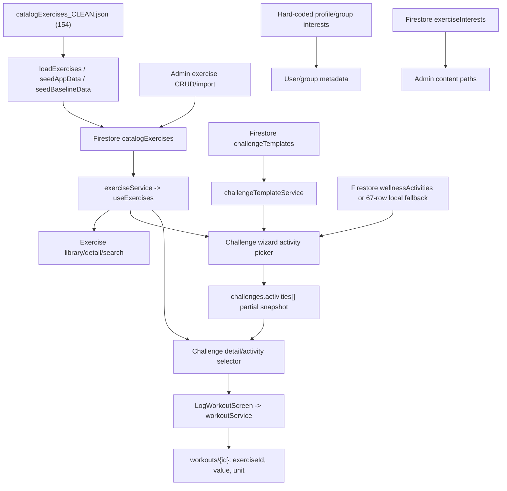

# Phase 3A-4 Legacy Fitness Catalogue Discovery Report

Audit date: 2026-07-18

## 1. Executive Summary

The repository contains a **154-record local exercise catalogue**, but it does not contain one unified fitness vocabulary. The audit extracted **369 source rows** from 21 record-defining files and traced 51 total source locations (45 repository files plus 6 logical Firestore/persisted paths).

The active member exercise library reads Firestore `catalogExercises` through `exerciseService`; it does **not** fall back to `catalogExercises_CLEAN.json`. The JSON is the likely intended seed/import authority, while admin CRUD can independently mutate Firestore. Existing challenges then carry partial activity snapshots, and workout logs retain activity IDs/units. Consequently, local JSON, live runtime catalogue, historical challenge snapshots, and logs can all diverge.

The assumed total of **154 exercises is partially supported, not confirmed as the current runtime total**. It is exactly true for `catalogExercises_CLEAN.json` and its dry-run loader, but no safe live catalogue reconciliation was available. Older specifications and production-readiness reports cite 113, while seeds only load JSON when the Firestore collection is empty.

The most important pre-rationalisation findings are:

- 91 separate hard-coded or seeded fitness-interest rows overlap but do not share one authority.
- Eight active/fallback wellness `movement` activities overlap the exercise boundary.
- A six-item seed fallback uses IDs such as `pushups` and `plank` that do not match current JSON IDs such as `push-ups` and `plank-forearm-plank`.
- Three independent taxonomy definitions disagree with JSON `tier_2` labels.
- Templates and test fixtures contain push-up/squat/plank/yoga variants and some template activities lack stable exercise IDs.
- Twenty-six JSON records have neither `movementType` nor `holdBased`; all are mobility/flexibility records in the loader's “untagged” output.
- Three JSON IDs contain punctuation outside the otherwise slug-like convention: `push-up-&-rotation`, `swimmer-&-superman`, and `child's-pose`.

This phase makes no rationalisation decisions.

## 2. Audit Scope and Constraints

Included:

- exercises, fitness/movement activities, stretches, mobility, cardio, holds and recovery movements;
- workout/challenge components and presets;
- member/group fitness-interest vocabularies;
- fitness categories, difficulty, movement types, metrics and selectable units;
- seeds, services, UI selectors, templates, tests, guards, persisted paths and historical count claims.

Excluded:

- generic prose that does not define, constrain, display, seed or validate a selectable item;
- generated dependency/build directories and binary assets;
- production Firestore contents;
- any Keep/Merge/Variant/Reclassify/Retire decision.

**Evidence:** all artefacts are derived from the working tree at the baseline commit and from local read-only commands.
**Inference:** source authority and overlap assessments are based on imports, calls, write paths and schema behavior.
**Unresolved:** deployed Firestore/rules/function state and live document counts were not inspected.

## 3. Repository Baseline

| Item | Baseline |
|---|---|
| Repository | `/Users/theo/tiizi_revamp` |
| Branch | `main` |
| Commit | `9dd1b4ccbc968afa782e93f582bc64afbd8dd435` |
| Node | `v20.20.0` |
| npm | `11.11.0` |
| Initially clean | No |
| Isolation decision | Continue: all pre-existing changes were outside `docs/reports/knowledge-catalogue/`; status was rechecked during the audit |

Relevant package scripts include `build`, `seed:exercises`, `seed:app`, `seed:baseline`, template/wellness seeds, catalogue/challenge audits, and static guard commands. Apply, cleanup, reset, deployment, migration and backfill commands were not run.

Likely data locations were root JSON, `src/data`, `src/services`, `src/features`, `src/types`, `scripts`, `functions/src`, `docs/input`, Firestore rules/indexes, and prior reports/specifications.

The initial dirty worktree contained pre-existing application, rules, test and report changes. No reset, discard, staging, commit or branch operation was performed.

## 4. Sources Discovered

The full 51-location register is in `phase-3a-4-fitness-source-register.md`.

| Source class | Evidence-backed result |
|---|---:|
| Repository files inspected/traced | 45 |
| Logical Firestore/persisted paths traced | 6 |
| Record-defining files represented in CSV | 21 |
| Local JSON exercises | 154 |
| Reference-only isometric concepts | 31 |
| Fitness-interest option rows | 91 |
| Taxonomy option rows | 34 |
| Admin validation option rows | 12 |
| Test fixture rows | 18 |
| Wellness movement rows | 8 |
| Seed fallback exercise rows | 6 |
| Selectable unit rows | 5 |
| Seeded template entities / components / challenge presets | 3 / 4 / 3 |

No CSV or alternate exercise JSON was found. `wellness-templates-sample.json` contains eight non-fitness wellness templates; it was inspected but contributed no fitness row. Generated `dist`, dependency directories, images and prototype HTML were not treated as catalogue sources.

## 5. Likely Sources of Truth

### Evidence

1. `exerciseService.collectionName = 'catalogExercises'`; member library, detail, wizard and logging hooks read that service.
2. `catalogExercises_CLEAN.json` is imported by `loadExercises.ts`, `seedAppData.ts`, and `seedBaselineData.ts`.
3. None of the member exercise read paths imports the JSON.
4. `adminExerciseService` can create, update, delete and bulk-import Firestore catalogue documents.
5. Both general seed scripts skip JSON loading when any `catalogExercises` document already exists.

### Assessment

- **Current runtime authority:** Firestore `catalogExercises`.
- **Likely intended local seed authority:** `catalogExercises_CLEAN.json`.
- **Administrative mutation authority:** `adminExerciseService` writing Firestore.
- **Historical per-challenge authority:** `challenges.activities[]` snapshot fields.
- **Usage evidence:** `workouts.exerciseId` and `workouts.unit`.
- **Parallel activity authorities:** `wellnessActivities`, fitness `challengeTemplates`, hard-coded profile/group options, and `exerciseInterests`.

### Unresolved

The live Firestore row count and field-level drift cannot be established without credentials and a purpose-built read-only comparison command. The credentialed backfill script has an apply mode and was not needed or run.

## 6. Raw Inventory Summary

| Measure | Count |
|---|---:|
| Total source rows | 369 |
| Unique non-`unknown` legacy IDs | 218 |
| Rows without an ID | 38 |
| Unique normalized names | 235 |
| Candidate duplicate/overlap groups | 56 |
| Runtime-reachable rows under the documented reachability rule | 281 |
| Test-only rows | 18 |
| Rows with a `seed-only*` current status | 46 |
| Reference-only rows | 31 |
| Template entity rows | 3 |
| Template activity component rows | 4 |
| Workout/routine/preset candidates | 12 |
| Wellness-overlap candidates | 11 |
| Rows with wholly unknown status/reachability | 0 |

“Runtime reachable” counts rows marked `active-direct`, `active-fallback`, or `seed-to-active-runtime`. The last category means a configured seed/import can make the definition active; it does not assert that the row is present in live Firestore today.

Normalized names lowercase text, replace `&` with `and`, collapse punctuation and whitespace, and do not perform final semantic merging. Candidate groups add a limited alias layer documented in the overlap artefact.

## 7. Runtime Catalogue Flow



### Runtime observations

- The exercise library gets filters dynamically from fetched Firestore data, then separately offers isometric/isotonic filters.
- The challenge picker defaults from an exercise metric but exposes hard-coded `Reps`, `Seconds`, `Minutes`, `Km`, and `Kg`; users can create a unit inconsistent with the catalogue.
- Collective and competitive launch with one activity; streak can retain multiple activities.
- Fitness launch snapshots `exerciseId`, resolved name, target and unit. Rich optional fields exist in the challenge schema, but normal fitness rows do not copy full setup/execution/form/safety content or an activity version.
- Templates prefill editable activity rows. A name-only template activity must be resolved against the current Firestore catalogue; fuzzy substring matching can select a record or fail.
- After launch, logging reads the challenge snapshot for target calculations and fetches the current catalogue for display. This is a duplicate runtime dependency rather than a fully self-contained immutable snapshot.
- `workoutService` writes the submitted ID/unit and does not make the catalogue itself authoritative at log ingestion.
- Profile/group interests are independent hard-coded vocabularies. Seeded Firestore `exerciseInterests` is not the member selection authority in the inspected screens.
- Wellness movement uses `wellnessLogs`, not `workouts`, despite overlapping names.

## 8. Duplicate and Overlap Signals

The companion `phase-3a-4-duplicate-and-overlap-signals.md` lists all 56 groups with inventory rows, evidence, reasons for possible overlap, material differences and preliminary confidence.

Prominent signals include:

- `Push-Ups`, `Pushups`, `Pushup`, and `Push-up` across the JSON, seed fallback, templates and tests;
- `Squat`/`Squats`, generic `Plank` versus `Plank (Forearm Plank)`, and `Yoga Session` versus Yoga;
- Running, Walking and Cycling across exercise, interest, wellness and test sources;
- Stretching, Mobility Routine, Stretching/Mobility and category-level Mobility;
- Dance/Dancing, Group Fitness/Group Fitness Classes, HIIT/Circuit variants, and Jump Rope wording;
- identical category/difficulty options repeated across three modules;
- combined left/right reference concepts expanded into separate JSON exercises.

These are signals only. A shared name does not establish equivalent movement, equipment, prescription, content, log collection, or safety behavior.

## 9. Exercise–Workout–Wellness Boundary Findings

### Exercise

`CatalogExercise` describes an atomic movement with category, metric, content, equipment, muscles and recommended volume. The JSON contains both dynamic movements and static holds, plus stretches.

### Workout/routine/preset

No active, standalone multi-exercise workout catalogue/model was found. Instead:

- seeded challenge presets dynamically choose two exercises;
- fitness templates contain activity prescriptions;
- `Home Workouts`, Group Fitness and HIIT/Circuit are selectable interests rather than workout entities;
- `Mobility Routine` is a wellness activity, not a sequenced workout definition.

The inventory flags 12 rows using an intentionally broad routine/preset heuristic; it does not claim all 12 are workouts.

### Wellness overlap

Eight movement wellness activities—Steps, Walking, Walking Distance, Running / Jogging, Cycling, Stretching, Mobility Routine and Yoga—have their own IDs, metrics, content, defaults, fallback behavior and log collection. Three additional wellness activity-type/taxonomy rows (`steps`, `walking`, `yoga`) are included, producing 11 boundary candidates.

### Interest/category

Fitness interests describe preferences or programme families, not executable activity definitions. Category, difficulty, metric and unit rows constrain records and therefore belong in discovery, but must not be counted as exercises.

## 10. Counts and Reconciliation

| Reconciliation class | Count | Interpretation |
|---|---:|---|
| Canonical-local exercise records | 154 | Full JSON documents |
| Additional seed fallback exercise records | 6 | Seed generator only; IDs/names diverge |
| Reference exercise concepts | 31 | Non-runtime content input |
| Test exercise fixtures | 10 | Test-only exercise identities |
| Fitness-interest rows | 91 | Five duplicated/divergent source arrays |
| Test fitness-interest rows | 8 | Test-only metadata values |
| Wellness activity records | 8 | Active/fallback movement entities |
| Taxonomy/validation/unit/type rows | 60 | Categories, subcategories, difficulty, metric/unit/activity/movement types |
| Template entities/components/presets | 10 | Programme/prescription definitions |
| **Total** | **369** | One row per source record; duplicates preserved |

The 369 total reconciles exactly to the CSV. It is not an exercise total. The narrower “exercise-like definitions” count also cannot be presented as a single canonical number because it mixes 154 full records, six seed fallbacks, 31 concepts and ten test fixtures with different status and reachability.

## 11. Comparison With the Assumed 154 Exercises

**Classification: partially supported / runtime not verifiable.**

Evidence supporting 154:

- `catalogExercises_CLEAN.json` has exactly 154 documents, 154 unique IDs and 154 unique names.
- `scripts/loadExercises.ts --dry-run` reported 154: 75 isometric, 53 isotonic and 26 untagged.
- `testExerciseLibraryIsometricGuards.ts` passed its size and uniqueness checks.

Evidence preventing runtime confirmation:

- runtime reads Firestore without a JSON fallback;
- admin CRUD/import can change Firestore independently;
- empty-only seeds do not update a non-empty 113-record collection to 154;
- historical specifications and earlier production reports cite 113;
- no live Firestore catalogue count was safely obtained.

Therefore “154 local intended seed records” is confirmed; “154 currently available exercises in the deployed app” is not.

## 12. Data Quality Problems

1. **Source divergence:** JSON, Firestore, challenge snapshots and logs have no version/hash reconciliation.
2. **Taxonomy incompatibility:** JSON uses `Balance & Stability`, `Power & Explosiveness`, and `Mobility & Flexibility`; admin validation accepts `Balance`, `Power`, and `Mobility` instead. Existing JSON rows may fail round-trip editing/import validation without transformation.
3. **Inconsistent interest IDs:** seed uses `hiit`, profile/group UI uses `hiit-circuit`; seed uses `stretching`, UI uses `stretching-mobility`; group options add `dance`, `crossfit`, `tennis`, `outdoors`, and `sports-general` absent elsewhere.
4. **Name-only template activities:** seeded `Squat`, `Plank`, `Pushup`, and `Yoga Session` have no stable catalogue IDs.
5. **Metric escape hatch:** wizard unit choices include distance/load units absent from the JSON's current `time`/`reps` metric types.
6. **Partial movement classification:** 26 mobility/flexibility records lack movement type and hold flag.
7. **ID punctuation:** three catalogue IDs include `&` or apostrophe, conflicting with admin slug generation and common URL/ID assumptions.
8. **Snapshot incompleteness:** fitness challenges do not preserve complete content, catalogue version, metric contract or safety metadata.
9. **Boundary duplication:** movement concepts exist in both workout and wellness logging domains.
10. **Stale documentation:** several core specifications still claim 113; hook/service comments repeat that count.
11. **Seed fallback drift:** fallback IDs `pushups` and `plank` differ from current full-catalogue IDs; generated challenge references can become unresolvable.
12. **Template/preset entity ambiguity:** session/programme labels and atomic exercise names share flat activity fields.

## 13. Risks for Phase 3A-5 Rationalisation

- Rationalising only the JSON could break existing Firestore-only admin records or challenge snapshots.
- Replacing IDs without alias/history handling could orphan challenge activities and workout logs.
- Treating interests as exercises would create non-loggable records; treating wellness movement as duplicates could break log-domain semantics.
- Collapsing left/right or hold/dynamic entries without reviewing execution and metric differences could remove meaningful variants.
- Enforcing the current admin taxonomy would reject or rewrite many JSON subcategories.
- Choosing 154 as a migration target without reading the intended environment could silently remove production-only records or reintroduce retired ones.
- Running empty-only seed scripts cannot reconcile an already populated catalogue.
- Template activities without IDs require explicit resolution review before any automated mapping.

## 14. Unresolved Questions

1. What are the live `catalogExercises` count, IDs, lifecycle fields and drift relative to JSON in each environment?
2. Are the historical 113 production records a strict subset of the current 154 JSON records?
3. Which 31 isometric concepts originated the 75 expanded JSON isometric rows, and which changes were editorial versus mechanical left/right expansion?
4. Which taxonomy wording is product-approved: expanded JSON labels or shortened admin labels?
5. Should movement wellness activities remain separate knowledge entities, aliases, or domain-specific uses of shared concepts? No decision is made here.
6. Which profile/group interest vocabulary is authoritative, and should Firestore `exerciseInterests` drive member selection?
7. Do production `challengeTemplates` contain activity names/IDs not present in local sources?
8. Must existing challenge snapshots remain immutable forever, or be mapped through versioned aliases?
9. Are the punctuation-bearing IDs already persisted in challenges/logs and safe in all routing/integration paths?
10. Is a separate workout/routine entity planned, or should templates remain the only composition layer?

## 15. Recommended Next Step

Proceed to Phase 3A-5 only after an approved **read-only environment reconciliation** exports IDs and relevant metadata from `catalogExercises`, `challengeTemplates`, `challenges.activities[]`, and optionally distinct workout exercise IDs. Compare that export against this 369-row inventory. Then review candidate groups by entity boundary before proposing any canonical ID or disposition.

Do not seed or backfill to obtain that comparison. Build or approve a purpose-specific read-only exporter with explicit project identification and no write branch.

## 16. Files Created

- `docs/reports/knowledge-catalogue/phase-3a-4-fitness-legacy-inventory.csv`
- `docs/reports/knowledge-catalogue/phase-3a-4-fitness-source-register.md`
- `docs/reports/knowledge-catalogue/phase-3a-4-duplicate-and-overlap-signals.md`
- `docs/reports/knowledge-catalogue/phase-3a-4-legacy-fitness-catalogue-discovery-report.md`

No other file was created or intentionally modified by this audit.

## 17. Commands Run

Read-only discovery/baseline commands included `git branch --show-current`, `git rev-parse HEAD`, `git status --short`, Node/npm version checks, package-script inspection, `rg`, `rg --files`, `find`, `sed`, local Node/TypeScript AST extraction, and local CSV parsing.

Validation commands:

```text
npx tsx scripts/loadExercises.ts --dry-run
npx tsx scripts/testExerciseLibraryIsometricGuards.ts
npx tsc -b --pretty false
npm run build
git diff --check
git status --short
git diff --stat
```

No seed apply, cleanup, reset, backfill, migration, deployment, commit, push or Firestore write command was run.

## 18. Validation Results

| Check | Result |
|---|---|
| CSV parses | Pass |
| Required headers exact | Pass |
| Inventory row IDs | 369 unique / 369 rows |
| Completely blank data rows | 0; terminal newline ignored |
| Missing `sourceLocation` | 0 |
| Missing `evidenceReference` | 0 |
| Count reconciliation | Pass: 369 |
| Generated/binary source paths in CSV | 0 |
| `loadExercises --dry-run` | Pass: 154 total, 75 isometric, 53 isotonic, 26 untagged; no writes |
| Exercise library guard | Pass: 391 passed, 0 failed |
| `npx tsc -b --pretty false` | Pass, exit 0 |
| `npm run build` | Pass, exit 0; Vite emitted a chunk-size warning only |
| Audit artefact effect on build | None detected; CSV/Markdown are outside application compilation |

The build generated ignored `dist` output as expected. It did not add a tracked/untracked status entry.

## 19. Final Git Status

Final status is recorded after the last validation pass. The worktree remains dirty from the pre-existing baseline; the only new status entry attributable to this task is `docs/reports/knowledge-catalogue/` containing the four requested artefacts.

```text
 M firebase.json
 M firestore.rules
 M scripts/testAdminDonationDashboardGuards.ts
 M scripts/testDonationPilotGuards.ts
 M scripts/testGroupRoutingAndProfileEdit.ts
 M scripts/testOnboardingGuards.ts
 M scripts/testScoringGuards.ts
 M src/components/Auth/RequireProfileSetup.tsx
 M src/features/Admin/Challenges/ChallengeTemplatesScreen.tsx
 M src/features/Admin/Challenges/EditChallengeTemplateScreen.tsx
 M src/features/Admin/Challenges/EditWellnessTemplateScreen.tsx
 M src/features/Admin/Donations/DonationCampaignsScreen.tsx
 M src/features/Admin/Donations/DonationReportsScreen.tsx
 M src/features/Admin/Donations/PlatformSupportScreen.tsx
 M src/features/Donate/DonateScreen.tsx
 M src/features/Onboarding/OnboardingSlides.tsx
 M src/features/Profile/EditProfileScreen.tsx
 M src/features/Profile/ProfileAnalyticsScreen.tsx
 M src/features/Profile/ProfileCompletionScreen.tsx
 M src/features/Profile/ProfileHealthGoalsScreen.tsx
 M src/features/Profile/ProfileInterestsScreen.tsx
 M src/features/Profile/ProfilePersonalInfoScreen.tsx
 M src/features/Profile/ProfilePrivacySettingsScreen.tsx
 M src/features/Profile/ProfileScreen.tsx
 M src/features/Profile/ProfileSettingsScreen.tsx
 M src/features/Profile/ProfileSetupFinishScreen.tsx
 M src/features/Profile/ProfileWellnessInterestsScreen.tsx
 M src/hooks/useDonations.ts
 M src/hooks/useProfileSetup.ts
 M src/services/adminDonationService.ts
 M src/services/donationService.ts
 M src/services/userProfileService.ts
 M src/types/index.ts
?? docs/reports/WELLNESS_ACTIVITY_CONTENT_AUDIT.md
?? docs/reports/challenge-creation-and-runtime-engine-audit.md
?? docs/reports/fitness-activity-content-audit.md
?? docs/reports/knowledge-catalogue/
?? docs/reports/pre-beta-support-tiizi-simplification.md
?? docs/reports/pre-pilot-onboarding-and-wellness-template-fix.md
?? scripts/testOnboardingPersistenceRuntime.ts
?? scripts/testSupportDonationPayloadRuntime.ts
?? scripts/testSupportDonationStatusRules.mjs
?? scripts/testUserProfilePatchEmulator.ts
?? scripts/testWellnessTemplateEditRuntime.ts
?? src/features/Admin/Challenges/wellnessTemplateEditState.ts
?? src/features/Profile/onboardingState.ts
?? src/services/supportDonationIntent.ts
?? src/services/userProfilePatchWriter.ts
```

All entries except `docs/reports/knowledge-catalogue/` were present in the captured initial baseline.
