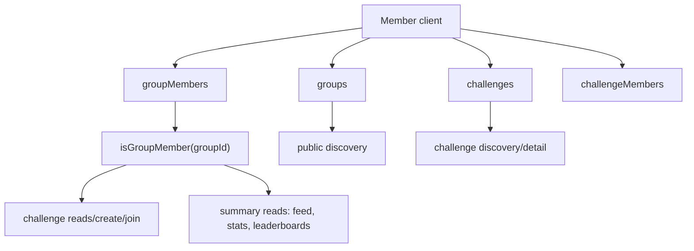

# Member Phase 7: Group / Challenge Policy Enforcement Audit

Date: 2026-06-10
Scope: member-facing group and challenge policy enforcement only.
Mode: audit only; no code changes or deploys.

## Executive Summary

The member UI has improved bounded discovery queries, but the Firestore policy model still has high-risk trust gaps around `groupMembers`, `groups`, `challenges`, and `challengeMembers`.

The most important issue is that a normal authenticated user can create their own `groupMembers` document for any `groupId` with arbitrary fields as long as `userId == request.auth.uid`. Because many other rules trust `isGroupMember(groupId)`, this can unlock private group access, challenge reads, challenge creation, challenge joins, and summary reads.

Risk rating: Critical until membership creation and protected group/challenge fields are hardened.

## Architecture Snapshot



Current trust boundary problem: client-writable `groupMembers` documents feed directly into `isGroupMember(groupId)`, and `isGroupMember(groupId)` is treated as authoritative by multiple sensitive rules.

## Current Behavior

### Group Creation

Members can create groups from `src/features/Groups/CreateGroupScreen.tsx`.

Client payload is built in `src/services/groupService.ts:210` and sets:

- `ownerId`
- `memberCount: 1`
- `status: active`
- `moderationStatus: pending_review`
- `reviewStatus: pending_review`
- `isVerified: false`
- `isPrivate`
- `visibility`
- `requireAdminApproval`
- `allowMemberChallenges`
- `inviteCode`
- `activeChallenges: 0`

Rules in `firestore.rules:542` allow create when only `ownerId == request.auth.uid`. There is no allowlist or server-owned field protection.

Result: normal members can directly create public or private groups and set policy/moderation fields that should be constrained by rules.

### Group Visibility

Group discovery uses a bounded indexed query in `src/services/groupService.ts:104`:

- `where('status', '==', 'active')`
- `where('isPrivate', '==', false)`
- `orderBy('createdAt', 'desc')`
- `limit(pageSize)`

There is also a bounded legacy fallback in `src/services/groupService.ts:126` that reads `pageSize * 2` groups and filters client-side.

Firestore rules allow any authenticated user to read every group document at `firestore.rules:542`, including private group metadata. The UI blocks private group details in `src/features/Groups/GroupDetailScreen.tsx:102`, but the rule does not enforce that privacy boundary.

### Group Join / Invite

`src/services/groupService.ts:245` creates or updates `groupMembers/{groupId}_{uid}`. Private or approval-required groups set status `pending`; open groups set status `active`.

Rules in `firestore.rules:551` allow any authenticated user to create a `groupMembers` document if `request.resource.data.userId == request.auth.uid`. The rule does not validate:

- document ID format
- `groupId`
- target group existence
- target group visibility
- invite code
- approval requirement
- allowed `status`
- allowed `role`
- owner/admin-only approvals

`joinGroup` and `leaveGroup` also update `groups/{groupId}.memberCount` in `src/services/groupService.ts:279` and `src/services/groupService.ts:351`, but `groups` updates are allowed only to group owner or admins in `firestore.rules:545`. This can cause partial join/leave behavior where membership changes but member counts fail or drift.

### Challenge Creation

Members can create challenges from `src/features/Challenges/CreateChallengeWizard.tsx`. The screen lets users select a joined group, configure activities, optionally enable Fitness + Cause, and launch.

`src/services/challengeService.ts:616` validates active group membership client-side and then writes a challenge. Non-donation challenges are created with:

- `status: active`
- `moderationStatus: approved`
- `visibility`/`groupVisibility` from group
- `participantCount: 0`, then possibly `1`

Rules in `firestore.rules:562` allow challenge create when:

- `createdBy == request.auth.uid`
- `isGroupMember(groupId)`
- donation-enabled challenges are draft/pending

The rules do not enforce:

- group owner/admin role
- `groups.allowMemberChallenges`
- allowed create fields
- immutable `groupId`/`createdBy`
- valid group status/review state
- safe `status`/`moderationStatus`
- protected donation fields beyond the draft/pending special case

Result: normal active members can create active non-donation challenges directly. Due to the `groupMembers` self-create gap, this can extend to arbitrary groups.

### Challenge Visibility

Challenge discovery is mostly bounded:

- `src/services/challengeService.ts:473` reads public challenges using `status`, `visibility`, `startDate`, and `limit`.
- It reads member-group challenges by chunked `groupId in [...]`, `status`, `startDate`, and `limit`.
- `src/services/challengeService.ts:565` reads group challenges by `groupId`, `status`, `startDate`, and `limit`.

However, `getChallengeById` in `src/services/challengeService.ts:554` returns the document if Firestore permits it, without service-level status/visibility filtering.

Rules in `firestore.rules:563` allow reads if:

- requester is a group member, or
- `isPublicGroup(groupId)`, or
- requester can moderate challenges

`isPublicGroup(groupId)` in `firestore.rules:149` only checks that `groups/{groupId}.isPrivate != true`. It does not check group `status`, `visibility`, `reviewStatus`, `moderationStatus`, suspended/deactivated state, or challenge `status`.

Result: a challenge in a public group may be readable by any authenticated user even if it is draft, archived, deactivated, or in a group whose lifecycle fields should block visibility.

### Challenge Join

`src/services/challengeService.ts:174` joins a challenge after confirming a group member document exists and has active/joined status. It does not check `challenge.status == active`.

Rules in `firestore.rules:587` allow `challengeMembers` create when:

- `userId == request.auth.uid`
- `isGroupMember(request.resource.data.groupId)`

The rule does not validate:

- document ID equals `{challengeId}_{uid}`
- challenge exists
- challenge groupId matches the membership groupId
- challenge status is active
- initial status/progress fields are safe
- `totalActivities`, `totalPoints`, or `completionRate` are bounded on create

Result: a member can create challenge membership records for non-active or mismatched challenges if they can satisfy `isGroupMember`.

### Summary Collections

Rules for summary collections are read-only for clients:

- `challengeActivitySummaries` at `firestore.rules:652`
- `groupActivityFeed` at `firestore.rules:657`
- `groupMemberStats` at `firestore.rules:662`
- `groupLeaderboards` at `firestore.rules:667`
- `challengeLeaderboards` at `firestore.rules:672`

Client writes are denied. That part is correct.

Remaining risk: reads rely on `canReadGroupSummary(resource.data)`, which relies on `isGroupMember(groupId)`. Because normal users can self-create active group memberships, summary privacy is only as strong as `groupMembers` integrity.

## Risk Findings

### Critical: Users Can Self-Grant Group Membership

Files:

- `firestore.rules:551`
- `firestore.rules:140`
- `src/services/groupService.ts:245`

Problem:

Any signed-in user can create a `groupMembers` document with their own `userId`. The rules do not restrict `groupId`, `role`, `status`, approval fields, or document ID.

Impact:

- Private group access can be bypassed.
- Challenge read/create/join checks based on `isGroupMember` can be bypassed.
- Group summaries and leaderboards can become readable to unauthorized users.
- `role` can potentially be written as `owner` or `admin` if other code later trusts it.

Recommended fix:

Make member-created `groupMembers` writes safe and narrow:

- document ID must equal `{groupId}_{uid}`
- `groupId` must exist
- `userId == uid`
- allowed fields only
- role must be `member`
- status must be `pending` for private/approval groups, or `active` only for public groups that do not require approval
- approval fields should be server/admin-only
- owner/admin roles should be created only by trusted server/admin flows

### High: Group Create/Update Allows Protected Fields

Files:

- `firestore.rules:542`
- `src/services/groupService.ts:210`
- `src/features/Groups/CreateGroupScreen.tsx:28`

Problem:

Group create only checks ownerId. Group owner update/delete is broad. Members can set or later alter fields such as `status`, `reviewStatus`, `moderationStatus`, `isVerified`, `memberCount`, `activeChallenges`, `visibility`, `isPrivate`, `requireAdminApproval`, and `allowMemberChallenges`.

Impact:

- Unreviewed public groups can appear active.
- Owners can potentially self-verify or alter moderation lifecycle fields.
- Member counts and policy flags can be manipulated.

Recommended fix:

Create rule helper functions:

- `groupClientCreateFields()`
- `isValidGroupCreate()`
- `isValidGroupOwnerUpdate()`

Client-created groups should default to safe statuses, with moderation/status/isVerified/count fields either fixed by rules or moved to Cloud Functions/Admin SDK.

### High: Challenge Create/Update Allows Protected Policy Fields

Files:

- `firestore.rules:562`
- `src/services/challengeService.ts:616`
- `src/features/Challenges/CreateChallengeWizard.tsx:56`

Problem:

Rules allow any group member to create a challenge if `createdBy` matches. Non-donation challenges can be active and approved immediately. The rules do not enforce group role or `allowMemberChallenges`, and update/delete by creator is broad.

Impact:

- Normal users can create public active challenges in groups without server-side moderation enforcement.
- Users may alter challenge policy, lifecycle, visibility, donation, and aggregate fields after creation.
- Combined with self-created group memberships, this becomes a cross-group challenge creation path.

Recommended fix:

Rules should require one of:

- group owner/admin role from a trusted membership doc, or
- group `allowMemberChallenges == true` plus active membership and safe draft/active policy.

Also add field allowlists and immutable fields for `groupId`, `createdBy`, `createdAt`, donation approval fields, participant counts, moderation status, and visibility.

### High: Challenge Membership Create Does Not Validate Challenge Context

Files:

- `firestore.rules:587`
- `src/services/challengeService.ts:174`

Problem:

`challengeMembers` creation checks only requester userId and group membership. It does not prove the challenge exists, is active, belongs to that group, or that the initial membership fields are safe.

Impact:

- Users can create invalid challenge memberships.
- User metrics or summary functions that react to challenge membership could be polluted.
- Users may join draft/archived/deactivated challenges if they know the ID.

Recommended fix:

Validate:

- membership document ID equals `{challengeId}_{uid}`
- challenge exists
- `request.resource.data.groupId == get(challenge).data.groupId`
- challenge status is `active`
- allowed create fields only
- initial progress fields are zero
- status is only `active` or a dedicated safe initial status

### High: Public Challenge Read Does Not Enforce Challenge Status

Files:

- `firestore.rules:563`
- `firestore.rules:149`
- `src/services/challengeService.ts:554`
- `src/features/Challenges/ChallengeDetailScreen.tsx:16`

Problem:

Public group challenge reads rely on `isPublicGroup`, which only checks `isPrivate != true`. It does not require the challenge to be active or the group to be active/reviewed.

Impact:

- Authenticated users may read draft, archived, deactivated, or unreviewed challenge records in public groups.
- The UI mostly queries active challenges, but direct links and `getChallengeById` rely on rules.

Recommended fix:

Add a `canReadChallenge(resource.data)` helper that checks challenge status, group visibility, group lifecycle, membership, and moderator access.

### Medium: Private Group Metadata Is Readable By All Authenticated Users

Files:

- `firestore.rules:542`
- `src/services/groupService.ts:171`
- `src/features/Groups/GroupDetailScreen.tsx:102`

Problem:

Rules permit all authenticated users to read all group documents. The UI blocks private content after reading the group.

Impact:

Private group names, descriptions, cover images, invite policy, and owner IDs can be exposed to all signed-in users.

Recommended fix:

Split group public profile fields into a safe discovery document, or make group reads conditional:

- public active/reviewed groups readable by authenticated users
- private groups readable by members/admins only
- invite-code preview should use a minimal safe lookup path

### Medium: Join/Leave May Cause Partial Writes and Stale Counts

Files:

- `src/services/groupService.ts:270`
- `src/services/groupService.ts:279`
- `src/services/groupService.ts:347`
- `src/services/groupService.ts:351`
- `firestore.rules:545`

Problem:

The member service writes membership first, then updates `groups.memberCount`. The count update is denied for non-owner/non-admin users by current group rules.

Impact:

Join/leave can partially succeed or show a generic error while membership has already changed. Counts can drift.

Recommended fix:

Move `memberCount` updates to Cloud Functions/Admin SDK, or add a narrow rule allowing only `memberCount` increments paired with validated membership writes. Cloud Functions is safer.

### Medium: Group Report UI Does Not Match Rules

Files:

- `src/features/Groups/GroupDetailScreen.tsx:136`
- `src/services/groupService.ts:356`
- `firestore.rules` groupReports block

Problem:

The member UI lets users report a group, but rules allow `groupReports` writes only to group moderators/admins.

Impact:

Normal users likely see “Could not submit report.”

Recommended fix:

Add a safe member report create rule with allowed fields, requester identity enforcement, and no status/admin fields. Keep update/read admin-only.

### Medium: `allowMemberChallenges` Is Product UI Only, Not Policy

Files:

- `src/features/Groups/CreateGroupScreen.tsx:166`
- `src/services/groupService.ts:226`
- `src/features/Groups/GroupDetailScreen.tsx:265`
- `src/services/challengeService.ts:616`
- `firestore.rules:562`

Problem:

The group setting exists in the UI and group payload, but challenge creation rules and the create challenge screen do not enforce it.

Impact:

Group owners may think member challenge creation is disabled, while rules still allow active members to create challenges.

Recommended fix:

Enforce `allowMemberChallenges` in both service and rules. Hide or disable create buttons for disallowed members, but keep rules authoritative.

### Low: Discovery Query Model Is Mostly Bounded But Still Has Edge Gaps

Files:

- `src/services/groupService.ts:104`
- `src/services/groupService.ts:126`
- `src/services/challengeService.ts:328`
- `src/services/challengeService.ts:473`
- `src/services/challengeService.ts:565`

Problem:

Discovery uses bounded queries, but accessible challenges first reads all memberships for a user with no limit. This is acceptable for pilot but should become paginated or materialized if users can join many groups.

Impact:

Cost and latency can grow for power users.

Recommended fix:

Keep as P2 unless pilot users are expected to join many groups. Longer term, use `memberHome/{uid}` or a user-visible challenge index.

## Screen Impact

| Screen | Current Policy Behavior | Risk |
| --- | --- | --- |
| `GroupsScreen` | Public discovery is bounded and filtered; invite join uses service. | Medium, because join relies on weak membership rules. |
| `GroupDetailScreen` | Private group content blocked by UI; public challenge previews shown to non-members; report UI likely denied. | High, because rules expose all group docs and membership can be self-granted. |
| `CreateGroupScreen` | Any signed-in user can create public/private groups and choose policy toggles. | High, because protected fields are not rule-constrained. |
| `JoinGroupScreen` | Invite join calls `joinGroupByInviteCode`; no real preview before toggle. | Medium, because rules do not enforce invite semantics. |
| `ChallengesScreen` | Uses bounded accessible/visible challenge pages. | Medium, because visibility fields are client-set and membership trust is weak. |
| `ChallengeDetailScreen` | Allows public previews, joins, and logging controls based on membership/status. | High, because direct doc reads depend on permissive challenge rules. |
| `CreateChallengeWizard` | Any active group member can create active non-donation challenges. | High, because rules do not enforce role or `allowMemberChallenges`. |

## Recommended Fix Order

### P0 / Critical

1. Harden `groupMembers` create/update/delete rules.
2. Add authoritative membership role/status semantics and document ID validation.
3. Re-test private group access, summary reads, challenge create, and challenge join.

### P1 / High

1. Harden `groups` create/update fields.
2. Move `memberCount` and lifecycle/moderation fields to Cloud Functions/Admin SDK.
3. Harden `challenges` create/update fields and enforce `allowMemberChallenges`.
4. Harden `challengeMembers` create rules against actual challenge docs.

### P2 / Medium

1. Make private group read rules enforce privacy instead of relying on UI.
2. Add safe member `groupReports` create rule.
3. Tighten `canReadChallenge` around challenge and group lifecycle.
4. Reduce user membership broad reads for high-scale cases.

## Deployment / Data Impact

Firestore rules required:

- Yes. Most critical fixes are rules changes.

Firestore indexes required:

- Probably not for the first hardening pass. Existing discovery indexes appear sufficient for current query shapes.

Hosting deploy required:

- Yes if UI is updated to hide disabled actions, show better errors, or align with stricter rules.

Functions required:

- Recommended for `memberCount`, challenge participant counts, group moderation lifecycle, and trusted membership approval transitions.

Backfill required:

- Likely yes after rules hardening:
  - normalize `groupMembers` roles/statuses
  - ensure owner memberships exist
  - normalize group lifecycle fields
  - normalize challenge visibility/status/moderation fields

## Validation

Commands run:

```bash
npx tsc -b
npm run build
```

Results:

- `npx tsc -b`: passed with no output.
- `npm run build`: passed. Vite transformed 1834 modules and completed production build successfully.

No code or rules were modified during this audit.
