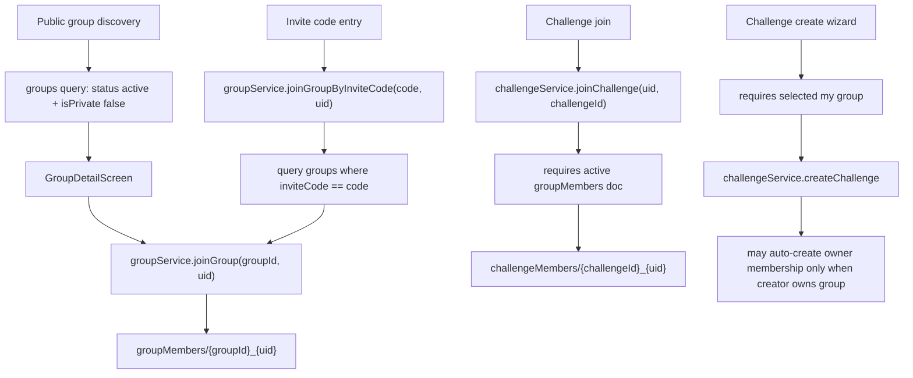

# Member Phase 7C: Private Group Invite / Join Flow Audit

Date: 2026-06-11
Scope: audit and architecture only.
Deployment: not deployed.
Code/rules changes: none.

## Executive Summary

Phase 7A/7B materially improved the security boundary around groups, group memberships, challenges, and counters. Normal members can no longer self-create privileged membership roles, self-activate private group access, or directly write derived counters.

The main finding for Phase 7C is that the current private-group invite experience is not production-ready:

- Private group reads are correctly protected from non-members.
- The current invite-code flow still looks up private groups by querying `groups.inviteCode` from the client.
- Because private group documents are not readable to non-members, private invite-code joins are likely to fail or behave inconsistently.
- A user who already knows a private `groupId` can still create a `pending` membership request directly, because rules allow pending self-create for private/approval-required groups.
- There is no trusted invite token, expiry, revocation, one-time use, multi-use limit, or audit trail model yet.

Recommended direction: implement a hybrid callable-function invite system backed by dedicated invite/join-request documents. Keep private `groups/{groupId}` metadata unreadable to non-members.

## Current Join Architecture



### Join Entry Points

| Path | File / Function | Security Model | Current Behavior |
| --- | --- | --- | --- |
| Public group discovery join | `src/features/Groups/GroupsScreen.tsx`, `src/features/Groups/GroupDetailScreen.tsx`, `src/hooks/useGroups.ts`, `src/services/groupService.ts::joinGroup` | Client creates `groupMembers/{groupId}_{uid}`. Rules validate doc ID, group existence, `userId`, role `member`, and initial status. | Public groups without approval create `status: active`. Public approval-required groups create `status: pending`. |
| Private group detail request | `GroupDetailScreen.tsx::handleJoin`, `groupService.joinGroup` | Same client membership create rule. | UI has "Request to Join", but `useGroup()` reads `groups/{groupId}` first. Non-member private reads are denied by rules, so this route usually cannot render the private group request state unless user already has access. |
| Invite code join | `GroupsScreen.tsx::handleInviteJoin`, `JoinGroupScreen.tsx::handleJoin`, `groupService.joinGroupByInviteCode` | Client queries `groups` where `inviteCode == code`, then calls `joinGroup`. | Works only for readable groups. It is incompatible with private group read hardening because non-members cannot read private group docs. |
| Invite link | `JoinGroupScreen.tsx` | UI placeholder only. | Button shows a toast: deep-link handling is "ready", but no real link parsing/token join flow exists. |
| Direct Firestore membership create | Firestore SDK against `groupMembers/{groupId}_{uid}` | `firestore.rules::isValidGroupMemberCreate()` | Cannot create owner/admin/moderator. Cannot set active for private/approval-required groups. Can create `pending` if user knows a valid private `groupId`. |
| Leave group | `groupService.leaveGroup`, `useLeaveGroup` | Client updates own membership to `status: left`. Rules allow only `status` + `leftAt`. | Owner cannot leave via service. Counts are now server-owned by functions. |
| Challenge join | `challengeService.joinChallenge` | Requires existing active/joined `groupMembers/{groupId}_{uid}` before creating `challengeMembers`. | Does not auto-join group. Rules also require active group membership and active challenge. |
| Challenge-created auto join | `challengeService.createChallenge` | After creating a non-donation challenge, creator is joined to the challenge. | Does not grant group membership except a narrow owner fallback where `groups.ownerId == createdBy`. |
| Create challenge wizard membership refresh | `CreateChallengeWizard.tsx` | Calls `groupService.getMembershipStatus` and best-effort `joinGroup` before create. | Hidden path, but selected group comes from `useMyGroups`; generally requires existing membership. |
| Admin/moderator group actions | `src/services/adminGroupService.ts::suspendMemberInGroup` | Admin browser update allowed by `canManageGroups()`. | Can update existing member status to `expelled`. No browser admin create-member path found. |
| Seed/reset/backfill scripts | `scripts/seedAppData.ts`, `scripts/resetAllData.ts`, `scripts/cleanupSeedGroupMemberships.ts`, `scripts/backfillGroupCounts.ts` | Script/Admin SDK or local maintenance. | Creates or repairs seed/membership data outside member app flow. Not a runtime member bypass. |
| Cloud Functions counters/summaries | `functions/src/index.ts`, `functions/src/memberCounters.ts`, `functions/src/memberActivitySummaries.ts`, `functions/src/memberUserMetrics.ts` | Admin SDK triggered by membership/challenge writes. | Maintains derived summaries/counters; does not provide invite or approval workflow. |

## Private Group Model Audit

Current fields used on groups:

- `isPrivate: boolean`
- `visibility: "public" | "private"`
- `requireAdminApproval: boolean`
- `allowMemberChallenges: boolean`
- `inviteCode: string`
- `status: "active" | lifecycle values`
- `moderationStatus`
- `reviewStatus`
- `isVerified`
- `ownerId`

Current fields used on group memberships:

- `groupId`
- `userId`
- `role`
- `status`
- `createdAt`
- legacy/seed fields such as `approvedAt`

Current status semantics:

- Active member access: `active` or legacy `joined`
- Private/approval-request create: `pending`
- Self-leave: `left`
- Seed/admin legacy values include `rejected`, `expelled`, and similar non-active states.

### Sufficiency for Future Workflows

| Capability | Current Model Sufficiency | Gap |
| --- | --- | --- |
| Public group direct join | Sufficient | No major gap. |
| Private group join request | Partially sufficient | Rules allow pending request, but UI cannot reliably load private group docs for non-members. No approval UI/workflow/audit trail. |
| Invite code | Insufficient | Code lives on unreadable `groups` doc for private groups. No expiry, revocation, use limits, hashing, audit trail, or abuse controls. |
| Invite link | Insufficient | UI placeholder exists, no token parsing or trusted backend validation. |
| Invite token document | Not implemented | Needs schema/rules/functions. |
| Admin approval | Partially sufficient | Admins can update existing memberships, but no dedicated join-request collection, approval metadata, or audit trail. |
| Moderator approval | Partially sufficient | `canManageGroups()` includes moderators, but no product workflow. |
| One-time/multi-use invites | Not implemented | Needs transactional server-side use-count validation. |

## Rules Audit

Relevant rule behavior:

- `groups/{groupId}` read uses `canReadGroup(resource.data, groupId)`.
- Public groups are readable to authenticated users only when not private and `status == active`.
- Private groups are readable only by admins/moderators, owner, or active/joined members.
- `groupMembers/{membershipId}` create uses `isValidGroupMemberCreate(membershipId)`.
- Membership document ID must be `{groupId}_{uid}`.
- User-created role must be `member`.
- Private or approval-required groups force initial `status: pending`.
- Public groups without approval force initial `status: active`.
- User self-update can only set `status: left` and `leftAt`.
- Admin/moderator update access remains via `canManageGroups()`.
- `challengeMembers/{membershipId}` create requires active challenge and active/joined group membership.
- Challenge reads for non-members require active challenge in an approved public group.

### Security Questions

| Question | Current Answer |
| --- | --- |
| Can a non-member discover a private group through normal group discovery? | No. Public discovery queries only public active groups, and rules deny private group reads to non-members. |
| Can a non-member read a private group document directly? | No, unless admin/moderator, owner, or active/joined member. |
| Can a user create membership directly? | Yes, but only for themselves, only with doc ID `{groupId}_{uid}`, only role `member`, and private/approval groups force `pending`. |
| Can a user bypass private approval to become active? | No via rules. Private/approval groups require initial `pending`, and self-update only allows `left`. |
| Can a user join using crafted requests? | They can create a pending request for a known `groupId`. They cannot activate it. This is a spam/approval-queue risk, not an access escalation. |
| Can a user elevate membership role? | No on self-create/update. Admin/moderator browser updates can alter existing membership docs. |
| Can a user join a challenge to bypass group membership? | No. Challenge membership creation checks active group membership. |

## Risks Found

### High

- Private invite-code join is functionally incompatible with private group read hardening. `joinGroupByInviteCode()` queries `groups.inviteCode` from the client, but private group docs are unreadable to non-members.
- There is no trusted invite token model. Group invite codes are stored directly on group documents and have no expiry, revocation, one-time use, max-use, or audit behavior.
- Known-`groupId` private join requests are possible without invite proof. Rules correctly force `pending`, but this can create spam/abuse or moderation burden if private groups are meant to be invite-only.

### Medium

- `groupMembers/{membershipId}` read is allowed to any authenticated user. That exposes membership metadata across groups. It does not grant access by itself, but private group member lists deserve tighter rules in a future pass.
- Approval workflow is incomplete. Admin/moderator update power exists, but there is no dedicated join-request queue, approval metadata, rejection reason, or audit trail.
- `GroupDetailScreen` has private group request UI, but non-members usually cannot reach it because `useGroup()` must read the private group first.
- `inviteCode` is owner-editable through `groupOwnerEditableFields()`. That is convenient but not auditable or rate-limited.

### Low

- Create group screen copy says "Only invited members can join and see posts", but current rules allow pending requests by known `groupId`.
- Invite link UI currently displays a placeholder toast, which can confuse users during pilot.

## Invite System Option Comparison

| Option | Security Rating | Complexity | Firestore Cost | UX Quality | Abuse Risk | Recommendation |
| --- | --- | --- | --- | --- | --- | --- |
| A. Invite Code on `groups` | Low | Low | Low | Familiar | High: brute force, no expiry/revocation, private lookup conflict | Not recommended alone. |
| B. Invite Link with `groupId` + code | Medium-low | Low-medium | Low | Good sharing UX | Medium-high unless server validates token and expiry | Not recommended alone. |
| C. Invite Token Document | High if token is random/hashed and unreadable broadly | Medium | Low-medium | Good | Low-medium with rate limits and expiry | Recommended as backend primitive. |
| D. Callable Function Join | High | Medium | Low-medium | Good; can return safe messages | Low; server owns validation and writes | Recommended as trust boundary. |
| E. Hybrid Callable + Token Docs + Link/Code UI | Highest | Medium-high | Low-medium | Best | Lowest practical risk | Recommended production design. |

## Recommended Production Architecture

Use a hybrid approach:

1. Keep private group documents private.
2. Store invites outside `groups/{groupId}`.
3. Validate all private joins through callable Cloud Functions using Admin SDK.
4. Keep `groupMembers` as the canonical membership collection.
5. Keep server-owned counters from Phase 7B unchanged.

### Proposed Collections

`groupInvites/{inviteId}`

- `groupId`
- `createdBy`
- `createdAt`
- `expiresAt`
- `revokedAt`
- `status: active | revoked | expired`
- `type: one_time | multi_use`
- `maxUses`
- `useCount`
- `role: member`
- `tokenHash` or `codeHash`
- `lastUsedAt`

`groupJoinRequests/{groupId}_{uid}`

- `groupId`
- `userId`
- `status: pending | approved | rejected | cancelled`
- `requestedAt`
- `requestedBy`
- `source: invite | request`
- `inviteId`
- `approvedBy`
- `approvedAt`
- `rejectedBy`
- `rejectedAt`
- `rejectionReason`

`groupAuditLogs/{auditId}` or `groups/{groupId}/auditLogs/{auditId}`

- `groupId`
- `actorUid`
- `targetUid`
- `action`
- `createdAt`
- `metadata`

### Proposed Callable Functions

- `createGroupInvite(groupId, options)`
- `revokeGroupInvite(inviteId)`
- `joinGroupWithInvite(tokenOrCode)`
- `requestGroupJoin(groupId)`
- `approveGroupJoinRequest(requestId)`
- `rejectGroupJoinRequest(requestId, reason)`

Function responsibilities:

- Read private group metadata using Admin SDK.
- Verify actor is owner/admin/moderator where required.
- Verify invite exists, is active, not expired, not revoked, and under usage limit.
- Transactionally increment invite usage and write membership/request docs.
- Write audit logs.
- Return only safe group preview data to non-members.

### Firestore Rules Direction

- `groups`: keep private reads member/admin-only.
- `groupInvites`: clients should not list all invites. Owners/moderators can read their group invites after membership/ownership checks; token validation should happen in callable functions.
- `groupJoinRequests`: users can read their own requests; group owners/moderators/admins can read requests for their groups.
- `groupMembers`: consider changing private/approval group create to callable-only if invite-only privacy is desired. Keep direct create for public groups.
- `challengeMembers`: keep requiring active group membership.

## Future Implementation Roadmap

### Phase 7D: Backend Foundation

1. Define `groupInvites`, `groupJoinRequests`, and audit-log schemas.
2. Add callable functions for invite validation and join request creation.
3. Add Firestore rules for invite/request documents.
4. Add emulator/security tests:
   - non-member cannot read private group
   - direct private membership create cannot become active
   - invalid/revoked/expired invite fails
   - valid invite creates active or pending membership according to group policy
5. Add dry-run migration report for existing `groups.inviteCode` values.

### Phase 7E: Invite Management

1. Add owner/moderator invite management service.
2. Add create/revoke/list invite APIs.
3. Support one-time and multi-use invites.
4. Support expiration and max-use limits.
5. Add audit logging for invite creation/revocation.

### Phase 7F: Join Request Workflow

1. Build request creation through callable function.
2. Build owner/moderator/admin approval and rejection actions.
3. Write `groupMembers` only from trusted function/admin flows for private approvals.
4. Add audit log entries for approvals/rejections.
5. Decide whether public approval-required groups should use the same request path.

### Phase 7G: UI Integration

1. Replace `joinGroupByInviteCode()` client group query with callable join.
2. Replace private group detail request flow with callable request flow.
3. Show safe invite preview without exposing private group metadata.
4. Remove placeholder invite-link toast.
5. Add clear pending/approved/rejected states.

### Phase 7H: Security Verification

1. Add Firestore rules tests for groups, groupMembers, groupInvites, and groupJoinRequests.
2. Add callable function integration tests.
3. Test direct client attempts:
   - create active private membership
   - create admin/owner membership
   - read private group as non-member
   - reuse one-time invite
   - use expired/revoked invite
4. Validate production deploy with dry-run first.

## Phase 7C Decision

Phase 7C should remain audit-only. Do not loosen private group reads to make the current invite-code flow work. The correct fix is to move private invite resolution to a trusted callable flow with dedicated invite/request records.

## Validation

Validation commands required:

```bash
npx tsc -b
npm run build
```

Results are recorded after command execution in the task response.
