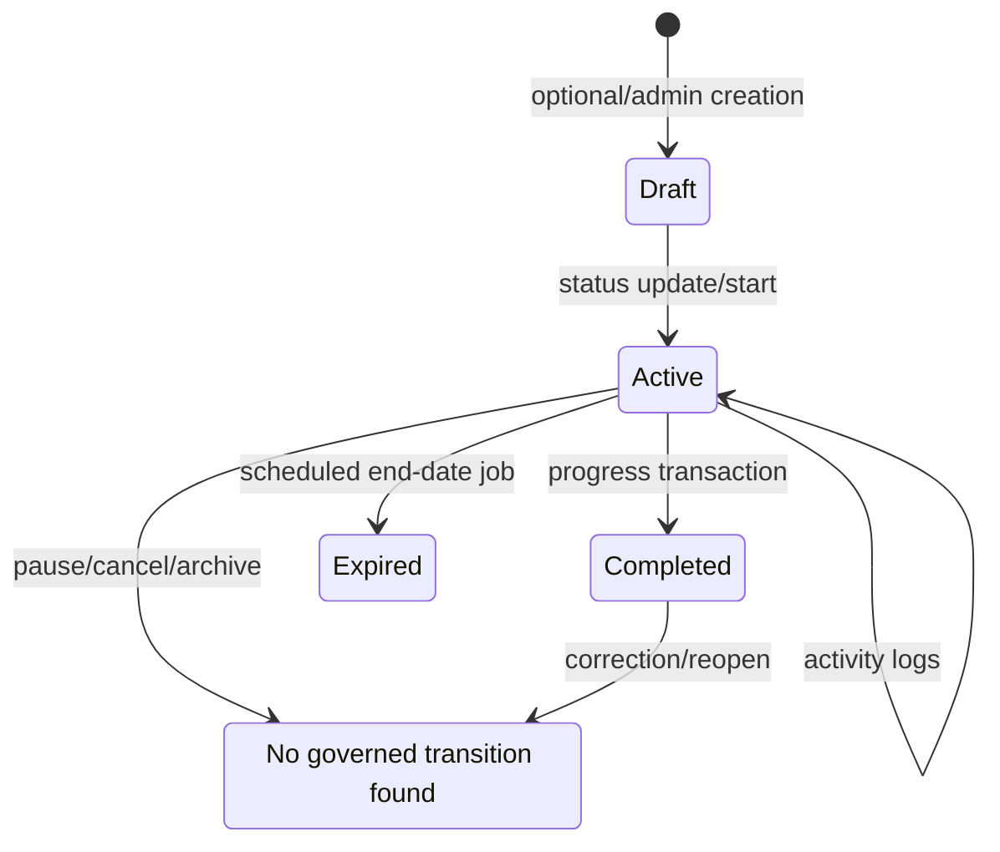
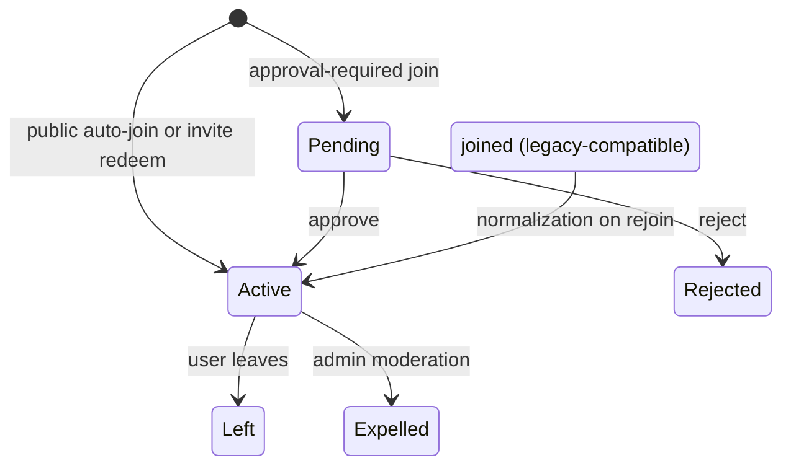

# State Machine Catalogue

## Observed state machines

| Machine | Observed states | Triggers/enforcement | Missing/contradictory behavior |
|---|---|---|---|
| Onboarding | intro/partial step data/completed flags | profile screens + RequireProfileSetup | multiple flags and skipped steps; no canonical transition enum |
| User | active; admin suspension metadata | AuthContext/adminUserService | delete/deactivate/reactivate/account retention not governed |
| Group | active, inactive; moderation active/flagged/deactivated | groupService/adminGroupService/rules | archive/delete/ownership transfer absent |
| Group member | joined, active, pending, rejected, left, expelled | client service and callables | joined vs active compatibility; role change absent |
| Invite | active, revoked, expired, exhausted | callable backend | expiration largely evaluated on use/list |
| Join request | pending, approved, rejected | callable backend | resubmit/withdraw/appeal unspecified |
| Challenge | draft, active, completed, expired | creation/update/log transactions/schedule | pause/cancel/archive absent; completion authorities overlap |
| Challenge member | active, completed, abandoned | join/log/leave | correction/rejoin and contribution retention unclear |
| Activity verification | `verified: false`/possible boolean | client defaults | no traced actor makes it true or uses it authoritatively |
| Streak | current/longest numeric plus dates | log calculations | timezone, grace, reset and multi-activity semantics unclear |
| Support donation | intent → sent_reported → verified; abandon/reject/refund/cancel; legacy confirmed/pending_confirmation | user service/admin service/rules/function | payment settlement absent; legacy meaning mixed |
| Pledge | pledged, confirmed, skipped | donationService | “confirmed” is not external payment proof |
| Knowledge item | implicit created/updated/deleted | admin CRUD | documented V2 lifecycle not implemented |
| Notification | unread/read in embedded array | notificationService | delivery/expiry/archive absent |
| Moderation report | open → reviewed/resolved | admin service | appeal/reopen/evidence lifecycle absent |

## Challenge state relationship

## Group participation

## Enforcement conclusion

State transitions are distributed among UI conditions, client services, Firestore rules, callables, document triggers and scheduled jobs. No platform-wide state-transition standard exists. Rules frequently validate actor/ownership but not complete before/after state matrices.
