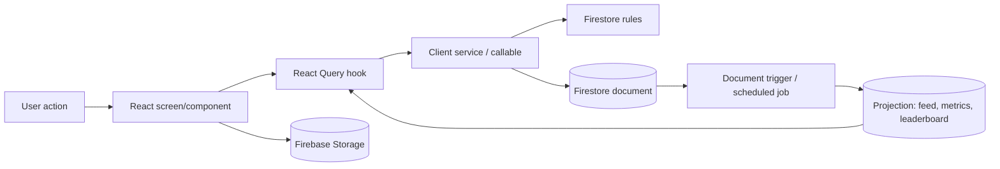

# Service, Function and Integration Catalogue

The full file register is in `evidence/runtime-source-inventory.tsv`.

## Client service domains

| Domain | Principal services | Reads/writes |
|---|---|---|
| Identity/profile | userProfileService, userProfilePatchWriter, userAccessService, dailyGoalsService, notificationService | users |
| Groups | groupService, groupInviteService, groupInsightsService, adminGroupService | groups, members, invites/requests via callable, reports |
| Challenges | challengeService, challengeTemplateService, wellnessTemplateService, adminChallengeService | challenges, members, templates |
| Activity | activityLogSessionService, workoutService, wellnessLogService, streakService | workouts, wellnessLogs, member/challenge progress |
| Social/projections | memberActivitySummaryService, feedLiveStatsService, feedReactionService, feedCommentService, memberMetricsService | feed/projections/subcollections |
| Knowledge | exerciseService/adminExerciseService, wellnessActivityService/adminWellnessActivityService | catalogues |
| Admin | adminAccess/User/Group/Challenge/Content/Analytics/Donation/Settings services | platform collections |
| Donations | donationService, adminDonationService, supportDonationIntent | support, pledges, settings, reporting |
| Media/library | imageUploadService, bookLibraryService | Storage, three book collections |

## Cloud Functions

| Export | Type | Purpose |
|---|---|---|
| create/list/revoke/redeem group invite | Callable | private invite lifecycle |
| request/approve/reject group join | Callable | controlled membership workflow |
| createChallengeWithCreatorMembership | Callable | atomic challenge + creator membership |
| refreshAdminMetrics | Scheduled | admin metrics projection |
| expireChallengesOnSchedule | Scheduled | active challenge expiry |
| workout/wellness log created summary triggers | Firestore create | member summaries, feed and leaderboards |
| group/challenge member summary triggers | Firestore create/write | projections and user metrics |
| supportDonation write trigger | Firestore write | support summary |
| group/challenge/member count triggers | Firestore create/update/delete | denormalized counts |

## Active runtime flow

## Integrations

Firebase is the only fully traced platform integration: Auth, Firestore, callable/scheduled Functions, Hosting and Storage. Google is an authentication provider through Firebase. Donation instructions/USSD/mobile-money handling record intent/self-report; no payment gateway, webhook or settlement API is present. No wearable/device verification, external health API, email/push provider, or implemented AI/recommendation service was traced. Unsplash URLs and browser sharing/clipboard are presentation-level external dependencies.
